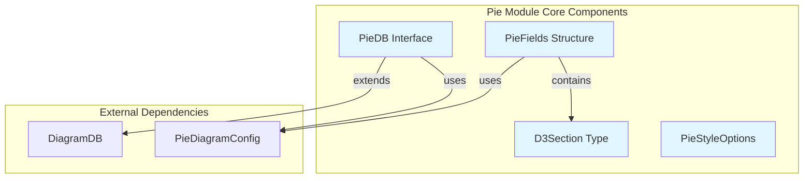
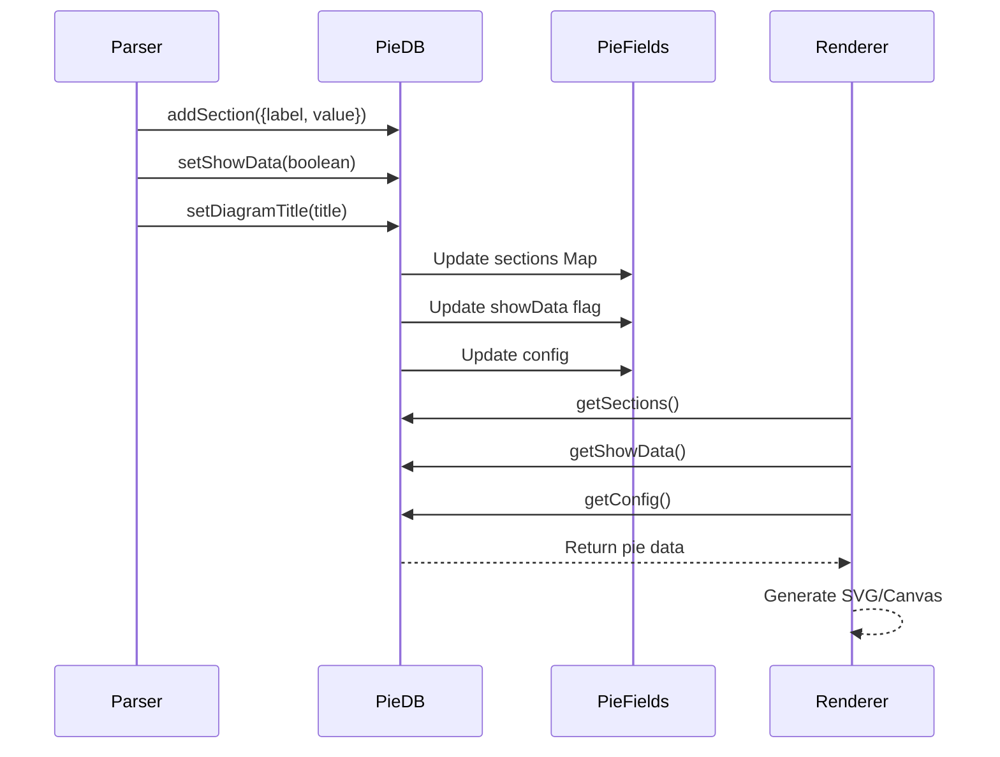
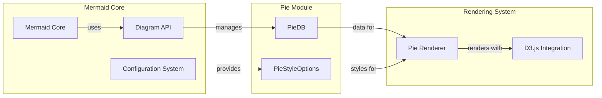

# Pie Module Documentation

## Introduction

The Pie module is a specialized diagram type within the Mermaid ecosystem that provides functionality for creating pie chart diagrams. It implements the database interface for pie chart data management and defines the core data structures and styling options specific to pie chart visualization. The module follows Mermaid's standard architecture pattern by extending the base `DiagramDB` interface and integrates with the broader diagram rendering system.

## Architecture Overview

The Pie module is structured around four core components that work together to provide complete pie chart functionality:

- **PieDB**: The database interface that manages pie chart data and configuration
- **PieFields**: The main data structure containing sections, display options, and configuration
- **D3Section**: Represents individual pie chart segments with label-value pairs
- **PieStyleOptions**: Comprehensive styling configuration for visual customization



## Component Details

### PieDB Interface

The `PieDB` interface is the central component that extends the base `DiagramDB` interface to provide pie chart-specific functionality. It manages both the common diagram operations (title, accessibility) and pie-specific data operations.

**Key Responsibilities:**
- Configuration management through `getConfig()`
- Diagram metadata handling (title, accessibility title and description)
- Section data management (add, retrieve sections)
- Data display control (show/hide data values)

**Interface Methods:**
- `getConfig()`: Returns the complete pie diagram configuration
- `clear()`: Resets the diagram data
- `setDiagramTitle(title)`: Sets the main diagram title
- `getDiagramTitle()`: Retrieves the current diagram title
- `setAccTitle(title)`: Sets accessibility title
- `getAccTitle()`: Gets accessibility title
- `setAccDescription(description)`: Sets accessibility description
- `getAccDescription()`: Gets accessibility description
- `addSection({label, value})`: Adds a new pie section
- `getSections()`: Returns all sections as a Map
- `setShowData(toggle)`: Controls data value visibility
- `getShowData()`: Returns current data visibility state

### PieFields Structure

The `PieFields` interface represents the complete state of a pie chart, containing all necessary data for rendering.

**Structure:**
```typescript
interface PieFields {
  sections: Sections;        // Map of label-value pairs
  showData: boolean;         // Display data values flag
  config: PieDiagramConfig;  // Diagram configuration
}
```

### D3Section Type

Represents individual pie chart segments with a simple label-value structure optimized for D3.js rendering.

**Structure:**
```typescript
interface D3Section {
  label: string;  // Section label/text
  value: number;  // Numeric value for the section
}
```

### PieStyleOptions Interface

Provides comprehensive styling configuration for pie chart visualization, including colors, fonts, and visual properties.

**Key Style Categories:**
- **Color Palette**: 12 predefined pie colors (pie1-pie12)
- **Typography**: Font family and text sizes for different elements
- **Text Colors**: Specific colors for titles, sections, and legends
- **Stroke Properties**: Colors and widths for borders
- **Visual Effects**: Opacity settings

## Data Flow Architecture



## Integration with Mermaid Ecosystem

The Pie module integrates seamlessly with the broader Mermaid architecture through several key interfaces:



## Configuration Integration

The Pie module leverages the Mermaid configuration system through `PieDiagramConfig`, which extends the base diagram configuration with pie-specific settings. This configuration is accessed through the `PieDB.getConfig()` method and influences rendering behavior, styling, and layout options.

## Styling and Theming

The `PieStyleOptions` interface provides extensive customization capabilities:

- **Color Management**: 12 predefined colors for pie sections
- **Typography Control**: Separate font sizes and colors for titles, sections, and legends
- **Visual Properties**: Stroke colors, widths, and opacity settings
- **Accessibility**: Text color configurations for improved readability

## Usage Patterns

The Pie module follows standard Mermaid diagram patterns:

1. **Data Input**: Sections are added via `addSection()` calls during parsing
2. **Configuration**: Style and display options are set through the configuration system
3. **Rendering**: The renderer accesses data through `PieDB` interface methods
4. **Styling**: Visual properties are applied based on `PieStyleOptions`

## Dependencies

The Pie module depends on several core Mermaid components:

- **[diagram-api](diagram-api.md)**: Base `DiagramDB` interface and diagram definition system
- **[config](config.md)**: `PieDiagramConfig` type definition
- **[rendering-util](rendering-util.md)**: Common rendering utilities and types
- **[themes](themes.md)**: Theme integration for consistent styling

## Extension Points

The modular design allows for future enhancements:

- Additional styling options can be added to `PieStyleOptions`
- New data management methods can be added to `PieDB`
- Custom section types can extend `D3Section`
- Configuration options can be expanded in `PieFields`

## Best Practices

When working with the Pie module:

1. **Data Validation**: Ensure section values are valid numbers before adding to database
2. **Accessibility**: Always provide meaningful titles and descriptions
3. **Styling Consistency**: Use theme-based colors when possible for visual consistency
4. **Performance**: Consider the number of sections for optimal rendering performance
5. **Configuration**: Leverage the configuration system rather than hardcoding values

This documentation provides a comprehensive overview of the Pie module's architecture, components, and integration within the Mermaid ecosystem. The module's design follows established patterns while providing specialized functionality for pie chart visualization.