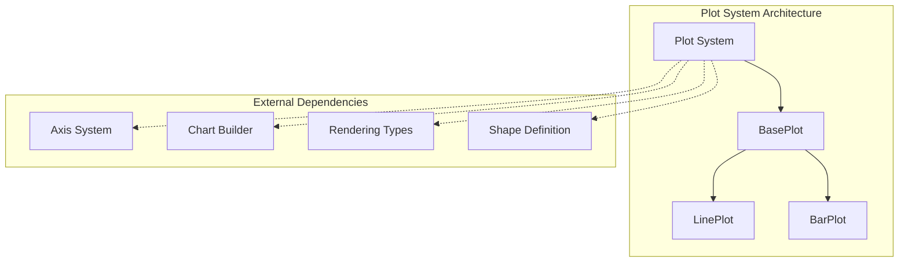
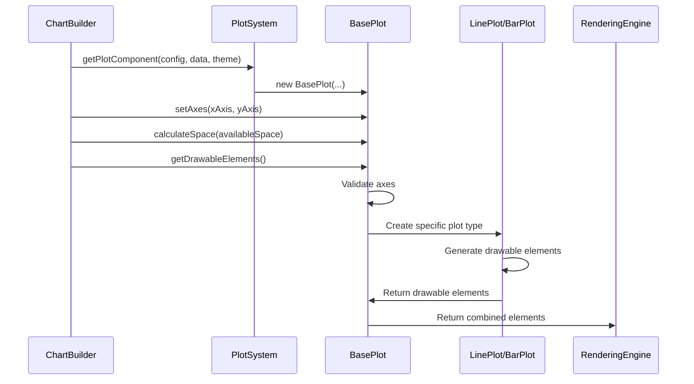
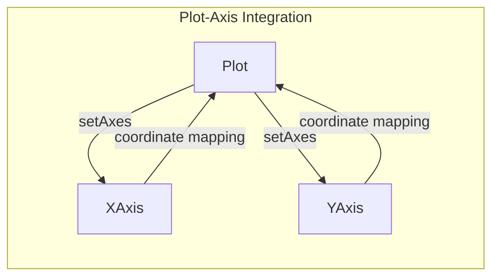
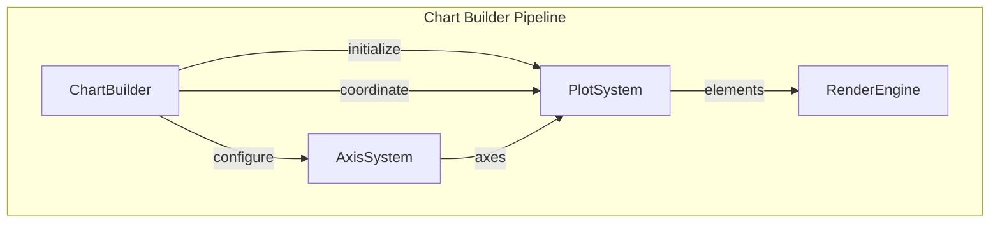
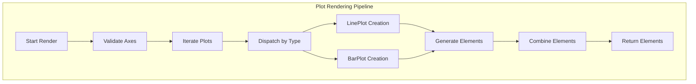

# Plot System Module Documentation

## Introduction

The plot-system module is a core component of the Mermaid XY Chart diagram system, responsible for rendering different types of data plots within chart visualizations. It provides a flexible architecture for creating line plots, bar plots, and other chart plot types, serving as the visual representation layer for data series in XY charts.

## Architecture Overview

The plot-system operates as a specialized rendering component within the broader XY chart ecosystem, working in conjunction with axis systems, chart builders, and the main Mermaid rendering engine.



## Core Components

### Plot Interface
The `Plot` interface defines the contract for all plot components within the XY chart system:

```typescript
interface Plot extends ChartComponent {
  setAxes(xAxis: Axis, yAxis: Axis): void;
}
```

This interface ensures that all plot implementations can:
- Integrate with the chart component system through `ChartComponent` inheritance
- Accept axis configurations for proper data mapping
- Participate in the chart rendering pipeline

### BasePlot Class
The `BasePlot` class serves as the foundation for all plot types, implementing core functionality:

**Key Responsibilities:**
- **Bounding Box Management**: Handles plot area dimensions and positioning
- **Axis Integration**: Manages X and Y axis associations for data mapping
- **Plot Type Dispatch**: Routes different plot types to specialized renderers
- **Drawable Element Generation**: Creates visual elements for rendering

**Core Methods:**
- `setAxes(xAxis, yAxis)`: Establishes axis relationships for data coordinate mapping
- `calculateSpace(availableSpace)`: Computes optimal plot dimensions within chart constraints
- `getDrawableElements()`: Generates visual elements based on plot data and configuration

### Plot Type Implementations

#### LinePlot
Specialized component for rendering line charts:
- Processes continuous data series
- Generates line paths and data points
- Supports multiple line series within a single chart

#### BarPlot
Dedicated component for bar chart visualizations:
- Renders discrete data categories
- Manages bar positioning and spacing
- Handles orientation-specific rendering (horizontal/vertical)

## Data Flow Architecture



## Component Interactions

### Integration with Axis System
The plot-system maintains a close relationship with the [axis-system](axis-system.md) module:



**Key Interactions:**
- **Coordinate Transformation**: Axes provide data-to-pixel coordinate mapping
- **Scale Management**: Axis scales determine plot element positioning
- **Theme Integration**: Axes contribute to overall chart theming consistency

### Chart Builder Integration
The plot-system works within the [chart-builder](chart-builder.md) architecture:



## Configuration and Theming

### Plot Configuration
The plot-system accepts configuration through `XYChartConfig`:
- **Chart Orientation**: Determines plot rendering direction
- **Plot Types**: Specifies which plot types to render
- **Spacing**: Controls plot area dimensions

### Theme Integration
Plot rendering respects the `XYChartThemeConfig`:
- **Color Schemes**: Applies consistent color palettes
- **Styling**: Maintains visual consistency across chart elements
- **Accessibility**: Supports theme-based accessibility features

## Rendering Process

### Plot Element Generation


### Error Handling
The plot-system implements robust error handling:
- **Axis Validation**: Ensures required axes are configured before rendering
- **Type Safety**: Validates plot data types before processing
- **Graceful Degradation**: Handles missing or invalid plot configurations

## Extension Points

### Custom Plot Types
The architecture supports adding new plot types:

1. **Implement Plot Interface**: Create new classes implementing the `Plot` interface
2. **Extend BasePlot**: Inherit from `BasePlot` for common functionality
3. **Add Type Dispatch**: Update `getDrawableElements()` to handle new types
4. **Register with Factory**: Add creation logic to `getPlotComponent()`

### Theming Extensions
Plot appearance can be customized through:
- **Theme Configuration**: Extend `XYChartThemeConfig` with plot-specific styling
- **Custom Renderers**: Implement specialized rendering for unique visual requirements
- **CSS Integration**: Leverage CSS classes for styling flexibility

## Performance Considerations

### Optimization Strategies
- **Lazy Initialization**: Plot components are created only when needed
- **Efficient Bounding**: Smart space calculation minimizes layout computations
- **Element Reuse**: Drawable elements are generated once per render cycle

### Memory Management
- **Bounded References**: Axis references are managed to prevent memory leaks
- **Element Cleanup**: Drawable elements are properly managed within the rendering pipeline
- **Configuration Isolation**: Plot configurations are immutable to prevent side effects

## Dependencies

### Direct Dependencies
- **[Axis System](axis-system.md)**: Provides coordinate mapping and scaling
- **[Chart Builder](chart-builder.md)**: Orchestrates plot creation and configuration
- **[Rendering Types](rendering-types.md)**: Supplies type definitions for visual elements
- **[Shape System](shape-system.md)**: Provides visual element definitions

### Indirect Dependencies
- **[Mermaid Core](mermaid-core.md)**: Integrates with the main rendering engine
- **[Theme System](theme-system.md)**: Applies consistent visual styling
- **[Configuration System](configuration.md)**: Processes chart-level configurations

## Usage Examples

### Basic Plot Creation
```typescript
// Plot creation through factory function
const plot = getPlotComponent(chartConfig, chartData, themeConfig);
plot.setAxes(xAxis, yAxis);
const drawableElements = plot.getDrawableElements();
```

### Plot Type Processing
The system automatically handles different plot types based on data configuration:
- **Line Plots**: For continuous data visualization
- **Bar Plots**: For categorical data representation
- **Future Types**: Extensible for additional plot varieties

## Future Enhancements

### Planned Features
- **Additional Plot Types**: Scatter plots, area charts, combination charts
- **Interactive Features**: Hover effects, data point selection, zoom capabilities
- **Animation Support**: Smooth transitions and data updates
- **Advanced Theming**: Per-plot-type styling options

### Architectural Improvements
- **Plugin Architecture**: Support for external plot type plugins
- **Performance Optimization**: WebGL rendering for large datasets
- **Accessibility Enhancements**: Screen reader support and keyboard navigation
- **Responsive Design**: Automatic adaptation to container sizes

## Conclusion

The plot-system module provides a robust, extensible foundation for data visualization within Mermaid's XY chart framework. Its clean architecture, comprehensive theming support, and flexible design make it an essential component for creating rich, interactive chart visualizations while maintaining consistency with the broader Mermaid ecosystem.