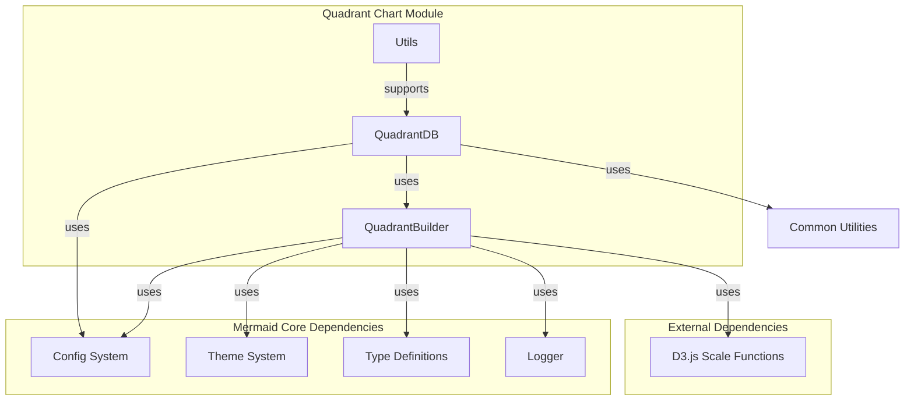
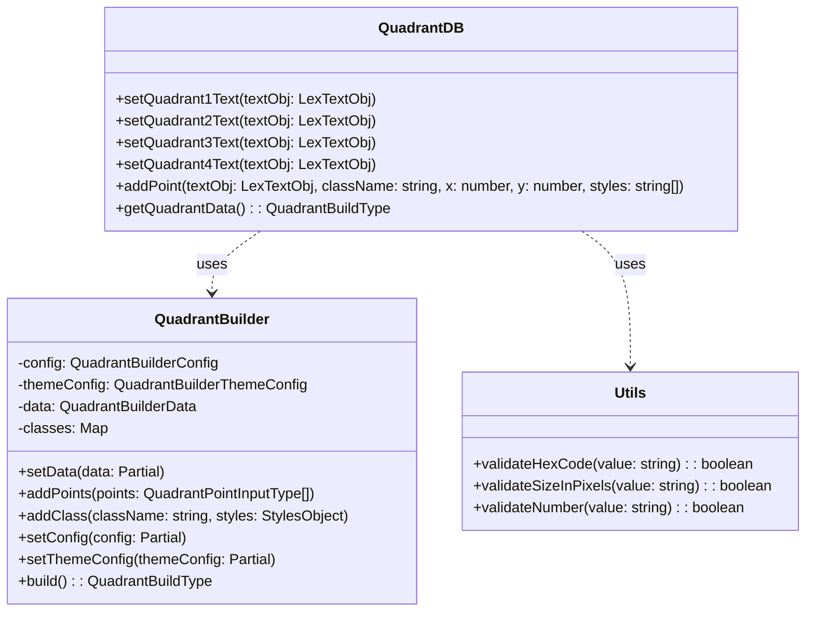
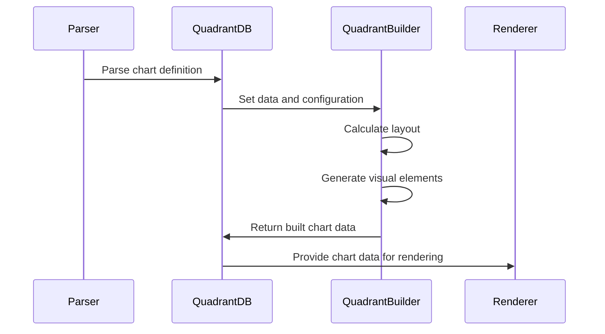
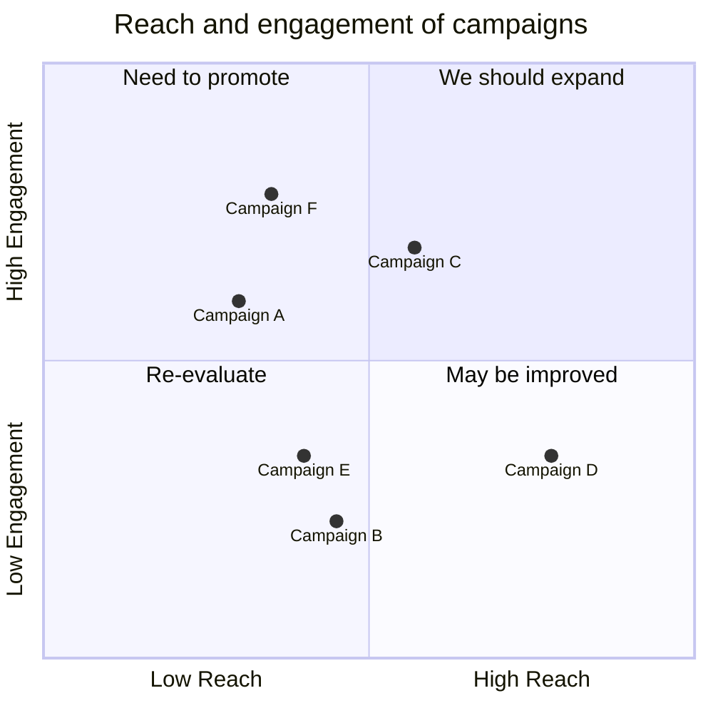

# Quadrant Chart Module

## Overview

The quadrant-chart module is a specialized diagram type within the Mermaid.js library that enables the creation of quadrant analysis charts. These charts are commonly used in strategic planning, risk assessment, and business analysis to visualize data points across four distinct quadrants, typically representing different categories or priority levels.

## Purpose

The quadrant-chart module provides a comprehensive solution for:
- **Strategic Analysis**: Visualizing SWOT analysis, BCG matrices, and priority matrices
- **Risk Assessment**: Plotting risks based on probability and impact
- **Project Management**: Prioritizing tasks based on urgency and importance
- **Business Intelligence**: Categorizing products, services, or initiatives
- **Data Visualization**: Creating scatter plots with quadrant-based categorization

## Architecture

### High-Level Architecture

### Component Relationships

## Core Functionality

### Data Flow

### Key Features

1. **Flexible Configuration**: Supports extensive customization of chart dimensions, colors, fonts, and positioning
2. **Dynamic Point Placement**: Uses D3.js scale functions for accurate point positioning
3. **Theme Integration**: Seamlessly integrates with Mermaid's theme system
4. **Style Classes**: Supports CSS-like styling for individual points
5. **Responsive Layout**: Automatically adjusts layout based on content and configuration
6. **Accessibility**: Includes proper text sanitization and accessibility features

## Module Structure

The quadrant-chart module consists of three main sub-modules:

### 1. [quadrantBuilder](quadrantBuilder.md)
The core building engine responsible for:
- Chart layout calculation and space management
- Point positioning using D3.js scales
- Theme application and styling
- Generation of visual elements (points, quadrants, axes, borders)

### 2. [quadrantDb](quadrantDb.md)
The data management layer handling:
- Text sanitization and processing
- Point and class data storage
- Configuration management
- Integration with Mermaid's common database utilities

### 3. [utils](utils.md)
Utility functions for:
- Input validation (hex codes, pixel sizes, numbers)
- Style parsing and error handling
- Common operations across the module

## Related Documentation

- [Core Mermaid Configuration](../config.md)
- [Theme System](../themes.md)
- [Common Types](../types.md)
- [Rendering Utilities](../rendering-util.md)
- [Diagram API](../diagram-api.md)

## Integration with Mermaid Ecosystem

The quadrant-chart module integrates with several core Mermaid systems:

- **Configuration System**: Inherits from `BaseDiagramConfig` and uses `QuadrantChartConfig`
- **Theme System**: Utilizes theme variables for consistent styling across diagram types
- **Type System**: Extends Mermaid's type definitions for points, text, and rendering data
- **Rendering Pipeline**: Follows Mermaid's standard diagram rendering workflow
- **Parser Integration**: Works with Mermaid's grammar-based parser system

## Usage Examples

The module supports various chart configurations:

## Configuration Options

The module supports extensive configuration through:
- Chart dimensions (width, height)
- Axis positioning and visibility
- Font sizes and padding for all text elements
- Point styling (radius, color, stroke)
- Border styling (width, color)
- Theme-based color schemes

For detailed configuration options, see the [quadrantBuilder](quadrantBuilder.md) documentation.