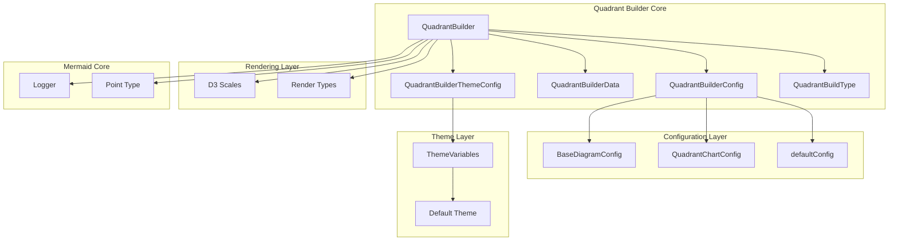
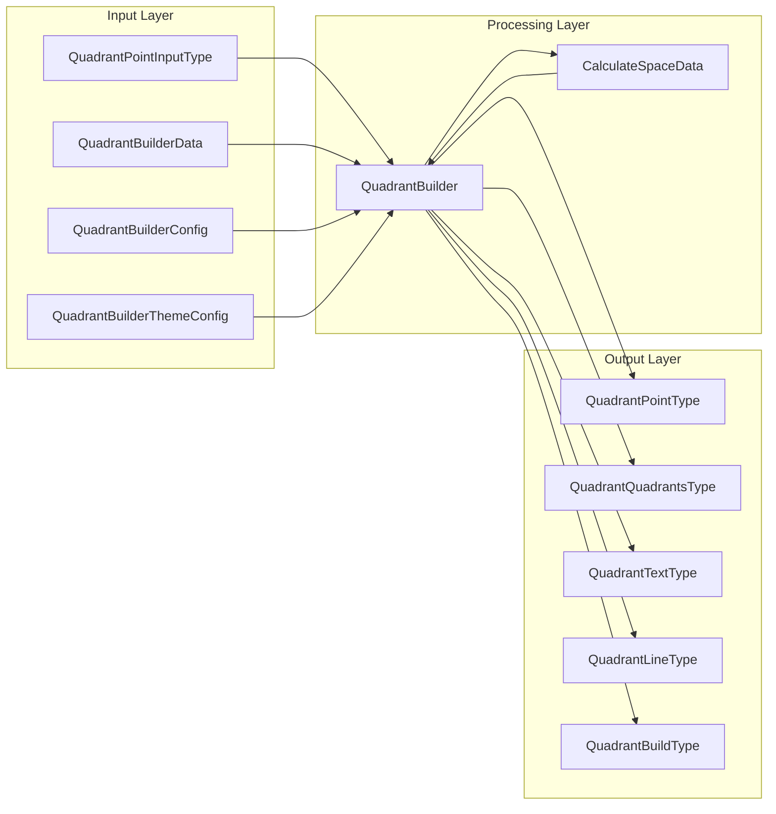
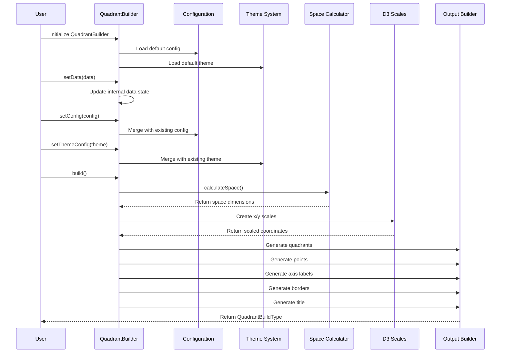
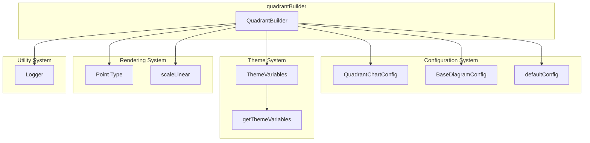
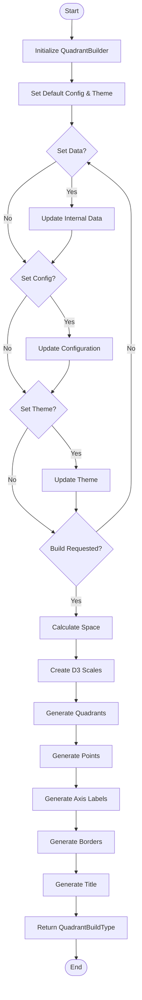
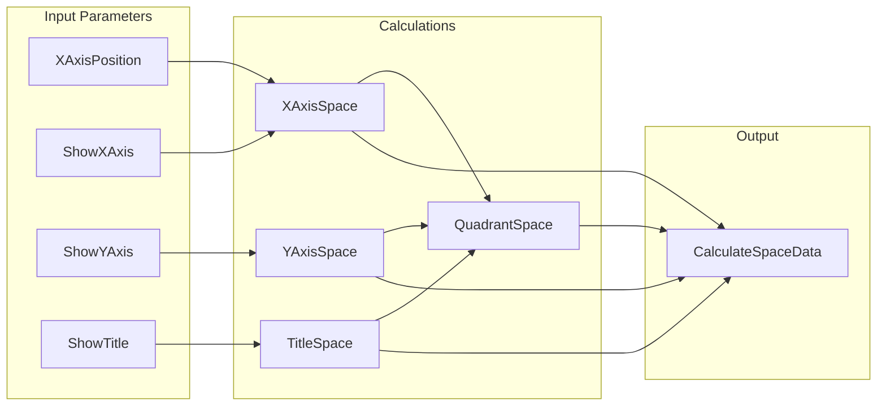
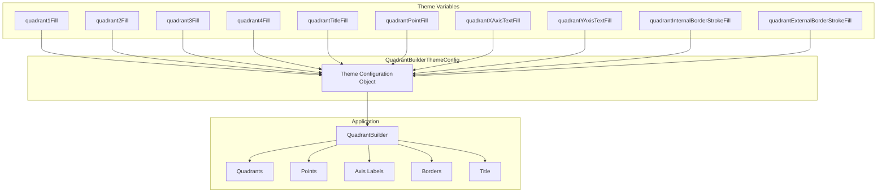

# Quadrant Builder Module Documentation

## Introduction

The `quadrantBuilder` module is a core component of the Mermaid quadrant chart diagram system. It provides a comprehensive builder pattern implementation for creating quadrant charts, which are used to visualize data points distributed across four quadrants with customizable styling, themes, and configurations. This module handles the transformation of raw data into renderable chart elements including points, quadrants, axis labels, borders, and titles.

## Architecture Overview

The quadrantBuilder module follows a builder pattern architecture that separates concerns into distinct configuration layers: data, styling, and rendering. It integrates with the broader Mermaid ecosystem through configuration types, theme systems, and rendering utilities.

## Component Relationships

The quadrantBuilder module consists of several interconnected components that work together to build quadrant charts:

## Data Flow Architecture

The data transformation pipeline in quadrantBuilder follows a systematic approach from raw input to renderable output:

## Core Components

### QuadrantBuilder Class

The main builder class that orchestrates the creation of quadrant charts. It manages configuration, data, and theme settings while providing methods for building the final chart structure.

**Key Responsibilities:**
- Configuration management (data, styling, themes)
- Space calculation and layout planning
- Coordinate transformation using D3 scales
- Generation of all chart elements (points, quadrants, labels, borders)

**Key Methods:**
- `build()`: Main method that constructs the complete chart
- `calculateSpace()`: Determines layout dimensions based on configuration
- `getQuadrantPoints()`: Transforms input points to chart coordinates
- `getQuadrants()`: Creates quadrant definitions with styling
- `getAxisLabels()`: Generates axis label positioning and styling
- `getBorders()`: Creates border line definitions

### Configuration Types

#### QuadrantBuilderConfig
Extends the base diagram configuration with quadrant-specific settings including chart dimensions, padding, font sizes, and axis positioning options.

#### QuadrantBuilderData
Defines the input data structure including title text, quadrant labels, axis labels, and point data.

#### QuadrantBuilderThemeConfig
Manages color schemes and styling for all chart elements including quadrant fills, text colors, and border strokes.

### Data Types

#### QuadrantPointInputType
Raw input format for data points with position, text, and optional styling properties.

#### QuadrantPointType
Processed point data ready for rendering with calculated coordinates and applied styling.

#### QuadrantQuadrantsType
Defines quadrant regions with positioning, dimensions, and text styling.

#### QuadrantTextType
Comprehensive text styling including position, color, font size, and rotation.

#### QuadrantLineType
Border line definitions with stroke properties and coordinates.

#### QuadrantBuildType
The final output structure containing all renderable chart elements.

## Integration with Mermaid Ecosystem

The quadrantBuilder module integrates with several other Mermaid components:

## Process Flow

The quadrantBuilder follows a systematic process to transform input data into a complete chart structure:

## Space Calculation Algorithm

The space calculation is a critical component that determines the layout of all chart elements:

## Theme Integration

The module integrates with Mermaid's theme system to provide consistent styling:

## Usage Patterns

The quadrantBuilder module is designed to be used in a fluent, chainable manner:

1. **Initialization**: Create a new QuadrantBuilder instance
2. **Configuration**: Set data, configuration, and theme options
3. **Building**: Call the build() method to generate the final chart structure
4. **Rendering**: Use the returned QuadrantBuildType with rendering systems

## Dependencies

The quadrantBuilder module has the following key dependencies:

- **D3.js**: For scale calculations and coordinate transformations
- **Mermaid Configuration System**: For base configuration and chart-specific settings
- **Mermaid Theme System**: For consistent styling and color management
- **Mermaid Logger**: For debugging and trace information
- **Mermaid Types**: For shared type definitions like Point

## Related Documentation

For more information about related components, see:

- [config module](config.md) - Configuration system details
- [themes module](themes.md) - Theme system and styling
- [types module](types.md) - Shared type definitions
- [quadrant-chart module](quadrant-chart.md) - Parent module documentation

## Summary

The quadrantBuilder module provides a robust, flexible system for creating quadrant charts within the Mermaid ecosystem. Its builder pattern design allows for incremental configuration and customization while maintaining clean separation of concerns between data, styling, and rendering logic. The module's integration with D3.js for coordinate transformation and the Mermaid theme system ensures consistent, high-quality chart generation that can be easily customized and extended.