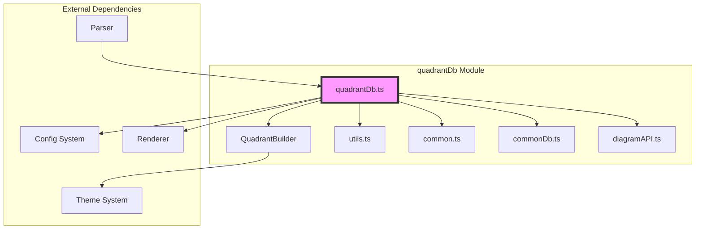
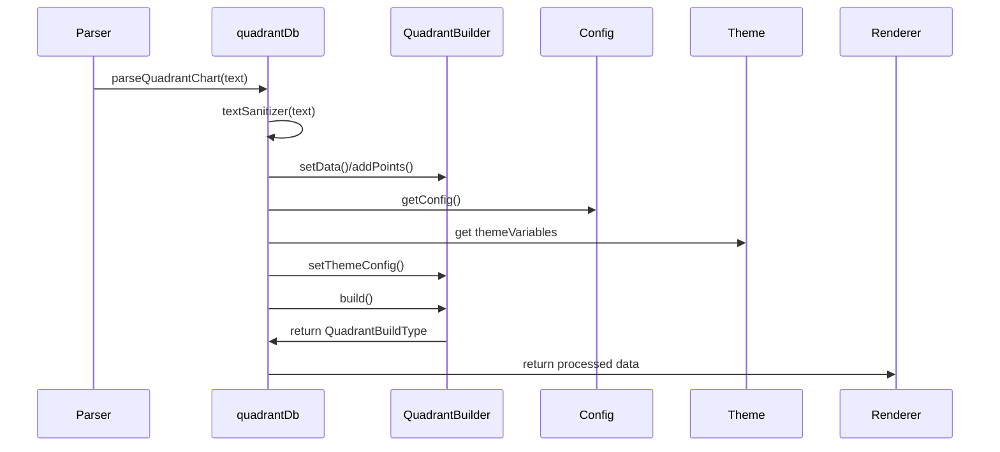
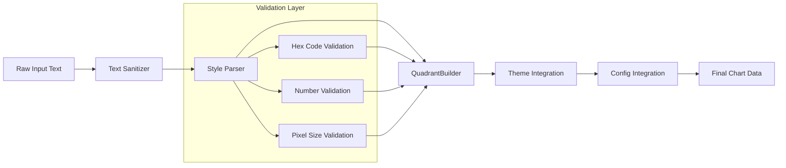
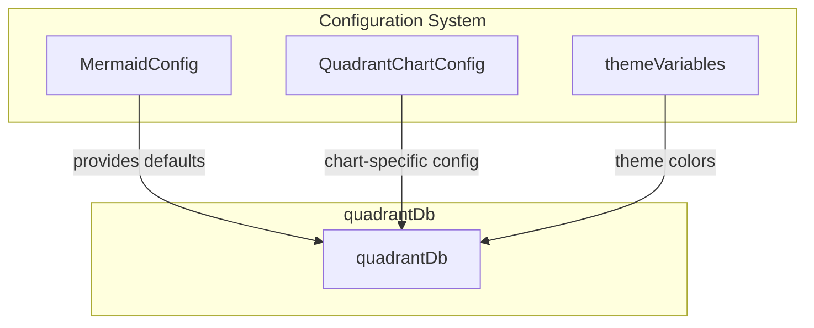

# quadrantDb Module Documentation

## Introduction

The `quadrantDb` module is a core data management component of the Mermaid quadrant chart diagram system. It serves as the primary database interface for quadrant charts, handling data parsing, validation, storage, and coordination with the rendering pipeline. This module acts as the bridge between the diagram syntax parser and the visual rendering engine, ensuring that quadrant chart data is properly structured and validated before being passed to the renderer.

## Module Purpose and Core Functionality

The quadrantDb module provides essential functionality for quadrant chart diagrams, which are used to visualize data points distributed across four quadrants based on two axes (typically representing different metrics or criteria). The module is responsible for:

- **Data Management**: Storing and managing quadrant chart configuration, text labels, data points, and styling information
- **Text Processing**: Sanitizing and processing text content for quadrants, axes, and data points
- **Style Validation**: Validating and parsing style properties for data points and classes
- **Integration**: Coordinating with the QuadrantBuilder to construct the final chart data structure
- **Configuration**: Managing chart dimensions, themes, and display options

## Architecture and Component Relationships

### Core Architecture



### Component Interaction Flow



## Key Components and Interfaces

### LexTextObj Interface

The `LexTextObj` interface is the primary data structure for text content in quadrant charts:

```typescript
interface LexTextObj {
  text: string;
  type: 'text' | 'markdown';
}
```

This interface supports both plain text and markdown content, providing flexibility in how text is displayed within the chart.

### Core Functions

#### Text Management Functions
- `setQuadrant1Text(textObj: LexTextObj)`: Sets text for quadrant 1
- `setQuadrant2Text(textObj: LexTextObj)`: Sets text for quadrant 2  
- `setQuadrant3Text(textObj: LexTextObj)`: Sets text for quadrant 3
- `setQuadrant4Text(textObj: LexTextObj)`: Sets text for quadrant 4
- `setXAxisLeftText(textObj: LexTextObj)`: Sets left X-axis label
- `setXAxisRightText(textObj: LexTextObj)`: Sets right X-axis label
- `setYAxisTopText(textObj: LexTextObj)`: Sets top Y-axis label
- `setYAxisBottomText(textObj: LexTextObj)`: Sets bottom Y-axis label

#### Data Point Management
- `addPoint(textObj: LexTextObj, className: string, x: number, y: number, styles: string[])`: Adds a data point to the chart with position and styling
- `addClass(className: string, styles: string[])`: Defines CSS-like classes for styling data points

#### Configuration Management
- `setWidth(width: number)`: Sets chart width
- `setHeight(height: number)`: Sets chart height
- `parseStyles(styles: string[])`: Parses and validates style strings

#### Data Retrieval
- `getQuadrantData()`: Retrieves the complete chart data structure for rendering
- `clear()`: Resets all chart data and configuration

## Data Flow and Processing Pipeline



## Style Validation System

The module implements a comprehensive style validation system through the `parseStyles()` function:

### Supported Style Properties
- **radius**: Validates numeric values for point radius
- **color**: Validates hexadecimal color codes
- **stroke-color**: Validates hexadecimal stroke colors
- **stroke-width**: Validates pixel-based stroke widths (e.g., "2px")

### Error Handling
The module uses custom error types for style validation:
- `InvalidStyleError`: Thrown when style values don't match expected formats
- Descriptive error messages guide users to correct formatting

## Integration with Mermaid Ecosystem

### Configuration Integration


### Theme System Integration
The module integrates with Mermaid's theme system to provide consistent styling:
- Quadrant fill colors
- Text colors for different chart elements
- Border stroke colors
- Point styling

### Common Database Functions
The module extends common database functionality:
- Title management (`setDiagramTitle`, `getDiagramTitle`)
- Accessibility support (`setAccTitle`, `getAccTitle`, `setAccDescription`, `getAccDescription`)
- Text sanitization through the common utilities

## Error Handling and Validation

### Input Validation
- Text sanitization prevents XSS attacks
- Style property validation ensures data integrity
- Coordinate validation for data points
- Class name validation for styling

### Error Types
- `InvalidStyleError`: Style validation failures
- `Error`: General parsing errors with descriptive messages

## Performance Considerations

### Optimization Strategies
- Lazy loading of configuration data
- Efficient data structure management through QuadrantBuilder
- Minimal memory footprint through proper cleanup
- Cached theme configuration to avoid repeated lookups

### Memory Management
- The `clear()` function ensures proper cleanup
- Reference management prevents memory leaks
- Efficient data structure updates through partial updates

## Usage Examples

### Basic Chart Setup
```typescript
// Set quadrant labels
quadrantDb.setQuadrant1Text({ text: "High Impact, High Effort", type: "text" });
quadrantDb.setQuadrant2Text({ text: "High Impact, Low Effort", type: "text" });
quadrantDb.setQuadrant3Text({ text: "Low Impact, Low Effort", type: "text" });
quadrantDb.setQuadrant4Text({ text: "Low Impact, High Effort", type: "text" });

// Set axis labels
quadrantDb.setXAxisLeftText({ text: "Low Impact", type: "text" });
quadrantDb.setXAxisRightText({ text: "High Impact", type: "text" });
quadrantDb.setYAxisTopText({ text: "High Effort", type: "text" });
quadrantDb.setYAxisBottomText({ text: "Low Effort", type: "text" });
```

### Adding Data Points
```typescript
// Add a data point with custom styling
quadrantDb.addPoint(
  { text: "Feature A", type: "text" },
  "priority-high",
  0.8, // x-coordinate (0-1)
  0.3, // y-coordinate (0-1)
  ["radius: 8", "color: #ff6b6b", "stroke-color: #c92a2a", "stroke-width: 2px"]
);
```

### Chart Configuration
```typescript
// Set chart dimensions
quadrantDb.setWidth(600);
quadrantDb.setHeight(400);

// Retrieve final chart data
const chartData = quadrantDb.getQuadrantData();
```

## Dependencies and References

### Internal Dependencies
- **[quadrantBuilder](quadrantBuilder.md)**: Core builder pattern implementation for chart construction
- **[common](common.md)**: Shared utility functions for text processing
- **[commonDb](commonDb.md)**: Common database functionality for diagram management
- **[diagramAPI](diagramAPI.md)**: Configuration and API management
- **[utils](utils.md)**: Validation utilities for style properties

### External Dependencies
- **Configuration System**: Provides default chart settings and theme integration
- **Theme System**: Supplies color schemes and visual styling properties
- **Parser**: Supplies parsed diagram syntax to the database
- **Renderer**: Consumes the final chart data for visual rendering

## Best Practices

### Data Management
- Always sanitize text input before processing
- Use the provided style validation system for custom styling
- Leverage the class system for consistent point styling
- Clear the database between diagram renders to prevent data leakage

### Performance
- Minimize the number of style validation calls by batching operations
- Use the configuration system for default values rather than hardcoding
- Take advantage of theme integration for consistent styling

### Error Handling
- Implement proper error handling for style validation failures
- Provide meaningful error messages to users
- Use the built-in validation functions for all user input

## Future Considerations

### Extensibility
The modular design allows for easy extension of:
- Additional style properties
- New chart elements
- Enhanced validation rules
- Custom theme integration

### Scalability
The architecture supports:
- Large numbers of data points through efficient data structures
- Complex styling scenarios through the class system
- Multiple chart instances through proper isolation
- Theme variations through the configuration system