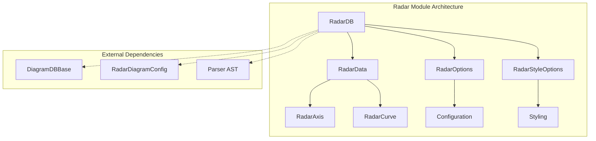
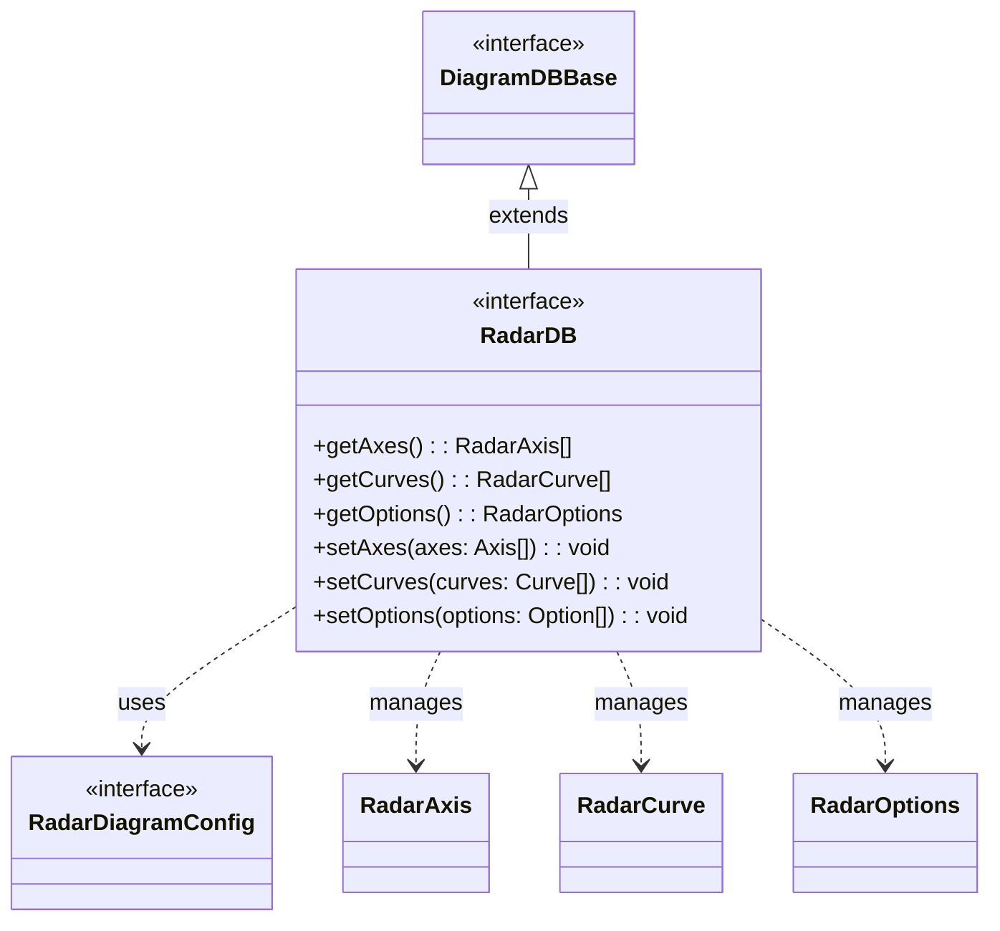
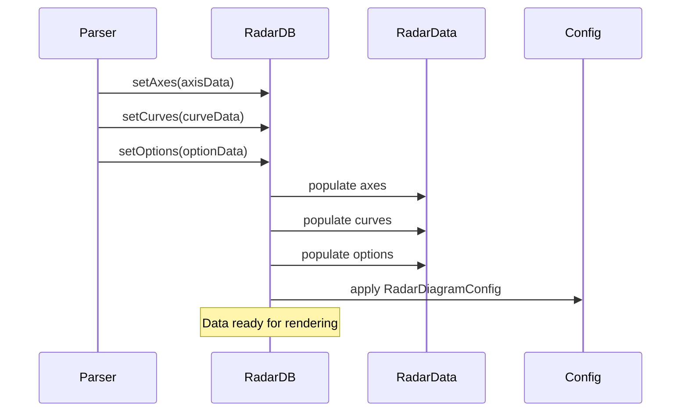
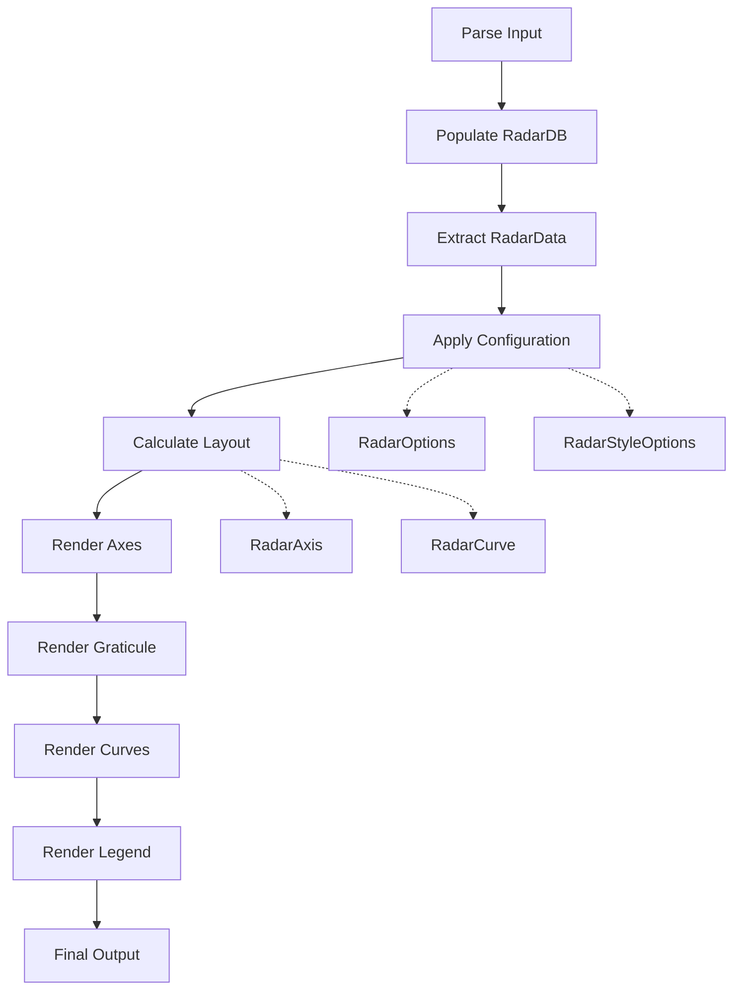
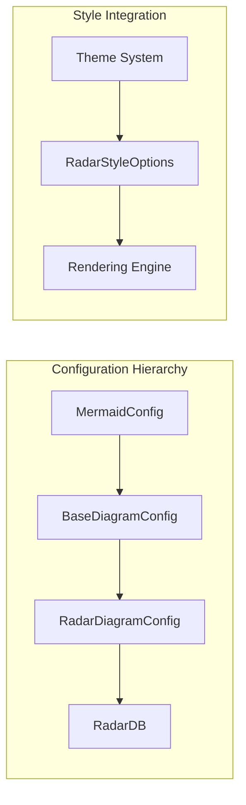
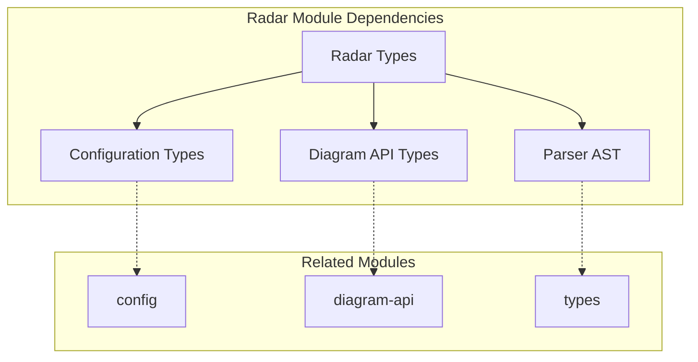

# Radar Module Documentation

## Introduction

The radar module is a specialized diagram type within the Mermaid ecosystem that enables the creation of radar charts (also known as spider charts or web charts). Radar charts are particularly useful for displaying multivariate data in a two-dimensional format, where multiple quantitative variables are represented on axes starting from the same point. This module provides a comprehensive solution for visualizing comparative data across multiple dimensions, making it ideal for performance analysis, skill assessments, product comparisons, and any scenario requiring the display of multiple metrics simultaneously.

## Core Architecture

### Module Structure

The radar module follows Mermaid's standardized diagram architecture, implementing the core interfaces and patterns established by the diagram API. It consists of several key components that work together to parse, store, and render radar chart data.

### Core Components

#### RadarDB Interface

The `RadarDB` interface serves as the primary data management layer for radar diagrams. It extends `DiagramDBBase<RadarDiagramConfig>` to integrate with Mermaid's diagram system while providing specialized methods for radar-specific data operations.

#### Data Structures

The module defines several key data structures that represent the different aspects of a radar chart:

**RadarAxis**: Defines individual axes in the radar chart
- `name`: Internal identifier for the axis
- `label`: Display label for the axis

**RadarCurve**: Represents data series in the radar chart
- `name`: Identifier for the data series
- `entries`: Array of numeric values corresponding to each axis
- `label`: Display label for the series

**RadarOptions**: Configuration options for chart behavior
- `showLegend`: Controls legend visibility
- `ticks`: Number of tick marks on axes
- `max`: Maximum value for axis scaling (null for auto-scaling)
- `min`: Minimum value for axis scaling
- `graticule`: Grid line style ('circle' or 'polygon')

**RadarStyleOptions**: Visual styling configuration
- `axisColor`: Color of axis lines
- `axisStrokeWidth`: Width of axis lines
- `axisLabelFontSize`: Font size for axis labels
- `curveOpacity`: Opacity of data curves
- `curveStrokeWidth`: Width of data curve lines
- `graticuleColor`: Color of grid lines
- `graticuleOpacity`: Opacity of grid lines
- `graticuleStrokeWidth`: Width of grid lines
- `legendBoxSize`: Size of legend boxes
- `legendFontSize`: Font size for legend text

**RadarData**: Aggregated data container
- `axes`: Array of RadarAxis objects
- `curves`: Array of RadarCurve objects
- `options`: RadarOptions configuration

## Data Flow Architecture

### Parsing and Data Population

### Rendering Pipeline

## Integration with Mermaid Ecosystem

### Configuration Integration

The radar module integrates with Mermaid's configuration system through the `RadarDiagramConfig` interface, which provides diagram-specific configuration options while maintaining compatibility with the global Mermaid configuration.

### Theme System Integration

The radar module leverages Mermaid's theme system to provide consistent styling across different diagram types. The `RadarStyleOptions` interface allows for both theme-based and custom styling, ensuring visual consistency while providing flexibility for specific use cases.

## Usage Patterns

### Basic Radar Chart

A typical radar chart consists of multiple axes representing different dimensions and one or more curves representing data series. Each curve contains values that correspond to the axes, creating a polygonal shape that visualizes the data across all dimensions.

### Configuration Options

The module supports extensive configuration through both the `RadarOptions` interface for behavioral settings and `RadarStyleOptions` for visual customization. This separation allows users to control chart behavior independently from its appearance.

### Data Scaling and Normalization

The radar module handles data scaling through the `max` and `min` options in `RadarOptions`. When `max` is null, the module automatically calculates the maximum value from the data, ensuring optimal visualization. The `min` value provides a baseline for all axes, allowing for consistent comparison across different data sets.

## Dependencies and Relationships

### Internal Dependencies

The radar module depends on several core Mermaid components:

- **Diagram API**: Provides the base interfaces and functionality for diagram integration
- **Configuration System**: Handles diagram-specific and global configuration options
- **Parser**: Processes the radar chart syntax and populates the data structures
- **Rendering Engine**: Handles the actual visualization of the chart

### External Dependencies

The module interfaces with the parser's AST (Abstract Syntax Tree) through the `Axis`, `Curve`, and `Option` types, ensuring seamless integration with Mermaid's parsing infrastructure.

## Extension Points

### Custom Styling

The `RadarStyleOptions` interface provides numerous extension points for custom styling, allowing developers to create unique visual presentations while maintaining the core functionality.

### Data Processing

The `RadarDB` interface can be extended to support additional data processing capabilities, such as data transformation, filtering, or aggregation, providing flexibility for complex use cases.

### Rendering Customization

While the core rendering is handled by Mermaid's rendering engine, the data structures and configuration options provide hooks for customizing the rendering behavior and output format.

## Best Practices

### Data Organization

When working with radar charts, it's important to organize data in a way that maximizes readability and comparison capabilities. The module's structure supports this through clear separation of axes, curves, and configuration options.

### Performance Considerations

For charts with many axes or curves, consider the impact on rendering performance and visual clarity. The module's architecture supports efficient data management and rendering, but optimal user experience may require careful consideration of data density.

### Accessibility

The radar module supports accessibility through proper labeling and configuration options. Use descriptive labels for axes and curves, and consider the color choices for users with visual impairments.

## Conclusion

The radar module provides a robust and flexible solution for creating radar charts within the Mermaid ecosystem. Its well-defined architecture, comprehensive configuration options, and seamless integration with Mermaid's core systems make it an effective tool for visualizing multivariate data. The module's design supports both simple use cases and complex customization requirements, ensuring it can adapt to a wide range of visualization needs.