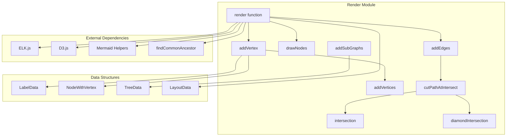
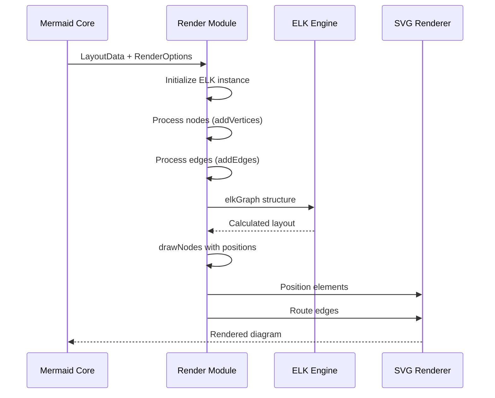
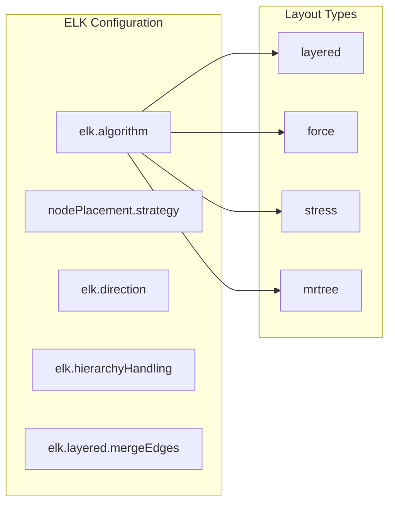
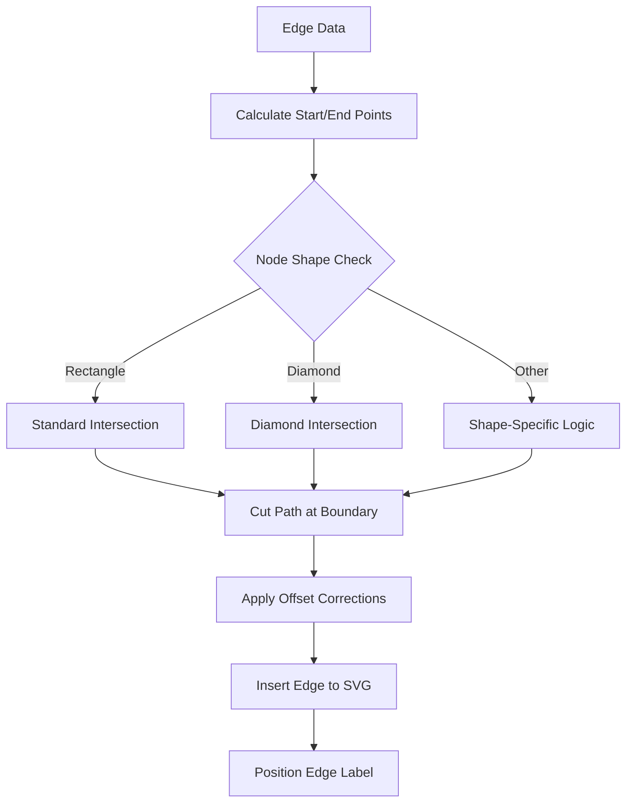
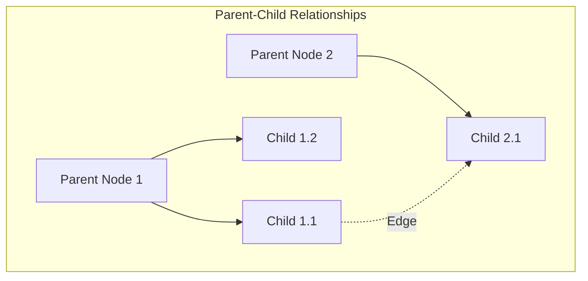

# Render Module Documentation

## Introduction

The render module is a core component of the mermaid-layout-elk package, responsible for rendering diagrams using the ELK (Eclipse Layout Kernel) layout algorithm. This module provides advanced graph layout capabilities for Mermaid diagrams, particularly optimized for flowcharts and hierarchical graph structures.

## Core Functionality

The render module serves as the bridge between Mermaid's diagram data structures and the ELK layout engine, providing:

- **ELK Integration**: Interfaces with the ELK JavaScript library for sophisticated graph layout algorithms
- **Node Positioning**: Calculates optimal positions for diagram nodes and subgraphs
- **Edge Routing**: Computes efficient edge paths with proper intersection handling
- **Hierarchical Layout**: Supports nested subgraphs and complex diagram hierarchies
- **Shape-Aware Rendering**: Handles different node shapes (rectangles, diamonds, etc.) with proper edge connections

## Architecture

### Component Overview



### Key Components

#### 1. Render Function
The main entry point that orchestrates the entire rendering process:
- Initializes ELK layout engine
- Processes diagram data structures
- Coordinates node and edge rendering
- Applies final layout transformations

#### 2. Node Management
- **addVertex**: Creates individual nodes with proper sizing and positioning
- **addVertices**: Batch processes multiple nodes with parent-child relationships
- **drawNodes**: Renders nodes to SVG with calculated positions and transformations

#### 3. Edge Management
- **addEdges**: Processes edge data and creates ELK-compatible edge structures
- **cutPathAtIntersect**: Trims edge paths at node boundaries
- **intersection/diamondIntersection**: Calculates precise intersection points for different node shapes

#### 4. Layout Calculation
- **addSubGraphs**: Builds hierarchical subgraph structures
- **calcOffset**: Computes position offsets for nested elements
- **findCommonAncestor**: Determines shared parent nodes for edge routing

## Data Flow



## Key Interfaces

### LabelData
```typescript
interface LabelData {
  width: number;
  height: number;
  wrappingWidth?: number;
  labelNode?: SVGGElement | null;
}
```

### NodeWithVertex
```typescript
interface NodeWithVertex extends Omit<Node, 'domId'> {
  children?: unknown[];
  labelData?: LabelData;
  domId?: Node['domId'] | SVGGroup | d3.Selection<SVGAElement, unknown, Element | null, unknown>;
}
```

## Layout Algorithm Integration

The module integrates with ELK's layout algorithms through configuration options:



## Edge Routing Process



## Shape-Specific Rendering

The module handles various node shapes with specialized intersection calculations:

### Rectangle Nodes
- Standard axis-aligned bounding box intersection
- Simple edge trimming at node boundaries

### Diamond Nodes
- Polygon-based intersection calculation
- Four-sided diamond shape with precise point-to-edge intersection

### Complex Shapes
- Extensible intersection framework
- Support for custom shape definitions

## Hierarchical Layout Support



The module supports:
- Nested subgraphs with proper containment
- Cross-hierarchy edge routing
- Automatic offset calculations for nested elements
- Hierarchical layout options (INCLUDE_CHILDREN, SEPARATE_CHILDREN)

## Performance Optimizations

- **Batch Processing**: Nodes and edges are processed in parallel using Promise.all
- **DOM Minimization**: Temporary DOM elements are removed after size calculation
- **Efficient Lookups**: Node and cluster databases for O(1) access
- **Smart Caching**: Reuses calculated positions and dimensions

## Error Handling

The module includes robust error handling for:
- Missing nodes in edge definitions
- Invalid shape specifications
- ELK layout calculation failures
- DOM manipulation errors

## Dependencies

### Internal Dependencies
- [find-common-ancestor](find-common-ancestor.md): Tree structure utilities for hierarchical layouts
- [mermaid-core](core-mermaid.md): Core Mermaid functionality and types

### External Dependencies
- **ELK.js**: Eclipse Layout Kernel for graph layout algorithms
- **D3.js**: SVG manipulation and curve interpolation

## Usage Examples

The render module is typically used as part of the Mermaid rendering pipeline:

```typescript
import { render } from 'mermaid-layout-elk/render';

const layoutData = {
  nodes: [...],
  edges: [...],
  direction: 'TB',
  config: { elk: { algorithm: 'layered' } }
};

await render(layoutData, svgElement, helpers, options);
```

## Configuration Options

### ELK-Specific Options
- `algorithm`: Layout algorithm ('layered', 'force', 'stress', etc.)
- `nodePlacementStrategy`: Node placement approach
- `mergeEdges`: Whether to merge parallel edges
- `cycleBreakingStrategy`: How to handle cycles in the graph

### Rendering Options
- `direction`: Overall layout direction (TB, BT, LR, RL)
- `curve`: Interpolation curve for edges
- `padding`: Node and edge padding values

## Future Enhancements

- Support for additional ELK layout algorithms
- Enhanced shape library with more intersection calculations
- Performance optimizations for large graphs
- Better error recovery mechanisms
- Extended configuration options for fine-tuned control