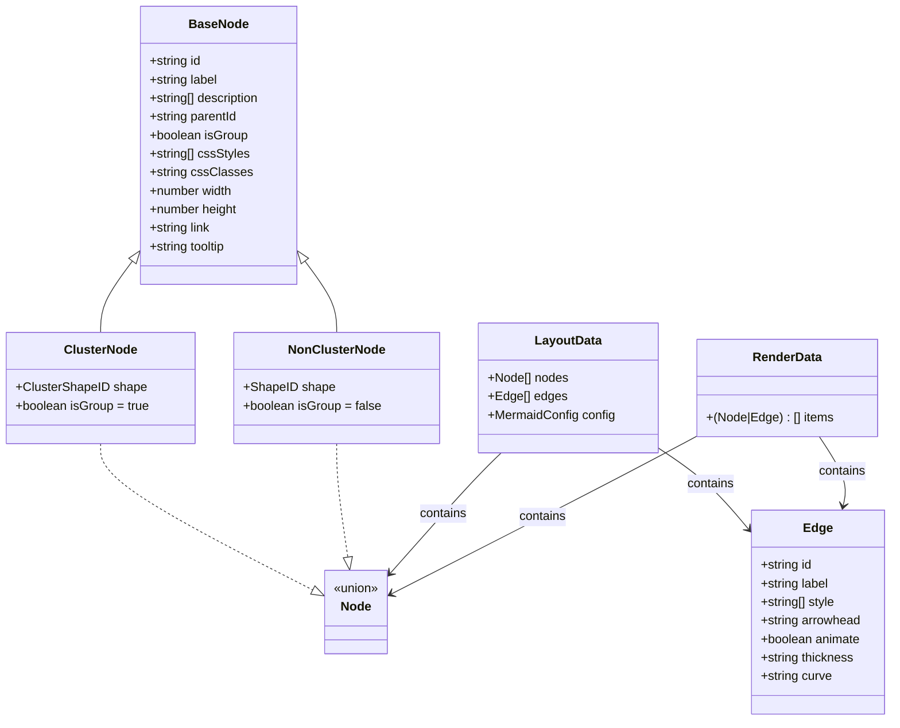
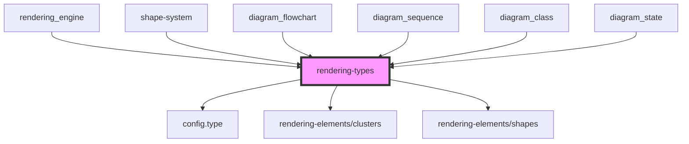
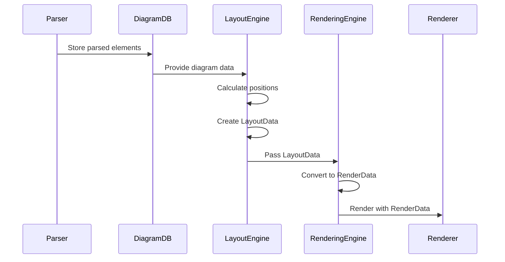
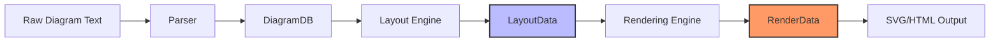
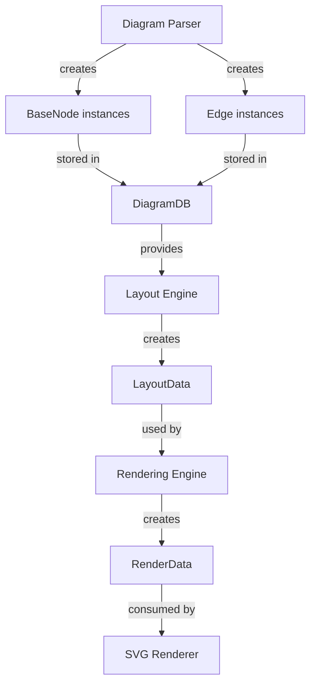
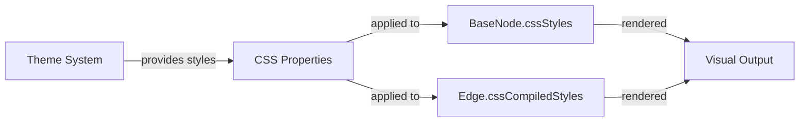

# Rendering Types Module

## Introduction

The rendering-types module provides the foundational type definitions for Mermaid's rendering system. It defines the core data structures that represent nodes, edges, and layout information used across all diagram types in the Mermaid ecosystem. These types serve as the common language between the parsing, layout, and rendering phases of diagram generation.

## Overview

The module establishes a unified type system for diagram elements, ensuring consistency across different diagram types while allowing for type-specific extensions. It provides the building blocks for representing graphical elements (nodes and edges) and their associated metadata, styling, and layout information.

## Core Components

### BaseNode Interface

The `BaseNode` interface is the fundamental building block for all diagram nodes. It provides a comprehensive set of properties that can represent any graphical element in a Mermaid diagram.

**Key Properties:**
- **Identification**: `id`, `domId` - Unique identifiers for the node
- **Content**: `label`, `description[]` - Text content and descriptions
- **Hierarchy**: `parentId`, `isGroup` - Support for nested structures and clusters
- **Styling**: `cssStyles[]`, `cssClasses`, `cssCompiledStyles[]` - CSS styling support
- **Positioning**: `x`, `y`, `position` - Coordinate and relative positioning
- **Visual Properties**: `width`, `height`, `rx`, `ry` - Dimensions and corner rounding
- **Behavior**: `link`, `tooltip`, `haveCallback` - Interactive features
- **Layout**: `dir`, `padding` - Direction and spacing information

**Specialized Node Types:**
- `ClusterNode`: Extends BaseNode for container/group nodes (`isGroup: true`)
- `NonClusterNode`: Extends BaseNode for regular nodes (`isGroup: false`)
- `Node`: Union type representing any node (ClusterNode | NonClusterNode)

### Edge Interface

The `Edge` interface defines the structure for connections between nodes, supporting various diagram types and edge styles.

**Key Properties:**
- **Identification**: `id` - Unique identifier for the edge
- **Content**: `label`, `text` - Edge labels and text content
- **Styling**: `style[]`, `classes`, `cssCompiledStyles[]` - Visual styling
- **Arrows**: `arrowhead`, `arrowTypeStart`, `arrowTypeEnd` - Arrow styling
- **Animation**: `animate`, `animation` - Animation controls
- **Layout**: `curve`, `minlen`, `labelpos` - Path and positioning
- **Appearance**: `thickness`, `pattern`, `stroke` - Visual properties

### LayoutData Interface

The `LayoutData` interface encapsulates the complete layout information for a diagram, including all nodes, edges, and configuration.

**Structure:**
```typescript
interface LayoutData {
  nodes: Node[];           // Array of all nodes in the diagram
  edges: Edge[];           // Array of all edges in the diagram
  config: MermaidConfig;   // Global configuration
  [key: string]: any;      // Extensible for diagram-specific data
}
```

### RenderData Interface

The `RenderData` interface represents the final rendering data structure, containing all items to be rendered.

**Structure:**
```typescript
interface RenderData {
  items: (Node | Edge)[];  // Combined array of nodes and edges
  [key: string]: any;      // Extensible for rendering-specific data
}
```

## Architecture

### Type Hierarchy



### Module Dependencies



## Data Flow

### From Parsing to Rendering



### Type Transformation Flow



## Component Interactions

### Node and Edge Creation



### Styling and Theming Integration



## Specialized Extensions

### Diagram-Specific Node Types

The base types support extension for specific diagram requirements:

- **ClassDiagramNode**: Adds `memberData` property for class diagrams
- **KanbanNode**: Adds priority, ticket, assignment properties for Kanban boards
- **Flowchart Nodes**: Utilize `x`, `y` coordinates and flowchart-specific properties
- **State Diagram Nodes**: Use `intersect` function for complex state shapes

### Layout Method Support

The module supports multiple layout algorithms through the `LayoutMethod` type:

```typescript
type LayoutMethod = 
  | 'dagre'      // Hierarchical layouts
  | 'dagre-wrapper'  // Enhanced dagre
  | 'elk'        // Eclipse Layout Kernel
  | 'neato'      // Spring model layouts
  | 'dot'        // Hierarchical drawings
  | 'circo'      // Circular layouts
  | 'fdp'        // Force-directed placement
  | 'osage'      // Array-based layouts
  | 'grid'       // Grid-based layouts
```

## Integration Points

### With Configuration System

The types integrate with Mermaid's configuration system through the `MermaidConfig` property in `LayoutData`, allowing global styling and behavior settings to propagate to individual elements.

### With Shape System

Nodes reference shape definitions through `ShapeID` and `ClusterShapeID`, linking to the [shape-system](shape-system.md) module for actual shape rendering logic.

### With Theme System

Styling properties (`cssStyles`, `cssClasses`, `cssCompiledStyles`) work with the [theme-system](theme-system.md) to apply consistent visual themes across diagrams.

## Usage Patterns

### Creating Nodes

```typescript
// Basic node creation
const node: Node = {
  id: 'node1',
  label: 'My Node',
  isGroup: false,
  width: 100,
  height: 50,
  cssClasses: 'default-node'
};

// Cluster node creation
const cluster: ClusterNode = {
  id: 'cluster1',
  label: 'My Cluster',
  isGroup: true,
  shape: 'rect',
  cssStyles: ['fill: #f0f0f0', 'stroke: #333']
};
```

### Creating Edges

```typescript
const edge: Edge = {
  id: 'edge1',
  label: 'Connection',
  arrowhead: 'arrow',
  thickness: 'normal',
  curve: 'basis',
  animate: true
};
```

### Layout Data Construction

```typescript
const layoutData: LayoutData = {
  nodes: [node1, node2, cluster1],
  edges: [edge1, edge2],
  config: globalConfig
};
```

## Best Practices

1. **Type Safety**: Use specific node types (`ClusterNode`, `NonClusterNode`) when possible for better type checking
2. **Styling**: Prefer `cssStyles` and `cssClasses` over deprecated styling properties
3. **Extensibility**: Use the extensible `[key: string]: any` pattern for diagram-specific data
4. **Performance**: Batch node/edge creation to minimize object instantiation overhead
5. **Consistency**: Maintain consistent ID schemes across nodes and edges for reliable referencing

## Future Considerations

The module includes several deprecated properties marked for removal, indicating ongoing refinement of the type system. Developers should avoid using deprecated properties and migrate to the recommended alternatives:

- Use `cssStyles` instead of `labelStyle`
- Use `label` instead of `labelText`
- Use `isGroup` instead of `type`
- Use `cssClasses` instead of `classes`

This evolution ensures the type system remains clean and maintainable while supporting the growing complexity of Mermaid diagrams.