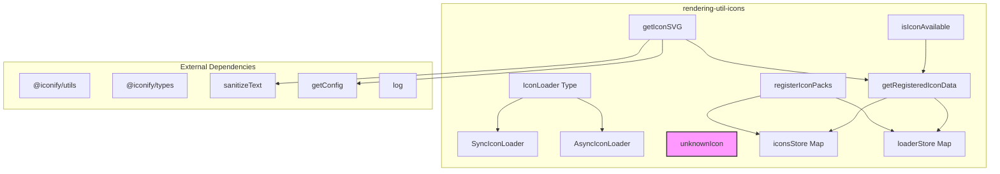
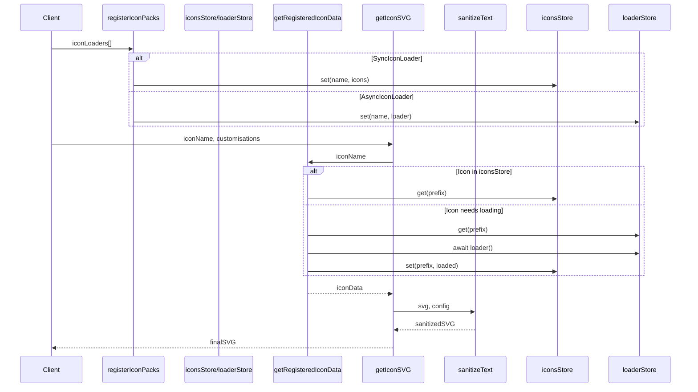
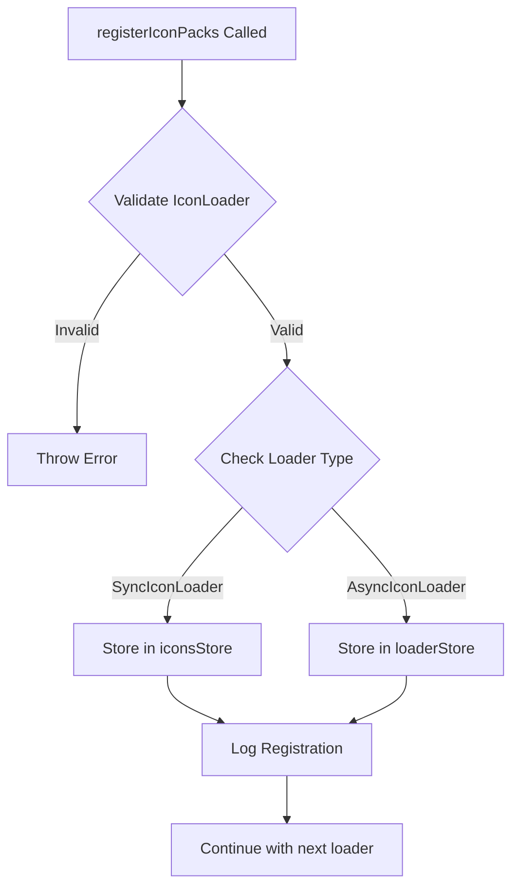
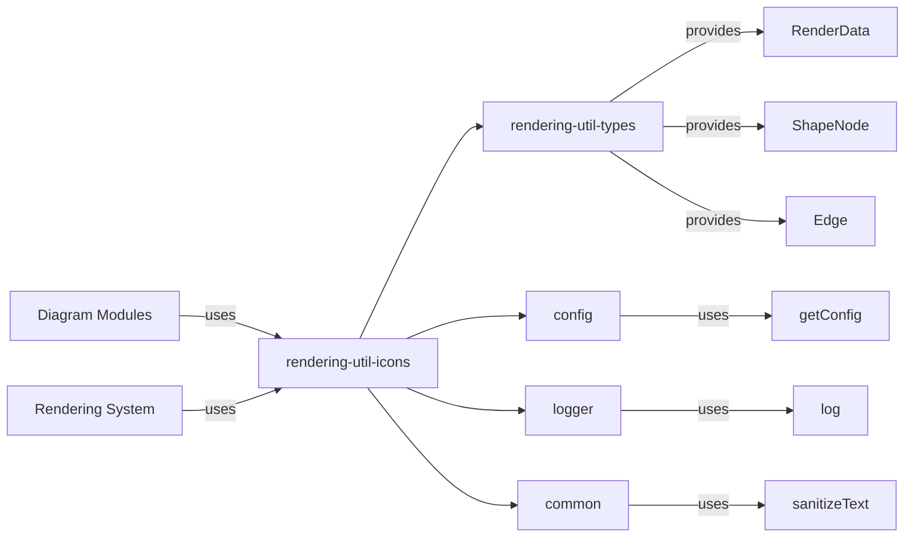
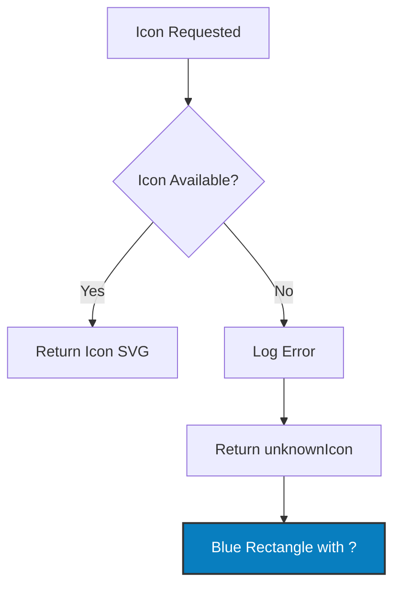
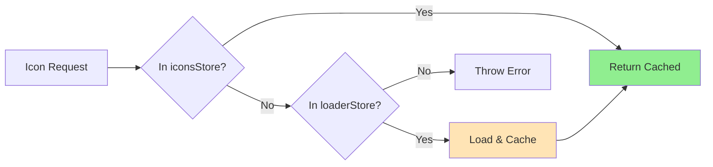

# rendering-util-icons Module Documentation

## Overview

The `rendering-util-icons` module provides icon loading and management functionality for Mermaid diagrams. It offers a flexible system for integrating custom icons into diagrams through both synchronous and asynchronous loading mechanisms. This module is essential for diagrams that require custom icons, such as architecture diagrams, flowcharts with custom shapes, or any diagram type that benefits from visual iconography.

## Purpose and Core Functionality

The module serves as Mermaid's icon management system, providing:

- **Icon Registration**: Register icon packs either synchronously (pre-loaded) or asynchronously (lazy-loaded)
- **Icon Resolution**: Resolve icon names to actual SVG data with proper error handling
- **Icon Rendering**: Convert icons to sanitized SVG strings suitable for diagram rendering
- **Fallback Support**: Provide default unknown icon when requested icons are unavailable

## Architecture

### Component Structure



### Data Flow



## Core Components

### IconLoader Types

#### SyncIconLoader
```typescript
interface SyncIconLoader {
  name: string;
  icons: IconifyJSON;
}
```
- **Purpose**: Provides pre-loaded icon data for immediate use
- **Use Case**: When icons are bundled with the application or available at initialization time
- **Performance**: Zero-latency access since icons are already in memory

#### AsyncIconLoader
```typescript
interface AsyncIconLoader {
  name: string;
  loader: () => Promise<IconifyJSON>;
}
```
- **Purpose**: Provides lazy-loaded icon data loaded on-demand
- **Use Case**: When icons should be loaded only when needed to reduce initial bundle size
- **Performance**: First access incurs loading delay, subsequent accesses are cached

### Key Functions

#### registerIconPacks(iconLoaders: IconLoader[])
Registers multiple icon packs for use in diagrams.

**Process Flow:**


#### getRegisteredIconData(iconName: string, fallbackPrefix?: string)
Resolves icon data from registered packs with automatic loading for async packs.

**Error Handling:**
- Invalid icon name format
- Missing icon set
- Failed async loading
- Icon not found in set

#### getIconSVG(iconName: string, customisations?, extraAttributes?)
Main entry point for retrieving SVG strings for diagram rendering.

**Features:**
- Automatic fallback to unknown icon on errors
- SVG sanitization for security
- Custom styling support
- Extra attribute injection

## Integration with Mermaid System

### Module Dependencies



### Usage in Diagram Types

The icon system is utilized by various diagram types that support custom icons:

- **Architecture Diagrams**: Service and component icons
- **Flowcharts**: Custom node shapes with icons
- **Class Diagrams**: Class and interface icons
- **State Diagrams**: State icons
- **Mind Maps**: Node icons

## Error Handling and Fallbacks

### Unknown Icon Strategy

When icon loading fails, the system provides a default unknown icon:



The unknown icon provides visual feedback that an icon was requested but unavailable, helping developers identify missing icon configurations.

## Performance Considerations

### Caching Strategy



- **Memory Store**: Loaded icons are cached in `iconsStore` Map
- **Lazy Loading**: Async loaders only execute once per icon set
- **Prefix-based**: Icons organized by prefix for efficient lookup

### Bundle Size Optimization

- **Optional Loading**: Icon packs loaded only when needed
- **Tree Shaking**: Unused icon sets don't impact bundle size
- **Async Loading**: Large icon sets can be loaded on-demand

## Configuration

### Iconify Integration

The module integrates with the Iconify ecosystem:

- **IconifyJSON**: Standard format for icon sets
- **IconifyIcon**: Individual icon data structure
- **IconifyIconCustomisations**: Styling and transformation options

### Custom Icon Sets

Developers can register custom icon sets:

```typescript
// Synchronous registration
registerIconPacks([{
  name: 'custom',
  icons: customIconSet
}]);

// Asynchronous registration
registerIconPacks([{
  name: 'custom',
  loader: async () => await loadIconSet()
}]);
```

## Security Considerations

### SVG Sanitization

All generated SVG strings are sanitized through the `sanitizeText` function to prevent XSS attacks and ensure proper encoding.

### Input Validation

- Icon names are validated for proper format
- Loader functions are validated before execution
- Error messages are logged without exposing sensitive information

## Related Documentation

- [rendering-util-types](rendering-util-types.md) - Type definitions for rendering utilities
- [config](config.md) - Configuration system integration
- [common](common.md) - Shared utilities including sanitization
- [logger](logger.md) - Logging system integration

## API Reference

### Types

#### IconLoader
Union type for sync and async icon loaders.

#### SyncIconLoader
Synchronous icon loader interface.

#### AsyncIconLoader
Asynchronous icon loader interface.

### Functions

#### registerIconPacks(iconLoaders: IconLoader[]): void
Register multiple icon packs for use in diagrams.

#### getRegisteredIconData(iconName: string, fallbackPrefix?: string): Promise<ExtendedIconifyIcon>
Retrieve icon data from registered packs.

#### isIconAvailable(iconName: string): Promise<boolean>
Check if an icon is available without loading it.

#### getIconSVG(iconName: string, customisations?, extraAttributes?): Promise<string>
Get SVG string for an icon with optional customizations.

### Constants

#### unknownIcon: IconifyIcon
Default icon used when requested icon is unavailable.