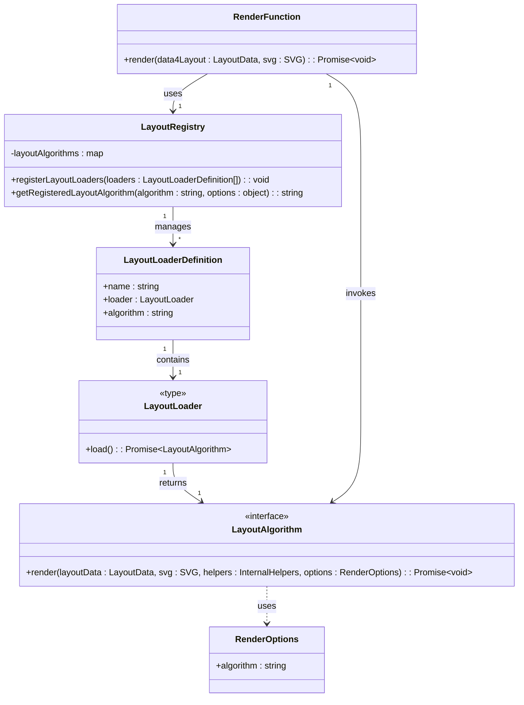
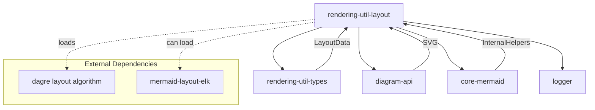
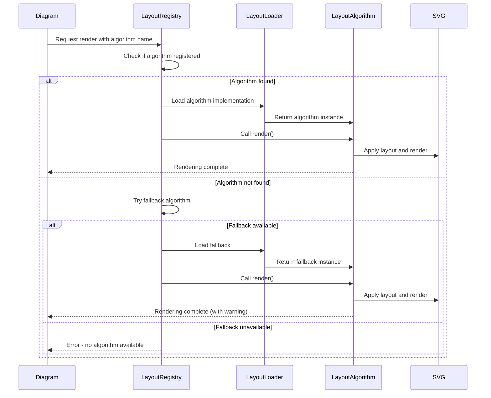
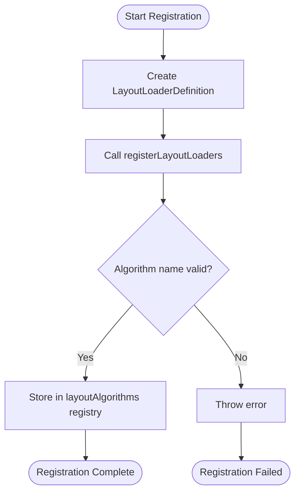
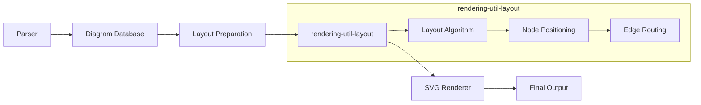
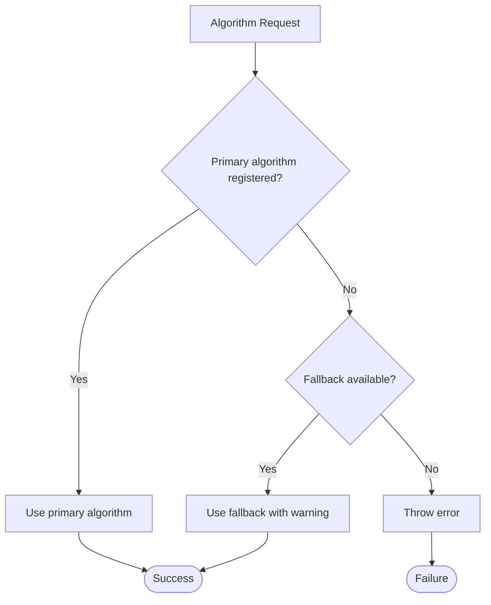

# rendering-util-layout Module Documentation

## Overview

The `rendering-util-layout` module is a core component of the Mermaid.js library that manages layout algorithms for diagram rendering. It provides a pluggable architecture for different layout algorithms, with a focus on positioning and arranging diagram elements in a visually appealing and structurally correct manner.

This module acts as the central hub for layout computation, abstracting the complexity of different layout algorithms while providing a consistent interface for diagram rendering across all Mermaid diagram types.

## Purpose and Core Functionality

The primary responsibilities of the rendering-util-layout module include:

1. **Layout Algorithm Management**: Registration, discovery, and management of different layout algorithms
2. **Rendering Coordination**: Orchestrating the rendering process by applying layout algorithms to diagram data
3. **Algorithm Selection**: Providing fallback mechanisms and algorithm selection logic
4. **Extensibility**: Supporting custom layout algorithms through a plugin-like architecture

## Architecture

### Component Structure



### Module Dependencies



## Core Components

### RenderOptions Interface

The `RenderOptions` interface provides configuration options for layout algorithms:

```typescript
interface RenderOptions {
  algorithm?: string;
}
```

**Purpose**: Allows specification of which layout algorithm variant to use within a layout algorithm family.

**Usage**: Passed to layout algorithms to customize their behavior during the rendering process.

### LayoutAlgorithm Interface

The `LayoutAlgorithm` interface defines the contract that all layout algorithms must implement:

```typescript
interface LayoutAlgorithm {
  render(
    layoutData: LayoutData,
    svg: SVG,
    helpers: InternalHelpers,
    options?: RenderOptions
  ): Promise<void>;
}
```

**Key Parameters**:
- `layoutData`: Contains the structured diagram data that needs layout computation
- `svg`: The SVG element where the diagram will be rendered
- `helpers`: Internal Mermaid utilities and helper functions
- `options`: Optional rendering configuration

**Purpose**: Provides a standardized interface for different layout algorithms to process diagram data and render it to SVG.

### LayoutLoaderDefinition Interface

The `LayoutLoaderDefinition` interface describes how layout algorithms are registered and loaded:

```typescript
interface LayoutLoaderDefinition {
  name: string;
  loader: LayoutLoader;
  algorithm?: string;
}
```

**Components**:
- `name`: Unique identifier for the layout algorithm
- `loader`: Function that asynchronously loads the layout algorithm implementation
- `algorithm`: Optional specification of algorithm variant

## Data Flow

### Rendering Process Flow



### Layout Algorithm Registration Flow



## Integration with Mermaid System

### Position in Rendering Pipeline



### Interaction with Other Modules

1. **rendering-util-types**: Receives `LayoutData` containing structured diagram information
2. **diagram-api**: Provides SVG element and receives rendering results
3. **core-mermaid**: Supplies internal helpers and utilities
4. **config**: Layout algorithms may access configuration for customization

## Default Layout Algorithms

### Dagre (Default)

The module comes with Dagre as the default layout algorithm, suitable for hierarchical and flow-based diagrams:

- **Type**: Directed graph layout
- **Use Cases**: Flowcharts, state diagrams, class diagrams
- **Characteristics**: Hierarchical arrangement, edge routing, node positioning

### Algorithm Registration Example

```typescript
// Default registration
registerDefaultLayoutLoaders();

// Custom registration
registerLayoutLoaders([
  {
    name: 'custom',
    loader: async () => await import('./custom-layout.js'),
    algorithm: 'force-directed'
  }
]);
```

## Error Handling and Fallbacks

### Algorithm Resolution Strategy



### Error Scenarios

1. **Unknown Algorithm**: Requested algorithm not registered → Fallback to default
2. **Missing Fallback**: Both primary and fallback unavailable → Error thrown
3. **Load Failure**: Algorithm module fails to load → Error propagated

## Extension Points

### Custom Layout Algorithm Development

To implement a custom layout algorithm:

1. Implement the `LayoutAlgorithm` interface
2. Create a loader function returning the implementation
3. Register using `registerLayoutLoaders`

### Integration with External Layout Libraries

The module supports integration with external layout libraries:

- **mermaid-layout-elk**: For complex hierarchical layouts
- **Custom libraries**: Through the loader mechanism

## Performance Considerations

### Lazy Loading

Layout algorithms are loaded on-demand to minimize initial bundle size:

```typescript
// Algorithms loaded only when needed
const layoutRenderer = await layoutDefinition.loader();
```

### Algorithm Selection

Choose algorithms based on diagram characteristics:

- **Small diagrams**: Dagre for simplicity
- **Large hierarchies**: ELK for complex layouts
- **Custom requirements**: Implement specialized algorithms

## Best Practices

1. **Algorithm Registration**: Register algorithms during initialization
2. **Fallback Strategy**: Always provide sensible fallbacks
3. **Error Handling**: Handle algorithm loading failures gracefully
4. **Performance**: Use lazy loading for large algorithm implementations
5. **Testing**: Test with various diagram types and sizes

## Related Documentation

- [rendering-util-types](rendering-util-types.md) - Data structures for layout computation
- [diagram-api](diagram-api.md) - SVG rendering and diagram lifecycle
- [core-mermaid](core-mermaid.md) - Main Mermaid functionality and helpers
- [config](config.md) - Configuration options for layout algorithms

## Summary

The `rendering-util-layout` module serves as the central nervous system for diagram layout in Mermaid.js. By providing a pluggable architecture for layout algorithms, it enables the library to support diverse diagram types while maintaining consistency in rendering quality and performance. The module's design emphasizes extensibility, allowing developers to integrate custom layout algorithms and adapt the rendering process to specific requirements.