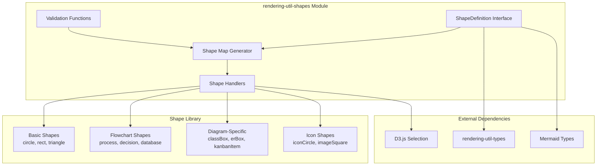
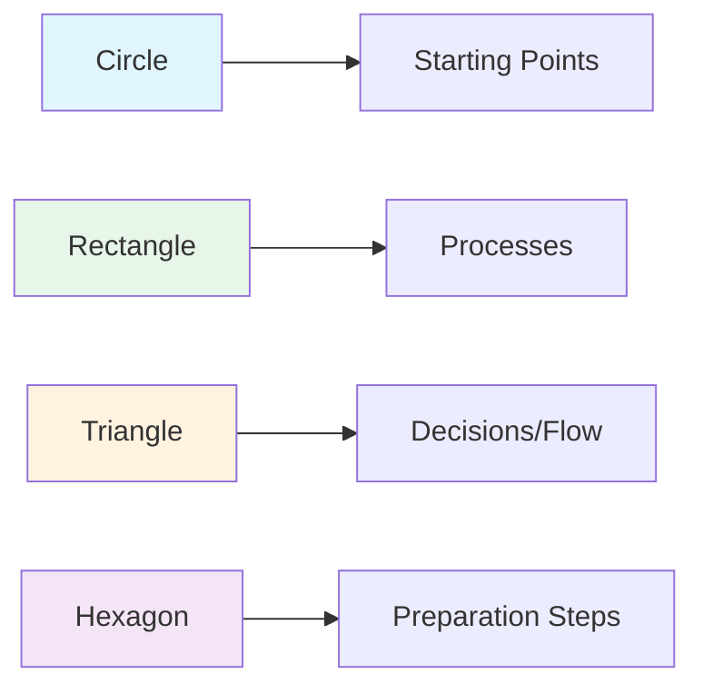
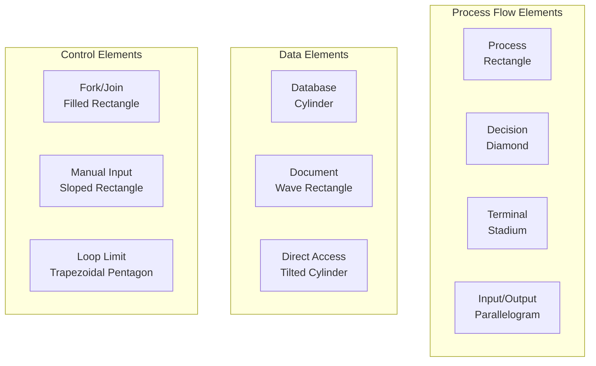
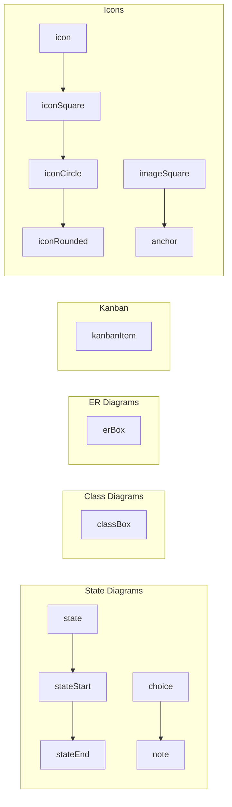
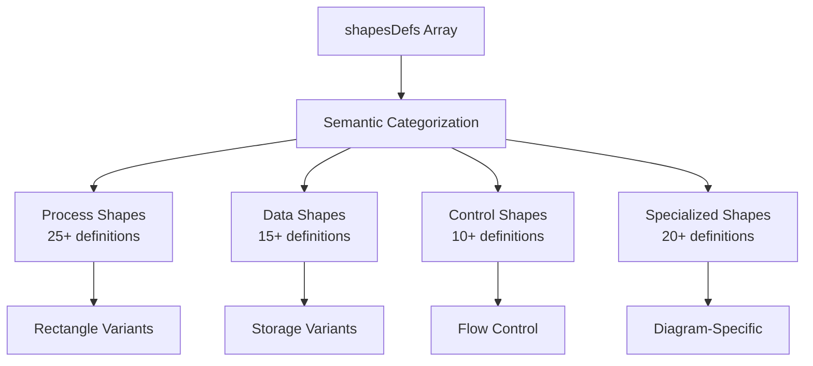
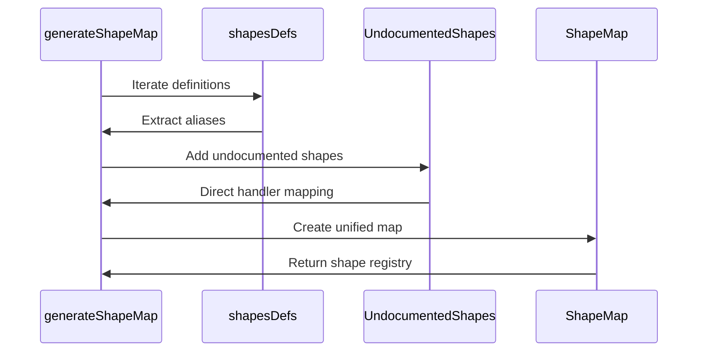
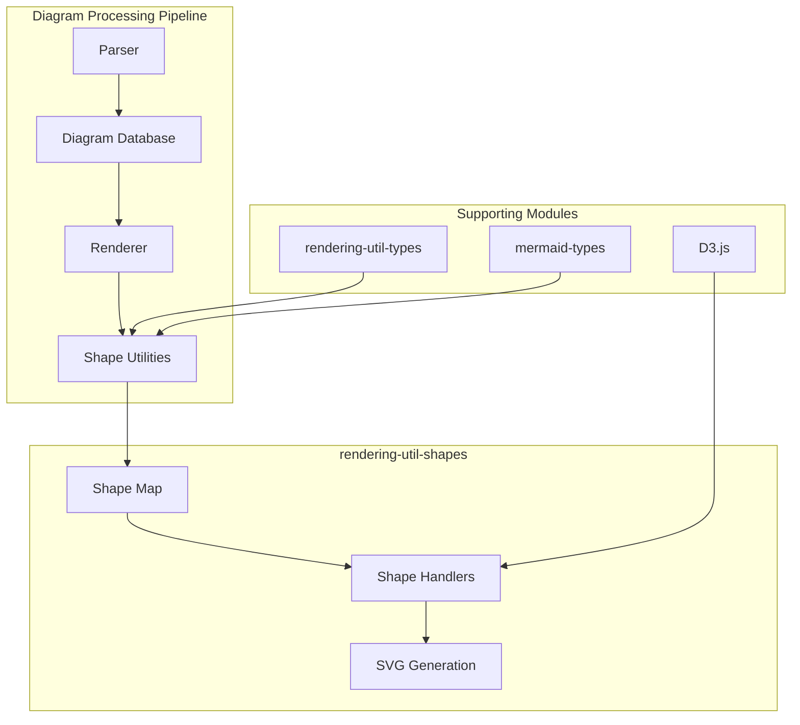
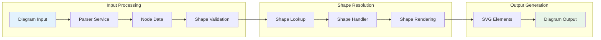
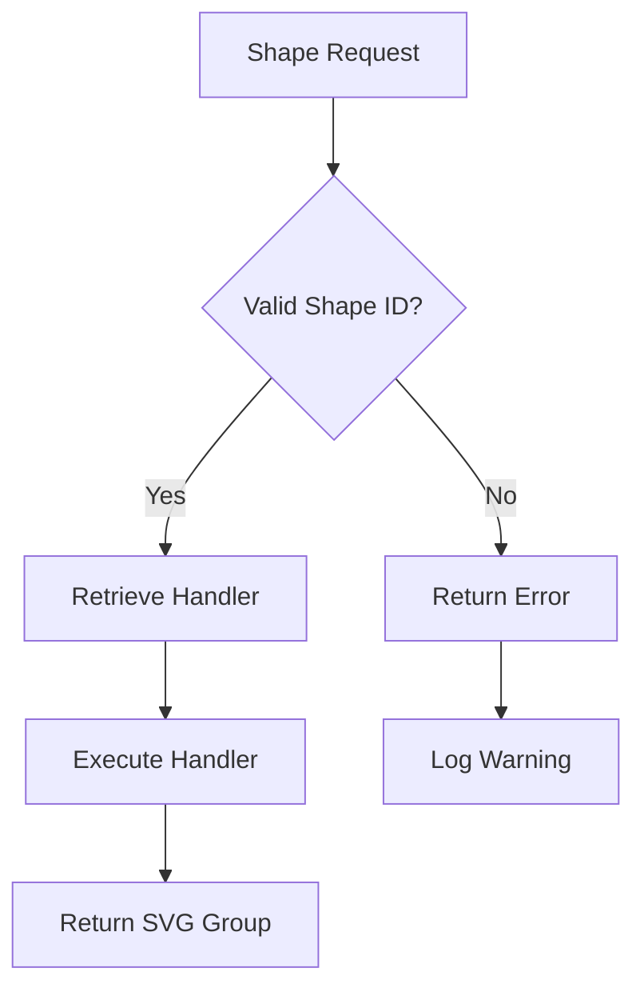

# rendering-util-shapes Module Documentation

## Introduction

The `rendering-util-shapes` module is a core component of the Mermaid.js library that provides a comprehensive shape definition and rendering system for diagram elements. This module serves as the central registry for all visual shapes used across different diagram types, offering a unified interface for shape rendering with support for aliases, semantic naming, and extensible shape handlers.

The module implements a shape factory pattern that maps shape identifiers to their corresponding rendering functions, enabling consistent shape rendering across flowcharts, sequence diagrams, class diagrams, and other Mermaid diagram types.

## Architecture Overview



## Core Components

### ShapeDefinition Interface

The `ShapeDefinition` interface is the fundamental structure that defines how shapes are represented in the system:

```typescript
interface ShapeDefinition {
  semanticName: string;     // Human-readable semantic meaning
  name: string;            // Display name
  shortName: string;       // Primary identifier
  description: string;     // Shape purpose and usage
  aliases?: string[];      // User-facing alternative names
  internalAliases?: string[]; // Legacy/internal identifiers
  handler: ShapeHandler;   // Rendering function
}
```

### Shape Handler System

Shape handlers are functions that implement the actual rendering logic:

```typescript
type ShapeHandler<T extends SVGGraphicsElement> = (
  parent: D3Selection<T>,    // Parent SVG element
  node: Node,                // Node data from diagram
  options: ShapeRenderOptions // Rendering configuration
) => MaybePromise<D3Selection<SVGGElement>>;
```

## Shape Categories

### 1. Basic Geometric Shapes



**Core Shapes:**
- **Circle**: Basic circular shape for start/end points
- **Rectangle**: Standard process representation
- **Triangle**: Directional and decision elements
- **Hexagon**: Conditional preparation steps

### 2. Flowchart-Specific Shapes



### 3. Advanced Specialized Shapes



## Shape Registration and Mapping

### Shape Definition Array

The module exports a comprehensive array of shape definitions (`shapesDefs`) that serves as the authoritative registry:



### Shape Map Generation

The `generateShapeMap()` function creates a unified mapping from all shape identifiers to their handlers:



## Integration with Mermaid System

### Dependency Flow



### Usage Patterns

1. **Shape Validation**: `isValidShape()` function validates shape identifiers
2. **Shape Resolution**: Direct map lookup for handler functions
3. **Rendering Execution**: Handler functions create SVG elements
4. **Alias Support**: Multiple naming conventions for flexibility

## Data Flow Architecture



## Shape Handler Implementation

### Handler Function Structure

Each shape handler follows a consistent pattern:

```typescript
const shapeHandler = async (
  parent: D3Selection<SVGGraphicsElement>,
  node: Node,
  options: ShapeRenderOptions
): Promise<D3Selection<SVGGElement>> => {
  // 1. Extract node properties
  const { x, y, width, height, label } = node;
  
  // 2. Create SVG group
  const group = parent.append('g');
  
  // 3. Apply styling and attributes
  group.attr('class', 'shape');
  
  // 4. Render shape-specific geometry
  // Implementation varies by shape type
  
  // 5. Return group for further processing
  return group;
};
```

### Shape Categories and Handlers

| Category | Handler Functions | Usage Context |
|----------|------------------|---------------|
| Basic Shapes | `circle`, `rectangle`, `triangle` | Universal elements |
| Flowchart | `squareRect`, `question`, `cylinder` | Process flows |
| State | `state`, `stateStart`, `stateEnd` | State diagrams |
| Class | `classBox` | Class diagrams |
| ER | `erBox` | Entity-relationship |
| Kanban | `kanbanItem` | Kanban boards |
| Icons | `icon`, `iconCircle`, `imageSquare` | Icon representations |

## Error Handling and Validation

### Shape Validation



### Type Safety

The module provides strong TypeScript support:

- **ShapeID Type**: Union type of all valid shape identifiers
- **ShapeHandler Type**: Generic handler function signature
- **ShapeDefinition Type**: Complete shape metadata structure

## Performance Considerations

### Shape Map Caching

The shape map is generated once at module initialization, providing O(1) lookup performance for shape resolution.

### Lazy Loading

Individual shape handlers are imported on-demand, reducing initial bundle size.

### Memory Management

Shape definitions are stored as a const array, enabling compile-time optimizations and tree-shaking.

## Extension Points

### Adding New Shapes

1. Create shape handler function
2. Add ShapeDefinition to `shapesDefs` array
3. Update TypeScript types if needed
4. Document shape usage and aliases

### Custom Shape Categories

The modular design allows for easy addition of new shape categories:

```typescript
// Example: Adding network diagram shapes
const networkShapes = [
  {
    semanticName: 'Router',
    name: 'Router Icon',
    shortName: 'router',
    description: 'Network router device',
    handler: routerShapeHandler,
  },
  // ... more network shapes
];
```

## Related Modules

- **[rendering-util-types](rendering-util-types.md)**: Type definitions for rendering utilities
- **[rendering-util](rendering-util.md)**: Main rendering utilities module
- **[diagram-api](diagram-api.md)**: Diagram definition and rendering interfaces
- **[types](types.md)**: Core Mermaid type definitions

## Best Practices

### Shape Selection

1. **Use semantic names** for better code readability
2. **Consider aliases** for user flexibility
3. **Document shape purposes** in descriptions
4. **Maintain consistency** across diagram types

### Performance Optimization

1. **Minimize shape lookups** by caching results
2. **Use appropriate shape categories** for specific diagram types
3. **Leverage built-in validation** to prevent runtime errors
4. **Consider async handlers** for complex shapes

### Integration Guidelines

1. **Import shape utilities** from the main shapes module
2. **Validate shape identifiers** before use
3. **Handle rendering errors** gracefully
4. **Test with different diagram types** for compatibility

This comprehensive shape system provides the foundation for consistent, extensible, and performant diagram rendering across all Mermaid diagram types.