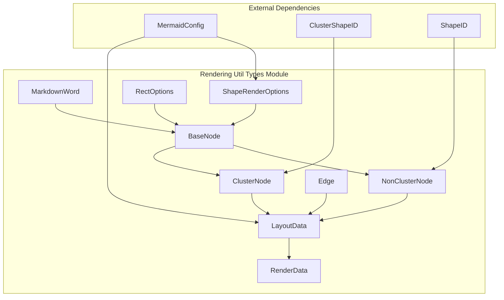
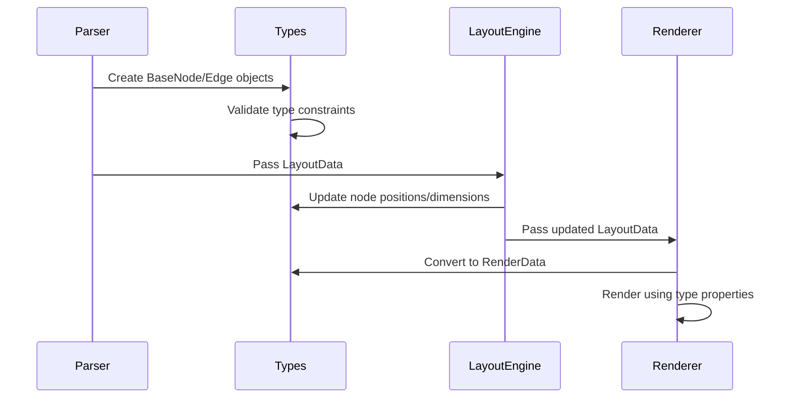
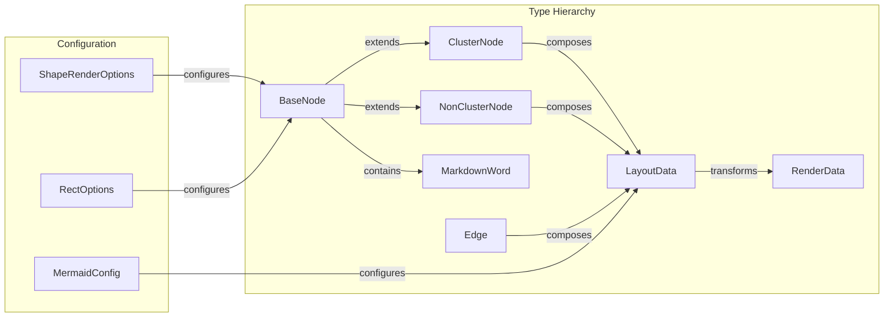
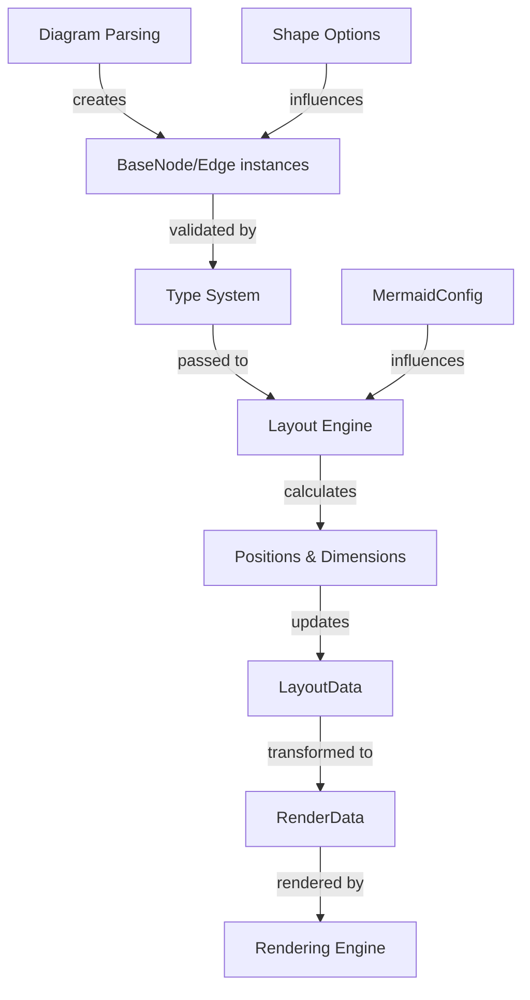

# Rendering Util Types Module

## Introduction

The `rendering-util-types` module provides the foundational type definitions for Mermaid's rendering system. It defines the core data structures that represent nodes, edges, and layout information used across all diagram types in the Mermaid ecosystem. These types serve as the common language between diagram parsers, layout engines, and rendering components.

## Core Components

### BaseNode
The fundamental interface for all diagram elements, providing common properties shared across different node types.

**Key Properties:**
- `id`: Unique identifier for the node
- `label`: Display text for the node
- `description`: Additional descriptive text
- `parentId`: Reference to parent node for hierarchical structures
- `cssStyles`/`cssClasses`: Styling information
- `isGroup`: Boolean flag indicating if the node is a container
- `width`/`height`: Dimensions for rendering
- `backgroundColor`/`borderColor`: Visual styling properties
- `link`/`tooltip`: Interactive properties

### ClusterNode
Extends `BaseNode` for container/group nodes that can contain other nodes.

**Key Properties:**
- `shape`: Cluster shape identifier (from `ClusterShapeID`)
- `isGroup`: Always `true`

### NonClusterNode
Extends `BaseNode` for individual diagram elements.

**Key Properties:**
- `shape`: Shape identifier (from `ShapeID`)
- `isGroup`: Always `false`

### Edge
Defines the interface for connections between nodes.

**Key Properties:**
- `id`: Unique identifier for the edge
- `label`: Display text for the edge
- `arrowhead`/`arrowTypeEnd`/`arrowTypeStart`: Arrow styling
- `stroke`/`thickness`: Visual properties
- `curve`: Path interpolation type
- `animate`/`animation`: Animation settings

### LayoutData
Container for all diagram elements and configuration.

**Key Properties:**
- `nodes`: Array of all nodes in the diagram
- `edges`: Array of all edges in the diagram
- `config`: Mermaid configuration object

### RenderData
Simplified data structure for rendering operations.

**Key Properties:**
- `items`: Combined array of nodes and edges

### MarkdownWord
Represents styled text content with markdown formatting.

**Key Properties:**
- `content`: Text content
- `type`: Style type ('normal', 'strong', 'em')

## Architecture



## Data Flow



## Component Relationships



## Process Flow



## Integration with Other Modules

### Configuration Module
The types integrate with the [config](config.md) module through:
- `MermaidConfig` used in `LayoutData` and `ShapeRenderOptions`
- Configuration influences node styling and layout behavior

### Rendering Utilities
Works closely with the broader [rendering-util](rendering-util.md) module:
- Provides type definitions for rendering elements
- Coordinates with shape definitions and layout algorithms
- Supports icon loading and UID generation

### Diagram-Specific Types
Each diagram type extends these base types:
- [Flowchart](flowchart.md): Adds flow-specific properties
- [Sequence](sequence.md): Extends for actor/message modeling
- [Class](class.md): Adds member data and relationship types
- [State](state.md): Includes state-specific node properties

## Usage Examples

### Creating a Basic Node
```typescript
const node: NonClusterNode = {
  id: 'node1',
  label: 'Process Start',
  shape: 'rect',
  isGroup: false,
  width: 120,
  height: 60,
  backgroundColor: '#e1f5fe',
  borderColor: '#01579b'
};
```

### Defining an Edge
```typescript
const edge: Edge = {
  id: 'edge1',
  label: 'transitions to',
  arrowhead: 'arrow_point',
  stroke: '#333',
  thickness: 'normal',
  curve: 'basis'
};
```

### Building Layout Data
```typescript
const layoutData: LayoutData = {
  nodes: [node1, node2, cluster1],
  edges: [edge1, edge2],
  config: mermaidConfig
};
```

## Type Safety Features

The module provides several type safety mechanisms:

1. **Discriminated Unions**: `Node` type uses `isGroup` to distinguish between `ClusterNode` and `NonClusterNode`
2. **String Literal Types**: `MarkdownWordType` restricts text styling options
3. **Optional Properties**: Most properties are optional, allowing flexible usage
4. **Index Signatures**: Support for additional properties in `LayoutData` and `RenderData`

## Extension Points

The types are designed for extension:

- **Diagram-Specific Nodes**: Extend `BaseNode` for specialized node types
- **Custom Shapes**: Integrate with shape registries through `ShapeID` and `ClusterShapeID`
- **Layout Methods**: Support multiple layout algorithms through `LayoutMethod` type
- **Styling**: CSS-based styling system allows theme integration

## Best Practices

1. **Use Type Guards**: Leverage `isGroup` property to distinguish node types
2. **Prefer Composition**: Use `LayoutData` to group related nodes and edges
3. **Style Consistently**: Use CSS properties rather than inline styles
4. **Validate Required Fields**: Ensure `id` is always provided for nodes and edges
5. **Consider Accessibility**: Include proper labels and descriptions

## Migration Notes

The module has undergone several refactoring efforts:
- Removed deprecated properties (style, class, labelText)
- Consolidated styling into CSS-based properties
- Introduced `isGroup` discriminator for better type safety
- Separated cluster and non-cluster node types

This documentation reflects the current state of the types module and should be referenced when implementing new diagram types or extending existing ones.