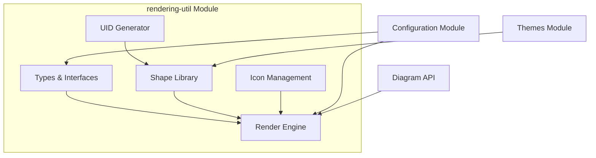
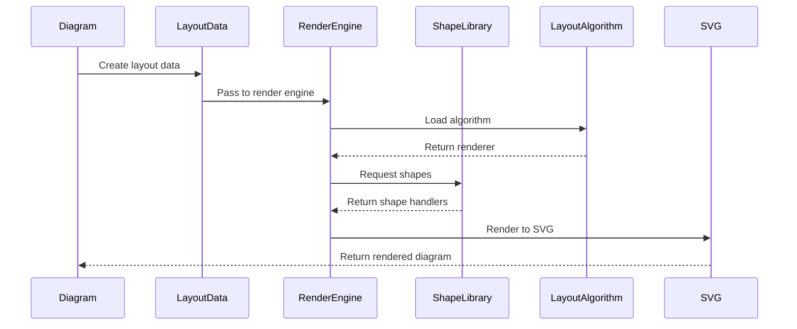

# Rendering Utilities Module

## Overview

The `rendering-util` module is a core component of the Mermaid diagramming library that provides essential utilities for rendering diagrams. It serves as the bridge between diagram data structures and their visual representation, handling shape rendering, layout algorithms, icon management, and unique identifier generation.

## Purpose

This module is responsible for:
- **Shape Rendering**: Defining and managing various diagram shapes (rectangles, circles, diamonds, etc.)
- **Layout Management**: Providing layout algorithms for positioning diagram elements
- **Icon Support**: Loading and rendering icons from various icon libraries
- **Data Types**: Defining common data structures for nodes, edges, and rendering data
- **Unique Identifiers**: Generating unique IDs for diagram elements

## Architecture



## Core Components

### 1. Types and Data Structures

The module defines fundamental data structures used across the rendering system:

- **RenderData**: Container for items to be rendered (nodes and edges)
- **LayoutData**: Comprehensive data structure containing nodes, edges, and configuration
- **Node Types**: BaseNode, ClusterNode, and NonClusterNode for different diagram elements
- **Edge**: Common interface for connections between nodes
- **ShapeRenderOptions**: Configuration options for shape rendering

### 2. Shape System

The shape system provides a comprehensive library of diagram shapes:

- **50+ predefined shapes** including rectangles, circles, diamonds, and specialized diagram shapes
- **ShapeDefinition** interface for consistent shape behavior
- **Semantic naming** with aliases for different diagram types
- **Extensible architecture** for adding custom shapes

Key shape categories:
- **Basic shapes**: Rectangle, circle, diamond
- **Flowchart shapes**: Process, decision, terminal
- **Specialized shapes**: Database (cylinder), document (waved rectangle)
- **State diagram shapes**: State start/end, choice
- **Class diagram shapes**: Class boxes

### 3. Layout Engine

The layout engine manages diagram positioning algorithms:

- **Pluggable architecture** supporting multiple layout algorithms
- **Default Dagre integration** for hierarchical layouts
- **LayoutAlgorithm** interface for custom implementations
- **Dynamic loading** of layout algorithms

Supported layout methods:
- `dagre` - Hierarchical layout (default)
- `dagre-wrapper` - Enhanced dagre with additional features
- `elk` - Eclipse Layout Kernel
- `neato`, `dot`, `circo`, `fdp`, `osage`, `grid` - Graphviz algorithms

### 4. Icon Management

The icon system provides flexible icon support:

- **Iconify integration** for loading icons from various libraries
- **Async and sync loading** options
- **Fallback handling** with unknown icon placeholder
- **Custom icon packs** registration
- **SVG sanitization** for security

### 5. Unique Identifier System

Simple but effective UID generation:
- **Sequential ID generation** with configurable prefixes
- **URL reference support** for SVG elements
- **Thread-safe implementation**

## Data Flow



## Integration with Other Modules

### Configuration Module
- Provides styling and configuration options
- Theme integration for consistent appearance
- Font and color settings

### Diagram API
- Receives diagram data for rendering
- Provides rendering context and helpers
- Manages diagram lifecycle

### Themes Module
- Supplies color schemes and styling
- Ensures consistent visual appearance
- Supports multiple theme variants

## Usage Examples

### Basic Shape Rendering
```typescript
import { shapes } from './rendering-elements/shapes';
import type { Node, ShapeRenderOptions } from './types';

const node: Node = {
  id: 'node1',
  shape: 'rect',
  label: 'Process',
  isGroup: false
};

const options: ShapeRenderOptions = {
  config: mermaidConfig,
  dir: 'LR'
};

// Render the shape
const shapeHandler = shapes[node.shape];
const renderedElement = shapeHandler(parentSelection, node, options);
```

### Layout Algorithm Registration
```typescript
import { registerLayoutLoaders } from './render';

const customLayout = {
  name: 'custom',
  loader: async () => import('./custom-layout'),
  algorithm: 'custom-v1'
};

registerLayoutLoaders([customLayout]);
```

### Icon Usage
```typescript
import { getIconSVG, registerIconPacks } from './icons';

// Register icon pack
registerIconPacks([{
  name: 'mdi',
  loader: async () => import('@iconify/json/json/mdi.json')
}]);

// Get icon SVG
const iconSVG = await getIconSVG('mdi:home', {
  width: 24,
  height: 24
});
```

## Extensibility

The module is designed for extensibility:

1. **Custom Shapes**: Implement the `ShapeHandler` interface
2. **Layout Algorithms**: Implement the `LayoutAlgorithm` interface
3. **Icon Packs**: Register custom icon libraries
4. **Type Extensions**: Extend base interfaces for specific needs

## Performance Considerations

- **Lazy loading** of layout algorithms and icon packs
- **Shape caching** for repeated elements
- **Efficient SVG generation** with minimal DOM manipulation
- **Memory management** through proper cleanup

## Related Documentation

- [Configuration Module](config.md) - For styling and theme configuration
- [Diagram API](diagram-api.md) - For diagram lifecycle management
- [Themes Module](themes.md) - For visual styling options
- [Core Mermaid](core-mermaid.md) - For main Mermaid functionality

## Sub-modules

The rendering-util module contains several specialized sub-modules:

- [rendering-util-types](rendering-util-types.md) - Type definitions and interfaces for nodes, edges, and rendering data
- [rendering-util-shapes](rendering-util-shapes.md) - Comprehensive shape library with 50+ predefined shapes
- [rendering-util-icons](rendering-util-icons.md) - Icon loading and management system with Iconify integration
- [rendering-util-layout](rendering-util-layout.md) - Layout algorithms and positioning engine