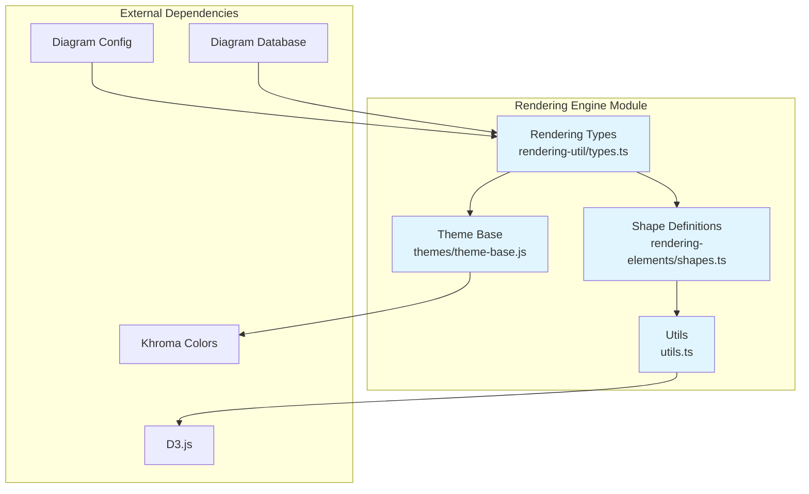
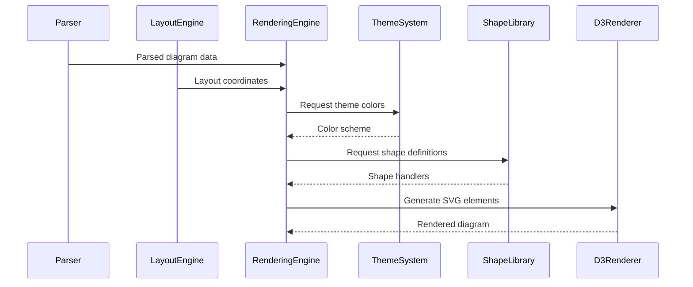

# Rendering Engine Module

## Overview

The rendering_engine module is a core component of the Mermaid diagramming library responsible for converting parsed diagram data into visual representations. It provides the essential infrastructure for rendering nodes, edges, shapes, and themes across all diagram types in the Mermaid ecosystem.

## Purpose

The rendering engine serves as the bridge between abstract diagram data structures and their visual representation, handling:

- **Shape Rendering**: Definition and rendering of various node shapes (rectangles, circles, diamonds, etc.)
- **Layout Management**: Processing layout data to position diagram elements
- **Theme Application**: Applying visual themes and styling to diagrams
- **Edge Rendering**: Drawing connections between nodes with various styles
- **Text Processing**: Handling text rendering, wrapping, and styling
- **Visual Styling**: Managing colors, borders, and visual properties

## Architecture



## Core Components

### 1. [Rendering Types](rendering-types.md)

Defines the fundamental data structures for rendering, including nodes, edges, and layout data. See [detailed documentation](rendering-types.md) for complete type definitions and usage patterns.

### 2. [Shape System](shape-system.md)

Comprehensive shape library with 50+ predefined shapes and support for custom shape definitions. See [detailed documentation](shape-system.md) for shape catalog and extension guidelines.

### 3. [Theme System](theme-system.md)

Centralized theming with color management, dark mode support, and dynamic color calculation. See [detailed documentation](theme-system.md) for theme configuration and customization options.

### 4. [Utility Functions](utility-functions.md)

Essential rendering utilities for text processing, geometry calculations, and D3 integration. See [detailed documentation](utility-functions.md) for utility function reference and usage examples.

## Data Flow



## Integration Points

### With Core API
- Receives `RenderData` from main Mermaid API
- Integrates with `MermaidConfig` for global settings
- Uses `ParseResult` for diagram structure

### With Diagram Plugins
- Works with `DiagramRenderer` interface
- Processes `DiagramDB` data structures
- Supports custom shape definitions

### With Layout Engines
- Consumes `LayoutData` from layout processors
- Supports multiple layout methods (dagre, elk, etc.)
- Handles positioning and sizing information

## Key Features

### 1. Flexible Shape System
- 50+ predefined shapes with semantic naming
- Support for custom shape definitions
- Shape aliases for backward compatibility
- Dynamic shape validation

### 2. Comprehensive Theming
- 12-color scale system
- Automatic dark mode adjustments
- Diagram-specific color schemes
- Runtime color calculation

### 3. Advanced Text Rendering
- Automatic text wrapping
- Font size and family support
- Text dimension calculation
- Markdown text support

### 4. Robust Error Handling
- Comprehensive error types
- Graceful degradation
- Detailed error messages
- Fallback mechanisms

## Usage Patterns

### Basic Rendering Flow
1. Parse diagram text into data structures
2. Apply layout engine for positioning
3. Generate theme colors and styles
4. Render shapes using shape definitions
5. Apply text labels and styling
6. Output final SVG representation

### Theme Customization
```javascript
// Theme variables can be overridden
const customTheme = {
  primaryColor: '#3498db',
  primaryTextColor: '#2c3e50',
  background: '#ecf0f1'
};
```

### Shape Extension
```javascript
// Custom shapes can be added
const customShape = {
  semanticName: 'Custom Shape',
  shortName: 'custom',
  handler: customShapeRenderer
};
```

## Performance Considerations

- **Memoization**: Text dimension calculations are cached
- **Lazy Loading**: Shapes loaded on-demand
- **Color Caching**: Theme colors calculated once
- **Batch Operations**: DOM manipulations batched

## Related Documentation

- [Diagram Plugin API](diagram_plugin_api.md) - Integration with diagram types
- [Layout Engine ELK](layout_engine_elk.md) - Layout processing
- [Core API](mermaid_core_api.md) - Main Mermaid API
- [Parser Engine](parser_engine.md) - Text parsing

## Future Enhancements

- WebGL rendering support
- Advanced animation system
- Plugin-based shape system
- Real-time theme switching
- Accessibility improvements