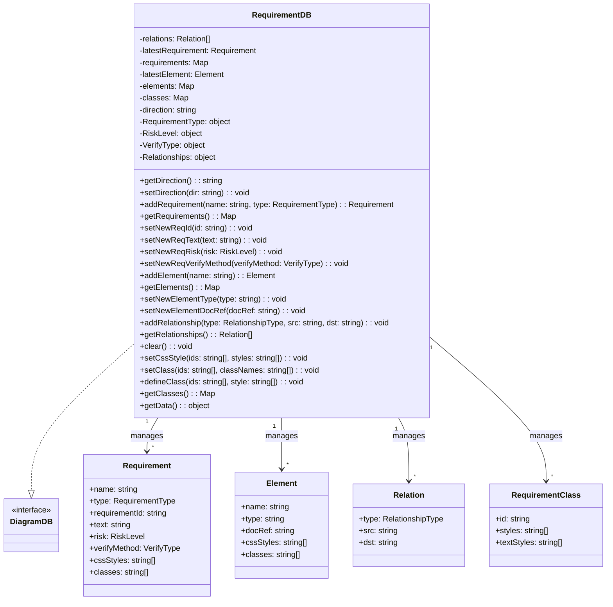
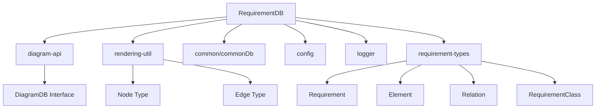
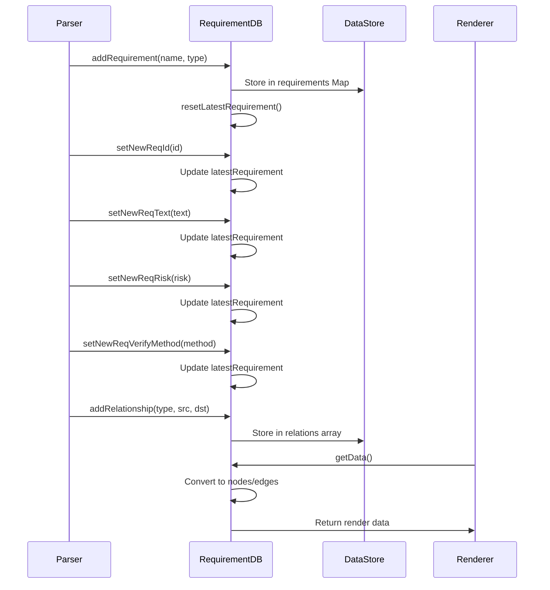
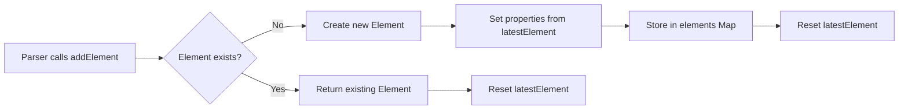
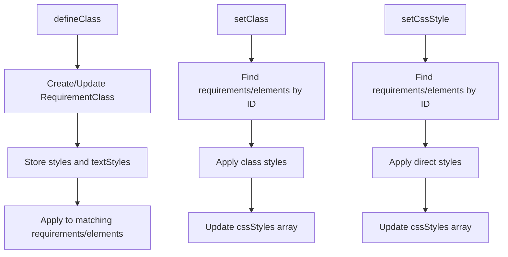

# Requirement Database Module

The requirement-database module is the core data management component for requirement diagrams in Mermaid.js. It provides a comprehensive database implementation for storing, managing, and manipulating requirement-related data structures including requirements, elements, relationships, and styling information.

## Overview

The requirement-database module implements the `RequirementDB` class, which serves as the central data repository for requirement diagrams. It manages the complete lifecycle of requirement data, from initial parsing through final rendering, providing a structured approach to handling complex requirement relationships and metadata.

## Architecture

### Core Components

### Module Dependencies

## Data Flow

### Requirement Processing Pipeline

### Element Management Flow

## Core Functionality

### Data Storage Architecture

The `RequirementDB` class employs a multi-map storage strategy:

- **Requirements Map**: `Map<string, Requirement>` - Stores all requirements indexed by name
- **Elements Map**: `Map<string, Element>` - Stores all elements indexed by name  
- **Classes Map**: `Map<string, RequirementClass>` - Stores CSS class definitions
- **Relations Array**: `Relation[]` - Stores relationship connections

### Requirement Types Support

The module supports six distinct requirement types:

- **REQUIREMENT**: General requirements
- **FUNCTIONAL_REQUIREMENT**: Functional specifications
- **INTERFACE_REQUIREMENT**: Interface specifications
- **PERFORMANCE_REQUIREMENT**: Performance criteria
- **PHYSICAL_REQUIREMENT**: Physical constraints
- **DESIGN_CONSTRAINT**: Design limitations

### Risk Level Management

Three risk levels are supported for requirements:

- **LOW_RISK**: Minimal impact requirements
- **MED_RISK**: Moderate impact requirements  
- **HIGH_RISK**: Critical requirements

### Verification Methods

Four verification methods are available:

- **VERIFY_ANALYSIS**: Analysis-based verification
- **VERIFY_DEMONSTRATION**: Demonstration-based verification
- **VERIFY_INSPECTION**: Inspection-based verification
- **VERIFY_TEST**: Test-based verification

### Relationship Types

Seven relationship types connect requirements and elements:

- **CONTAINS**: Hierarchical containment
- **COPIES**: Copy relationships
- **DERIVES**: Derivation relationships
- **SATISFIES**: Satisfaction relationships
- **VERIFIES**: Verification relationships
- **REFINES**: Refinement relationships
- **TRACES**: Traceability relationships

## Styling and Theming

### CSS Style Management

The module provides comprehensive styling capabilities:

### Visual Differentiation

The `getData()` method applies different visual styles based on relationship types:

- **Contains relationships**: Solid lines with specific arrow styling
- **Other relationships**: Dashed lines with different arrow configurations

## Integration Points

### Diagram API Integration

The `RequirementDB` implements the `DiagramDB` interface, ensuring compatibility with Mermaid's diagram processing pipeline:

- **getData()**: Converts internal data to renderable nodes and edges
- **clear()**: Resets all data structures for reuse
- **Accessibility support**: Integrates with title and description methods

### Configuration Integration

The module integrates with Mermaid's configuration system:

- **getConfig()**: Retrieves requirement-specific configuration
- **Look and feel**: Applies global styling preferences
- **Direction support**: Supports diagram flow direction (TB, BT, LR, RL)

## Error Handling and Validation

### Data Integrity

The module implements several validation mechanisms:

- **Duplicate prevention**: Prevents duplicate requirements and elements
- **Null checking**: Validates data before operations
- **Type safety**: Uses TypeScript interfaces for type safety

### State Management

The module maintains consistent state through:

- **Reset mechanisms**: Resets latestRequirement and latestElement after use
- **Clear operations**: Comprehensive cleanup of all data structures
- **Binding for JISON**: Ensures proper context for parser integration

## Performance Considerations

### Memory Management

- **Map-based storage**: Efficient key-value lookups for requirements and elements
- **Lazy initialization**: Creates objects only when needed
- **Reference management**: Proper cleanup to prevent memory leaks

### Processing Optimization

- **Single-pass conversion**: Efficient conversion to render format
- **Minimal copying**: Uses references where possible
- **Batch operations**: Groups related operations for efficiency

## Usage Patterns

### Typical Workflow

1. **Initialization**: Create new `RequirementDB` instance
2. **Requirement creation**: Add requirements with `addRequirement()`
3. **Property setting**: Configure requirement properties
4. **Element creation**: Add related elements with `addElement()`
5. **Relationship establishment**: Connect items with `addRelationship()`
6. **Styling application**: Apply CSS classes and styles
7. **Data retrieval**: Get render-ready data with `getData()`

### Parser Integration

The module is designed for seamless integration with JISON-based parsers:

- **Method binding**: All methods bound to instance context
- **Direct property access**: Supports JISON's property access patterns
- **State management**: Maintains parser state across operations

## Related Documentation

- [requirement-types](requirement-types.md) - Type definitions for requirement data structures
- [diagram-api](diagram-api.md) - Core diagram API interface
- [rendering-util](rendering-util.md) - Rendering utilities and types
- [config](config.md) - Configuration management system