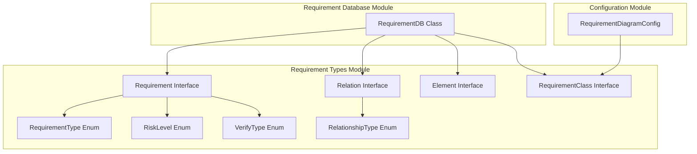
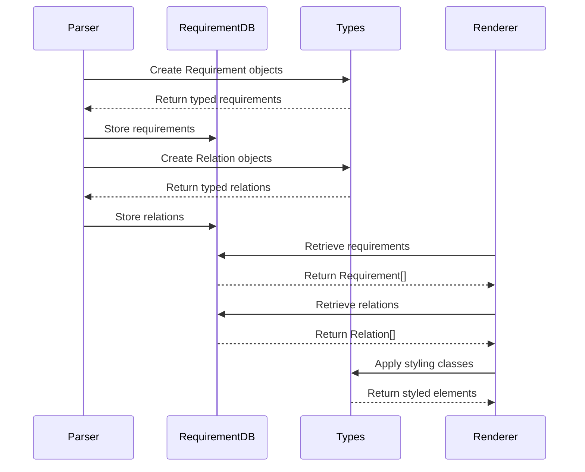
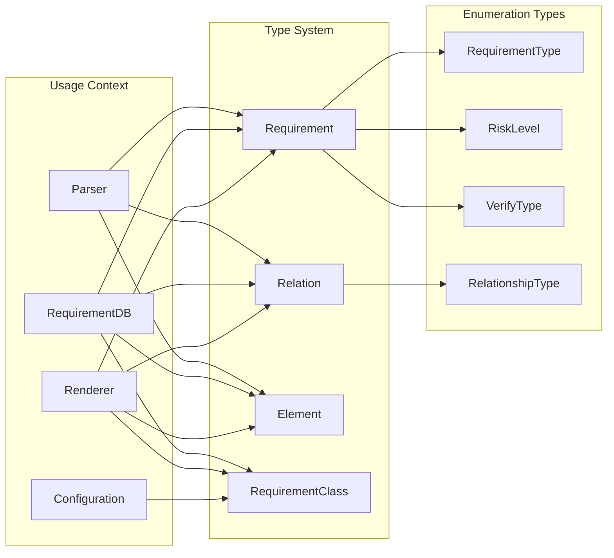
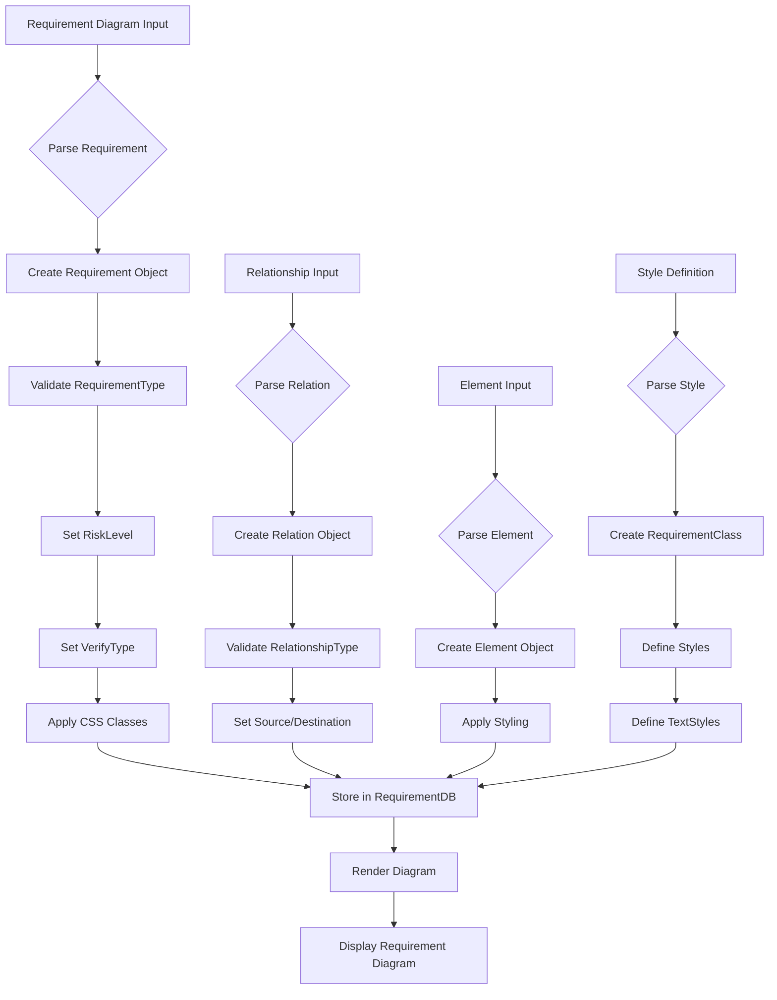

# Requirement Types Module Documentation

## Introduction

The requirement-types module defines the core type definitions for requirement diagrams in Mermaid. This module provides the fundamental data structures and type definitions that enable the creation, validation, and rendering of requirement diagrams, which are used to model system requirements, their relationships, and verification methods in software engineering and systems analysis.

## Core Components

### 1. Requirement Interface

The `Requirement` interface represents individual requirements within a requirement diagram. It encapsulates all essential properties of a requirement including its type, verification method, risk level, and styling information.

**Properties:**
- `name`: Human-readable name of the requirement
- `type`: Categorization of the requirement (RequirementType)
- `requirementId`: Unique identifier for the requirement
- `text`: Detailed description of the requirement
- `risk`: Risk level assessment (Low, Medium, High)
- `verifyMethod`: Verification approach (Analysis, Demonstration, Inspection, Test)
- `cssStyles`: Array of CSS style classes for visual customization
- `classes`: Array of additional CSS classes

### 2. Relation Interface

The `Relation` interface defines relationships between different requirements and elements within the diagram. It supports various relationship types that represent different semantic connections in requirement engineering.

**Properties:**
- `type`: Type of relationship (contains, copies, derives, satisfies, verifies, refines, traces)
- `src`: Source element identifier
- `dst`: Destination element identifier

### 3. Element Interface

The `Element` interface represents general elements within requirement diagrams that may not be formal requirements but are related to the requirement ecosystem.

**Properties:**
- `name`: Element name
- `type`: Element type classification
- `docRef`: Documentation reference
- `cssStyles`: Array of CSS style classes
- `classes`: Array of additional CSS classes

### 4. RequirementClass Interface

The `RequirementClass` interface defines styling classes that can be applied to requirements for consistent visual representation across the diagram.

**Properties:**
- `id`: Unique identifier for the class
- `styles`: Array of CSS styles
- `textStyles`: Array of text-specific styling properties

## Type Definitions

### RequirementType
Enumerates the different types of requirements supported:
- `Requirement`: General requirement
- `Functional Requirement`: Functionality-specific requirement
- `Interface Requirement`: Interface-related requirement
- `Performance Requirement`: Performance-related requirement
- `Physical Requirement`: Physical constraint requirement
- `Design Constraint`: Design limitation requirement

### RiskLevel
Defines the risk assessment levels:
- `Low`: Low risk requirement
- `Medium`: Medium risk requirement
- `High`: High risk requirement

### VerifyType
Specifies verification methods:
- `Analysis`: Analytical verification
- `Demonstration`: Demonstration-based verification
- `Inspection`: Inspection-based verification
- `Test`: Testing-based verification

### RelationshipType
Defines the types of relationships between elements:
- `contains`: Container relationship
- `copies`: Copying relationship
- `derives`: Derivation relationship
- `satisfies`: Satisfaction relationship
- `verifies`: Verification relationship
- `refines`: Refinement relationship
- `traces`: Traceability relationship

## Architecture



## Data Flow



## Component Interactions



## Process Flow



## Integration with Other Modules

### Requirement Database Module
The requirement-types module is tightly integrated with the [requirement-database](requirement-database.md) module. The database module uses these type definitions to store and manage requirement diagram data structures.

### Configuration Module
The [config](config.md) module's `RequirementDiagramConfig` utilizes the `RequirementClass` interface to define styling configurations for requirement diagrams.

### Rendering System
The rendering system uses these type definitions to properly display requirement diagrams with appropriate styling, relationships, and visual representations.

## Usage Examples

### Creating a Requirement
```typescript
const requirement: Requirement = {
    name: "User Authentication",
    type: "Functional Requirement",
    requirementId: "REQ-001",
    text: "The system shall provide secure user authentication",
    risk: "High",
    verifyMethod: "Test",
    cssStyles: ["requirement-box"],
    classes: ["high-priority"]
};
```

### Defining a Relationship
```typescript
const relation: Relation = {
    type: "satisfies",
    src: "REQ-001",
    dst: "REQ-002"
};
```

### Creating a Style Class
```typescript
const requirementClass: RequirementClass = {
    id: "high-priority",
    styles: ["fill: #ff0000", "stroke: #000000"],
    textStyles: ["font-weight: bold", "font-size: 14px"]
};
```

## Best Practices

1. **Type Safety**: Always use the defined enum types instead of string literals to ensure type safety
2. **Consistent Styling**: Use `RequirementClass` for consistent styling across multiple requirements
3. **Relationship Validation**: Ensure source and destination IDs exist before creating relationships
4. **Risk Assessment**: Properly assess and set risk levels for effective requirement management
5. **Verification Planning**: Choose appropriate verification methods based on requirement type

## Dependencies

- **Internal**: Works closely with [requirement-database](requirement-database.md) for data persistence
- **Configuration**: Integrates with [config](config.md) module for diagram styling
- **Rendering**: Used by rendering utilities for visual representation
- **Parser**: Consumed by the requirement diagram parser for syntax validation

## Extension Points

The module provides a solid foundation for extending requirement diagram functionality:
- New requirement types can be added to the `RequirementType` enum
- Additional relationship types can be included in `RelationshipType`
- New verification methods can be added to `VerifyType`
- Custom styling properties can be extended in the interfaces

This modular design ensures that the requirement diagram system remains flexible and maintainable while providing a robust type-safe foundation for requirement engineering visualization.