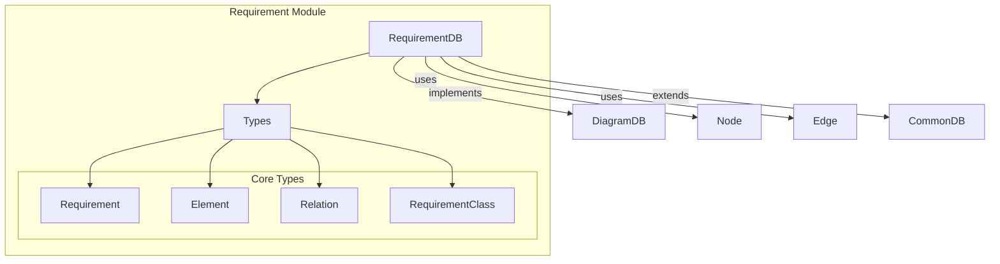
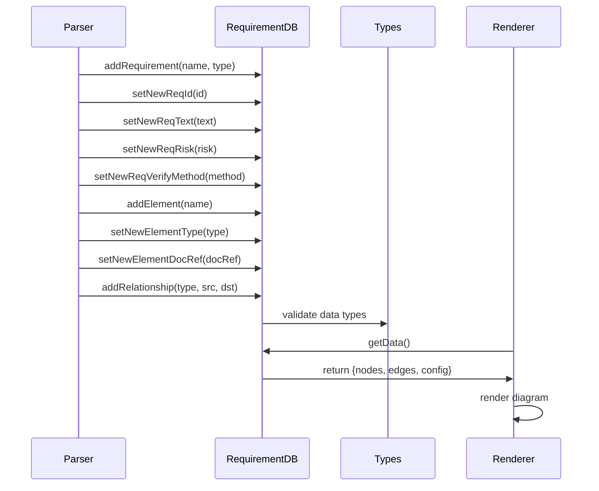
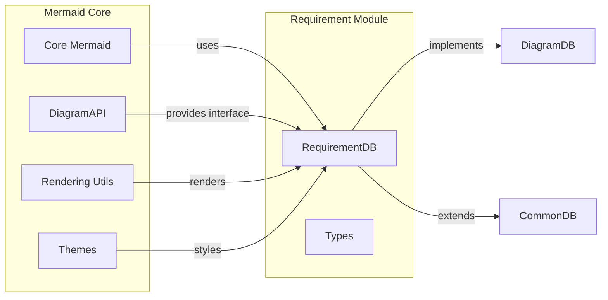
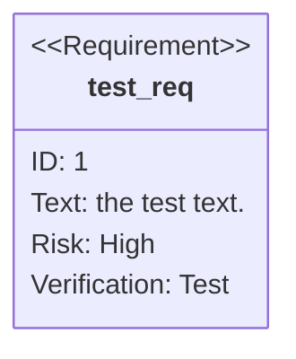
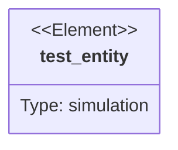

# Requirement Module Documentation

## Overview

The Requirement module is a specialized diagram type within the Mermaid.js library that enables the creation of requirement diagrams. These diagrams are used to visualize system requirements, their relationships, and associated metadata in a structured format. The module provides functionality for defining requirements, elements, and the relationships between them, making it particularly useful for system engineering and requirements analysis.

## Purpose

The Requirement module serves as a dedicated tool for:
- **Requirements Management**: Creating and organizing system requirements with detailed metadata
- **Relationship Visualization**: Mapping dependencies and relationships between requirements and system elements
- **Risk Assessment**: Incorporating risk levels and verification methods into requirement specifications
- **Documentation**: Providing a visual representation of complex requirement hierarchies and traceability

## Architecture

### Core Components

The Requirement module consists of two primary components:

1. **RequirementDB** ([`packages.mermaid.src.diagrams.requirement.requirementDb.RequirementDB`](requirement-database.md)): The main database class that manages all requirement data, relationships, and diagram state
2. **Types** ([`packages.mermaid.src.diagrams.requirement.types`](requirement-types.md)): TypeScript type definitions for requirements, elements, relationships, and supporting data structures

### Module Structure



### Data Flow



## Key Features

### Requirement Types
The module supports various requirement types:
- **Requirement**: General requirement
- **Functional Requirement**: System functionality specifications
- **Interface Requirement**: Interface specifications
- **Performance Requirement**: Performance criteria
- **Physical Requirement**: Physical constraints
- **Design Constraint**: Design limitations

### Risk Levels
Each requirement can be assigned a risk level:
- **Low Risk**: Minimal impact
- **Medium Risk**: Moderate impact
- **High Risk**: Significant impact

### Verification Methods
Requirements can specify verification approaches:
- **Analysis**: Analytical verification
- **Demonstration**: Demonstration-based verification
- **Inspection**: Inspection-based verification
- **Test**: Testing-based verification

### Relationship Types
The module supports various relationship types between requirements and elements:
- **contains**: Containment relationship
- **copies**: Copy relationship
- **derives**: Derivation relationship
- **satisfies**: Satisfaction relationship
- **verifies**: Verification relationship
- **refines**: Refinement relationship
- **traces**: Traceability relationship

## Integration with Mermaid Ecosystem

The Requirement module integrates seamlessly with the broader Mermaid.js ecosystem:



## Usage Patterns

### Basic Requirement Definition


### Element Definition


### Relationship Establishment
```mermaid
requirementDiagram
    test_entity - satisfies -> test_req
```

## Configuration and Styling

The module supports extensive configuration options through:
- **CSS Classes**: Custom styling for requirements and elements
- **Themes**: Integration with Mermaid's theme system
- **Layout Options**: Direction control (TB, BT, LR, RL)
- **Visual Customization**: Arrow styles, line patterns, and node shapes

## Dependencies

The Requirement module depends on several core Mermaid components:
- **DiagramAPI**: For diagram definition and registration
- **Rendering Utils**: For node and edge rendering
- **CommonDB**: For shared database functionality
- **Config**: For configuration management
- **Logger**: For logging and debugging

## Extensibility

The module is designed for extensibility with:
- **Type Safety**: Strong TypeScript typing throughout
- **Interface Implementation**: Implements standard Mermaid interfaces
- **Plugin Architecture**: Compatible with Mermaid's plugin system
- **Custom Styling**: Support for custom CSS classes and themes

## Performance Considerations

- **Efficient Data Structures**: Uses Maps for O(1) lookup performance
- **Lazy Initialization**: Components are initialized only when needed
- **Memory Management**: Proper cleanup and reset functionality
- **Rendering Optimization**: Efficient node and edge generation

## Error Handling

The module includes comprehensive error handling for:
- **Invalid Requirement Types**: Validation against supported types
- **Missing Dependencies**: Graceful handling of missing elements
- **Relationship Validation**: Ensures valid source and target entities
- **Configuration Errors**: Proper validation of configuration options

This documentation provides a comprehensive overview of the Requirement module's architecture, functionality, and integration within the Mermaid.js ecosystem. For detailed implementation specifics, refer to the individual component documentation files.