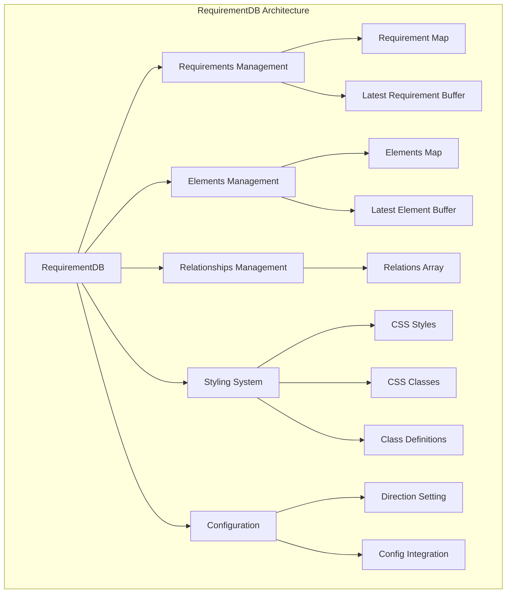
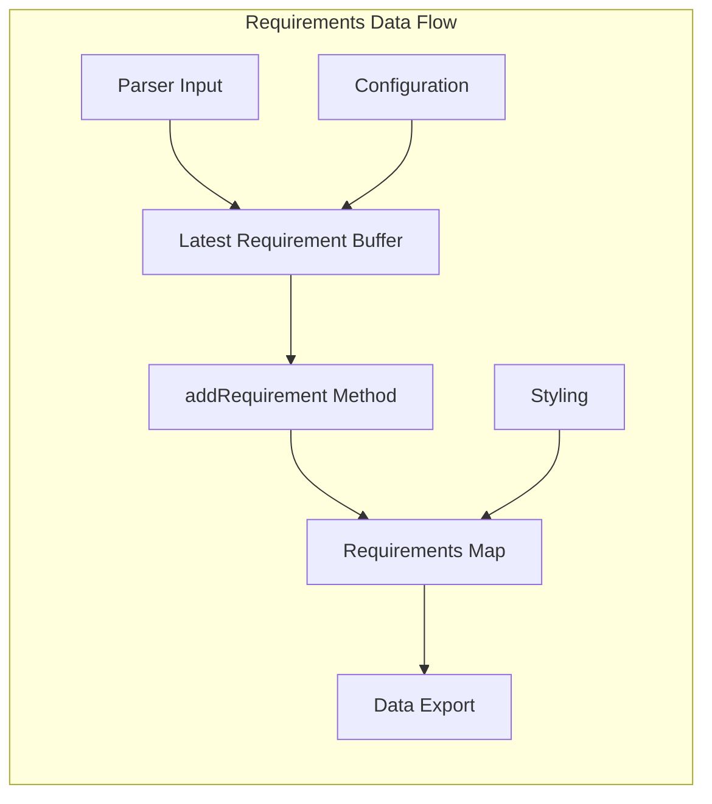
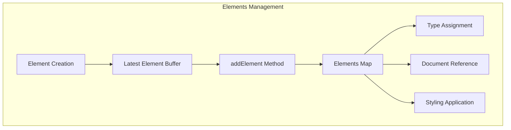
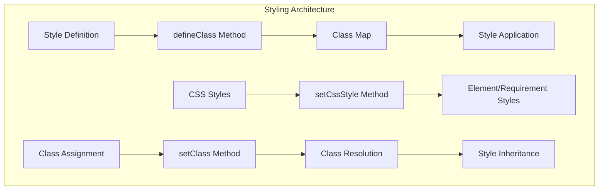
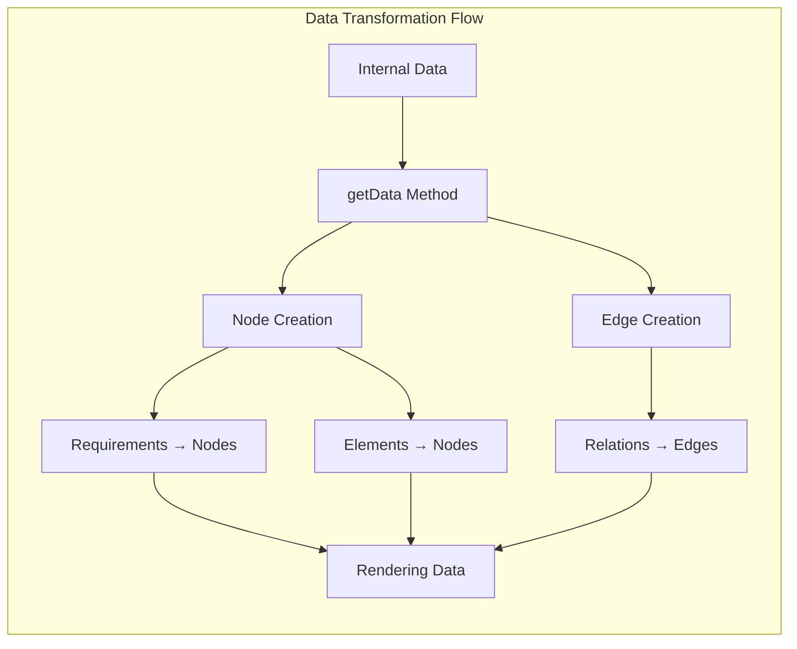
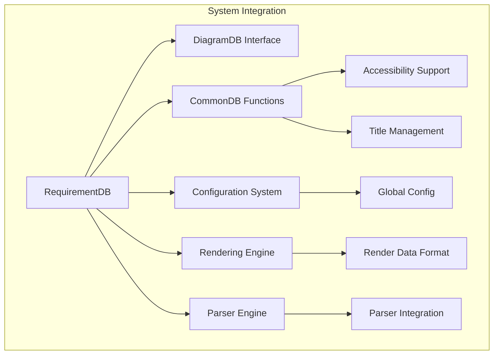

# RequirementDB Module Documentation

## Introduction

The RequirementDB module is a core component of Mermaid's requirement diagram system, providing data management and storage capabilities for requirement diagrams. It implements the `DiagramDB` interface and serves as the central data repository for managing requirements, elements, relationships, and styling information within requirement diagrams.

## Architecture Overview

The RequirementDB module follows a centralized data management pattern, acting as the single source of truth for requirement diagram data. It manages three primary data types: requirements, elements, and relationships, while providing comprehensive styling and configuration capabilities.



## Core Components

### RequirementDB Class

The `RequirementDB` class is the main implementation of the `DiagramDB` interface, providing comprehensive data management for requirement diagrams.

**Key Responsibilities:**
- Manage requirements, elements, and relationships
- Handle styling and CSS class definitions
- Provide data transformation for rendering
- Support diagram configuration and accessibility

**Core Properties:**
```typescript
private relations: Relation[]
private latestRequirement: Requirement
private requirements: Map<string, Requirement>
private latestElement: Element
private elements: Map<string, Element>
private classes: Map<string, RequirementClass>
private direction: string
```

## Data Management

### Requirements Management

The module maintains a comprehensive requirements system with support for different requirement types and attributes.



**Requirement Types Supported:**
- `REQUIREMENT`: General requirements
- `FUNCTIONAL_REQUIREMENT`: Functional specifications
- `INTERFACE_REQUIREMENT`: Interface specifications
- `PERFORMANCE_REQUIREMENT`: Performance criteria
- `PHYSICAL_REQUIREMENT`: Physical constraints
- `DESIGN_CONSTRAINT`: Design limitations

**Risk Levels:**
- `LOW_RISK`: Low risk requirements
- `MED_RISK`: Medium risk requirements
- `HIGH_RISK`: High risk requirements

**Verification Methods:**
- `VERIFY_ANALYSIS`: Analysis verification
- `VERIFY_DEMONSTRATION`: Demonstration verification
- `VERIFY_INSPECTION`: Inspection verification
- `VERIFY_TEST`: Test verification

### Elements Management

Elements represent system components that interact with requirements.



### Relationships Management

The module supports various relationship types between requirements and elements.

**Supported Relationships:**
- `CONTAINS`: Containment relationships
- `COPIES`: Copy relationships
- `DERIVES`: Derivation relationships
- `SATISFIES`: Satisfaction relationships
- `VERIFIES`: Verification relationships
- `REFINES`: Refinement relationships
- `TRACES`: Traceability relationships

## Styling System

The RequirementDB provides a comprehensive styling system with CSS class support and dynamic style application.



**Styling Features:**
- CSS style application to individual elements
- CSS class definition and management
- Class-based style inheritance
- Dynamic style resolution
- Color and text style support

## Data Transformation

The module transforms internal data structures into rendering-compatible formats.



**Node Transformation:**
- Requirements and elements are converted to nodes
- Shape assignment (`requirementBox`)
- CSS class and style application
- Configuration integration

**Edge Transformation:**
- Relationships are converted to edges
- Label generation with relationship type
- Style differentiation (solid vs dashed)
- Arrow type assignment based on relationship

## Integration with Mermaid Core

The RequirementDB module integrates with the broader Mermaid ecosystem through several interfaces.



**Integration Points:**
- [DiagramDB Interface](diagram_plugin_api.md): Core diagram database contract
- [CommonDB Functions](diagram_plugin_api.md): Shared database utilities
- [Configuration System](mermaid_core_api.md): Global configuration integration
- [Rendering Engine](rendering_engine.md): Data format compatibility
- [Parser Engine](parser_engine.md): Parser integration support

## Configuration and Accessibility

The module supports comprehensive configuration and accessibility features.

**Configuration Support:**
- Direction setting (TB, BT, LR, RL)
- Requirement-specific configuration
- Global Mermaid config integration

**Accessibility Features:**
- Title management
- Description support
- Screen reader compatibility
- Semantic structure preservation

## API Reference

### Core Methods

**Requirement Management:**
- `addRequirement(name: string, type: RequirementType)`: Add new requirement
- `setNewReqId(id: string)`: Set requirement ID
- `setNewReqText(text: string)`: Set requirement text
- `setNewReqRisk(risk: RiskLevel)`: Set risk level
- `setNewReqVerifyMethod(verifyMethod: VerifyType)`: Set verification method
- `getRequirements()`: Get all requirements

**Element Management:**
- `addElement(name: string)`: Add new element
- `setNewElementType(type: string)`: Set element type
- `setNewElementDocRef(docRef: string)`: Set document reference
- `getElements()`: Get all elements

**Relationship Management:**
- `addRelationship(type: RelationshipType, src: string, dst: string)`: Add relationship
- `getRelationships()`: Get all relationships

**Styling:**
- `setCssStyle(ids: string[], styles: string[])`: Apply CSS styles
- `setClass(ids: string[], classNames: string[])`: Assign CSS classes
- `defineClass(ids: string[], style: string[])`: Define CSS classes
- `getClasses()`: Get all class definitions

**Data Export:**
- `getData()`: Get rendering data
- `getDirection()`: Get diagram direction
- `getConfig()`: Get configuration

**Utility:**
- `clear()`: Clear all data
- `setDirection(dir: string)`: Set diagram direction

## Usage Patterns

### Basic Requirement Creation
```typescript
const reqDb = new RequirementDB();
reqDb.setNewReqId('REQ-001');
reqDb.setNewReqText('System shall provide user authentication');
reqDb.setNewReqRisk('High');
reqDb.setNewReqVerifyMethod('Test');
reqDb.addRequirement('AuthRequirement', 'FUNCTIONAL_REQUIREMENT');
```

### Element and Relationship Creation
```typescript
reqDb.addElement('UserService');
reqDb.setNewElementType('Service');
reqDb.setNewElementDocRef('ARCH-001');
reqDb.addElement('UserService');

reqDb.addRelationship('satisfies', 'UserService', 'AuthRequirement');
```

### Styling Application
```typescript
reqDb.defineClass(['high-risk'], ['stroke:red', 'stroke-width:2px']);
reqDb.setClass(['AuthRequirement'], ['high-risk']);
```

## Error Handling

The module implements defensive programming practices:
- Null checks for latest requirement/element buffers
- Duplicate prevention in maps
- Graceful handling of missing entities
- Safe style application with fallbacks

## Performance Considerations

**Optimization Strategies:**
- Map-based storage for O(1) lookups
- Lazy style resolution
- Efficient data transformation
- Minimal memory footprint for buffers

**Scalability Features:**
- Support for large requirement sets
- Efficient relationship management
- Optimized rendering data generation
- Memory-conscious data structures

## Dependencies

**Internal Dependencies:**
- [DiagramDB Interface](diagram_plugin_api.md): Core interface implementation
- [CommonDB Functions](diagram_plugin_api.md): Shared utilities
- [Configuration System](mermaid_core_api.md): Configuration access
- [Rendering Types](rendering_engine.md): Type definitions
- [Logger](mermaid_core_api.md): Logging functionality

**Type Dependencies:**
- [Requirement Types](types.md): TypeScript type definitions
- [Rendering Types](rendering-types.md): Node and edge types
- [Configuration Types](config.type.md): Configuration interfaces

This comprehensive data management system enables Mermaid to create sophisticated requirement diagrams while maintaining clean separation of concerns and providing extensive customization capabilities.