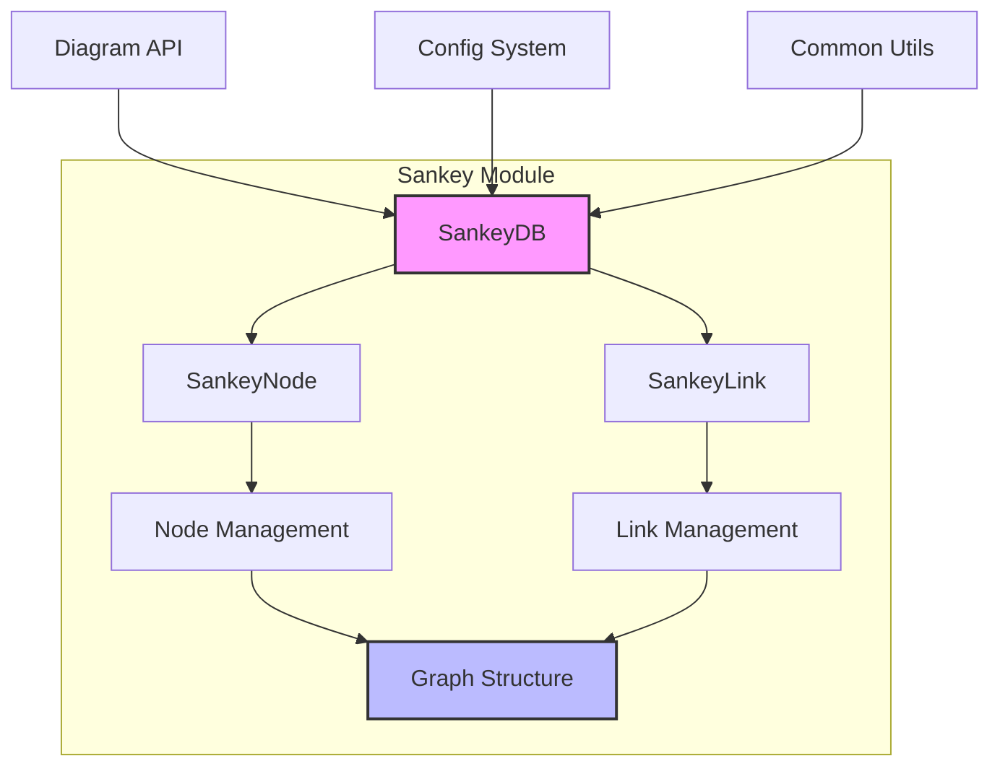
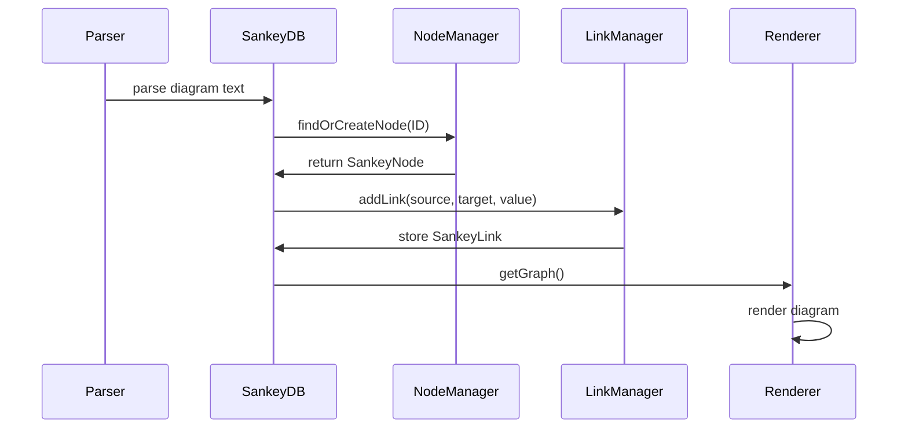
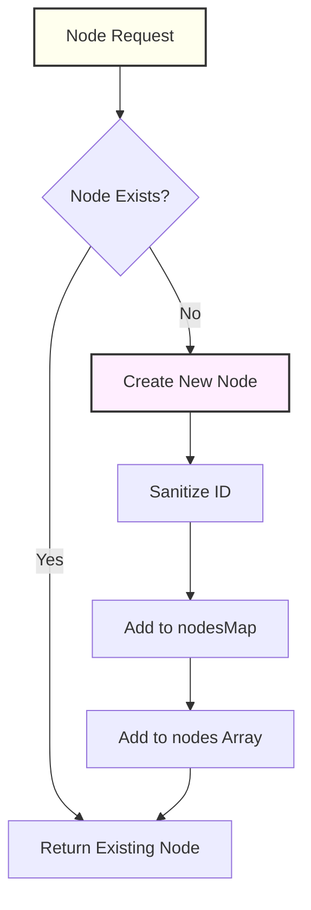
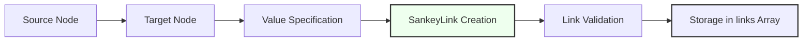

# Sankey Module Documentation

## Introduction

The Sankey module is a specialized diagram type within the Mermaid ecosystem that implements Sankey diagrams - a type of flow diagram where the width of arrows is proportional to the flow quantity. This module provides the data structures and logic for creating, managing, and rendering Sankey diagrams that visualize flows between different nodes or entities.

Sankey diagrams are particularly useful for visualizing:
- Energy flows
- Material flows
- Budget allocations
- Data transfers
- Process flows

## Architecture Overview

The Sankey module follows Mermaid's standard diagram architecture pattern, integrating with the core framework through the diagram API while maintaining its own specialized data structures and rendering logic.



## Core Components

### SankeyDB (Data Layer)

The `SankeyDB` serves as the central data management system for Sankey diagrams. It maintains the state of all nodes and links, provides CRUD operations, and interfaces with the broader Mermaid ecosystem.

**Key Responsibilities:**
- Node lifecycle management (creation, storage, retrieval)
- Link management and validation
- Graph structure maintenance
- Integration with common diagram utilities

**Data Structures:**
- `nodes: SankeyNode[]` - Ordered array of nodes
- `links: SankeyLink[]` - Array of connections between nodes
- `nodesMap: Map<string, SankeyNode>` - Fast node lookup by ID

### SankeyNode (Entity Representation)

Represents individual entities in the Sankey diagram. Nodes are the fundamental building blocks that can receive, process, and send flows.

**Properties:**
- `ID: string` - Unique identifier for the node
- Text sanitization support for safe rendering

### SankeyLink (Flow Representation)

Defines the connections between nodes, carrying flow values that determine the visual width in the rendered diagram.

**Properties:**
- `source: SankeyNode` - Origin node
- `target: SankeyNode` - Destination node
- `value: number` - Flow quantity (determines arrow width)

## Data Flow Architecture



## Integration with Mermaid Ecosystem

### Configuration System

The Sankey module integrates with Mermaid's configuration system through `getConfig().sankey`, allowing users to customize diagram appearance and behavior. Configuration options are defined in the [config module](config.md).

### Common Utilities

Leverages shared utilities from the common module:
- Text sanitization via `common.sanitizeText()`
- Accessibility features (title and description management)
- Diagram metadata handling

### Diagram API Integration

Implements the standard diagram interface pattern:
- `clear()` - Resets diagram state
- `getAccTitle()` / `setAccTitle()` - Accessibility support
- `getAccDescription()` / `setAccDescription()` - Screen reader support
- `getDiagramTitle()` / `setDiagramTitle()` - Title management

## Node Management Process



## Link Creation Flow



## Graph Export

The module provides a `getGraph()` method that exports the diagram structure in a format suitable for rendering engines:

```typescript
{
  nodes: [{ id: string }],
  links: [{
    source: string,
    target: string,
    value: number
  }]
}
```

This normalized format separates the internal object references from the export structure, making it suitable for serialization and rendering.

## Error Handling and Validation

The Sankey module implements several validation mechanisms:

1. **Node ID Sanitization**: All node IDs are processed through `common.sanitizeText()` to prevent XSS attacks
2. **Configuration Validation**: Uses the central configuration system for validation
3. **State Consistency**: Maintains consistency between `nodes`, `links`, and `nodesMap`

## Performance Considerations

- **Fast Node Lookup**: Uses `Map` for O(1) node retrieval by ID
- **Ordered Node Array**: Maintains insertion order for consistent rendering
- **Lazy Node Creation**: Nodes are created only when first referenced
- **Memory Management**: `clear()` method properly resets all data structures

## Dependencies

The Sankey module depends on several core Mermaid components:

- **[core-mermaid](core-mermaid.md)**: Core framework and configuration
- **[config](config.md)**: Configuration type definitions, including `SankeyDiagramConfig`
- **[diagram-api](diagram-api.md)**: Base diagram interfaces and utilities
- **[common-types](common-types.md)**: Shared type definitions
- **[utils](utils.md)**: Common utility functions

## Extension Points

The module is designed for extensibility:

1. **Custom Node Types**: The `SankeyNode` class can be extended for specialized node behavior
2. **Link Validation**: Additional validation logic can be added to `addLink()`
3. **Export Formats**: The `getGraph()` method can be extended to support additional export formats
4. **Configuration**: New configuration options can be added through the config system

## Usage Examples

The typical usage flow involves:

1. Parsing diagram text to identify nodes and links
2. Creating nodes via `findOrCreateNode()`
3. Establishing links with `addLink()`
4. Exporting the graph structure for rendering
5. Clearing state for the next diagram

This modular approach ensures clean separation of concerns and makes the Sankey diagram implementation maintainable and extensible within the larger Mermaid ecosystem.