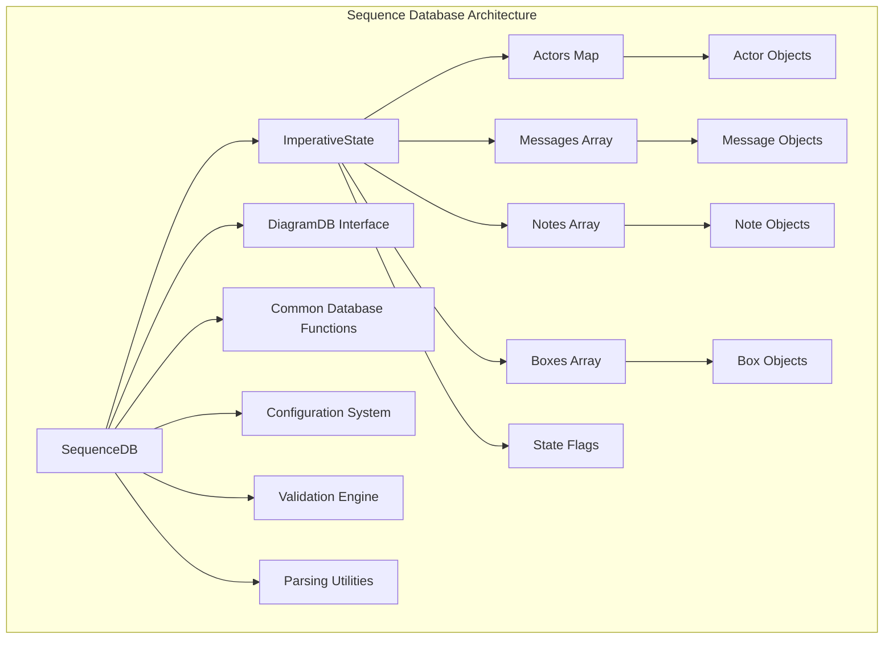
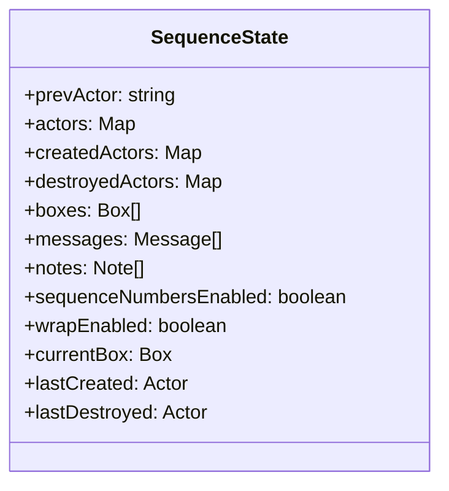
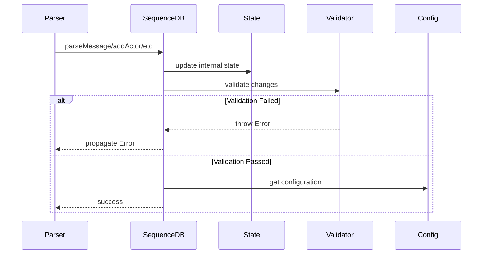
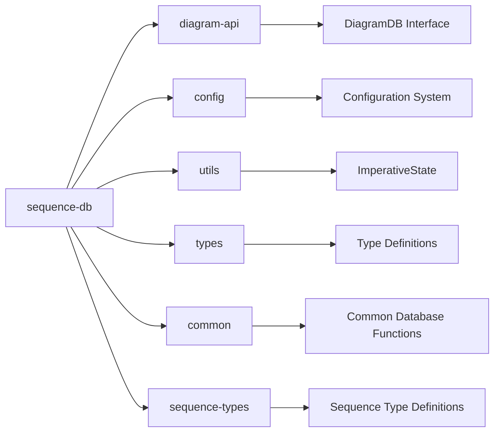
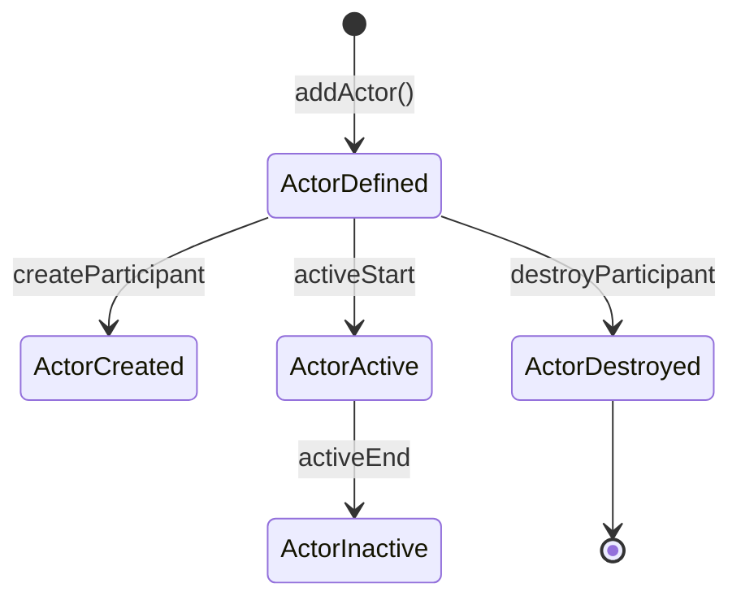
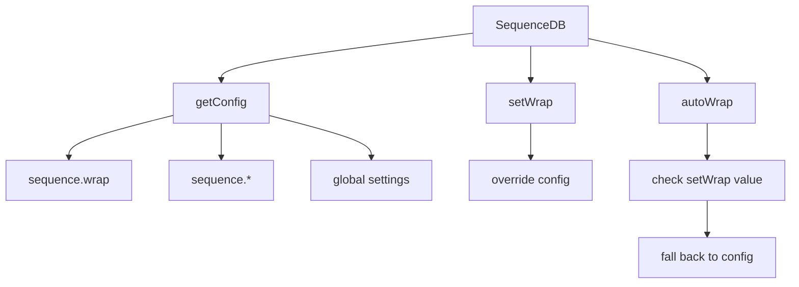
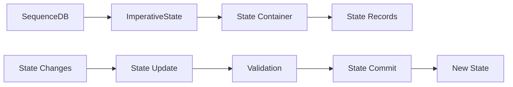

# Sequence Database Module Documentation

## Introduction

The sequence-db module is a core component of Mermaid's sequence diagram functionality, providing the data management layer for sequence diagrams. It implements the `DiagramDB` interface and manages the state, actors, messages, notes, and structural elements that define sequence diagrams. This module serves as the central repository for all sequence diagram data, handling parsing, validation, and state management throughout the diagram lifecycle.

## Architecture Overview

The sequence-db module follows a stateful architecture pattern with the `SequenceDB` class as the primary data manager. It maintains an internal state using the `ImperativeState` utility and provides a comprehensive API for manipulating sequence diagram elements.



## Core Components

### SequenceDB Class

The `SequenceDB` class is the main implementation of the `DiagramDB` interface for sequence diagrams. It provides a comprehensive API for managing all aspects of sequence diagram data.

**Key Responsibilities:**
- Actor management (creation, properties, lifecycle)
- Message handling (signals, interactions, types)
- Note management and placement
- Box/container organization
- State validation and error handling
- Configuration integration
- Parsing and text processing

### SequenceState Interface

The internal state structure that maintains all sequence diagram data:



## Data Flow Architecture



## Component Relationships

### Dependencies

The sequence-db module integrates with several other Mermaid modules:



### Integration Points

- **Diagram API**: Implements `DiagramDB` interface for diagram lifecycle management
- **Configuration**: Integrates with Mermaid's configuration system for sequence-specific settings
- **Common Database**: Shares functionality with other diagram types through common database utilities
- **Type System**: Uses shared type definitions for consistency across the codebase

## Key Features

### Actor Management

The module provides comprehensive actor lifecycle management:



**Features:**
- Multiple actor types (actor, boundary, collections, control, database, entity, participant, queue)
- Actor properties and links management
- Box assignment and organization
- Lifecycle tracking (creation/destruction)
- Activation state management

### Message System

Sophisticated message handling with various types and validation:

**Message Types:**
- Solid and dotted lines
- Bidirectional messages
- Notes and annotations
- Control flow (loop, alt, opt, par, critical, break)
- Activation signals

**Validation Features:**
- Activation count validation
- Actor existence verification
- Message sequence validation
- Creation/destruction consistency checks

### Text Processing

Advanced text processing capabilities:

- **Wrap Control**: Automatic and manual text wrapping
- **Sanitization**: HTML sanitization for security
- **YAML Parsing**: Support for metadata in YAML format
- **Color Parsing**: CSS color validation and processing

## Configuration Integration

The module integrates with Mermaid's configuration system:



## Error Handling

Comprehensive error handling for various scenarios:

- **Duplicate Actors**: Prevents same participant in multiple boxes
- **Invalid Activations**: Validates activation/deactivation sequences
- **Missing Participants**: Ensures created/destroyed participants have associated messages
- **Parse Errors**: Handles malformed YAML, JSON, and text

## State Management

Uses the `ImperativeState` utility for reliable state management:



## API Reference

### Core Methods

- `addActor()`: Add or update an actor/participant
- `addMessage()`: Add a message between actors
- `addSignal()`: Add a signal with type validation
- `addNote()`: Add a note to an actor
- `addBox()`: Create a container box
- `apply()`: Process structured diagram commands

### State Access

- `getActors()`: Retrieve all actors
- `getMessages()`: Retrieve all messages
- `getBoxes()`: Retrieve all boxes
- `getCreatedActors()`: Get creation timeline
- `getDestroyedActors()`: Get destruction timeline

### Configuration

- `setWrap()`: Override wrap behavior
- `autoWrap()`: Get current wrap setting
- `enableSequenceNumbers()`: Toggle sequence numbering
- `showSequenceNumbers()`: Check numbering state

## Usage Patterns

### Basic Actor Definition

```
sequenceDiagram
    participant Alice
    participant Bob
```

### Message Flow

```
sequenceDiagram
    Alice->>Bob: Hello
    Bob-->>Alice: Hi there
```

### Advanced Features

```
sequenceDiagram
    box RGB(33,66,99) Container
        participant A
        participant B
    end
    A->>B: Message
    note right of B: Note
```

## Related Documentation

- [sequence-types](sequence-types.md) - Type definitions for sequence diagrams
- [sequence-renderer](sequence-renderer.md) - Rendering engine for sequence diagrams
- [diagram-api](diagram-api.md) - Core diagram API interface
- [config](config.md) - Configuration system integration
- [common](common.md) - Shared database utilities

## Performance Considerations

- **State Updates**: Uses efficient state management with minimal re-renders
- **Validation**: Validates during parsing to catch errors early
- **Memory Management**: Proper cleanup with clear() method
- **Lookup Optimization**: Uses Maps for O(1) actor lookups

## Security Features

- **Text Sanitization**: All user input is sanitized before processing
- **JSON/YAML Parsing**: Safe parsing with error handling
- **CSS Validation**: Color values are validated before use
- **Input Validation**: Comprehensive validation of all inputs