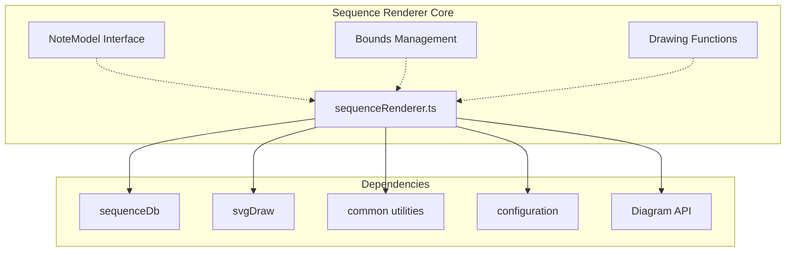
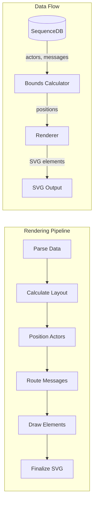
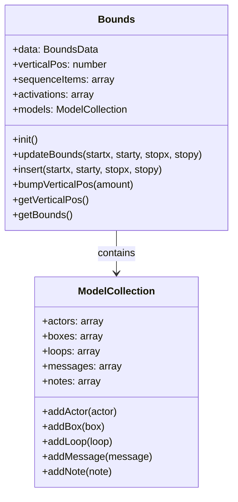
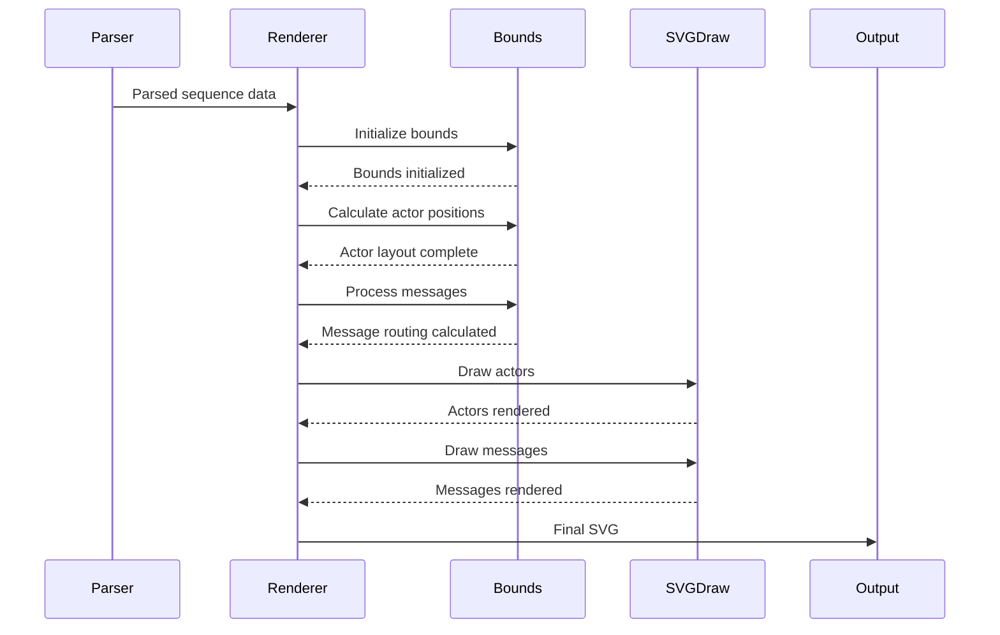
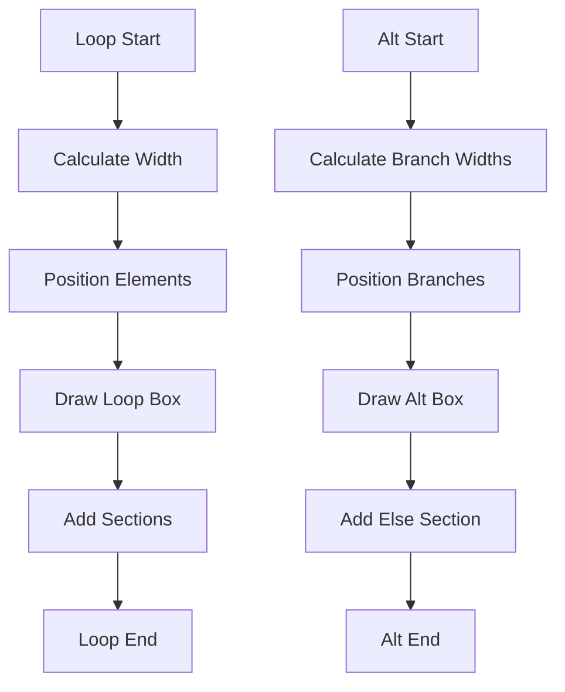

# Sequence Renderer Module

## Introduction

The sequence-renderer module is a core component of the Mermaid diagram library responsible for rendering sequence diagrams. It transforms parsed sequence diagram data into visual SVG representations, handling the complex layout calculations, actor positioning, message routing, and interactive elements that make sequence diagrams intuitive and informative.

## Module Overview

The sequence-renderer serves as the visual engine for sequence diagrams, working in conjunction with the sequence database (sequenceDb) and SVG drawing utilities to create professional-quality sequence diagrams. It manages the entire rendering pipeline from data processing to final SVG output.

## Architecture

### Core Components



### Component Relationships



## Key Components

### Bounds Management System

The bounds object is the central coordination system for layout calculations:



### NoteModel Interface

The NoteModel interface defines the structure for note rendering:

```typescript
interface NoteModel {
    startx: number;      // x axis start position
    starty: number;      // y axis position
    message: string;     // the message to be shown
    width: number;       // custom width override
}
```

## Rendering Process Flow



## Key Functions

### Primary Drawing Function

```typescript
export const draw = async function (
    _text: string, 
    id: string, 
    _version: string, 
    diagObj: Diagram
): Promise<void>
```

The main entry point that orchestrates the entire rendering process.

### Message Processing

```typescript
async function boundMessage(_diagram, msgModel): Promise<number>
const drawMessage = async function (diagram, msgModel, lineStartY: number, diagObj: Diagram)
```

These functions handle message layout calculation and rendering, supporting various message types including solid, dotted, bidirectional, and self-referencing messages.

### Actor Management

```typescript
export const drawActors = async function (diagram, actors, actorKeys, isFooter)
export const drawActorsPopup = function (diagram, actors, actorKeys, doc)
```

Manages actor positioning, rendering, and interactive popup elements.

### Note Rendering

```typescript
const drawNote = async function (elem: any, noteModel: NoteModel)
const buildNoteModel = async function (msg, actors, diagObj)
```

Handles note positioning and rendering with support for different placements (left, right, over).

## Layout Algorithms

### Actor Positioning

The renderer uses a sophisticated algorithm to position actors:

1. **Margin Calculation**: Each actor's margin is calculated based on the widest message originating from it
2. **Box Handling**: Actors within boxes are grouped and positioned together
3. **Created/Destroyed Actors**: Special positioning for actors created or destroyed during the sequence

### Message Routing

Messages are routed based on:

- **Activation bounds**: Messages consider activation boxes when determining start/end points
- **Arrow types**: Different routing for various arrow styles (solid, dotted, open, cross, point)
- **Bidirectional messages**: Special handling for bidirectional arrows
- **Self-references**: Curved routing for messages from an actor to itself

### Loop and Control Structure Layout



## Configuration and Styling

### Font Configuration

The renderer supports separate font configurations for different elements:

```typescript
const messageFont = (cnf) => ({ fontFamily, fontSize, fontWeight })
const noteFont = (cnf) => ({ fontFamily, fontSize, fontWeight })
const actorFont = (cnf) => ({ fontFamily, fontSize, fontWeight })
```

### Styling Options

- **Actor dimensions**: Configurable width, height, and margins
- **Message styling**: Font properties, alignment, and wrapping
- **Note appearance**: Background, borders, and text styling
- **Loop styling**: Box appearance and text formatting

## Advanced Features

### KaTeX Support

The renderer supports mathematical expressions through KaTeX integration:

```typescript
const textElem = hasKatex(textObj.text) 
    ? await drawKatex(g, textObj) 
    : drawText(g, textObj);
```

### Sequence Numbering

Automatic sequence numbering with configurable visibility and step values:

```typescript
if (sequenceVisible || conf.showSequenceNumbers) {
    // Add sequence number indicators
}
```

### Text Wrapping

Intelligent text wrapping based on available space and configuration:

```typescript
msg.message = utils.wrapLabel(
    msg.message, 
    boundedWidth + 2 * conf.wrapPadding, 
    messageFont(conf)
);
```

## Integration Points

### Sequence Database Integration

The renderer integrates with the sequence database through:

- **Actor retrieval**: `diagObj.db.getActors()`
- **Message processing**: `diagObj.db.getMessages()`
- **Created/destroyed actors**: `diagObj.db.getCreatedActors()`, `diagObj.db.getDestroyedActors()`
- **Box management**: `diagObj.db.getBoxes()`

### Configuration System

Integrates with Mermaid's configuration system:

```typescript
const { securityLevel, sequence } = getConfig();
conf = sequence;
```

### SVG Drawing Utilities

Leverages specialized SVG drawing functions:

- **Actor drawing**: `svgDraw.drawActor()`
- **Message rendering**: `svgDraw.drawActivation()`
- **Loop drawing**: `svgDraw.drawLoop()`
- **Icon insertion**: `svgDraw.insertComputerIcon()`, `svgDraw.insertDatabaseIcon()`, `svgDraw.insertClockIcon()`

## Error Handling

The renderer includes comprehensive error handling:

```typescript
try {
    msgModel = msg.msgModel;
    // Process message
} catch (e) {
    log.error('error while drawing message', e);
}
```

## Performance Optimizations

### Bounds Calculation Caching

The bounds system caches calculations to avoid redundant processing:

```typescript
updateVal: function (obj, key, val, fun) {
    if (obj[key] === undefined) {
        obj[key] = val;
    } else {
        obj[key] = fun(val, obj[key]);
    }
}
```

### Message Width Optimization

Pre-calculates maximum message widths per actor to optimize layout:

```typescript
async function getMaxMessageWidthPerActor(
    actors: Map<string, any>, 
    messages: any[], 
    diagObj: Diagram
): Promise<Record<string, number>>
```

## Dependencies

The sequence-renderer module depends on several other Mermaid modules:

- **[sequence-db](sequence-db.md)**: Provides the data model and parsing logic
- **[svg-draw](svg-draw.md)**: Handles low-level SVG element creation
- **[common](common.md)**: Provides utility functions and text processing
- **[diagram-api](diagram-api.md)**: Configuration and diagram lifecycle management
- **[rendering-util](rendering-util.md)**: Shared rendering utilities and types

## Usage Examples

The renderer is typically used internally by Mermaid's diagram system, but understanding its structure helps with:

- **Custom styling**: Modifying appearance through configuration
- **Performance tuning**: Understanding layout calculations
- **Debugging**: Identifying rendering issues
- **Extension**: Adding new sequence diagram features

This module represents a sophisticated layout engine that balances visual clarity, performance, and configurability to produce professional sequence diagrams.