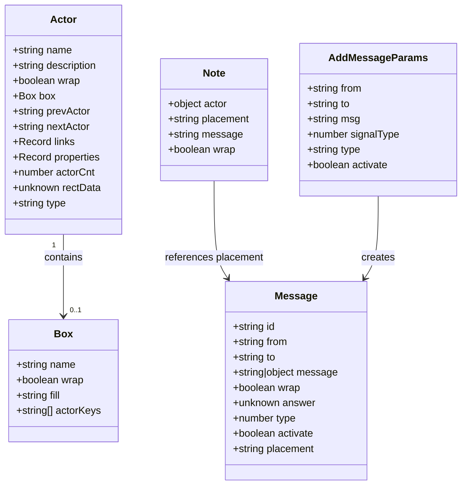
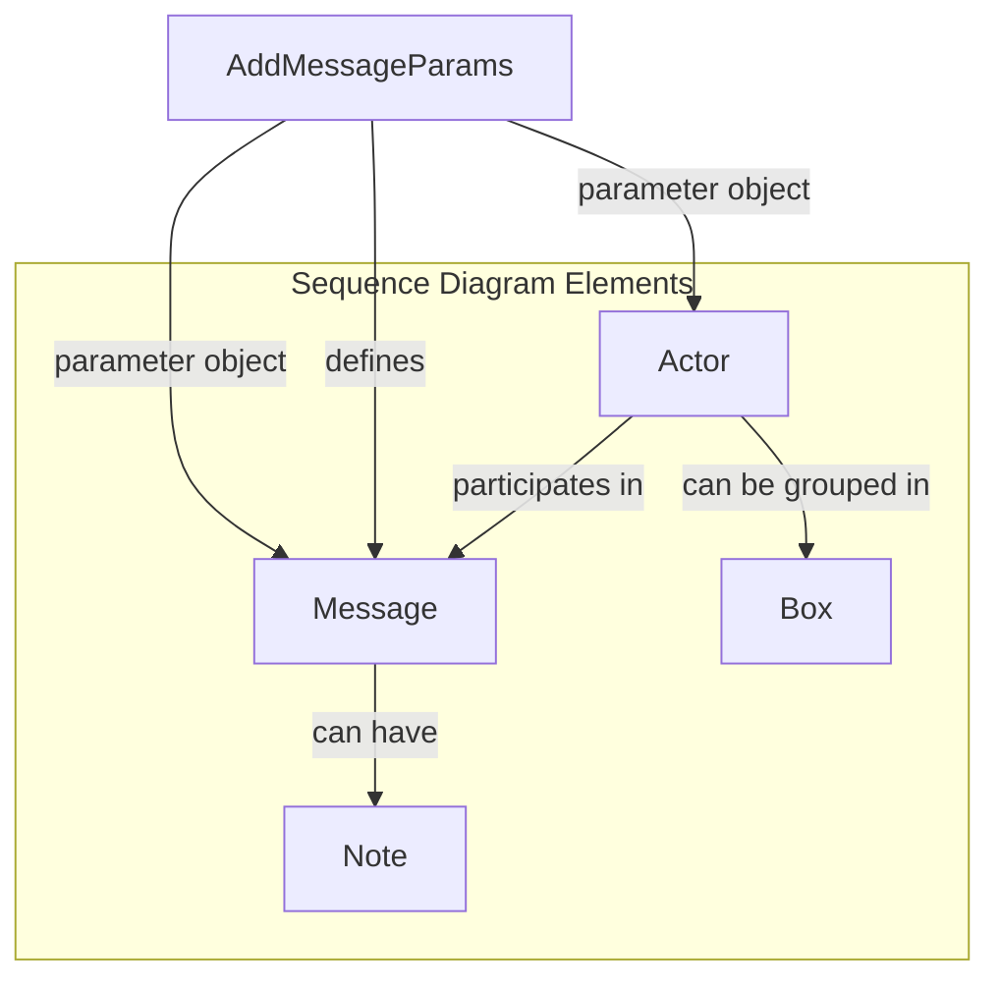
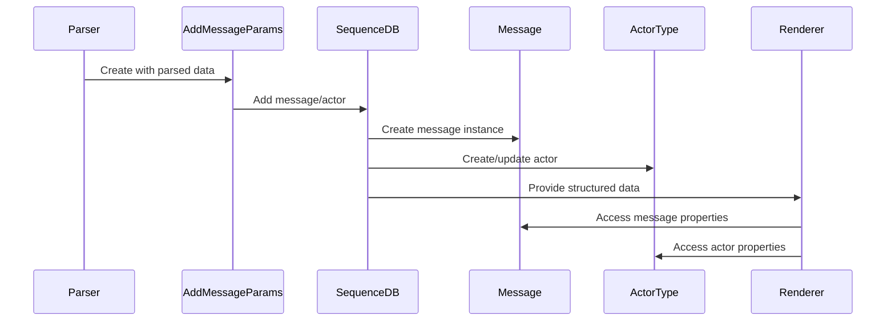
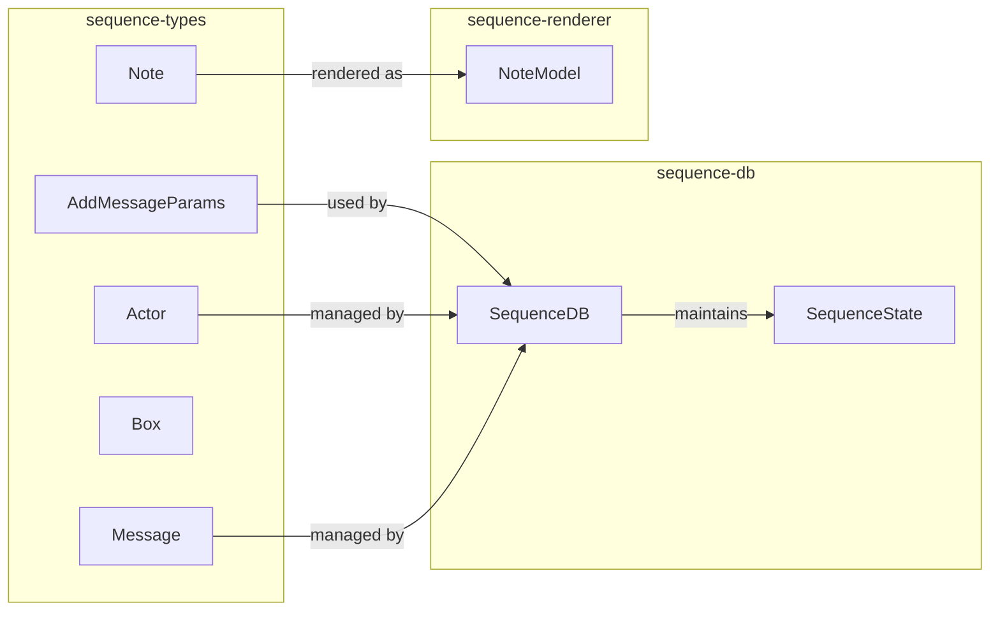

# Sequence Types Module Documentation

## Introduction

The sequence-types module defines the core type definitions for sequence diagrams in Mermaid. It provides the fundamental data structures that represent actors, messages, notes, and boxes within sequence diagrams. These types form the foundation for parsing, storing, and rendering sequence diagram elements.

## Module Architecture

### Core Components Overview

The sequence-types module consists of five primary interfaces that define the structure of sequence diagram elements:



### Component Relationships



## Detailed Component Documentation

### Actor Interface

The `Actor` interface represents participants in a sequence diagram. Actors are the entities that interact through messages.

**Properties:**
- `name`: Unique identifier for the actor
- `description`: Human-readable description of the actor
- `wrap`: Text wrapping behavior
- `box`: Optional box grouping (for visual organization)
- `prevActor`/`nextActor`: Linked list structure for actor ordering
- `links`: Additional link metadata
- `properties`: Custom properties
- `actorCnt`: Actor count/index
- `rectData`: Rendering rectangle data
- `type`: Actor type classification

**Usage Context:**
Actors are fundamental to sequence diagrams and are typically created when parsing participant declarations. They maintain relationships with other actors and can be visually grouped within boxes.

### Message Interface

The `Message` interface represents communication between actors in a sequence diagram.

**Properties:**
- `id`: Unique message identifier
- `from`: Source actor identifier
- `to`: Target actor identifier
- `message`: Message content (string or structured object)
- `wrap`: Text wrapping behavior
- `answer`: Response/answer metadata
- `type`: Message type classification
- `activate`: Activation flag for lifeline visualization
- `placement`: Message placement/positioning

**Message Content Structure:**
When `message` is an object, it contains:
- `start`: Start position
- `step`: Step increment
- `visible`: Visibility flag

### Note Interface

The `Note` interface represents annotations attached to actors or messages.

**Properties:**
- `actor`: Target actor reference (contains actor property)
- `placement`: Position relative to actor/message (references Message placement)
- `message`: Note content
- `wrap`: Text wrapping behavior

### Box Interface

The `Box` interface represents visual grouping containers for actors.

**Properties:**
- `name`: Box identifier
- `wrap`: Text wrapping behavior
- `fill`: Background color/fill style
- `actorKeys`: Array of actor identifiers within the box

### AddMessageParams Interface

The `AddMessageParams` interface defines parameters for adding messages to the sequence diagram database.

**Properties:**
- `from`: Source actor identifier
- `to`: Target actor identifier
- `msg`: Message content
- `signalType`: Signal type classification
- `type`: Operation type (extensive enum of sequence operations)
- `activate`: Activation flag

**Operation Types:**
The `type` property supports numerous operation types including:
- Message operations: `addMessage`, `sequenceIndex`
- Participant operations: `addParticipant`, `createParticipant`, `destroyParticipant`
- Activation operations: `activeStart`, `activeEnd`
- Note operations: `addNote`
- Link operations: `addLinks`, `addALink`
- Property operations: `addProperties`, `addDetails`
- Box operations: `boxStart`, `boxEnd`
- Control flow operations: `loopStart`, `loopEnd`, `optStart`, `optEnd`, `altStart`, `else`, `altEnd`
- Parallel operations: `parStart`, `parAnd`, `parEnd`, `parOverStart`, `parOverEnd`
- Critical section operations: `criticalStart`, `criticalOption`, `criticalEnd`
- Break operations: `breakStart`, `breakEnd`

## Data Flow Architecture



## Integration with Sequence Module

The sequence-types module integrates with other sequence diagram components:



## Type Safety and Extensibility

The sequence-types module provides strong typing for sequence diagram elements while maintaining flexibility through:

1. **Generic Properties**: `Record<string, unknown>` types for `links` and `properties` allow extensibility
2. **Union Types**: Message content supports both string and structured object formats
3. **Optional Properties**: Many properties are optional, allowing incremental construction
4. **Type References**: Cross-references between types (e.g., Note references Message placement)

## Usage Patterns

### Actor Creation
```typescript
const actor: Actor = {
  name: "User",
  description: "System User",
  wrap: true,
  actorCnt: 1,
  type: "participant"
};
```

### Message Construction
```typescript
const message: Message = {
  id: "msg1",
  from: "User",
  to: "System",
  message: "Login request",
  type: 1,
  activate: true
};
```

### Note Attachment
```typescript
const note: Note = {
  actor: { actor: "User" },
  placement: "over",
  message: "Authentication required",
  wrap: false
};
```

## Related Documentation

- [sequence-db.md](sequence-db.md) - Database operations for sequence diagrams
- [sequence-renderer.md](sequence-renderer.md) - Rendering logic for sequence diagrams
- [config.md](config.md) - Configuration options including SequenceDiagramConfig
- [diagram-api.md](diagram-api.md) - General diagram API patterns

## Summary

The sequence-types module provides the foundational type definitions that enable the creation, manipulation, and rendering of sequence diagrams in Mermaid. Its well-structured interfaces support the complex requirements of sequence diagram visualization while maintaining type safety and extensibility. The module's design facilitates clear separation of concerns between data representation, storage, and rendering phases of the diagram lifecycle.