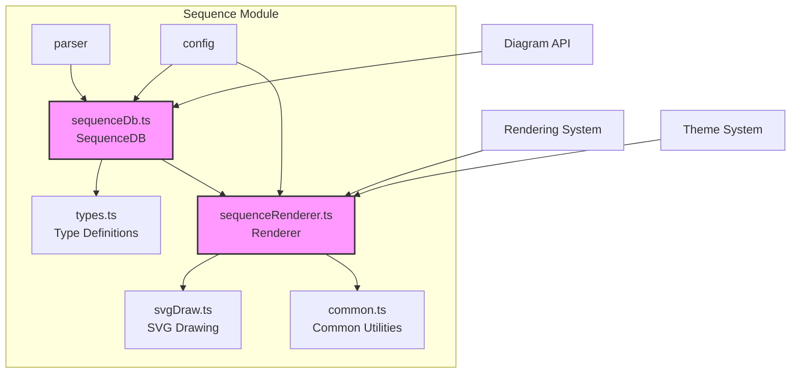
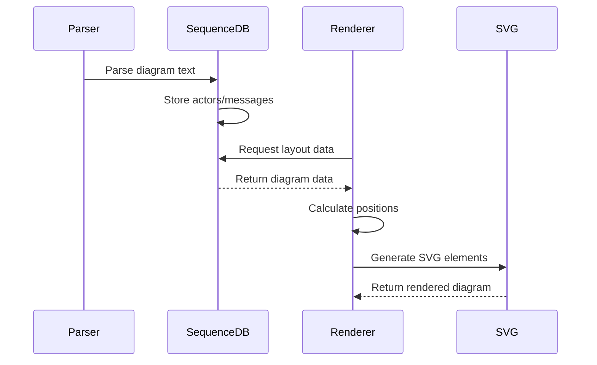
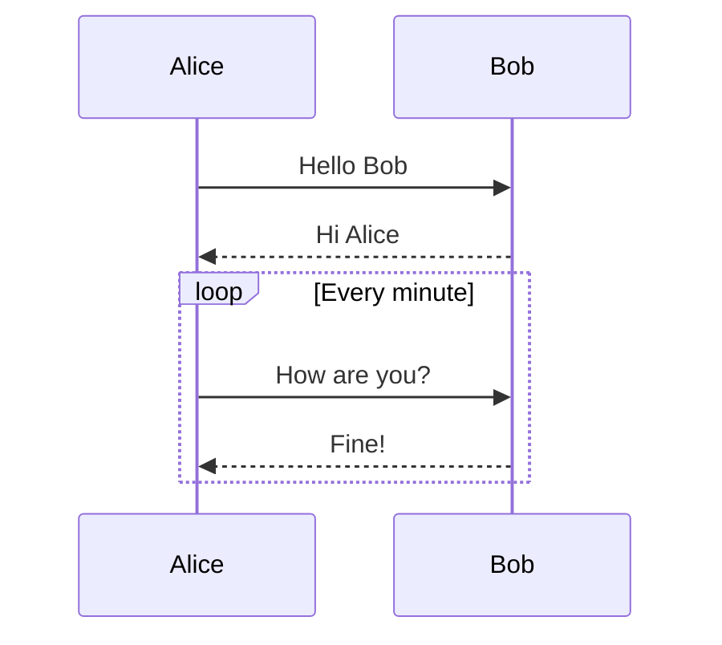

# Sequence Module Documentation

## Overview

The sequence module is a core component of the Mermaid diagram library that provides functionality for creating sequence diagrams. Sequence diagrams are used to visualize the interactions between different actors or participants in a system over time, showing the sequence of messages exchanged between them.

## Purpose

The sequence module enables developers to:
- Define actors/participants in a system
- Model message exchanges between participants
- Represent different types of interactions (synchronous, asynchronous, notes, etc.)
- Handle complex control flow structures (loops, alternatives, parallel execution)
- Support various participant types (actors, databases, collections, etc.)
- Manage actor lifecycles (creation and destruction)

## Architecture

## Core Components

### 1. SequenceDB (sequenceDb.ts)
The central database component that manages all sequence diagram data. See [sequence-db.md](sequence-db.md) for detailed documentation.

Key components:
- **SequenceDB**: Main class implementing the DiagramDB interface
- **SequenceState**: Internal state management for diagram elements

High-level responsibilities:
- Actor/participant management
- Message storage and organization
- Note handling
- Box/grouping functionality
- Sequence numbering
- Actor lifecycle management (creation/destruction)

### 2. Type Definitions (types.ts)
Defines the core data structures for the sequence module. See [sequence-types.md](sequence-types.md) for detailed documentation.

Core types:
- **Actor**: Participant representation with properties and metadata
- **Message**: Communication between actors
- **Note**: Annotations and comments
- **Box**: Grouping mechanism for actors
- **AddMessageParams**: Parameter interface for message operations

### 3. Sequence Renderer (sequenceRenderer.ts)
Handles the visual representation and rendering of sequence diagrams. See [sequence-renderer.md](sequence-renderer.md) for detailed documentation.

Key components:
- **NoteModel**: Model for note rendering
- **bounds**: Layout and positioning management
- **draw**: Main rendering function
- **drawMessage**: Message visualization
- **drawActors**: Actor representation

## Key Features

### Actor Types
The module supports various participant types:
- **Actor**: General participant
- **Boundary**: Boundary element
- **Collections**: Collection/group
- **Control**: Control element
- **Database**: Database representation
- **Entity**: Entity element
- **Participant**: Generic participant
- **Queue**: Queue element

### Message Types
Multiple message interaction patterns:
- Solid and dotted lines
- Open and filled arrows
- Bidirectional communication
- Cross markers
- Point markers
- Self-references

### Control Structures
Advanced diagramming features:
- **Loops**: Repetitive behavior
- **Alternatives**: Conditional branching (alt/else)
- **Options**: Optional behavior
- **Parallel**: Concurrent execution
- **Critical**: Critical sections
- **Break**: Break statements

### Actor Lifecycle
Complete lifecycle management:
- **Creation**: Dynamic actor instantiation
- **Destruction**: Actor termination
- **Activation**: Activity representation
- **Deactivation**: Activity termination

## Data Flow

## Integration Points

### Configuration System
- Integrates with Mermaid's configuration system
- Supports sequence-specific settings (wrapping, fonts, spacing)
- Theme integration for consistent styling

### Diagram API
- Implements the DiagramDB interface
- Provides standardized methods for diagram interaction
- Supports accessibility features (titles, descriptions)

### Rendering Pipeline
- Works with the main rendering system
- Supports SVG output
- Integrates with theme system for styling

## Usage Examples

The sequence module processes text definitions like:

## Dependencies

The sequence module relies on:
- **config**: For configuration management
- **diagram-api**: For diagram interface implementation
- **rendering-util**: For common rendering utilities
- **common**: For shared utilities and text processing
- **themes**: For styling and appearance

## Related Documentation

- [config.md](config.md) - Configuration system details
- [diagram-api.md](diagram-api.md) - Diagram API interface
- [rendering-util.md](rendering-util.md) - Rendering utilities
- [themes.md](themes.md) - Theme system documentation
- [common-types.md](common-types.md) - Common type definitions