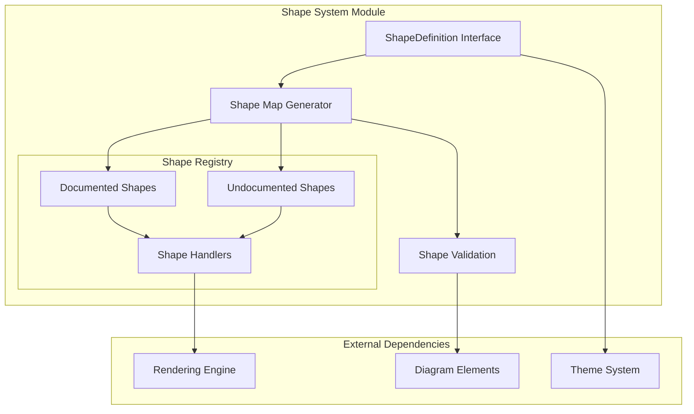
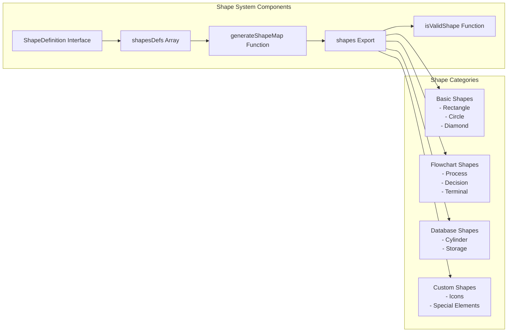
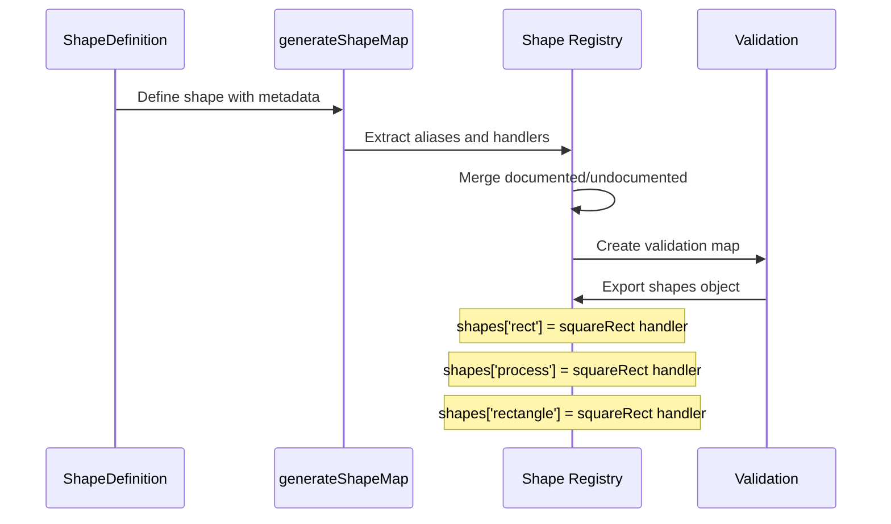
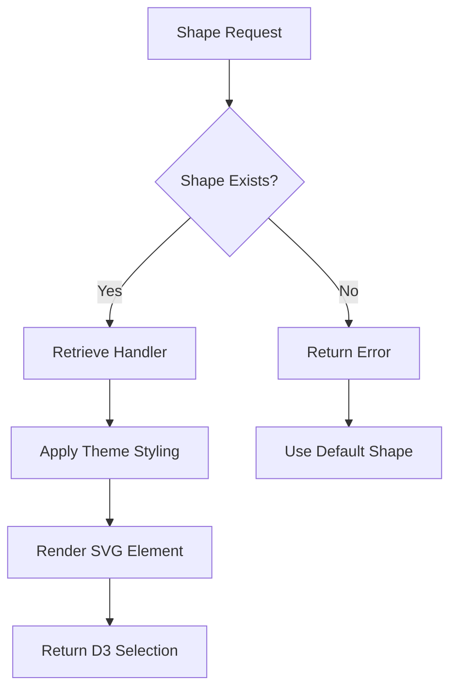
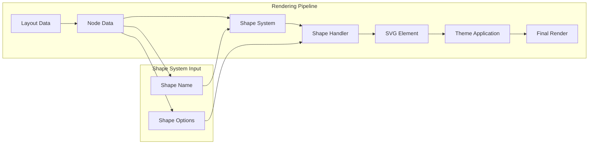

# Shape System Module Documentation

## Introduction

The shape-system module is a core component of the Mermaid rendering engine that provides a comprehensive library of visual shapes for diagram elements. It serves as the central registry and factory for all geometric shapes used across different diagram types, from basic rectangles and circles to specialized shapes like cylinders, hexagons, and custom flowchart symbols.

This module implements a flexible shape definition system that allows for semantic naming, multiple aliases, and extensible shape handlers, making it a critical foundation for the rendering capabilities of the entire Mermaid ecosystem.

## Architecture Overview

### Core Architecture



### Component Relationships



## Core Components

### ShapeDefinition Interface

The `ShapeDefinition` interface is the fundamental contract that defines how shapes are structured within the system:

```typescript
interface ShapeDefinition {
  semanticName: string;        // Human-readable semantic meaning
  name: string;                // Display name
  shortName: string;           // Primary identifier
  description: string;         // Detailed description
  aliases?: string[];          // User-facing alternative names
  internalAliases?: string[];  // Legacy/internal identifiers
  handler: ShapeHandler;       // Rendering function
}
```

### Shape Handler Type

Shape handlers are functions responsible for rendering individual shapes:

```typescript
type ShapeHandler = <T extends SVGGraphicsElement>(
  parent: D3Selection<T>,      // SVG container
  node: Node,                  // Node data
  options: ShapeRenderOptions  // Rendering options
) => MaybePromise<D3Selection<SVGGElement>>;
```

### Shape Registry System

The module maintains two distinct shape collections:

1. **Documented Shapes** (`shapesDefs`): 60+ officially supported shapes with comprehensive metadata
2. **Undocumented Shapes**: Specialized shapes for internal use and specific diagram types

## Data Flow

### Shape Registration Process



### Shape Resolution Flow



## Shape Categories

### Basic Geometric Shapes
- **Rectangle Family**: `squareRect`, `roundedRect`, `multiRect`
- **Circular Family**: `circle`, `doublecircle`, `filledCircle`
- **Triangular Family**: `triangle`, `flippedTriangle`, `trapezoid`

### Flowchart-Specific Shapes
- **Process Elements**: Process, Terminal, Decision, Subprocess
- **Data Elements**: Input/Output, Database, Document, Storage
- **Control Elements**: Start, Stop, Fork/Join, Manual Operations

### Specialized Diagram Shapes
- **State Diagrams**: `state`, `stateStart`, `stateEnd`, `choice`
- **Class Diagrams**: `classBox`
- **ER Diagrams**: `erBox`
- **Requirement Diagrams**: `requirementBox`
- **Kanban Boards**: `kanbanItem`

### Icon and Symbol Shapes
- **Icon Variants**: `iconSquare`, `iconCircle`, `iconRounded`
- **Special Symbols**: `anchor`, `lightningBolt`, `curlyBraces`

## Integration with Rendering Engine

### Shape System in Rendering Pipeline



### Theme Integration

The shape system works closely with the [theme-system](theme-system.md) to apply consistent styling:

- Shape colors and borders
- Text styling within shapes
- Hover and interaction effects
- Responsive sizing behavior

## Usage Patterns

### Basic Shape Usage

```typescript
// Shape lookup and validation
if (isValidShape(shapeName)) {
  const handler = shapes[shapeName];
  const shapeElement = await handler(parent, node, options);
}
```

### Alias Resolution

The system supports multiple naming conventions:
- **Short names**: `rect`, `circ`, `diam`
- **Semantic names**: `process`, `decision`, `terminal`
- **Legacy aliases**: `squareRect`, `roundedRect`
- **User aliases**: `rectangle`, `diamond`, `circle`

## Extension Points

### Adding New Shapes

To add a new shape to the system:

1. **Create Shape Handler**: Implement the `ShapeHandler` function
2. **Define Metadata**: Create `ShapeDefinition` with semantic information
3. **Register Shape**: Add to appropriate array (`shapesDefs` or undocumented shapes)
4. **Update Types**: Ensure `ShapeID` type includes new shape

### Custom Shape Categories

The modular design allows for:
- Domain-specific shape collections
- Custom styling and behavior
- Integration with specialized diagram types
- Theme-aware rendering

## Dependencies

### Internal Dependencies
- [Rendering Engine](rendering-engine.md): Provides rendering context and utilities
- [Theme System](theme-system.md): Supplies styling and visual properties
- [Utility Functions](utility-functions.md): Offers helper functions like ID generation

### External Dependencies
- **D3.js**: SVG manipulation and selection
- **TypeScript**: Type safety and development experience

## Performance Considerations

### Optimization Strategies

1. **Lazy Loading**: Shape handlers are loaded on-demand
2. **Shape Caching**: Rendered shapes can be cached for reuse
3. **Alias Mapping**: Efficient lookup through pre-computed maps
4. **Type Safety**: Compile-time validation reduces runtime errors

### Memory Management

- Shape definitions are immutable after creation
- Handler functions are shared across instances
- SVG elements are managed by D3's lifecycle

## Error Handling

### Shape Validation

The `isValidShape` function provides runtime validation:
- Prevents undefined shape errors
- Enables graceful fallbacks
- Supports dynamic shape selection

### Fallback Mechanisms

When shapes are not found:
- Default to basic rectangle
- Log warning for debugging
- Continue rendering process

## Future Enhancements

### Planned Features

1. **Shape Animation**: Support for enter/exit transitions
2. **Responsive Shapes**: Adaptive sizing based on content
3. **Shape Composition**: Combine multiple shapes
4. **Custom Shape Builder**: Runtime shape creation
5. **Shape Validation**: Content-aware sizing and positioning

### API Evolution

The shape system is designed to be:
- **Backward Compatible**: Existing shapes remain unchanged
- **Extensible**: New shapes can be added without breaking changes
- **Type Safe**: TypeScript ensures compile-time correctness
- **Performance Focused**: Minimal runtime overhead

## Conclusion

The shape-system module serves as the visual foundation of the Mermaid rendering engine, providing a rich library of shapes that can be consistently styled, efficiently rendered, and easily extended. Its flexible architecture supports the diverse visual requirements of different diagram types while maintaining performance and type safety throughout the system.

The modular design enables independent evolution of shape definitions, rendering logic, and styling systems, making it a robust and maintainable component of the overall Mermaid architecture.