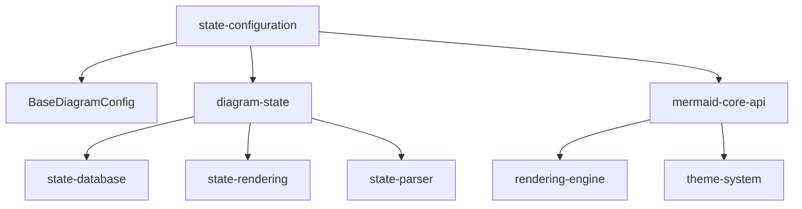
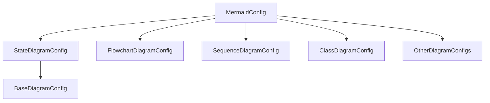
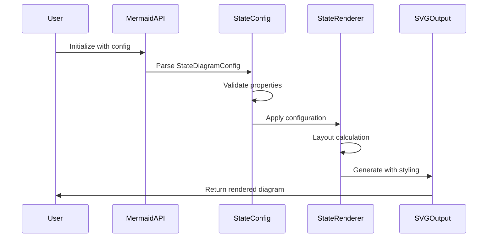
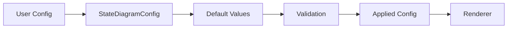

# State Configuration Module Documentation

## Introduction

The state-configuration module is a specialized configuration component within the Mermaid diagramming library that manages configuration options specifically for state diagrams. It provides a comprehensive set of properties and settings that control the appearance, layout, and behavior of state diagrams, including node spacing, dimensions, fonts, and rendering preferences.

## Module Overview

The state-configuration module is part of the larger [diagram-state](diagram-state.md) module ecosystem and provides the `StateDiagramConfig` interface, which extends the base diagram configuration with state-specific settings. This module is automatically generated from JSON Schema definitions and serves as the authoritative source for state diagram configuration options.

## Core Components

### StateDiagramConfig Interface

The primary component of this module is the `StateDiagramConfig` interface, which extends `BaseDiagramConfig` to provide state diagram-specific configuration options:

```typescript
export interface StateDiagramConfig extends BaseDiagramConfig {
  titleTopMargin?: number;
  arrowMarkerAbsolute?: boolean;
  dividerMargin?: number;
  sizeUnit?: number;
  padding?: number;
  textHeight?: number;
  titleShift?: number;
  noteMargin?: number;
  nodeSpacing?: number;
  rankSpacing?: number;
  forkWidth?: number;
  forkHeight?: number;
  miniPadding?: number;
  fontSizeFactor?: number;
  fontSize?: number;
  labelHeight?: number;
  edgeLengthFactor?: string;
  compositTitleSize?: number;
  radius?: number;
  defaultRenderer?: 'dagre-d3' | 'dagre-wrapper' | 'elk';
}
```

## Architecture

### Module Dependencies

The state-configuration module integrates with several other modules in the Mermaid ecosystem:



### Configuration Hierarchy



## Configuration Properties

### Layout and Spacing

| Property | Type | Description |
|----------|------|-------------|
| `nodeSpacing` | number | Defines spacing between nodes on the same level |
| `rankSpacing` | number | Defines spacing between nodes on different levels |
| `padding` | number | Internal padding for diagram elements |
| `miniPadding` | number | Minimum padding for compact elements |
| `dividerMargin` | number | Margin around divider elements |
| `noteMargin` | number | Margin around notes and annotations |

### Dimensions and Sizing

| Property | Type | Description |
|----------|------|-------------|
| `sizeUnit` | number | Base unit for sizing calculations |
| `forkWidth` | number | Width of fork/join elements |
| `forkHeight` | number | Height of fork/join elements |
| `textHeight` | number | Height allocated for text elements |
| `labelHeight` | number | Height for label elements |
| `radius` | number | Corner radius for rounded elements |

### Typography and Fonts

| Property | Type | Description |
|----------|------|-------------|
| `fontSize` | number | Base font size for diagram text |
| `fontSizeFactor` | number | Scaling factor for font size calculations |
| `compositTitleSize` | number | Font size for composite state titles |
| `titleTopMargin` | number | Margin above title elements |
| `titleShift` | number | Horizontal shift for title positioning |

### Rendering Options

| Property | Type | Description |
|----------|------|-------------|
| `defaultRenderer` | string | Rendering engine selection ('dagre-d3', 'dagre-wrapper', 'elk') |
| `arrowMarkerAbsolute` | boolean | Controls arrow marker path type |
| `edgeLengthFactor` | string | Factor for edge length calculations |

## Data Flow

### Configuration Application Flow



### Configuration Resolution Process



## Integration Points

### With State Database Module

The configuration module works closely with the [state-database](state-database.md) module to ensure that configuration settings are properly applied to state elements:

- Node spacing affects state positioning in the database
- Font settings influence text storage and measurement
- Dimension properties constrain element sizing

### With State Rendering Module

Configuration properties directly influence the [state-rendering](state-rendering.md) module:

- `defaultRenderer` determines which rendering engine to use
- Spacing properties affect layout calculations
- Font settings control text rendering
- Dimension properties constrain SVG element sizes

### With Core API

The state-configuration module integrates with the [mermaid-core-api](mermaid-core-api.md) through:

- Inheritance from `BaseDiagramConfig`
- Participation in the main `MermaidConfig` interface
- Configuration validation and type safety

## Usage Examples

### Basic Configuration

```javascript
mermaid.initialize({
  state: {
    nodeSpacing: 50,
    rankSpacing: 80,
    fontSize: 14,
    defaultRenderer: 'dagre-wrapper'
  }
});
```

### Advanced Layout Configuration

```javascript
mermaid.initialize({
  state: {
    nodeSpacing: 60,
    rankSpacing: 100,
    forkWidth: 150,
    forkHeight: 50,
    padding: 20,
    miniPadding: 5,
    fontSizeFactor: 1.2,
    edgeLengthFactor: '1.5'
  }
});
```

### Typography Configuration

```javascript
mermaid.initialize({
  state: {
    fontSize: 16,
    fontSizeFactor: 1.1,
    compositTitleSize: 18,
    textHeight: 20,
    labelHeight: 16,
    titleTopMargin: 10,
    titleShift: 5
  }
});
```

## Best Practices

### Performance Optimization

1. **Use appropriate spacing values**: Excessive spacing can lead to large diagrams and poor performance
2. **Choose the right renderer**: Different renderers have different performance characteristics
3. **Optimize font settings**: Use consistent font sizes to improve rendering speed

### Visual Consistency

1. **Maintain proportional spacing**: Keep `nodeSpacing` and `rankSpacing` in reasonable proportions
2. **Use consistent fonts**: Apply consistent font families and sizes across diagram types
3. **Consider diagram size**: Adjust `sizeUnit` based on expected diagram complexity

### Configuration Management

1. **Override selectively**: Only override configuration values that need customization
2. **Document custom settings**: Maintain documentation of non-default configurations
3. **Test across renderers**: Verify appearance with different `defaultRenderer` settings

## Related Modules

- [diagram-state](diagram-state.md) - Parent module containing state diagram functionality
- [state-database](state-database.md) - State data storage and management
- [state-rendering](state-rendering.md) - State diagram rendering engine
- [state-parser](state-parser.md) - State diagram syntax parsing
- [mermaid-core-api](mermaid-core-api.md) - Core API and base configurations
- [rendering-engine](rendering-engine.md) - General rendering utilities
- [theme-system](theme-system.md) - Visual theming and styling

## API Reference

### StateDiagramConfig Interface

Extends `BaseDiagramConfig` with state diagram-specific properties.

**Inherited Properties:**
- `useWidth?: number` - Width constraint for the diagram
- `useMaxWidth?: boolean` - Whether to use maximum available width

**State-Specific Properties:**
- All properties listed in the Configuration Properties section above

### Type Definitions

The module exports TypeScript interfaces that provide:
- Type safety for configuration objects
- IntelliSense support in IDEs
- Compile-time validation of configuration properties
- Documentation through type annotations

## Migration Guide

### From Legacy Configuration

When migrating from older Mermaid versions:

1. **Review property names**: Some configuration properties may have been renamed
2. **Check default values**: Default values may have changed between versions
3. **Validate renderer selection**: Ensure `defaultRenderer` is set to a supported value
4. **Test spacing values**: Layout algorithms may have changed, affecting spacing calculations

### Version Compatibility

The `StateDiagramConfig` interface is designed to be backward compatible while allowing for new features. Always refer to the latest documentation for newly added properties and deprecated features.