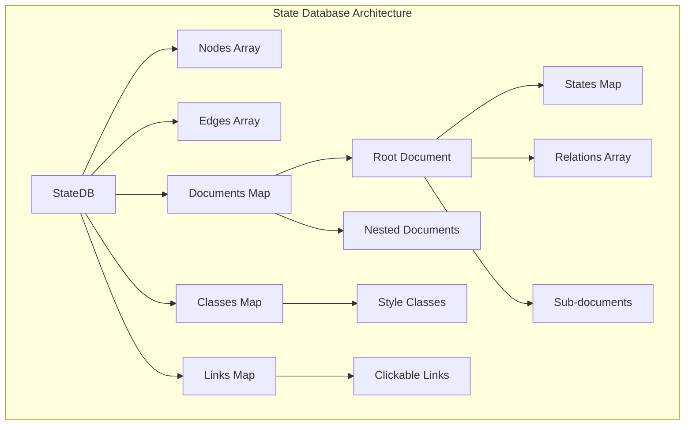
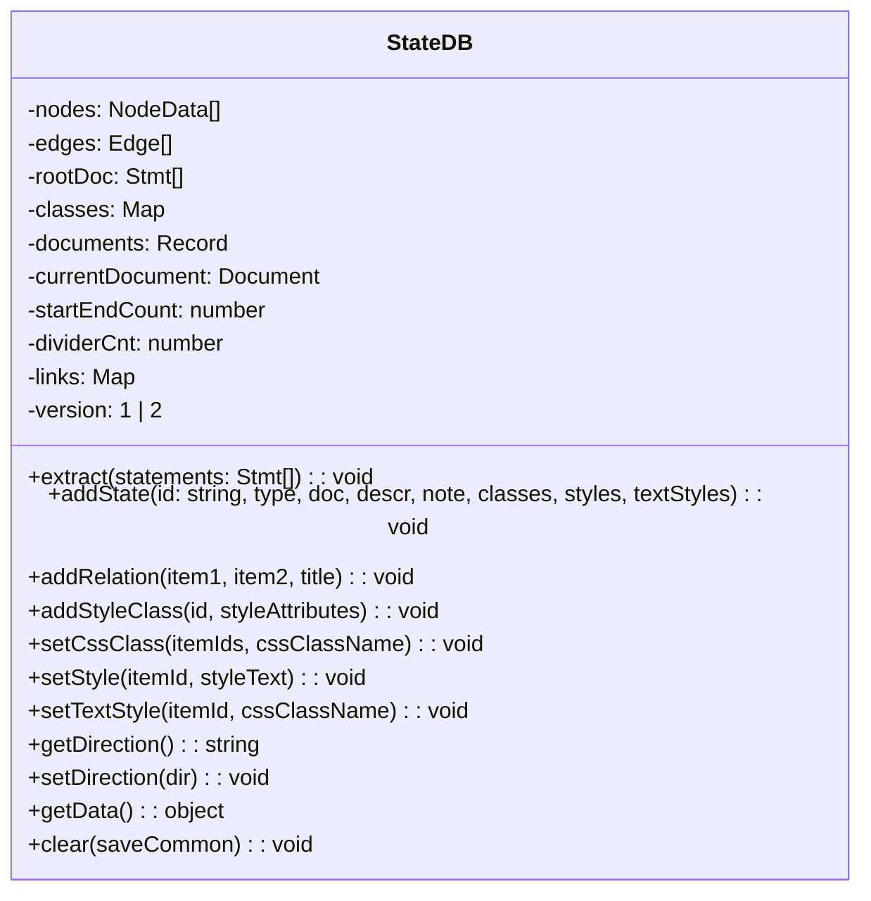
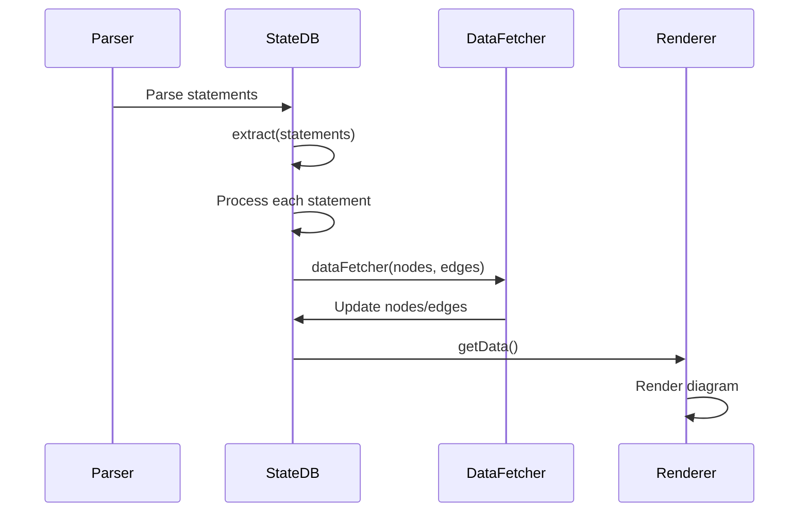
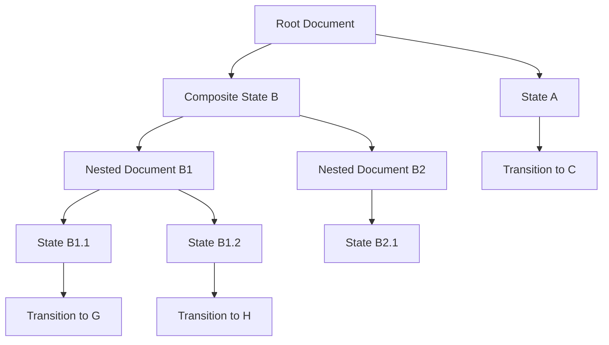
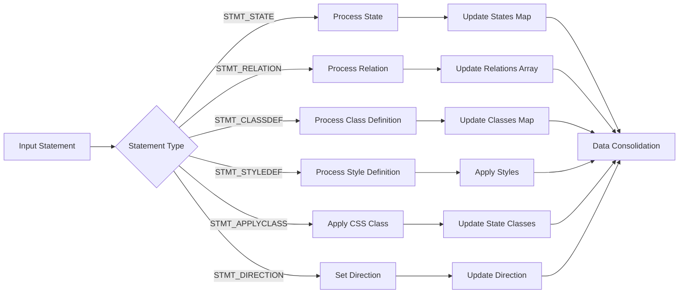

# State Database Module Documentation

## Introduction

The state-database module is the core data management component for Mermaid's state diagrams. It provides a comprehensive database system that handles the storage, manipulation, and retrieval of state diagram elements including states, transitions, relationships, and styling information. This module serves as the central repository for all state diagram data, enabling the parser, renderer, and other components to interact with state diagram definitions in a structured and efficient manner.

## Architecture Overview

The state-database module implements a hierarchical document-based architecture that mirrors the nested structure of state diagrams. It maintains separate storage for different diagram elements and provides a rich API for data manipulation and retrieval.



## Core Components

### StateDB Class

The `StateDB` class is the central component that manages all state diagram data. It provides methods for adding states, creating relationships, managing styles, and handling document hierarchies.

**Key Responsibilities:**
- State management and storage
- Relationship handling between states
- Style and class management
- Document hierarchy maintenance
- Data extraction and transformation



### StateStmt Interface

The `StateStmt` interface defines the structure of state statements within the database. It represents individual states with their properties, descriptions, and nested content.

**Properties:**
- `id`: Unique identifier for the state
- `type`: State type (default, fork, join, choice, divider, start, end)
- `description`: State description text
- `descriptions`: Array of description strings
- `doc`: Nested statements for composite states
- `note`: Attached note information
- `classes`: Applied CSS classes
- `styles`: Inline styles
- `textStyles`: Text-specific styles

### Edge Interface

The `Edge` interface represents transitions and relationships between states, containing styling and layout information.

**Properties:**
- `id`: Unique edge identifier
- `start`: Source state ID
- `end`: Target state ID
- `arrowhead`: Arrowhead style
- `style`: Edge styling
- `label`: Transition label
- `thickness`: Edge thickness
- `classes`: Applied CSS classes

## Data Flow Architecture



## Document Hierarchy System

The state-database implements a sophisticated document hierarchy system that handles nested state structures, including composite states, forks, and joins.



## Statement Processing Pipeline

The module processes various types of statements through a unified pipeline:



## Integration with Other Modules

The state-database module integrates with several other system components:

### Parser Engine Integration
- Receives parsed statements from the [parser_engine](parser_engine.md)
- Processes statement types defined in `stateCommon.js`
- Handles syntax validation and error reporting

### Rendering Engine Integration
- Provides structured data to the [rendering_engine](rendering_engine.md)
- Exports nodes and edges with styling information
- Supports theme integration through the [theme-system](theme-system.md)

### Configuration Integration
- Works with [state-configuration](state-configuration.md) for diagram settings
- Applies global configuration from [mermaid-core](mermaid-core.md)
- Supports diagram-specific styling options

## Data Structures and Storage

### NodeData Structure
```typescript
interface NodeData {
    labelStyle?: string;
    shape: string;
    label?: string | string[];
    cssClasses: string;
    cssCompiledStyles?: string[];
    cssStyles: string[];
    id: string;
    dir?: string;
    domId?: string;
    type?: string;
    isGroup?: boolean;
    padding?: number;
    rx?: number;
    ry?: number;
    look?: MermaidConfig['look'];
    parentId?: string;
    centerLabel?: boolean;
    position?: string;
    description?: string | string[];
}
```

### Document Structure
```typescript
interface Document {
    relations: DiagramEdge[];
    states: Map<string, StateStmt>;
    documents: Record<string, Document>;
}
```

## Key Features

### 1. Hierarchical State Management
- Supports nested composite states
- Handles concurrent regions (fork/join)
- Manages state inheritance and containment

### 2. Flexible Styling System
- CSS class application
- Inline style definitions
- Text-specific styling
- Theme integration

### 3. Relationship Handling
- Bidirectional relationship support
- Transition labeling
- Arrowhead customization
- Relationship styling

### 4. Document Versioning
- Supports multiple diagram versions (v1, v2)
- Backward compatibility maintenance
- Version-specific processing logic

## API Reference

### Core Methods

#### `extract(statements: Stmt[] | { doc: Stmt[] }): void`
Processes parsed statements and builds the internal data structure.

#### `addState(id, type, doc, descr, note, classes, styles, textStyles): void`
Adds a new state to the database with comprehensive styling options.

#### `addRelation(item1, item2, title): void`
Creates a relationship between two states with optional transition label.

#### `addStyleClass(id, styleAttributes): void`
Defines a reusable style class that can be applied to multiple states.

#### `getData(): object`
Returns the complete diagram data structure for rendering.

### Utility Methods

#### `setDirection(dir): void`
Sets the diagram layout direction (TB, BT, RL, LR).

#### `getDirection(): string`
Retrieves the current diagram direction.

#### `clear(saveCommon): void`
Resets the database, optionally preserving common elements.

## Error Handling

The module implements comprehensive error handling for:
- Invalid state references
- Circular dependencies
- Style parsing errors
- Document structure validation

## Performance Considerations

- Efficient Map-based state storage for O(1) lookups
- Lazy evaluation of complex state hierarchies
- Optimized relationship processing
- Memory-efficient document cloning

## Usage Examples

### Basic State Creation
```typescript
const stateDB = new StateDB(2);
stateDB.addState('Idle', 'default', undefined, 'System is idle');
stateDB.addState('Active', 'default', undefined, 'System is active');
stateDB.addRelation('Idle', 'Active', 'start');
```

### Composite State with Nested Documents
```typescript
stateDB.addState('CompositeState', 'default', [
    { stmt: 'state', id: 'SubState1' },
    { stmt: 'state', id: 'SubState2' }
]);
```

### Style Class Definition and Application
```typescript
stateDB.addStyleClass('highlight', 'fill:#ff0,stroke:#000');
stateDB.setCssClass('Idle', 'highlight');
```

## Conclusion

The state-database module provides a robust foundation for state diagram processing in Mermaid. Its hierarchical document system, comprehensive styling capabilities, and efficient data structures make it suitable for handling complex state diagrams while maintaining performance and extensibility. The module's design enables seamless integration with other system components while providing a clean API for diagram manipulation and data retrieval.