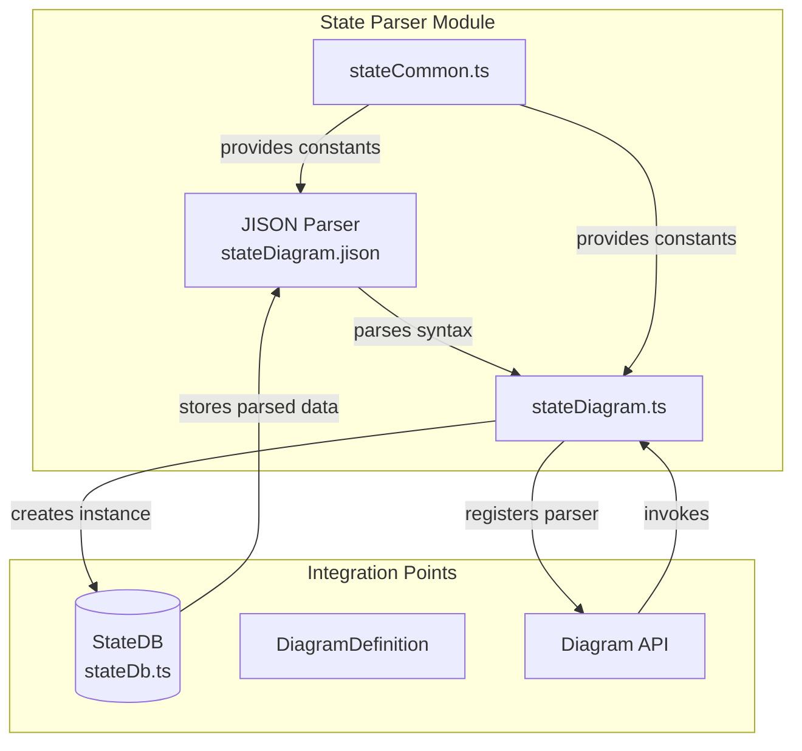
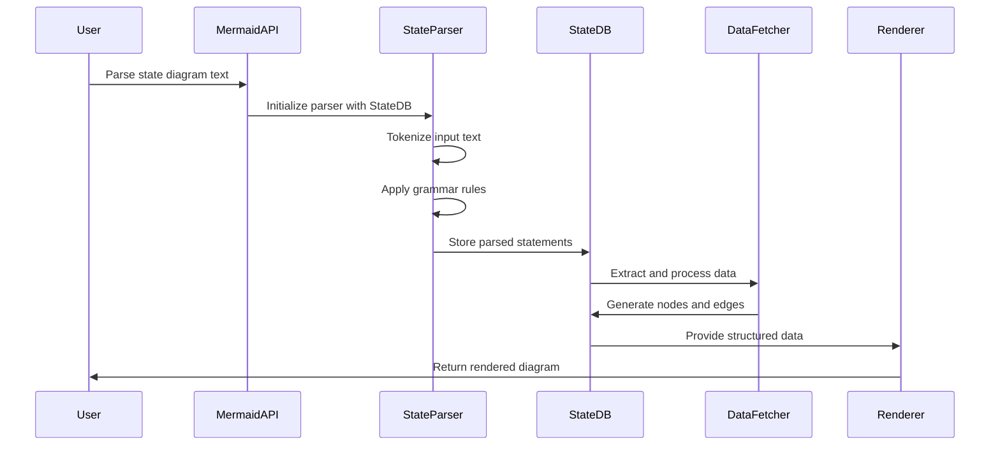
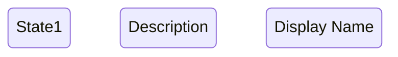
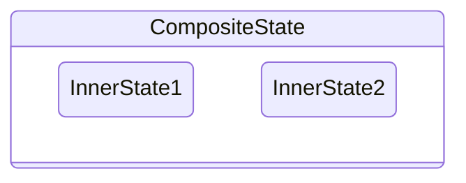
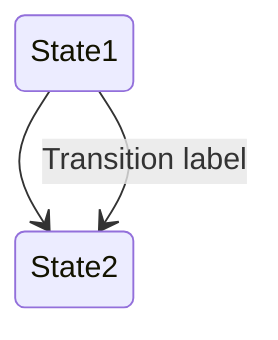
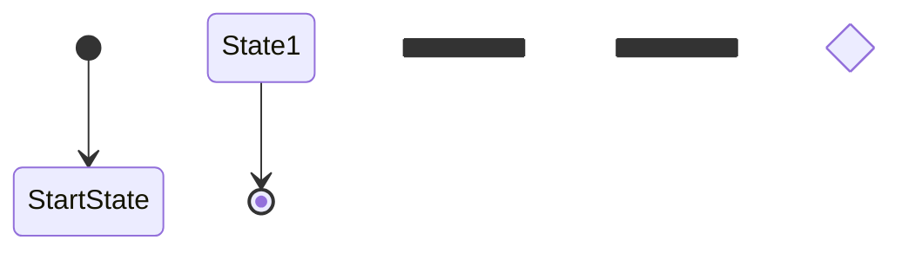

# State Parser Module Documentation

## Introduction

The state-parser module is a core component of the Mermaid state diagram system, responsible for parsing state diagram syntax and converting text-based diagram definitions into structured data. It implements a JISON-based grammar parser that processes state diagram declarations, state definitions, transitions, and styling information.

The parser serves as the entry point for state diagram processing, transforming human-readable diagram syntax into an abstract syntax tree (AST) that can be rendered into visual diagrams. It supports complex state diagram features including composite states, concurrent states, forks/joins, notes, and styling directives.

## Architecture Overview

The state-parser module operates as part of the larger [diagram-state](diagram-state.md) module ecosystem, integrating with the state database ([state-database](state-database.md)) and rendering system ([state-rendering](state-rendering.md)).



## Core Components

### JISON Grammar Parser (`stateDiagram.jison`)

The heart of the state parser is a JISON-based grammar definition that specifies the syntax rules for state diagrams. The parser uses lexical analysis and grammar rules to tokenize and parse diagram text.

**Key Features:**
- **Lexical States**: Uses multiple lexical states (`ID`, `STATE`, `FORK_STATE`, `STATE_STRING`, etc.) to handle different parsing contexts
- **Token Recognition**: Identifies keywords (`state`, `stateDiagram`, `note`, `classDef`, etc.), operators (`-->`, `:::`, etc.), and literals
- **Grammar Rules**: Defines the structure for valid state diagram syntax
- **Error Handling**: Provides syntax error detection and reporting

**Lexical Analysis States:**
```jison
%x ID
%x STATE
%x FORK_STATE
%x STATE_STRING
%x STATE_ID
%x ALIAS
%x SCALE
%x acc_title
%x acc_descr
%x CLASSDEF
%x CLASS
%x STYLE
```

### State Common Constants (`stateCommon.ts`)

Provides shared constants and configuration used throughout the state diagram system.

**Key Constants:**
- **Statement Types**: `STMT_STATE`, `STMT_RELATION`, `STMT_CLASSDEF`, `STMT_DIRECTION`
- **Shape Definitions**: `SHAPE_STATE`, `SHAPE_START`, `SHAPE_END`, `SHAPE_DIVIDER`
- **CSS Classes**: `CSS_DIAGRAM`, `CSS_STATE`, `CSS_EDGE`, `CSS_NOTE`
- **Default Values**: `DEFAULT_DIAGRAM_DIRECTION`, `DEFAULT_STATE_TYPE`

### State Diagram Definition (`stateDiagram.ts`)

The main integration point that registers the parser with the Mermaid diagram system.

**Responsibilities:**
- Parser registration with the diagram API
- StateDB instance creation and configuration
- Style and renderer integration
- Configuration initialization

## Parser Grammar Specification

### Document Structure

The parser recognizes the following high-level document structure:

```jison
start
    : SPACE start
    | NL start
    | SD document { yy.setRootDoc($2); return $2; }
    ;

document
    : /* empty */ { $$ = [] }
    | document line {
        if($2 !='nl'){
            $1.push($2); $$ = $1
        }
    }
    ;
```

### Statement Types

The parser supports multiple statement types, each handled by specific grammar rules:

#### State Definitions
```jison
statement
    : idStatement 
    | idStatement DESCR 
    | COMPOSIT_STATE STRUCT_START document STRUCT_STOP
    | STATE_DESCR AS ID 
    | STATE_DESCR AS ID STRUCT_START document STRUCT_STOP
    | FORK 
    | JOIN 
    | CHOICE 
    | CONCURRENT 
```

#### State Relationships
```jison
statement
    : idStatement '-->' idStatement
    | idStatement '-->' idStatement DESCR
```

#### Styling and Classes
```jison
statement
    : classDefStatement
    | styleStatement  
    | cssClassStatement
```

#### Notes and Annotations
```jison
statement
    : note notePosition ID NOTE_TEXT
    | note NOTE_TEXT AS ID
```

### Lexical Token Recognition

The parser uses sophisticated token recognition patterns:

**Keywords and Operators:**
- `stateDiagram` / `stateDiagram-v2`: Diagram type declaration
- `state`: State definition keyword
- `-->`: Transition arrow
- `:::`, `::`: Style separators
- `note`: Note annotation keyword
- `classDef` / `style`: Styling keywords

**Special State Types:**
- `<<fork>>` / `[[fork]]`: Fork states
- `<<join>>` / `[[join]]`: Join states  
- `<<choice>>` / `[[choice]]`: Choice states
- `[*]`: Start/end states

**Direction Control:**
- `direction TB` / `direction BT` / `direction RL` / `direction LR`

## Data Flow Architecture



## Integration with State Database

The parser integrates closely with the [StateDB](state-database.md) class to store and manage parsed diagram data.

### Statement Processing

The `extract()` method in StateDB processes parsed statements:

```typescript
extract(statements: Stmt[] | { doc: Stmt[] }) {
  for (const item of Array.isArray(statements) ? statements : statements.doc) {
    switch (item.stmt) {
      case STMT_STATE:
        this.addState(item.id.trim(), item.type, item.doc, item.description, item.note);
        break;
      case STMT_RELATION:
        this.addRelation(item.state1, item.state2, item.description);
        break;
      case STMT_CLASSDEF:
        this.addStyleClass(item.id.trim(), item.classes);
        break;
      // ... other cases
    }
  }
}
```

### Data Structure Mapping

Parsed statements are converted to internal data structures:

- **StateStmt**: Individual state definitions with type, description, and nested documents
- **RelationStmt**: State-to-state transitions with optional descriptions  
- **ClassDefStmt**: CSS class definitions for styling
- **StyleStmt**: Style application to specific elements

## Error Handling and Validation

The parser implements several levels of error handling:

### Syntax Error Detection
- Invalid token sequences trigger parser errors
- Missing required elements (brackets, quotes) are detected
- Malformed relationships are identified

### Semantic Validation
- Duplicate state IDs are handled
- Invalid state references in relationships are caught
- Style class validation occurs during processing

### Recovery Mechanisms
- The parser attempts to continue parsing after non-fatal errors
- Partial diagrams can be processed even with some invalid elements
- Error messages provide context for debugging

## Supported Syntax Features

### Basic State Definitions


### Composite States


### State Relationships


### Special State Types


### Styling and Classes
```mermaid
stateDiagram-v2
    classDef myClass fill:#f9f,stroke:#333,stroke-width:4px
    style State1 fill:#bbf,stroke:#f66,stroke-width:2px,color:#fff
```

### Notes and Annotations
```mermaid
stateDiagram-v2
    State1: Note right of State1
    note right of State2 : This is a note
```

## Performance Considerations

### Parser Optimization
- **Lexical State Management**: Efficient state transitions minimize parsing overhead
- **Token Caching**: Repeated patterns are recognized efficiently
- **Grammar Simplification**: Optimized grammar rules reduce parsing complexity

### Memory Management
- **Incremental Processing**: Large diagrams are processed incrementally
- **Garbage Collection**: Temporary parsing objects are properly cleaned up
- **Data Structure Efficiency**: Optimized internal representations minimize memory usage

### Scalability Features
- **Nested Document Support**: Composite states are handled without performance degradation
- **Parallel Processing**: Independent diagram sections can be processed concurrently
- **Caching Mechanisms**: Parsed results can be cached for repeated rendering

## Testing and Validation

The parser includes comprehensive test coverage through the `state-parser.spec.js` file, validating:

- **Basic Syntax**: State definitions, relationships, and descriptions
- **Complex Structures**: Composite states, nested documents, and special state types
- **Edge Cases**: Empty states, special characters, and boundary conditions
- **Error Scenarios**: Invalid syntax, malformed relationships, and missing elements

## Dependencies and Integration

### Internal Dependencies
- **[stateCommon](stateCommon.ts)**: Shared constants and configuration
- **[stateDb](state-database.md)**: Data storage and management
- **[dataFetcher](state-rendering.md#data-fetcher)**: Data extraction and processing

### External Dependencies
- **JISON Parser Generator**: Grammar compilation and parsing engine
- **Mermaid Core API**: Diagram registration and lifecycle management
- **Configuration System**: Diagram-specific configuration handling

### Module Integration
The state parser integrates with the broader Mermaid ecosystem:

- **[diagram_plugin_api](diagram_plugin_api.md)**: Standard diagram interface compliance
- **[mermaid_core_api](mermaid_core_api.md)**: Core API integration and registration
- **[rendering_engine](rendering_engine.md)**: Rendering pipeline integration

## Future Enhancements

### Planned Improvements
- **Enhanced Error Reporting**: More detailed syntax error messages with suggestions
- **Performance Optimization**: Faster parsing for large and complex diagrams
- **Extended Syntax Support**: Additional state diagram notation standards
- **Validation Framework**: Comprehensive semantic validation beyond syntax checking

### Extension Points
- **Custom State Types**: Plugin architecture for user-defined state types
- **Advanced Styling**: Enhanced CSS and theming capabilities
- **Interactive Features**: Click handlers and dynamic behavior support
- **Export Capabilities**: Multiple output format support

## Conclusion

The state-parser module is a sophisticated and robust component that forms the foundation of Mermaid's state diagram capabilities. Its JISON-based grammar engine, comprehensive syntax support, and tight integration with the broader diagram system make it capable of handling complex state modeling requirements while maintaining performance and reliability.

The modular design allows for easy extension and maintenance, while the comprehensive test suite ensures stability across different use cases and edge conditions. As state diagrams continue to evolve as a modeling standard, the parser provides a solid foundation for future enhancements and capabilities.