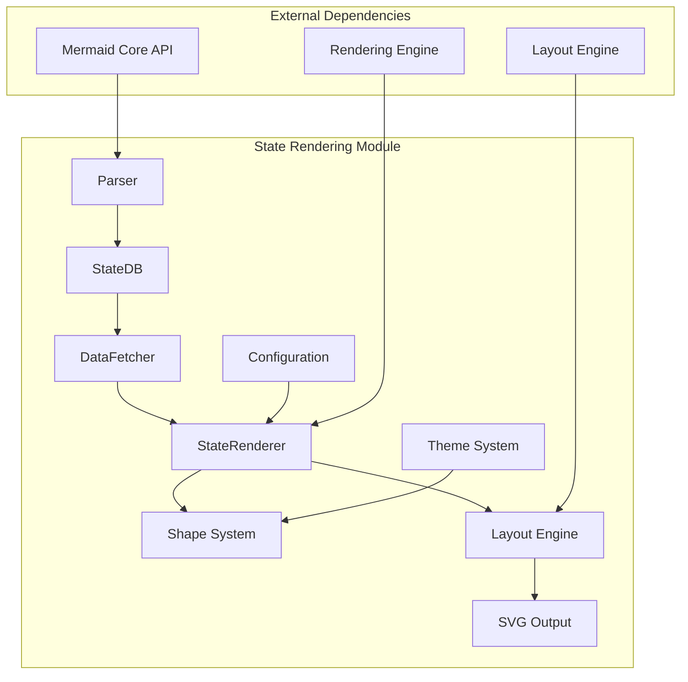
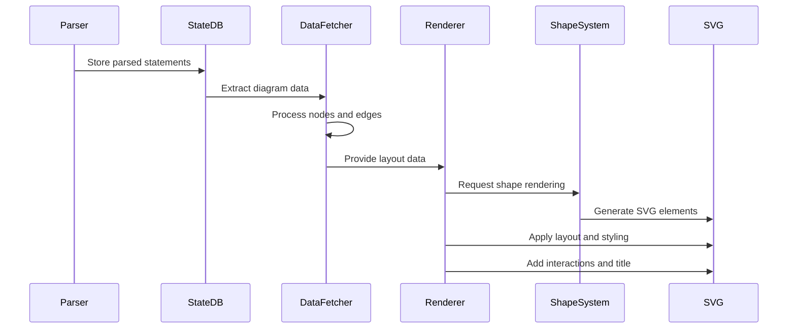
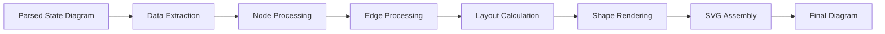
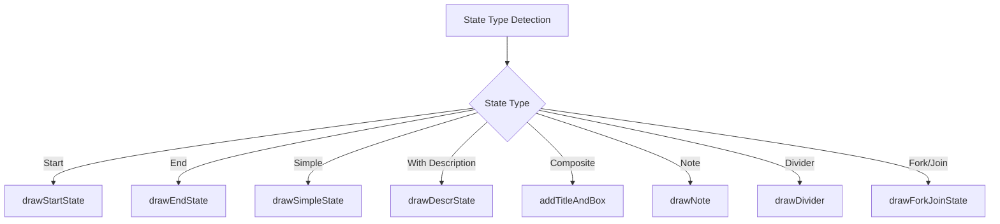
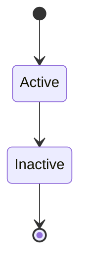
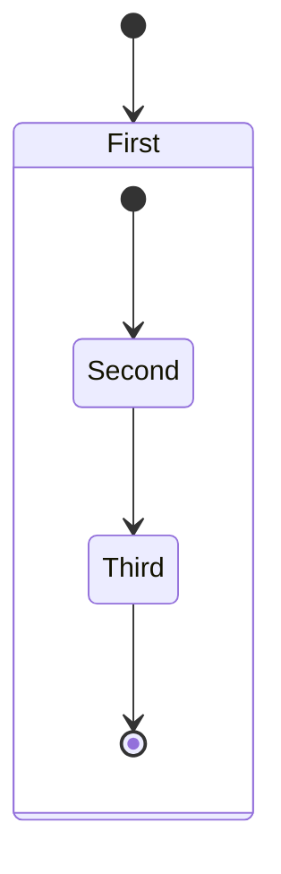
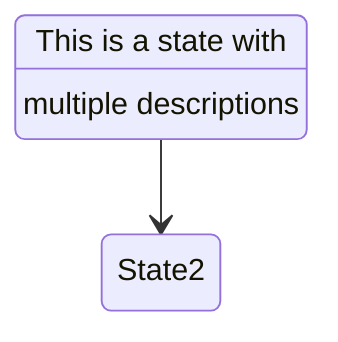

# State Rendering Module Documentation

## Introduction

The state-rendering module is a core component of the Mermaid diagramming library, responsible for rendering state diagrams. State diagrams are used to model the dynamic behavior of systems, showing how objects change their states in response to events. This module transforms parsed state diagram syntax into visual representations using SVG elements.

The module provides comprehensive functionality for rendering various state types, transitions, composite states, and annotations, making it suitable for modeling complex system behaviors, user interface flows, and business processes.

## Architecture Overview

The state-rendering module follows a layered architecture that separates concerns between data processing, layout calculation, and visual rendering:

## Core Components

### 1. Data Fetcher (`dataFetcher.ts`)

The data fetcher is responsible for transforming parsed state diagram data into a format suitable for rendering. It processes the abstract syntax tree (AST) and creates node and edge data structures that can be consumed by the rendering engine.

**Key Responsibilities:**
- Convert parsed state statements into node data structures
- Handle different state types (start, end, composite, notes, dividers)
- Process state relationships and transitions
- Manage CSS classes and styling information
- Handle nested document structures for composite states

**Key Functions:**
- `dataFetcher()`: Main function that processes parsed items and creates node/edge data
- `setupDoc()`: Recursively processes document structures for composite states
- `insertOrUpdateNode()`: Manages node creation and updates with styling information
- `stateDomId()`: Generates unique DOM identifiers for state elements

### 2. State Renderer (`stateRenderer-v3-unified.ts`)

The unified state renderer is the main rendering engine that coordinates the transformation of layout data into visual SVG elements. It integrates with the core rendering engine and handles state-specific rendering requirements.

**Key Responsibilities:**
- Coordinate the overall rendering process
- Extract data from the state database
- Configure layout parameters (spacing, direction, markers)
- Handle clickable links and interactions
- Manage viewport setup and diagram sizing
- Inject titles and accessibility features

**Key Functions:**
- `draw()`: Main rendering function that orchestrates the entire process
- `getClasses()`: Retrieves CSS class definitions for styling
- `getDir()`: Determines diagram direction from parsed data

### 3. Shape System (`shapes.js`)

The shape system provides specialized drawing functions for different state diagram elements. Each function is responsible for creating the appropriate SVG elements for specific state types.

**Key Responsibilities:**
- Draw different state shapes (start, end, simple, composite)
- Render state descriptions and dividers
- Create notes and annotations
- Handle text rendering and positioning
- Manage shape styling and attributes

**Key Functions:**
- `drawStartState()`: Renders start state as a black circle
- `drawEndState()`: Renders end state as a double circle
- `drawSimpleState()`: Renders basic rectangular states
- `drawDescrState()`: Renders states with descriptions
- `addTitleAndBox()`: Creates composite state containers
- `drawNote()`: Renders note annotations
- `drawEdge()`: Creates transition arrows and labels

## Data Flow

## Component Interactions

### Rendering Pipeline

### State Type Handling

## Integration with Core Systems

### Rendering Engine Integration

The state-rendering module integrates with the core rendering engine through the unified renderer interface:

- **Layout Data Format**: Conforms to the standard `LayoutData` interface used across all diagram types
- **Node Structure**: Uses `BaseNode` and `Edge` types from the rendering utilities
- **Shape Definitions**: Leverages the shape system for consistent visual elements
- **Theme Support**: Integrates with the theme system for consistent styling

### Configuration System

The module integrates with Mermaid's configuration system to support customizable rendering:

- **State-specific Settings**: Node spacing, rank spacing, font sizes, padding
- **Layout Options**: Direction, algorithm selection, marker configuration
- **Styling**: CSS classes, color schemes, shape properties

### Database Integration

The module works closely with the state database (`StateDB`) to:

- Extract parsed diagram data
- Retrieve state relationships and properties
- Access styling and class information
- Handle composite state hierarchies

## Key Features

### State Types Support

1. **Basic States**: Simple rectangular states with optional descriptions
2. **Start/End States**: Circular indicators for diagram boundaries
3. **Composite States**: Nested state containers with titles
4. **Notes**: Annotation elements attached to states
5. **Dividers**: Horizontal separators within composite states
6. **Fork/Join**: Parallel execution indicators

### Advanced Features

1. **Hierarchical States**: Support for nested composite states
2. **Transitions**: Flexible arrow connections with labels
3. **Styling**: CSS class support for custom appearance
4. **Interactions**: Clickable links on state elements
5. **Accessibility**: Title and description support
6. **Responsive Layout**: Automatic sizing and positioning

### Styling and Theming

The module supports comprehensive styling through:

- **CSS Classes**: Custom class definitions and applications
- **Inline Styles**: Direct style application to elements
- **Theme Integration**: Consistent theming across diagram types
- **Shape Properties**: Configurable corner radius, padding, colors

## Dependencies

### Internal Dependencies

- **[diagram-state](../diagram-state.md)**: Parent module providing database and parser components
- **[rendering-engine](../rendering-engine.md)**: Core rendering infrastructure and utilities
- **[diagram-plugin-api](../diagram-plugin-api.md)**: Plugin interface and type definitions
- **[mermaid-core-api](../mermaid-core-api.md)**: Core API and configuration management

### External Dependencies

- **D3.js**: Used for curve calculations and path generation
- **SVG**: Native SVG manipulation for visual elements

## Usage Patterns

### Basic State Diagram

### Composite States

### States with Descriptions

## Error Handling

The module implements comprehensive error handling for:

- **Invalid State Data**: Graceful handling of malformed state definitions
- **Missing Dependencies**: Fallback rendering for incomplete data
- **SVG Generation**: Error recovery during element creation
- **Layout Issues**: Default positioning for problematic layouts

## Performance Considerations

### Optimization Strategies

1. **Node Caching**: Reuse of node data structures to minimize memory allocation
2. **Batch Processing**: Efficient processing of multiple states and transitions
3. **Lazy Rendering**: Deferred rendering of complex composite structures
4. **DOM Efficiency**: Minimized DOM manipulation through batch operations

### Scalability

The module is designed to handle:
- Large state diagrams with hundreds of states
- Deep nesting hierarchies in composite states
- Complex transition networks
- Multiple styling classes and customizations

## Future Enhancements

### Planned Improvements

1. **Enhanced Interactions**: Support for hover effects and animations
2. **Advanced Layouts**: Additional layout algorithms for complex diagrams
3. **Performance Optimization**: Further optimization for large diagrams
4. **Accessibility**: Enhanced screen reader support and keyboard navigation

### Extension Points

The modular architecture supports:
- Custom shape definitions
- Additional state types
- New layout algorithms
- Enhanced styling mechanisms

## Conclusion

The state-rendering module provides a robust, flexible foundation for creating state diagrams within the Mermaid ecosystem. Its modular architecture, comprehensive feature set, and integration with core systems make it suitable for a wide range of use cases, from simple state machines to complex behavioral modeling scenarios.

The module's design emphasizes extensibility, performance, and maintainability, ensuring it can evolve with changing requirements while providing consistent, high-quality visual output for state diagram representations.