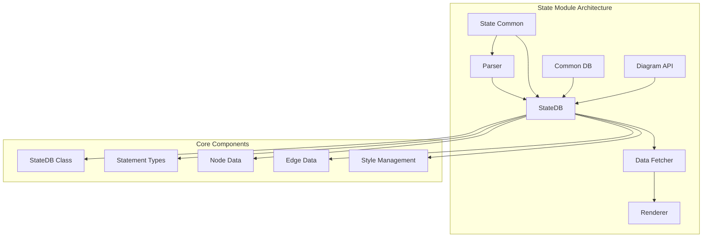
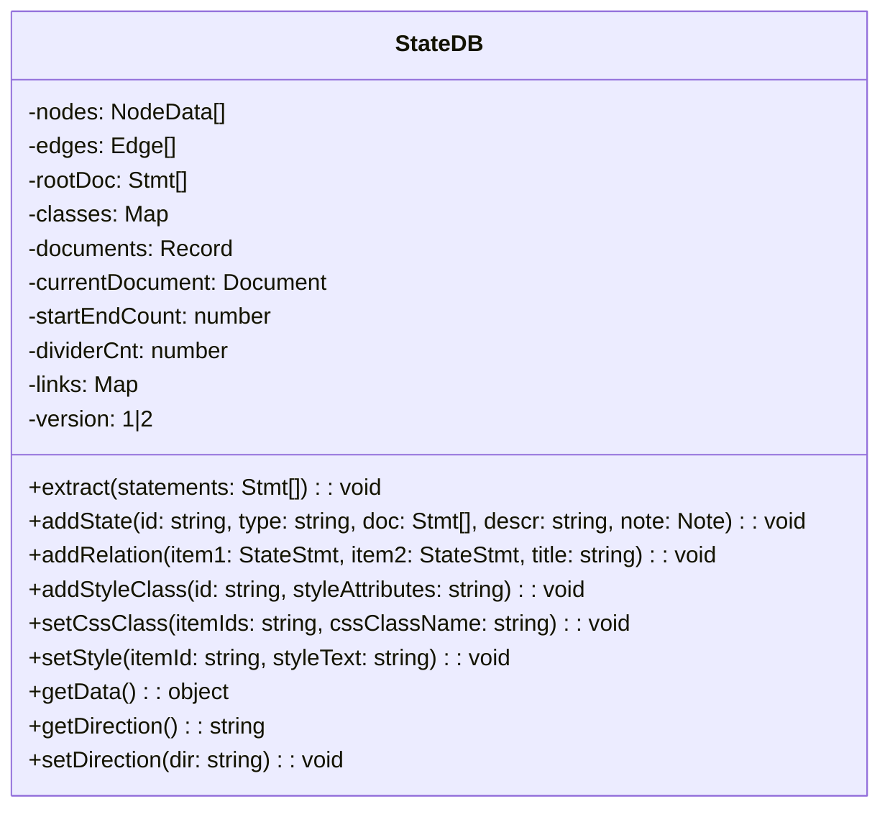
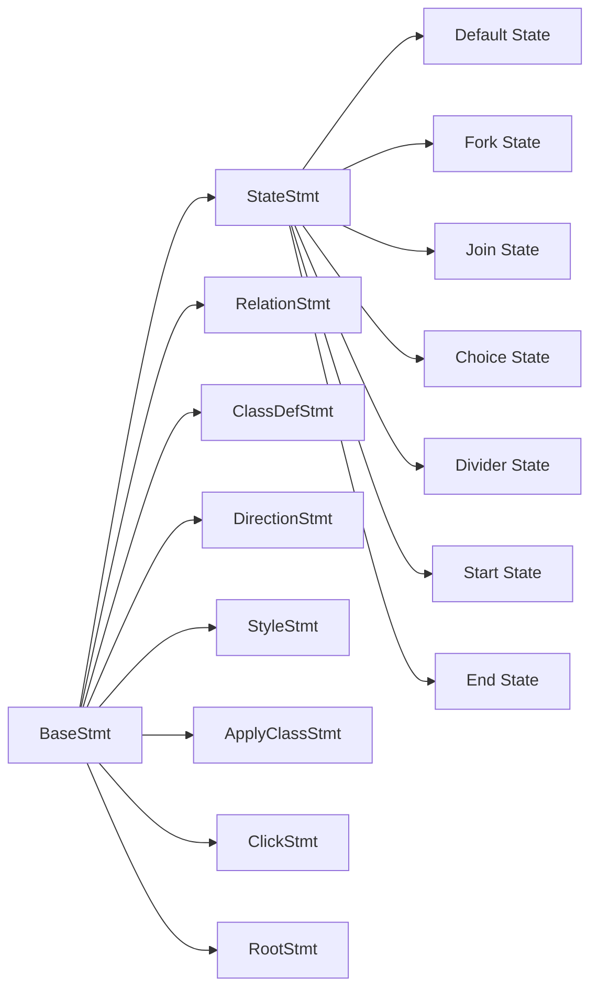
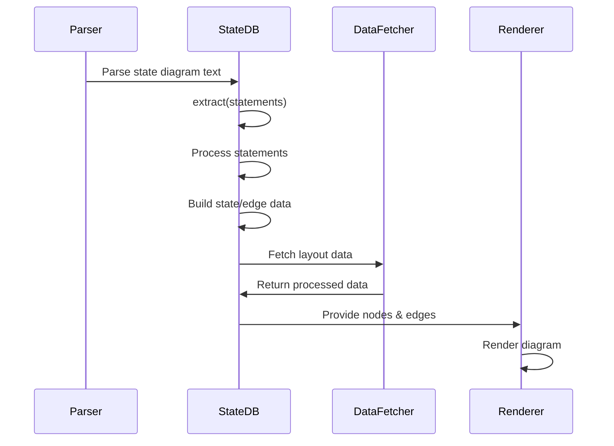
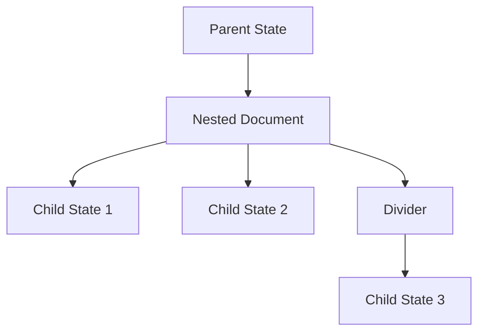
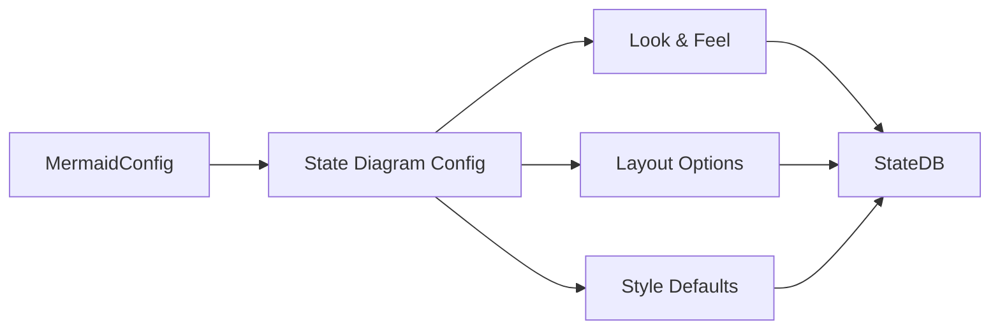

# State Diagram Module Documentation

## Introduction

The state module is a core component of the Mermaid diagram library that provides functionality for creating state diagrams. State diagrams are used to model the dynamic behavior of systems, showing how objects change their states in response to events. This module handles parsing, data management, and rendering of state diagrams with support for nested states, concurrent regions, and various state types including start/end states, choice points, forks, and joins.

## Architecture Overview

The state module follows a layered architecture pattern with clear separation of concerns:



## Core Components

### StateDB Class

The `StateDB` class is the central data management component that serves as the database for state diagram information. It extends the common diagram database pattern used across Mermaid diagrams.

**Key Responsibilities:**
- State and relationship storage
- Style and class management
- Document hierarchy management
- Data extraction and transformation
- Link management for interactive states



### Statement Types

The module defines a comprehensive type system for representing different statement types in state diagrams:



### Data Structures

#### NodeData Interface
Represents individual states with their properties:
- `id`: Unique identifier
- `label`: Display text
- `shape`: Visual representation
- `cssClasses`: Applied CSS classes
- `styles`: Inline styles
- `type`: State type (default, fork, join, etc.)
- `description`: Additional text
- `look`: Visual appearance configuration

#### Edge Interface
Represents transitions between states:
- `start`: Source state ID
- `end`: Target state ID
- `label`: Transition text
- `style`: Visual styling
- `arrowhead`: Arrow style
- `thickness`: Line thickness

#### Document Structure
Manages hierarchical state relationships:
- `relations`: Array of state connections
- `states`: Map of state definitions
- `documents`: Nested document structures

## Data Flow Architecture



## Key Features

### 1. State Types Support

The module supports various state types through the `StateStmt` interface:

- **Default States**: Regular states with descriptions
- **Start/End States**: Represented as `[*]`
- **Fork/Join States**: For concurrent behavior
- **Choice States**: Decision points
- **Divider States**: Section separators

### 2. Nested State Support

States can contain nested documents, enabling hierarchical state modeling:



### 3. Styling System

Comprehensive styling support through:
- **CSS Classes**: Reusable style definitions
- **Inline Styles**: Direct style application
- **Text Styles**: Text-specific formatting
- **Style Classes**: Named style collections

### 4. Interactive Features

Support for clickable states with URL links and tooltips, enabling interactive diagrams.

## Configuration Integration

The state module integrates with Mermaid's configuration system:



## Processing Pipeline

### 1. Parsing Phase
- Text input is parsed into statement objects
- Each statement represents a diagram element
- Statements are organized into document hierarchy

### 2. Data Extraction Phase
- `extract()` method processes parsed statements
- States and relationships are built
- Style information is applied
- Nested documents are processed

### 3. Data Fetching Phase
- `dataFetcher` processes the extracted data
- Layout information is calculated
- Node and edge data structures are finalized
- Visual properties are determined

### 4. Rendering Phase
- Processed data is passed to the renderer
- Visual elements are created
- Diagram is rendered to the target format

## Error Handling

The module implements several error handling mechanisms:

- **State Validation**: Ensures states exist before operations
- **Type Safety**: Strong typing prevents invalid data
- **Document Integrity**: Maintains consistent document structure
- **Style Validation**: Validates CSS and style properties

## Performance Considerations

### Memory Management
- Efficient data structures using Maps and typed arrays
- Cleanup methods to prevent memory leaks
- Lazy loading of nested documents

### Processing Optimization
- Batch processing of statements
- Efficient ID generation and management
- Optimized data fetching algorithms

## Integration Points

### With Core Mermaid
- Extends common diagram database patterns
- Integrates with Mermaid's configuration system
- Uses shared utility functions

### With Other Modules
- **config**: Type definitions for state diagram configuration
- **diagram-api**: Standard diagram interface compliance
- **rendering-util**: Shared rendering utilities
- **themes**: Theme integration for consistent styling

## Usage Patterns

### Basic State Diagram
```
stateDiagram
    [*] --> Active
    Active --> Inactive
    Inactive --> [*]
```

### Complex State Diagram
```
stateDiagram
    state ForkState <<fork>>
    [*] --> ForkState
    ForkState --> State1
    ForkState --> State2
    
    state JoinState <<join>>
    State1 --> JoinState
    State2 --> JoinState
    JoinState --> [*]
```

### Styled State Diagram
```
stateDiagram
    classDef myStyle fill:#f9f,stroke:#333,stroke-width:4px
    State1:::myStyle --> State2
```

## Future Enhancements

Potential areas for improvement:
- Enhanced concurrent state modeling
- Better layout algorithms for complex diagrams
- Improved interactive features
- Performance optimizations for large diagrams
- Extended styling capabilities

## Related Documentation

- [config.md](config.md) - Configuration system details
- [diagram-api.md](diagram-api.md) - Diagram API specifications
- [rendering-util.md](rendering-util.md) - Rendering utilities
- [themes.md](themes.md) - Theme system documentation
- [common-types.md](common-types.md) - Shared type definitions