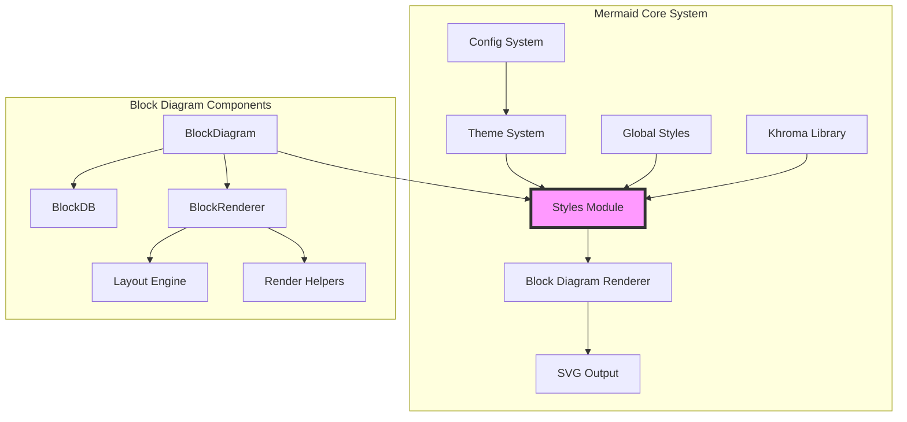
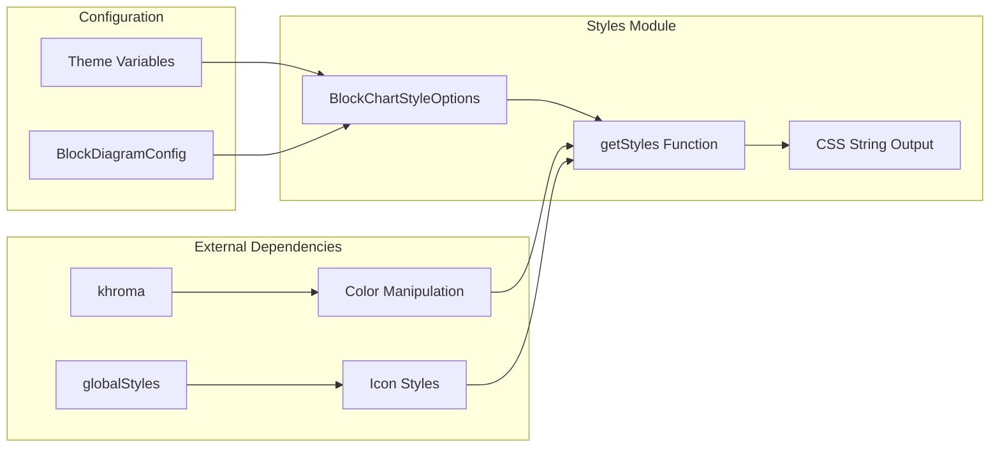
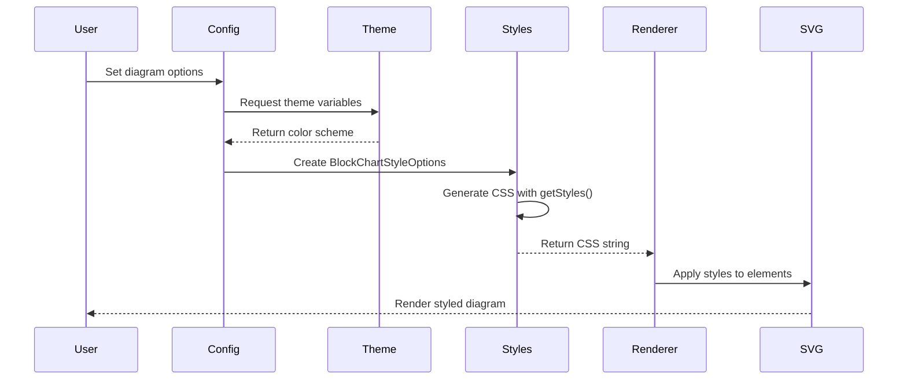
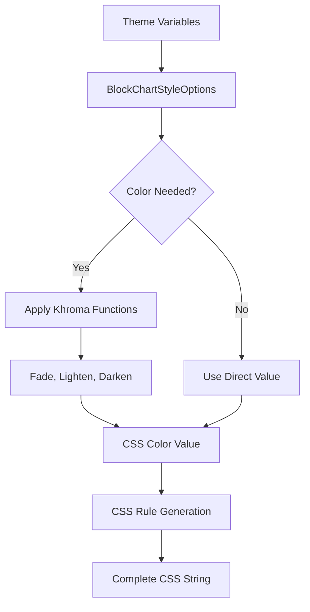
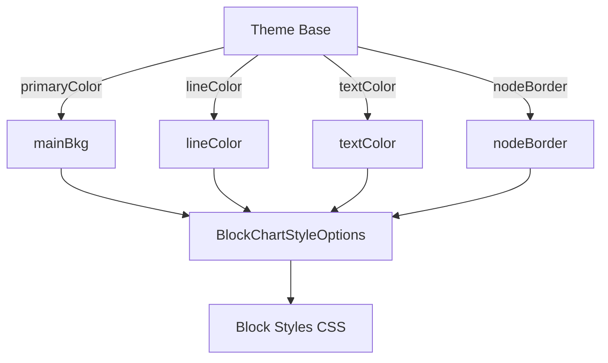

# Styles Module Documentation

## Overview

The **styles module** is a core component of the Mermaid.js library that provides CSS styling functionality for block diagrams. It serves as the bridge between the theming system and the visual representation of block diagrams, ensuring consistent and customizable visual styling across all diagram elements.

## Purpose and Core Functionality

The styles module is responsible for:

1. **CSS Generation**: Dynamically generating CSS styles based on theme variables and configuration options
2. **Visual Consistency**: Ensuring consistent styling across all block diagram elements (nodes, edges, clusters, labels)
3. **Theme Integration**: Integrating with Mermaid's theming system to support multiple themes (default, dark, forest, neutral)
4. **Customization**: Providing a flexible interface for customizing colors, fonts, and visual properties
5. **Cross-browser Compatibility**: Generating CSS that works consistently across different browsers and rendering environments

## Architecture and Component Relationships

### Module Position in System Architecture



### Component Dependencies



## Core Components

### BlockChartStyleOptions Interface

The `BlockChartStyleOptions` interface defines the complete set of styling properties available for block diagrams:

```typescript
export interface BlockChartStyleOptions {
  arrowheadColor: string;        // Color of arrowheads on edges
  border2: string;               // Secondary border color
  clusterBkg: string;            // Background color for clusters/groups
  clusterBorder: string;         // Border color for clusters
  edgeLabelBackground: string;   // Background color for edge labels
  fontFamily: string;            // Font family for all text
  lineColor: string;             // Color of lines and edges
  mainBkg: string;               // Main background color for nodes
  nodeBorder: string;            // Border color for nodes
  nodeTextColor: string;         // Text color for node content
  tertiaryColor: string;         // Tertiary color for accents
  textColor: string;             // General text color
  titleColor: string;            // Color for titles and headings
}
```

### getStyles Function

The `getStyles` function is the core of the module, responsible for generating CSS based on the provided options:

```typescript
const getStyles = (options: BlockChartStyleOptions) => string
```

**Key Features:**
- **Dynamic CSS Generation**: Creates CSS rules based on input options
- **Color Manipulation**: Uses khroma library for color operations (fading, opacity)
- **Comprehensive Coverage**: Styles all diagram elements including nodes, edges, clusters, and labels
- **Icon Integration**: Incorporates global icon styles from the globalStyles module

## Data Flow and Process Flow

### Style Generation Process



### Color Processing Flow



## Integration with Other Modules

### Theme System Integration

The styles module integrates with the [themes module](themes.md) through the theme variables system:



### Configuration System Integration

The module works with the [config module](config.md) to provide diagram-specific customization:

- **BlockDiagramConfig**: Provides padding and layout options
- **Theme Variables**: Supplies color schemes and visual properties
- **Global Settings**: Includes font families and base colors

### Renderer Integration

The styles module is used by the [block diagram renderer](block.md#renderer) to apply visual styling:

1. Renderer calls `getStyles()` with theme-based options
2. CSS is injected into the SVG document
3. Styles are applied to DOM elements during rendering
4. Visual consistency is maintained across all diagram elements

## Key Features and Capabilities

### Comprehensive Element Coverage

The styles module provides styling for:

- **Nodes**: Rectangles, circles, ellipses, polygons, and paths
- **Edges**: Lines, arrows, and connections
- **Clusters**: Group containers and boundaries
- **Labels**: Text elements for nodes, edges, and titles
- **Tooltips**: Interactive hover elements
- **Icons**: Font Awesome and custom icon integration

### Advanced Color Processing

- **Opacity Control**: Fade function for semi-transparent backgrounds
- **Color Harmony**: Integration with theme color schemes
- **Accessibility**: Support for high contrast and dark mode themes
- **Consistency**: Automatic color derivation from base theme colors

### Responsive Design

- **Flexible Units**: Support for various CSS units and measurements
- **Scalable Elements**: Proportional sizing based on diagram dimensions
- **Adaptive Colors**: Theme-aware color adjustments

## Usage Examples

### Basic Style Application

```typescript
import getStyles from './styles';
import { getThemeVariables } from '../themes';

// Get theme variables
const themeVars = getThemeVariables({
  theme: 'default',
  primaryColor: '#fff4dd'
});

// Create style options
const styleOptions: BlockChartStyleOptions = {
  arrowheadColor: themeVars.arrowheadColor,
  border2: themeVars.border2,
  clusterBkg: themeVars.clusterBkg,
  clusterBorder: themeVars.clusterBorder,
  edgeLabelBackground: themeVars.edgeLabelBackground,
  fontFamily: themeVars.fontFamily,
  lineColor: themeVars.lineColor,
  mainBkg: themeVars.mainBkg,
  nodeBorder: themeVars.nodeBorder,
  nodeTextColor: themeVars.nodeTextColor,
  tertiaryColor: themeVars.tertiaryColor,
  textColor: themeVars.textColor,
  titleColor: themeVars.titleColor
};

// Generate CSS
const css = getStyles(styleOptions);
```

### Custom Theme Integration

```typescript
// Custom theme override
const customTheme = {
  primaryColor: '#e1f5fe',
  secondaryColor: '#b3e5fc',
  tertiaryColor: '#4fc3f7',
  background: '#ffffff',
  mainBkg: '#e1f5fe',
  secondaryBkg: '#b3e5fc',
  lineColor: '#01579b'
};

// Apply to block diagram styles
const themedStyles = getStyles({
  ...baseOptions,
  mainBkg: customTheme.mainBkg,
  lineColor: customTheme.lineColor,
  clusterBkg: customTheme.secondaryBkg
});
```

## Best Practices

### Performance Optimization

1. **Cache Generated Styles**: Store generated CSS to avoid recomputation
2. **Minimize Color Operations**: Use pre-calculated color values when possible
3. **Optimize CSS Selectors**: Use efficient CSS selectors for better rendering performance

### Theme Consistency

1. **Follow Theme Guidelines**: Use established theme variables for consistency
2. **Maintain Color Relationships**: Preserve color harmony within themes
3. **Test Across Themes**: Verify styles work with all available themes

### Customization Guidelines

1. **Preserve Semantic Meaning**: Maintain visual distinctions between element types
2. **Ensure Readability**: Keep text readable against backgrounds
3. **Support Accessibility**: Consider contrast ratios and color blindness

## Troubleshooting

### Common Issues

1. **Color Contrast Problems**: Use theme color validation tools
2. **Font Rendering Issues**: Verify font family availability
3. **CSS Specificity Conflicts**: Check for conflicting global styles

### Debug Techniques

1. **Inspect Generated CSS**: Review the output of `getStyles()`
2. **Test Theme Variables**: Validate theme color calculations
3. **Check Browser Compatibility**: Verify CSS support across target browsers

## Related Documentation

- [Themes Module](themes.md) - Comprehensive theming system documentation
- [Config Module](config.md) - Configuration system and diagram-specific settings
- [Block Diagram Module](block.md) - Block diagram implementation and renderer
- [Global Styles](global-styles.md) - System-wide styling components

## API Reference

### BlockChartStyleOptions

Complete interface for block diagram styling options.

### getStyles(options: BlockChartStyleOptions): string

Generates CSS string based on provided style options.

**Parameters:**
- `options`: BlockChartStyleOptions object containing styling properties

**Returns:**
- CSS string for application to SVG elements

**Example:**
```typescript
const css = getStyles({
  arrowheadColor: '#333',
  border2: '#ccc',
  clusterBkg: '#f5f5f5',
  // ... other options
});
```