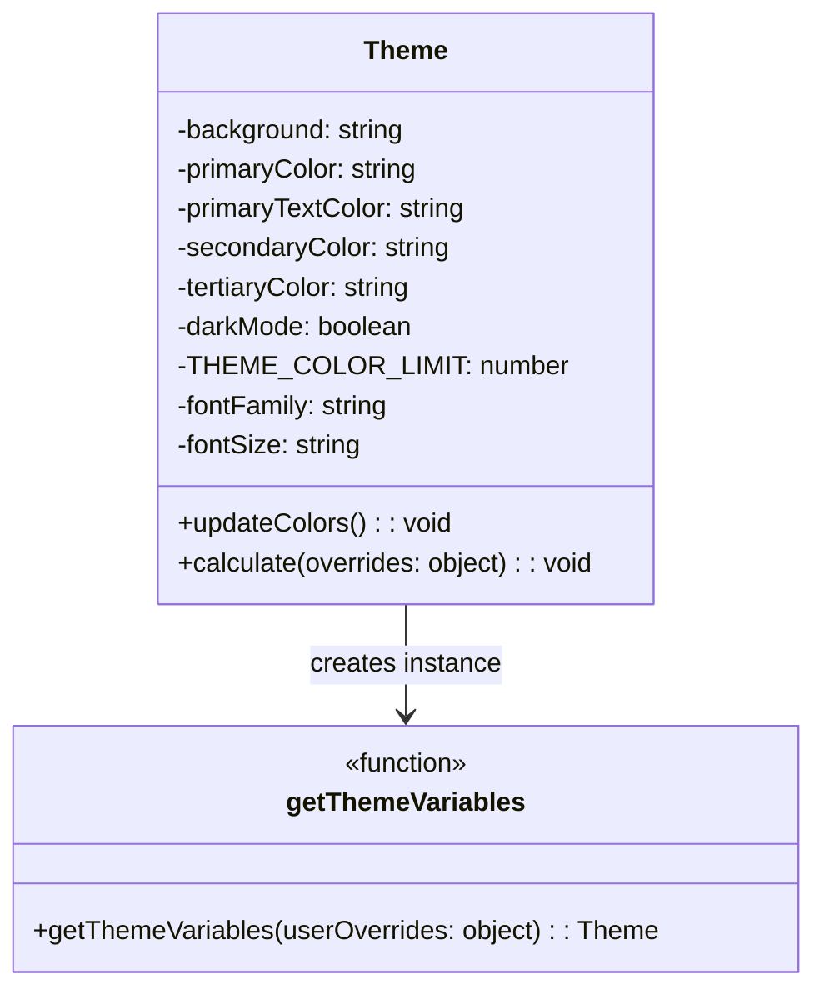
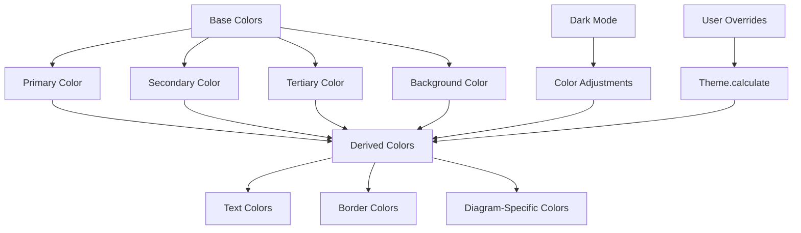
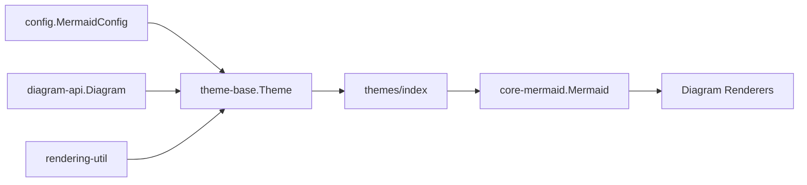
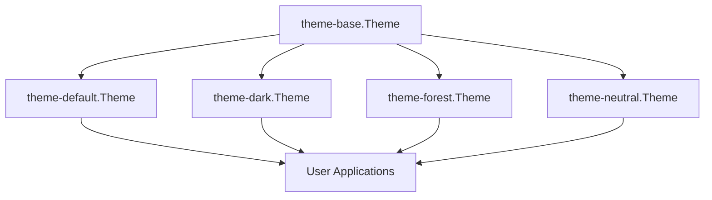
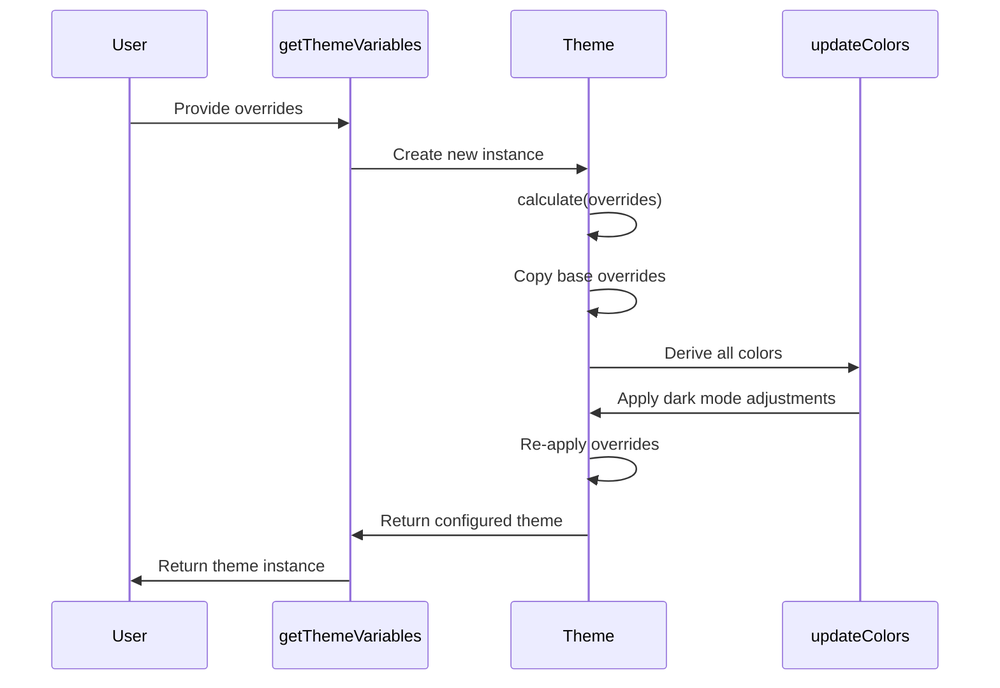

# Theme Base Module Documentation

## Introduction

The theme-base module serves as the foundational theming system for Mermaid diagrams, providing a comprehensive color management and styling framework. It defines the base `Theme` class that establishes default color schemes, typography, and visual properties used across all diagram types. This module is essential for maintaining consistent visual appearance and enabling theme customization throughout the Mermaid ecosystem.

## Core Architecture

### Theme Class Structure

The `Theme` class is the central component that manages all visual properties for Mermaid diagrams. It provides a systematic approach to color management with intelligent color derivation and dark mode support.



### Color Management System

The theme system implements a sophisticated color management approach with automatic color derivation:



## Component Relationships

### Integration with Mermaid Core

The theme-base module integrates with the broader Mermaid architecture through the theming system:



### Theme Inheritance Chain

The theme system supports multiple theme variants that extend the base theme:



## Key Features

### 1. Intelligent Color Derivation

The theme automatically calculates related colors based on primary colors using the `khroma` library:

- **Secondary colors**: Adjusted hue by -120 degrees
- **Tertiary colors**: Adjusted hue by +180 degrees with lightness adjustment
- **Text colors**: Automatically inverted for contrast
- **Border colors**: Generated using contrast-aware algorithms

### 2. Dark Mode Support

Comprehensive dark mode implementation with automatic color adjustments:

```javascript
// Dark mode color scaling
if (this.darkMode) {
  for (let i = 0; i < this.THEME_COLOR_LIMIT; i++) {
    this['cScale' + i] = darken(this['cScale' + i], 75);
  }
}
```

### 3. Diagram-Specific Color Schemes

The theme provides specialized color sets for different diagram types:

- **Flowchart**: Node backgrounds, cluster colors, edge labels
- **Sequence**: Actor colors, signal colors, activation colors
- **Gantt**: Task colors, section colors, critical path colors
- **State**: Transition colors, state backgrounds
- **ER Diagram**: Attribute row colors
- **Git Graph**: Branch colors with 8-color palette
- **Pie Charts**: 12-segment color palette
- **Radar Charts**: Axis and curve styling
- **Architecture**: Edge and group styling

### 4. Color Scale System

Implements a 12-color scale system (`cScale0` through `cScale11`) with:
- Base colors with systematic hue adjustments
- Inverted variants for text contrast
- Peer colors for borders
- Label colors for accessibility

## Configuration and Customization

### Theme Calculation Process



### Override System

The theme supports comprehensive customization through the `calculate` method:

1. **Base color overrides**: Primary, secondary, tertiary colors
2. **Derived property overrides**: Text colors, border colors
3. **Diagram-specific overrides**: Specialized colors for each diagram type
4. **Font and typography overrides**: Family, size, and color properties

## Dependencies

### External Dependencies

- **khroma**: Color manipulation library for hue adjustments, darkening, and inversion
- **theme-helpers**: Internal utilities for border color calculations
- **erDiagram-oldHardcodedValues**: Legacy color values for ER diagram compatibility

### Internal Dependencies

The theme-base module is utilized by:
- [themes](themes.md) - Theme collection and management
- [config](config.md) - Configuration system integration
- [core-mermaid](core-mermaid.md) - Core rendering engine
- [rendering-util](rendering-util.md) - Rendering utilities

## Usage Patterns

### Basic Theme Creation

```javascript
// Create theme with defaults
const theme = getThemeVariables();

// Create theme with overrides
const customTheme = getThemeVariables({
  primaryColor: '#3498db',
  darkMode: true,
  fontFamily: 'Arial, sans-serif'
});
```

### Color Property Categories

1. **Base Properties**: `background`, `primaryColor`, `fontFamily`
2. **Text Properties**: `primaryTextColor`, `secondaryTextColor`, `textColor`
3. **Border Properties**: `primaryBorderColor`, `secondaryBorderColor`
4. **Diagram-Specific**: `nodeBkg`, `actorBorder`, `sectionBkgColor`
5. **Color Scales**: `cScale0` through `cScale11`

## Best Practices

### Theme Development

1. **Always use the base theme** as a foundation for custom themes
2. **Leverage color derivation** to maintain visual harmony
3. **Test in both light and dark modes** for accessibility
4. **Use the color scale system** for consistent multi-color diagrams
5. **Override specific properties** rather than entire color sets when possible

### Performance Considerations

- Theme calculation happens once per diagram render
- Color derivation is computationally intensive but cached
- Override application is optimized for minimal overhead

## Extension Points

The theme system is designed for extensibility:

- **Custom color schemes**: Implement new theme variants
- **Diagram-specific themes**: Add specialized color properties
- **Dynamic theming**: Runtime theme switching capabilities
- **Accessibility enhancements**: High contrast and colorblind-friendly variants

This foundation enables Mermaid to maintain consistent, accessible, and customizable visual theming across all supported diagram types while providing the flexibility needed for diverse use cases and branding requirements.