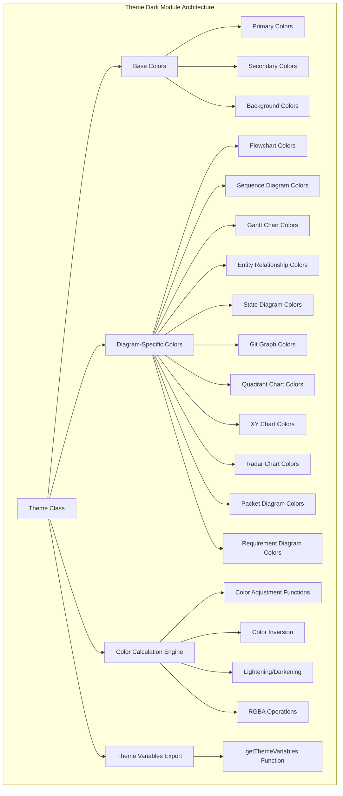
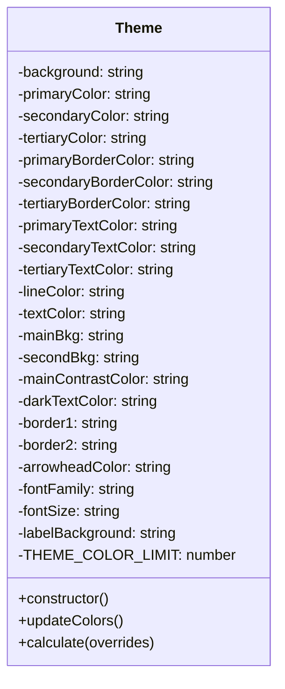
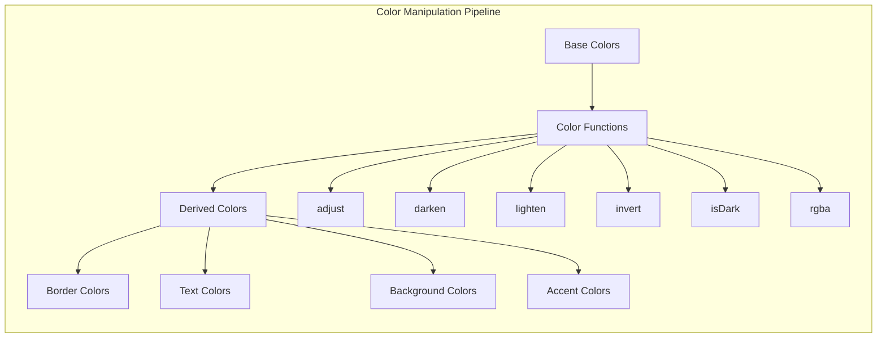
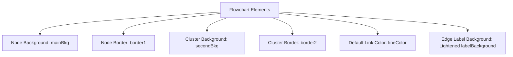
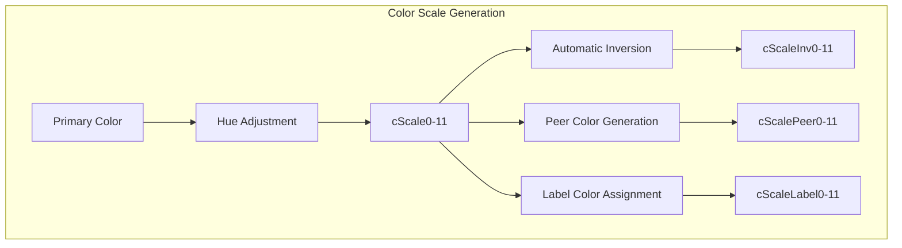
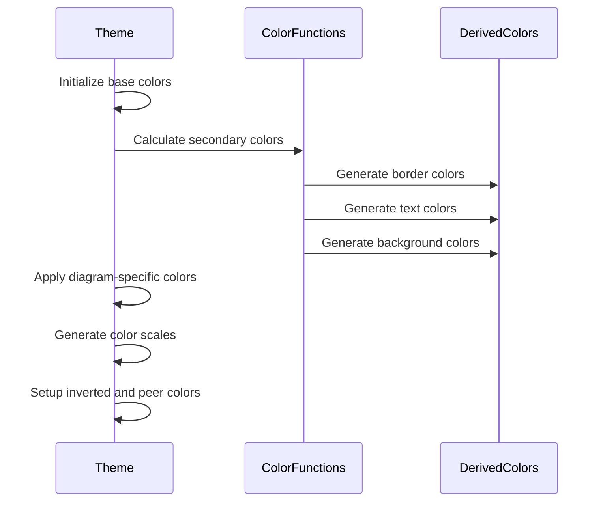
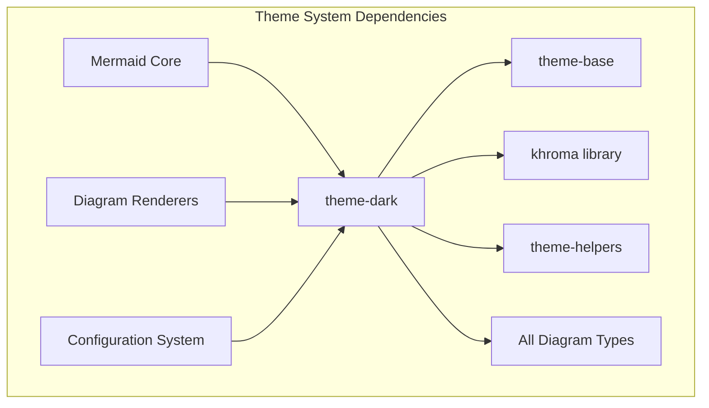

# Theme Dark Module Documentation

## Introduction

The theme-dark module provides a comprehensive dark color scheme for Mermaid diagrams, offering an aesthetically pleasing and accessible dark mode experience. This module defines color variables, styling properties, and theme configurations that ensure consistent visual presentation across all diagram types in dark mode environments.

## Architecture Overview

The theme-dark module is built around a centralized `Theme` class that encapsulates all color definitions and styling properties. The module follows a systematic approach to color management, using color manipulation functions to derive related colors from base values, ensuring visual harmony and consistency throughout the diagram rendering process.



## Core Components

### Theme Class

The `Theme` class is the central component that defines all color properties and styling configurations for the dark theme. It provides a structured approach to color management with the following key features:

- **Base Color Definitions**: Primary, secondary, and tertiary colors with their variations
- **Diagram-Specific Configurations**: Tailored color schemes for each diagram type
- **Dynamic Color Calculation**: Automatic derivation of related colors using color manipulation functions
- **Override Support**: Ability to customize theme properties through user-provided overrides



### Color Management System

The theme employs a sophisticated color management system that uses the `khroma` library for color manipulation:



## Color Categories

### Base Colors

The dark theme establishes a foundation with carefully chosen base colors:

- **Background**: `#333` - Dark gray background for optimal contrast
- **Primary Color**: `#1f2020` - Deep charcoal for main elements
- **Secondary Color**: Lightened primary color (16% lighter)
- **Tertiary Color**: Hue-adjusted primary color (-160 degrees)

### Diagram-Specific Color Schemes

#### Flowchart Colors


#### Sequence Diagram Colors
- **Actor Border**: Uses `border1` for consistent borders
- **Actor Background**: Matches `mainBkg` for unified appearance
- **Signal Colors**: Based on `mainContrastColor` for visibility
- **Note Colors**: Special handling with `secondBkg` and `secondaryTextColor`

#### Gantt Chart Colors
- **Section Backgrounds**: Darkened versions of base colors
- **Task Colors**: Lightened `mainBkg` with appropriate contrast
- **Grid Colors**: Uses `mainContrastColor` for subtle grid lines
- **Critical Path**: Distinctive red colors (`#E83737`)

### Color Scale System

The theme implements a comprehensive 12-color scale system (`cScale0` through `cScale11`) that provides:

- **Sequential Color Progression**: Hue-based variations of primary colors
- **Inverted Colors**: Automatic inversion for contrast requirements
- **Peer Colors**: Lightened versions for border effects
- **Label Colors**: Appropriate text colors for each scale color



## Theme Calculation Process

### Initialization Phase
1. **Base Color Setup**: Define primary, secondary, and tertiary colors
2. **Background Configuration**: Set dark background and contrast colors
3. **Font Configuration**: Establish typography settings
4. **Diagram-Specific Defaults**: Initialize empty color slots for each diagram type

### Color Calculation Phase
The `updateColors()` method systematically calculates derived colors:



### Override Application Phase
The `calculate()` method handles user overrides:
1. **Base Override Application**: Apply user-provided base colors
2. **Color Recalculation**: Recalculate all derived colors
3. **Final Override Application**: Apply any specific color overrides

## Integration with Mermaid System

### Theme Registration
The theme-dark module integrates with the broader Mermaid theming system through the `getThemeVariables()` function, which:

- **Instantiates Theme**: Creates a new Theme instance
- **Applies Overrides**: Processes user-provided color customizations
- **Returns Theme Object**: Provides the complete theme configuration

### Dependency Relationships


## Usage Patterns

### Basic Usage
```javascript
import { getThemeVariables } from './theme-dark.js';

// Get default dark theme
const darkTheme = getThemeVariables();

// Get customized dark theme
const customDarkTheme = getThemeVariables({
    primaryColor: '#2a2a2a',
    background: '#1a1a1a'
});
```

### Integration with Configuration
The theme integrates with Mermaid's configuration system to provide consistent theming across all diagram types, automatically applying appropriate colors based on the diagram's specific requirements.

## Extensibility

### Custom Color Scales
The theme supports extension through:
- **Color Scale Expansion**: Beyond the default 12-color limit
- **Diagram-Specific Extensions**: Adding new diagram type support
- **Surface Color Variations**: Custom surface color definitions

### Override Mechanisms
- **Base Color Overrides**: Modify primary theme colors
- **Derived Color Overrides**: Override calculated colors
- **Diagram-Specific Overrides**: Customize colors for specific diagram types

## Best Practices

### Color Contrast
The theme maintains WCAG compliance by:
- Using inverted colors for text on dark backgrounds
- Providing sufficient contrast ratios for accessibility
- Automatically calculating appropriate text colors for backgrounds

### Consistency
- All diagram types use consistent base colors
- Border and text colors are systematically derived
- Color scales provide harmonious color progression

### Performance
- Colors are calculated once during theme initialization
- Derived colors are cached to avoid recalculation
- The theme object is lightweight and serializable

## Related Documentation

- [theme-base](theme-base.md) - Base theme functionality and common properties
- [theme-default](theme-default.md) - Default light theme implementation
- [config](config.md) - Configuration system integration
- [rendering-util](rendering-util.md) - Rendering system that applies theme colors

## Summary

The theme-dark module provides a comprehensive, well-structured dark theme implementation that ensures consistent, accessible, and visually appealing diagram rendering across all Mermaid diagram types. Its systematic approach to color management, extensive customization options, and integration with the broader Mermaid ecosystem make it an essential component for dark mode support in Mermaid diagrams.