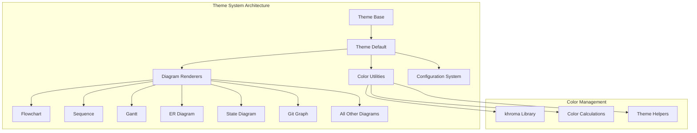
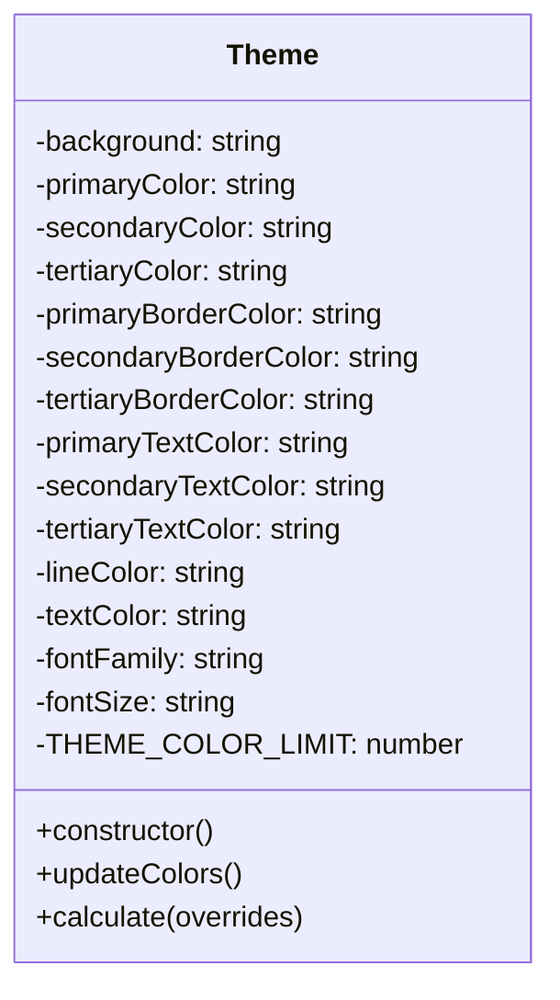
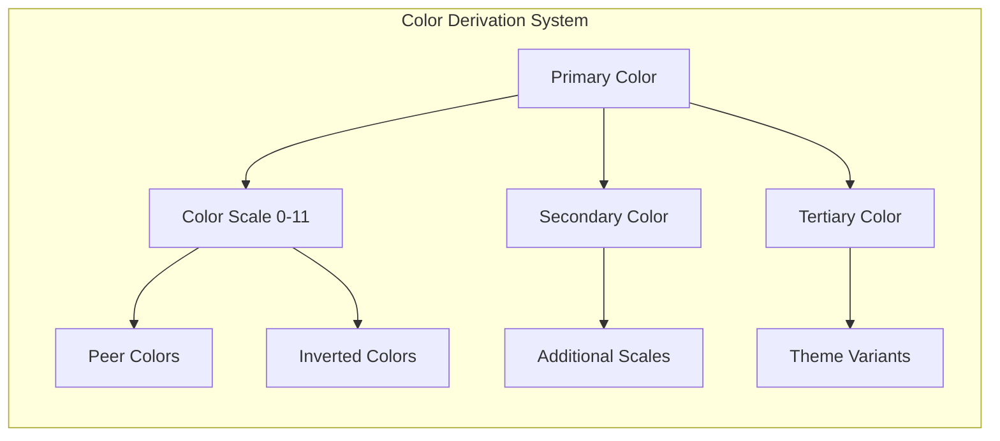
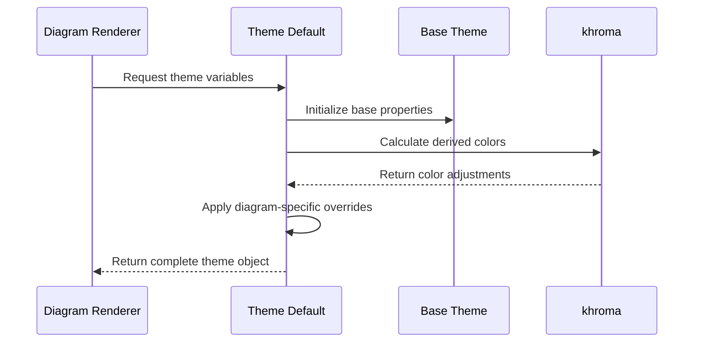

# Theme Default Module Documentation

## Introduction

The theme-default module provides the default visual styling and color scheme for Mermaid diagrams. It serves as the foundational theme that defines the default appearance of all diagram types, including colors, fonts, borders, and other visual properties. This module is essential for ensuring consistent and aesthetically pleasing diagram rendering across the entire Mermaid ecosystem.

## Architecture Overview

The theme-default module implements a comprehensive theming system that extends the base theme architecture. It provides a complete set of color variables and styling properties that are used by various diagram renderers throughout the Mermaid library.



## Core Components

### Theme Class

The main component of the theme-default module is the `Theme` class, which extends the base theme functionality and provides comprehensive styling configuration for all diagram types.

**Location**: `packages.mermaid.src.themes.theme-default.Theme`

**Key Features**:
- Comprehensive color palette management
- Support for 20+ diagram types
- Dynamic color calculation and adjustment
- Override system for customization
- Dark mode support



## Color System

The theme implements a sophisticated color system with multiple color scales and automatic color derivation:

### Base Colors
- **Primary Color**: `#ECECFF` - Main theme color
- **Secondary Color**: `#ffffde` - Secondary theme color  
- **Tertiary Color**: Derived from primary with hue adjustment
- **Background**: `white` - Default background color
- **Text Color**: `#333` - Default text color

### Color Scales
The theme generates 12-color scales (cScale0-cScale11) with automatic peer colors and inverted variants for comprehensive theming support.



## Diagram-Specific Styling

The theme provides specialized styling variables for each diagram type:

### Flowchart Variables
- `nodeBkg`: Node background color
- `nodeBorder`: Node border color
- `clusterBkg`: Cluster background color
- `clusterBorder`: Cluster border color
- `defaultLinkColor`: Default link/edge color
- `titleColor`: Title text color
- `edgeLabelBackground`: Edge label background color

### Sequence Diagram Variables
- `actorBorder`: Actor border color
- `actorBkg`: Actor background color
- `actorTextColor`: Actor text color
- `signalColor`: Signal line color
- `noteBkgColor`: Note background color (`#fff5ad`)
- `activationBkgColor`: Activation background color

### Gantt Chart Variables
- `sectionBkgColor`: Section background color
- `taskBkgColor`: Task background color
- `taskBorderColor`: Task border color
- `gridColor`: Grid line color
- `critBkgColor`: Critical task background color

## Integration with Other Modules

The theme-default module integrates with several other Mermaid modules:

### Dependencies
- **[theme-base](theme-base.md)**: Extends the base theme functionality
- **[config](config.md)**: Provides configuration for theme overrides
- **[rendering-util](rendering-util.md)**: Supplies colors to rendering utilities
- **[diagram-api](diagram-api.md)**: Makes theme variables available to diagram definitions

### Usage Pattern


## Color Calculation System

The theme uses the `khroma` library for sophisticated color manipulation:

### Color Operations
- **Lighten/Darken**: Adjust color brightness
- **Adjust**: Modify hue, saturation, lightness
- **Invert**: Create color inversions
- **RGBA**: Handle transparency
- **isDark**: Determine if color is dark

### Dynamic Color Generation
The `updateColors()` method automatically generates:
- Color scales with hue variations
- Peer colors for borders and accents
- Inverted colors for contrast
- Surface colors for depth effects

## Customization and Overrides

The theme supports comprehensive customization through the `calculate()` method:

### Override Process
1. Accept user-provided color overrides
2. Apply base color changes
3. Recalculate derived colors
4. Apply final overrides
5. Return customized theme object

### Example Usage
```javascript
const customTheme = getThemeVariables({
  primaryColor: '#FF6B6B',
  background: '#F8F9FA',
  fontFamily: 'Arial, sans-serif'
});
```

## Theme Variables Reference

### Core Visual Properties
| Variable | Default Value | Description |
|----------|---------------|-------------|
| background | white | Diagram background color |
| primaryColor | #ECECFF | Main theme color |
| secondaryColor | #ffffde | Secondary theme color |
| textColor | #333 | Default text color |
| lineColor | #333333 | Line and border color |
| fontFamily | "trebuchet ms", verdana, arial | Default font family |
| fontSize | 16px | Default font size |

### Diagram-Specific Colors
Each diagram type has its own set of color variables that inherit from the base colors but can be individually customized. The theme provides sensible defaults for all diagram types while allowing complete customization.

## Error Handling and Validation

The theme system includes built-in validation and fallback mechanisms:
- Automatic color calculation when values are undefined
- Fallback to base colors for missing diagram-specific variables
- Validation of color formats through the khroma library
- Graceful handling of invalid override values

## Performance Considerations

The theme system is optimized for performance:
- Colors are calculated once during theme initialization
- Derived colors are cached to avoid recalculation
- Minimal runtime overhead during diagram rendering
- Efficient color scale generation algorithms

## Future Extensibility

The theme architecture is designed for future enhancements:
- Support for additional diagram types
- Plugin system for custom color schemes
- Advanced color harmony algorithms
- Theme inheritance and composition
- Dynamic theme switching capabilities

This comprehensive theming system ensures that Mermaid diagrams maintain visual consistency while providing the flexibility needed for diverse use cases and customization requirements.