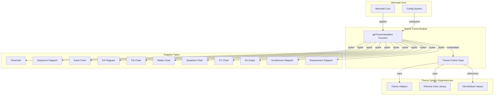
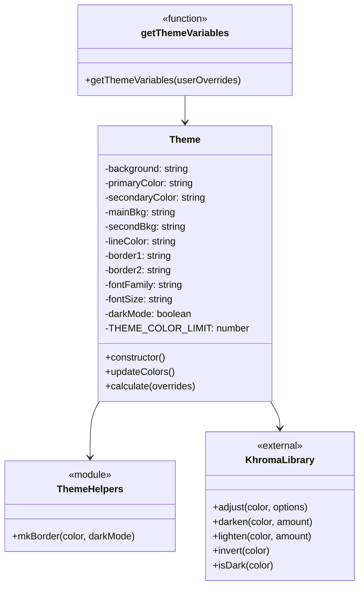
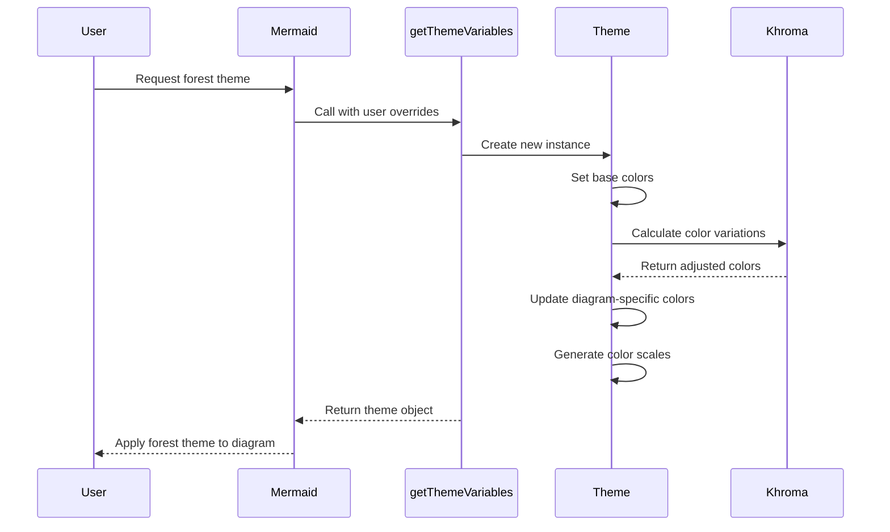
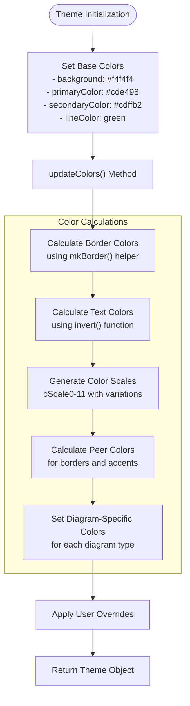
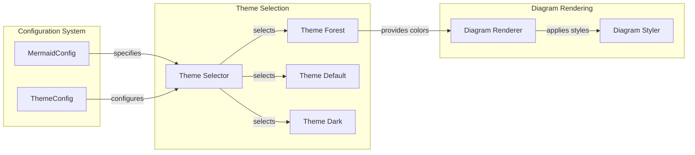
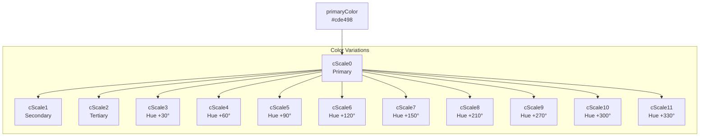

# Theme Forest Module Documentation

## Introduction

The theme-forest module is a visual styling component within the Mermaid diagramming library that provides a nature-inspired color scheme and aesthetic configuration. This theme implements a forest-like visual palette with green tones and natural colors, designed to create diagrams that evoke an organic, environmental feel while maintaining excellent readability and visual hierarchy.

## Module Purpose and Core Functionality

The theme-forest module serves as one of Mermaid's built-in visual themes, offering a complete color and styling system that can be applied across all supported diagram types. Its primary purpose is to provide a cohesive, forest-themed visual experience that transforms the appearance of diagrams through carefully curated color palettes, typography, and visual elements.

### Key Features

- **Nature-Inspired Color Palette**: Utilizes green tones, earth colors, and natural hues
- **Comprehensive Diagram Support**: Configures styling for all Mermaid diagram types
- **Dynamic Color Calculation**: Automatically generates complementary colors and variations
- **Override Capabilities**: Allows users to customize base colors while maintaining theme consistency
- **Accessibility Considerations**: Ensures proper contrast ratios and readability

## Architecture and Component Relationships

### Theme Architecture Overview



### Component Structure



## Data Flow and Processing

### Theme Initialization Flow



### Color Calculation Process



## Integration with Mermaid System

### Theme System Hierarchy

The theme-forest module integrates with Mermaid's broader theming system, which includes multiple theme modules:

- **[theme-base](theme-base.md)**: Base theme class and common functionality
- **[theme-dark](theme-dark.md)**: Dark theme variant
- **[theme-default](theme-default.md)**: Default theme configuration
- **[theme-neutral](theme-neutral.md)**: Neutral theme variant
- **theme-forest**: Forest/nature-inspired theme (current module)

### Configuration Integration



## Color System and Variables

### Base Color Palette

The forest theme establishes a cohesive color system based on natural, earthy tones:

| Color Variable | Value | Description |
|---|---|---|
| `background` | `#f4f4f4` | Light gray background |
| `primaryColor` | `#cde498` | Soft green primary color |
| `secondaryColor` | `#cdffb2` | Light green secondary color |
| `mainBkg` | `#cde498` | Main background color |
| `lineColor` | `green` | Line and border color |
| `border1` | `#13540c` | Dark green border |
| `border2` | `#6eaa49` | Medium green border |

### Color Scale System

The theme generates a comprehensive color scale system for data visualization:



## Diagram-Specific Configurations

### Flowchart Configuration

The forest theme provides specific styling for flowchart diagrams:

- **Node Background**: Uses `mainBkg` color (#cde498)
- **Node Border**: Uses `border1` color (#13540c)
- **Cluster Background**: Uses `secondBkg` color (#cdffb2)
- **Default Link Color**: Matches `lineColor` (green)
- **Title Color**: Dark gray (#333) for contrast

### Sequence Diagram Configuration

Sequence diagrams receive specialized styling:

- **Actor Border**: Darkened version of main background
- **Actor Background**: Primary background color
- **Signal Color**: Dark gray (#333) for readability
- **Note Background**: Light yellow (#fff5ad) for visibility
- **Activation Colors**: Light gray backgrounds with dark borders

### Gantt Chart Configuration

Gantt charts use a nature-inspired color scheme:

- **Section Background**: Green tone (#6eaa49)
- **Task Background**: Darker green (#487e3a)
- **Task Text**: White for dark backgrounds, black for light
- **Grid Color**: Light gray for subtle divisions
- **Critical Path**: Red indicators for attention

## Usage Examples

### Basic Usage

```javascript
// Apply forest theme to a Mermaid diagram
mermaid.initialize({
  theme: 'forest'
});
```

### Customized Usage

```javascript
// Apply forest theme with custom overrides
mermaid.initialize({
  theme: 'forest',
  themeVariables: {
    primaryColor: '#a1d99b',
    primaryTextColor: '#2c3e50'
  }
});
```

## Dependencies and External Libraries

### Internal Dependencies

- **[theme-helpers.js](theme-helpers.md)**: Provides utility functions like `mkBorder()`
- **[erDiagram-oldHardcodedValues.js](erDiagram-oldHardcodedValues.md)**: Legacy color values for ER diagrams

### External Dependencies

- **[Khroma](https://www.npmjs.com/package/khroma)**: Color manipulation library providing:
  - `adjust()`: Modify color properties (hue, saturation, lightness)
  - `darken()`: Darken colors by specified amount
  - `lighten()`: Lighten colors by specified amount
  - `invert()`: Calculate inverse colors for text contrast
  - `isDark()`: Determine if a color is dark

## Extension and Customization

### Creating Theme Variants

The forest theme can serve as a base for creating custom nature-inspired themes:

```javascript
// Example: Creating a autumn variant
const autumnOverrides = {
  primaryColor: '#d4a574',
  secondaryColor: '#e6b89c',
  border1: '#8b4513',
  border2: '#cd853f'
};

const autumnTheme = getThemeVariables(autumnOverrides);
```

### Integration with Custom Diagrams

When developing custom diagram types, the forest theme colors can be accessed through the theme object:

```javascript
// Accessing forest theme colors in a custom renderer
const theme = getThemeVariables();
const nodeColor = theme.primaryColor;
const borderColor = theme.primaryBorderColor;
const textColor = theme.primaryTextColor;
```

## Performance Considerations

### Color Calculation Optimization

The theme system optimizes color calculations by:

1. **Lazy Calculation**: Colors are only calculated when the theme is instantiated
2. **Caching**: Color scales are generated once and reused
3. **Efficient Algorithms**: Uses Khroma's optimized color manipulation functions

### Memory Management

- Theme objects are lightweight and can be garbage collected when no longer referenced
- Color values are stored as primitive strings rather than complex objects
- No persistent state between theme instantiations

## Troubleshooting and Common Issues

### Color Contrast Issues

If text becomes unreadable with certain color combinations:

1. Check that `primaryTextColor` and `secondaryTextColor` are properly calculated
2. Verify that the `invert()` function is working correctly
3. Consider manual overrides for problematic color combinations

### Theme Application Problems

If the forest theme doesn't apply correctly:

1. Ensure Mermaid is properly initialized with `theme: 'forest'`
2. Check for conflicting CSS styles that might override theme colors
3. Verify that the theme module is properly imported and loaded

### Browser Compatibility

The forest theme relies on modern JavaScript features and CSS color functions. For older browsers:

1. Ensure Khroma library compatibility
2. Test color calculation functions across target browsers
3. Consider providing fallback colors for unsupported features

## Future Enhancements

### Potential Improvements

1. **Dynamic Theme Generation**: Allow runtime theme creation based on user preferences
2. **Accessibility Enhancements**: Built-in WCAG compliance checking for color contrast
3. **Theme Animation**: Smooth transitions between theme changes
4. **Export Functionality**: Save and share custom theme configurations
5. **Advanced Color Schemes**: Support for color-blind friendly palettes

### Integration Opportunities

1. **CSS Custom Properties**: Export theme colors as CSS variables for external styling
2. **Design System Integration**: Connect with popular design systems and component libraries
3. **Theme Marketplace**: Community-driven theme sharing platform
4. **AI-Powered Themes**: Generate themes based on brand colors or uploaded images