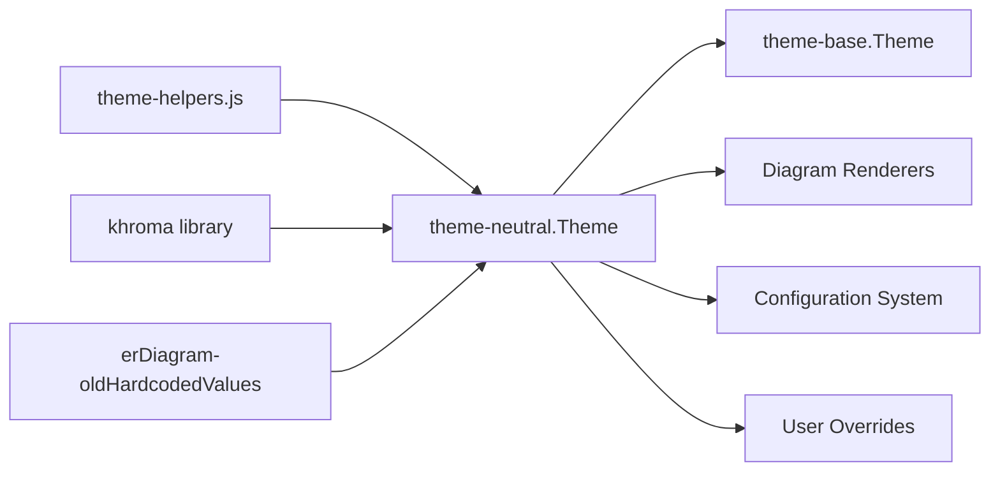
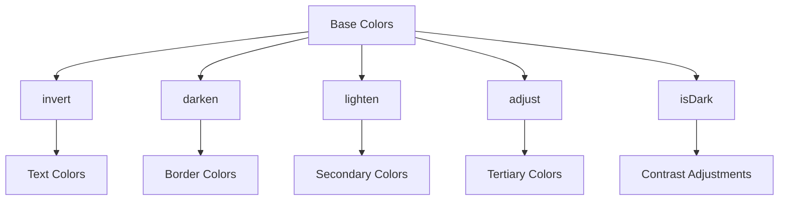
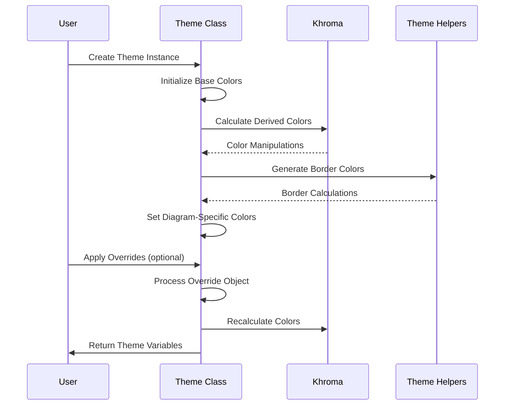

# Theme-Neutral Module Documentation

## Introduction

The theme-neutral module provides a clean, minimalistic color scheme for Mermaid diagrams. It implements the neutral theme variant that offers a balanced, professional appearance suitable for various documentation contexts. This theme is designed to be unobtrusive while maintaining good contrast and readability across all supported diagram types.

## Module Overview

The theme-neutral module is part of Mermaid's theming system and provides a specific color palette and styling configuration. It extends the base theme architecture and implements the Theme interface to deliver consistent visual styling across all diagram types supported by Mermaid.

## Core Architecture

### Component Structure

```mermaid
graph TD
    A[Theme Class] --> B[Color Properties]
    A --> C[Diagram-Specific Properties]
    A --> D[Update Colors Method]
    A --> E[Calculate Method]
    
    B --> B1[Primary Colors]
    B --> B2[Secondary Colors]
    B --> B3[Text Colors]
    B --> B4[Border Colors]
    
    C --> C1[Flowchart Variables]
    C --> C2[Sequence Diagram Variables]
    C --> C3[Gantt Chart Variables]
    C --> C4[ER Diagram Variables]
    C --> C5[State Diagram Variables]
    C --> C6[Git Graph Variables]
    C --> C7[Pie Chart Variables]
    C --> C8[Quadrant Chart Variables]
    C --> C9[XY Chart Variables]
    C --> C10[Radar Chart Variables]
    C --> C11[Requirement Diagram Variables]
    
    D --> D1[Color Calculations]
    D --> D2[Derived Properties]
    
    E --> E1[Override Processing]
    E --> E2[Color Recalculation]
```



### Theme Integration



## Core Components

### Theme Class

The `Theme` class is the main component of the theme-neutral module. It encapsulates all color and styling properties required for rendering Mermaid diagrams.

**Key Properties:**

- **Base Colors**: `primaryColor`, `contrast`, `secondaryColor`, `background`
- **Text Colors**: `primaryTextColor`, `secondaryTextColor`, `tertiaryTextColor`
- **Border Colors**: `primaryBorderColor`, `secondaryBorderColor`, `tertiaryBorderColor`
- **Diagram-Specific Colors**: Individual properties for each diagram type

**Key Methods:**

- `constructor()`: Initializes default color values
- `updateColors()`: Calculates derived colors from base colors
- `calculate(overrides)`: Applies user overrides and recalculates colors

### Color Management

The theme uses the khroma library for color manipulation:



## Color Palette

### Primary Colors
- **Primary Color**: `#eee` (Light gray)
- **Contrast**: `#707070` (Medium gray)
- **Secondary Color**: Lightened contrast (55%)
- **Background**: `#ffffff` (White)
- **Tertiary Color**: Adjusted primary color (hue -160)

### Text Colors
- **Primary Text**: Inverted primary color
- **Secondary Text**: Inverted secondary color
- **Tertiary Text**: Inverted tertiary color
- **General Text**: `#333` (Dark gray)
- **Line Color**: `#666` (Medium gray)

### Status Colors
- **Critical**: `#d42` (Red)
- **Done**: `#bbb` (Light gray)
- **Note**: `#ffa` (Yellow)
- **Error Background**: `#552222` (Dark red)
- **Error Text**: `#552222` (Dark red)

## Diagram-Specific Configurations

### Flowchart
```javascript
nodeBkg: 'calculated'      // Based on mainBkg
nodeBorder: 'calculated'   // Based on border1
clusterBkg: 'calculated'   // Based on secondBkg
clusterBorder: 'calculated' // Based on border2
defaultLinkColor: 'calculated' // Based on lineColor
titleColor: 'calculated'   // Based on text
```

### Sequence Diagram
```javascript
actorBorder: 'calculated'  // Lightened border1
actorBkg: 'calculated'     // Based on mainBkg
actorTextColor: 'calculated' // Based on text
signalColor: 'calculated'  // Based on text
noteBorderColor: '#999'
noteBkgColor: '#666'
noteTextColor: '#fff'
```

### Gantt Chart
```javascript
sectionBkgColor: 'calculated' // Lightened contrast
taskBorderColor: 'calculated' // Darkened contrast
taskBkgColor: 'calculated'    // Based on contrast
gridColor: 'calculated'       // Lightened border1
```

### Color Scales
The theme provides a 12-color scale system for diagrams requiring multiple colors:

```javascript
cScale0: '#555'    // Dark gray
cScale1: '#F4F4F4' // Very light gray
cScale2: '#555'    // Dark gray
cScale3: '#BBB'    // Light gray
// ... through cScale11
```

## Theme Calculation Process



## Integration with Mermaid System

### Theme Registration
The theme-neutral module integrates with Mermaid's theme system through the `getThemeVariables` function, which:

1. Creates a new Theme instance
2. Applies any user overrides
3. Returns the complete theme configuration

### Usage Pattern
```javascript
import { getThemeVariables } from './theme-neutral.js';

// Basic usage
const theme = getThemeVariables();

// With overrides
const customTheme = getThemeVariables({
  primaryColor: '#f0f0f0',
  contrast: '#808080'
});
```

## Dependencies

### Internal Dependencies
- **[theme-helpers.js](theme-helpers.md)**: Provides the `mkBorder` function for border color calculations
- **[erDiagram-oldHardcodedValues.js](erDiagram-oldHardcodedValues.md)**: Supplies legacy ER diagram color values

### External Dependencies
- **khroma**: Color manipulation library providing functions like `invert`, `darken`, `lighten`, `adjust`, and `isDark`

## Configuration Options

### Base Color Overrides
Users can override any of the base colors:
- `primaryColor`
- `contrast`
- `background`
- `mainBkg`
- `lineColor`

### Diagram-Specific Overrides
Each diagram type can have its colors customized:
- Flowchart node and cluster colors
- Sequence diagram actor and note colors
- Gantt chart task and section colors
- State diagram transition and state colors

### Advanced Overrides
The theme supports overriding calculated properties:
- Color scale values (cScale0-cScale11)
- Surface colors (surface0-surface4)
- Git graph colors (git0-git7)
- Pie chart colors (pie0-pie12)

## Best Practices

### Color Contrast
The theme automatically calculates text colors by inverting background colors, ensuring proper contrast ratios for accessibility.

### Consistency
All diagram types use the same base color palette, maintaining visual consistency across different diagram types in the same document.

### Extensibility
The theme system is designed to be easily extensible - new diagram types can be added by including their specific color properties in the Theme class.

## Troubleshooting

### Common Issues
1. **Colors not updating**: Ensure `calculate()` is called after setting overrides
2. **Poor contrast**: Check if background colors are too similar to text colors
3. **Inconsistent appearance**: Verify that all diagram-specific colors are properly calculated

### Debug Information
The theme provides calculated values for all properties, making it easy to inspect the final color values used in rendering.

## Related Documentation
- [Theme Base](theme-base.md) - Base theme architecture
- [Theme Dark](theme-dark.md) - Dark theme variant
- [Theme Default](theme-default.md) - Default theme variant
- [Theme Forest](theme-forest.md) - Forest theme variant
- [Configuration System](config.md) - How themes integrate with Mermaid configuration