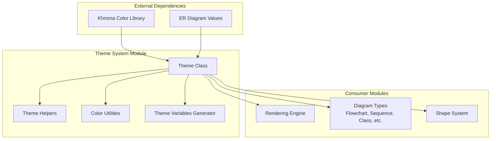
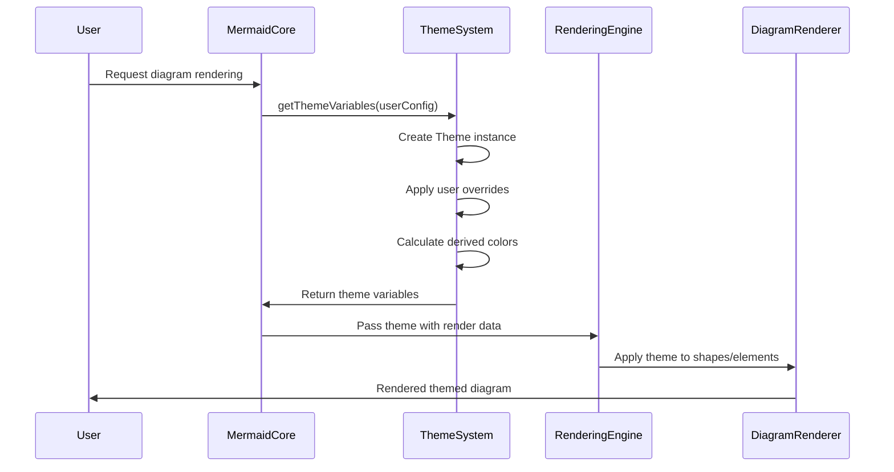
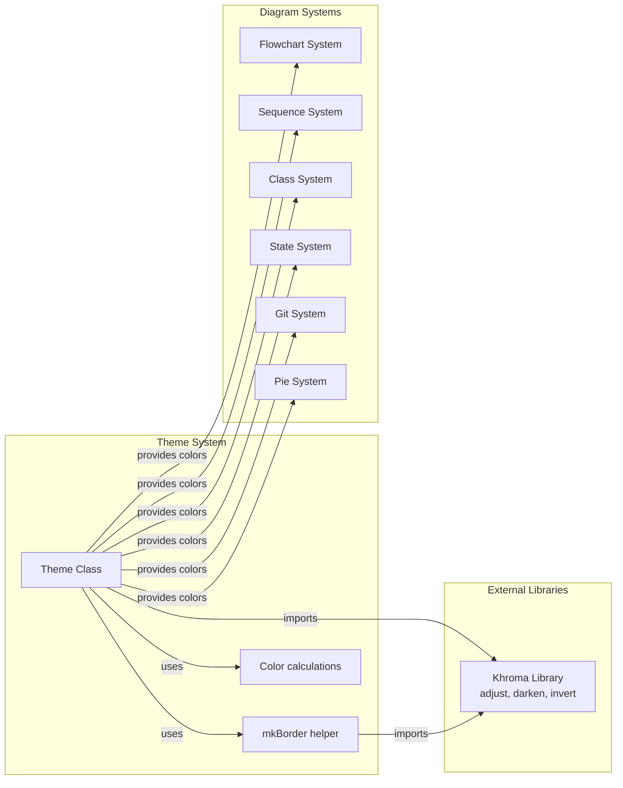
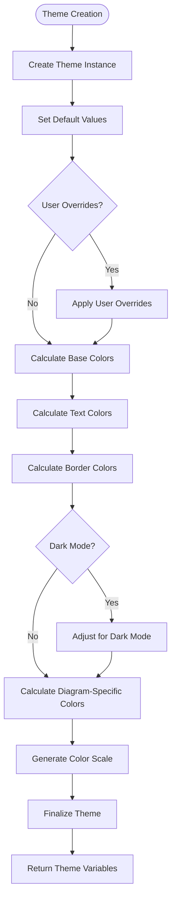

# Theme System Module Documentation

## Introduction

The theme-system module is a core component of the Mermaid rendering engine that provides comprehensive theming and styling capabilities for all diagram types. It serves as the central color management system, handling color calculations, theme variables, and visual consistency across different diagram types. The module ensures that diagrams maintain a cohesive visual appearance while supporting both light and dark modes, custom color schemes, and diagram-specific styling requirements.

## Architecture Overview

The theme-system module is built around a centralized Theme class that manages color variables and calculations for the entire Mermaid ecosystem. It acts as a dependency for the rendering engine and provides theming services to all diagram types through a well-defined interface.



## Core Components

### Theme Class (packages.mermaid.src.themes.theme-base.Theme)

The Theme class is the central component of the theme system, providing a comprehensive color management system with the following key features:

#### Core Properties
- **Background Management**: Controls the base background color (#f4f4f4) used for color calculations
- **Primary Color System**: Defines the main color palette with primary, secondary, and tertiary colors
- **Dark Mode Support**: Automatic color adjustments based on dark mode settings
- **Font Configuration**: Manages font family and size settings
- **Color Scale System**: Provides 12-color scale (cScale0-cScale11) for consistent color usage

#### Key Methods

**constructor()**: Initializes default theme values including background, primary colors, font settings, and theme limits.

**updateColors()**: The core method that calculates derived colors from base colors. It handles:
- Text color calculations based on background contrast
- Border color generation using the mkBorder helper
- Dark mode adjustments for all color properties
- Diagram-specific color variables for different diagram types

**calculate(overrides)**: Processes user-provided color overrides and recalculates the theme. Supports two modes:
- No overrides: Recalculates colors from existing base colors
- With overrides: Applies user overrides and recalculates derived colors

#### Color Categories

The Theme class manages colors for multiple diagram categories:

1. **General Colors**: Primary, secondary, tertiary colors and their derivatives
2. **Flowchart Colors**: Node backgrounds, borders, cluster colors, edge labels
3. **Sequence Diagram Colors**: Actor colors, signal colors, activation colors
4. **Gantt Chart Colors**: Task colors, section colors, grid colors
5. **State Diagram Colors**: State backgrounds, transition colors
6. **ER Diagram Colors**: Row colors for alternating patterns
7. **Git Graph Colors**: Branch colors with light/dark mode adjustments
8. **Pie Chart Colors**: Slice colors with specific hue adjustments
9. **Specialized Diagrams**: Radar, Architecture, Quadrant, XY Chart, Requirement diagrams

### Theme Variables Generator

The `getThemeVariables(userOverrides)` function provides a factory method for creating themed instances:
- Creates new Theme instance
- Applies user overrides through calculate() method
- Returns fully configured theme object

## Data Flow



## Component Interactions



## Theme Calculation Process



## Integration with Rendering Engine

The theme system integrates closely with the [rendering engine](rendering-engine.md) through the following mechanisms:

1. **Color Provision**: The Theme class provides all necessary colors to the rendering engine
2. **Shape Styling**: Colors are applied to shapes through the [shape system](shape-system.md)
3. **Consistency**: Ensures visual consistency across all diagram elements
4. **Dynamic Updates**: Supports runtime theme changes through the calculate() method

## Dependencies

### Internal Dependencies
- **Theme Helpers**: Uses `mkBorder` function for border color calculations
- **ER Diagram Values**: Imports hardcoded values for ER diagram theming

### External Dependencies
- **Khroma Library**: Provides color manipulation functions (adjust, darken, invert, isDark, lighten)

### Consumer Dependencies
- **Rendering Engine**: Primary consumer of theme variables
- **All Diagram Types**: Each diagram type uses theme-specific colors
- **Shape System**: Applies theme colors to shape definitions

## Configuration Options

The theme system supports extensive customization through the user overrides object:

### Base Color Options
- `background`: Diagram background color
- `primaryColor`: Main primary color
- `secondaryColor`: Secondary color (auto-calculated if not provided)
- `tertiaryColor`: Tertiary color (auto-calculated if not provided)

### Text and Font Options
- `primaryTextColor`: Primary text color
- `fontFamily`: Font family for diagram text
- `fontSize`: Base font size

### Mode Options
- `darkMode`: Boolean to enable dark mode adjustments

### Advanced Options
- Individual diagram-specific colors can be overridden
- Color scale values (cScale0-cScale11) can be customized
- Border colors and text colors for specific elements

## Usage Examples

### Basic Theme Usage
```javascript
// Get default theme
const theme = getThemeVariables();

// Apply custom theme
const customTheme = getThemeVariables({
  primaryColor: '#3498db',
  background: '#2c3e50',
  darkMode: true
});
```

### Integration with Rendering
```javascript
// Theme is automatically applied during diagram rendering
mermaid.render('diagram', diagramText, {
  theme: 'dark', // or custom theme object
  themeVariables: {
    primaryColor: '#e74c3c'
  }
});
```

## Best Practices

1. **Color Contrast**: Ensure sufficient contrast between text and background colors
2. **Consistency**: Use the color scale system for consistent color usage
3. **Dark Mode**: Test themes in both light and dark modes
4. **Accessibility**: Consider color blindness when customizing themes
5. **Performance**: Theme calculations are cached, but avoid frequent theme changes

## Related Documentation

- [Rendering Engine](rendering-engine.md) - Primary consumer of theme variables
- [Shape System](shape-system.md) - Applies theme colors to diagram shapes
- [Mermaid Core API](mermaid-core-api.md) - Entry point for theme configuration
- [Diagram Types](diagram-types.md) - Individual diagram theming requirements