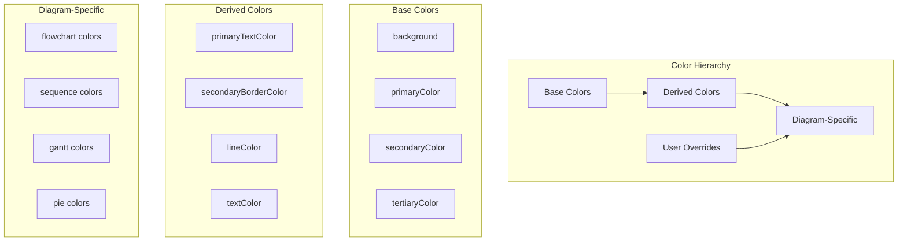
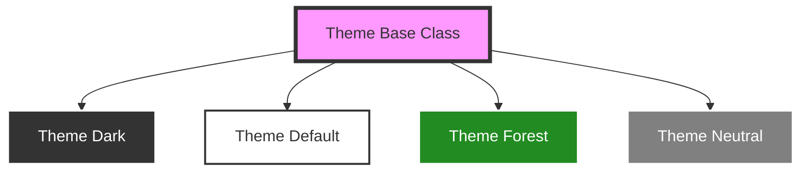

# Themes Module Documentation

## Overview

The themes module is a core component of the Mermaid diagramming library that provides comprehensive theming capabilities for all diagram types. It manages visual styling, color schemes, and appearance customization across the entire Mermaid ecosystem, ensuring consistent and aesthetically pleasing diagram rendering.

## Purpose

The themes module serves as the central styling engine for Mermaid, offering:

- **Visual Consistency**: Standardized color palettes and styling across all diagram types
- **Customization**: Flexible theme system allowing users to override default styles
- **Accessibility**: Support for both light and dark modes with appropriate contrast ratios
- **Extensibility**: Easy addition of new themes and customization of existing ones
- **Cross-Diagram Compatibility**: Unified theming approach that works across all supported diagram types

## Architecture

```mermaid
graph TB
    subgraph "Themes Module"
        TB[Theme Base]
        TD[Theme Dark]
        TDF[Theme Default]
        TF[Theme Forest]
        TN[Theme Neutral]
        TH[Theme Helpers]
    end
    
    subgraph "Core System"
        CM[Core Mermaid]
        Config[Config System]
        Render[Rendering Engine]
    end
    
    subgraph "Diagram Types"
        FC[Flowchart]
        SD[Sequence]
        CD[Class]
        ST[State]
        ER[ER Diagram]
        GC[Gantt]
        PC[Pie]
        RC[Radar]
        QC[Quadrant]
        XY[XY Chart]
        AD[Architecture]
        GD[Git]
        JD[Journey]
        MM[Mindmap]
        TL[Timeline]
        SK[Sankey]
        TR[Treemap]
        BD[Block]
        PD[Packet]
        RD[Requirement]
    end
    
    TB --> TD
    TB --> TDF
    TB --> TF
    TB --> TN
    TH --> TB
    TH --> TD
    TH --> TDF
    TH --> TF
    TH --> TN
    
    CM --> TB
    Config --> TB
    Render --> TB
    
    TB --> FC
    TB --> SD
    TB --> CD
    TB --> ST
    TB --> ER
    TB --> GC
    TB --> PC
    TB --> RC
    TB --> QC
    TB --> XY
    TB --> AD
    TB --> GD
    TB --> JD
    TB --> MM
    TB --> TL
    TB --> SK
    TB --> TR
    TB --> BD
    TB --> PD
    TB --> RD
```



## Core Components

### Theme Base ([`theme-base.md`](theme-base.md))
The foundation class that defines the core theming structure and color calculation logic. It provides:
- Base color variables and their relationships
- Color calculation algorithms for derived colors
- Support for user overrides and customizations
- Comprehensive color palette management for all diagram elements

### Theme Implementations
Each theme extends the base functionality with specific color schemes:

- **Theme Dark** ([`theme-dark.md`](theme-dark.md)): Dark mode theme with high contrast colors
- **Theme Default** ([`theme-default.md`](theme-default.md)): Standard light theme with balanced colors
- **Theme Forest** ([`theme-forest.md`](theme-forest.md)): Nature-inspired green color palette
- **Theme Neutral** ([`theme-neutral.md`](theme-neutral.md)): Minimalist grayscale theme

### Theme Helpers (`theme-helpers.js`)
Utility functions for color manipulation and border calculations, used across all themes.

## Color System

The themes module implements a sophisticated color system with the following hierarchy:



## Theme Variables

### Base Variables
- `background`: Diagram background color
- `primaryColor`: Main theme color
- `secondaryColor`: Secondary theme color
- `tertiaryColor`: Tertiary theme color
- `primaryTextColor`: Primary text color
- `lineColor`: Line and border colors

### Diagram-Specific Variables
Each diagram type has its own set of theme variables:

#### Flowchart Variables
- `nodeBkg`: Node background color
- `nodeBorder`: Node border color
- `clusterBkg`: Cluster background color
- `defaultLinkColor`: Default link color

#### Sequence Diagram Variables
- `actorBorder`: Actor border color
- `actorBkg`: Actor background color
- `signalColor`: Signal/message color
- `noteBkgColor`: Note background color

#### Gantt Chart Variables
- `sectionBkgColor`: Section background color
- `taskBkgColor`: Task background color
- `activeTaskBkgColor`: Active task background color
- `gridColor`: Grid line color

## Integration with Other Modules

### Configuration System
The themes module integrates with the [config module](config.md) to allow theme selection and customization through configuration options.

### Rendering Engine
Works closely with the [rendering-util module](rendering-util.md) to apply theme colors during the rendering process.

### Core Mermaid
Integrates with the [core-mermaid module](core-mermaid.md) to provide theme functionality to the main Mermaid API.

## Usage Examples

### Basic Theme Selection
```javascript
mermaid.initialize({
  theme: 'dark'  // 'default', 'dark', 'forest', 'neutral'
});
```

### Custom Theme Overrides
```javascript
mermaid.initialize({
  theme: 'base',
  themeVariables: {
    primaryColor: '#FF6B6B',
    primaryTextColor: '#FFFFFF',
    primaryBorderColor: '#FF4757'
  }
});
```

## Theme Inheritance



## Color Calculation Process

The themes module uses a sophisticated color calculation process:

1. **Base Color Definition**: Primary colors are defined for each theme
2. **Derived Color Calculation**: Secondary colors are calculated using color theory
3. **Diagram-Specific Assignment**: Colors are mapped to specific diagram elements
4. **User Override Application**: User-provided colors override calculated values
5. **Accessibility Validation**: Colors are checked for contrast and accessibility

## Extensibility

The themes module is designed for easy extension:

- **New Themes**: New theme classes can be created by extending the base theme
- **Custom Variables**: Additional theme variables can be added for new diagram types
- **Color Algorithms**: Custom color calculation methods can be implemented
- **Override System**: Flexible override system allows complete customization

## Performance Considerations

- **Lazy Calculation**: Colors are calculated only when needed
- **Caching**: Calculated colors are cached to avoid redundant calculations
- **Minimal Overhead**: Theme application adds minimal overhead to rendering
- **Efficient Updates**: Theme changes are applied efficiently without full re-renders

## Best Practices

1. **Use Theme Variables**: Always use theme variables instead of hardcoded colors
2. **Test Across Themes**: Ensure diagrams work well with all available themes
3. **Consider Accessibility**: Maintain proper contrast ratios for readability
4. **Document Customizations**: Document any custom theme variables or overrides
5. **Follow Naming Conventions**: Use consistent naming for theme variables

## Related Documentation

- [Core Mermaid Module](core-mermaid.md) - Main Mermaid functionality
- [Configuration Module](config.md) - Theme configuration options
- [Rendering Utilities](rendering-util.md) - Theme application during rendering
- [Diagram-Specific Modules](README.md) - Individual diagram type documentation