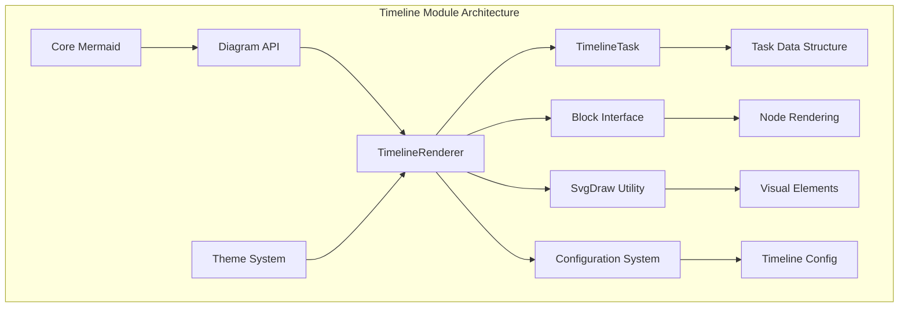
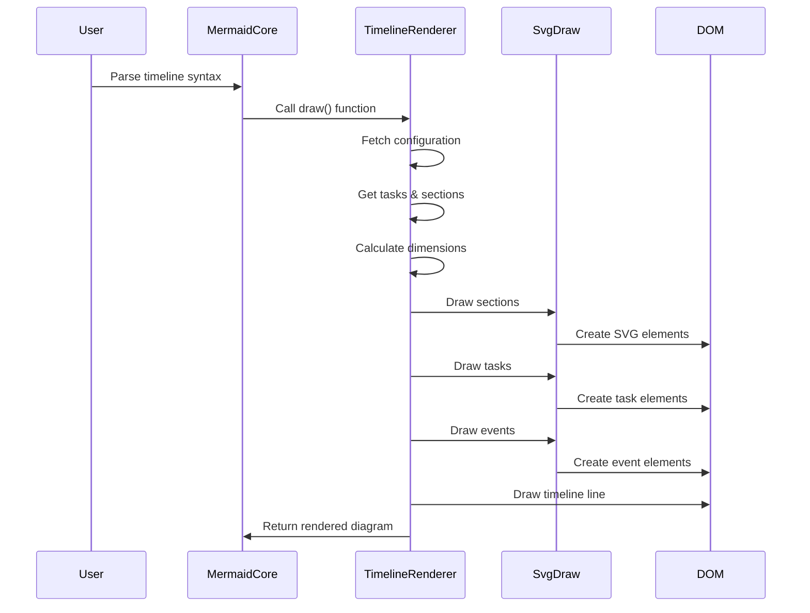
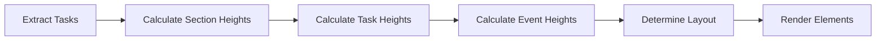
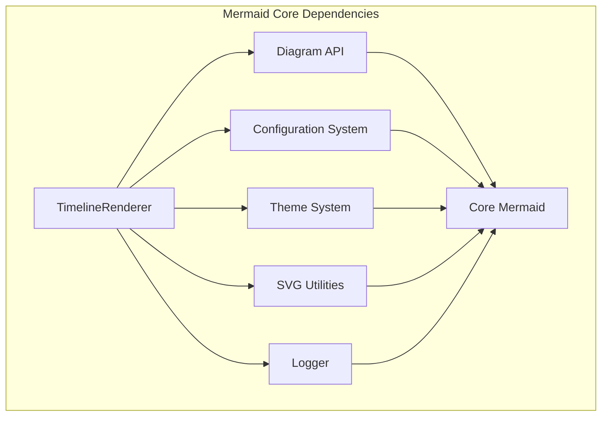
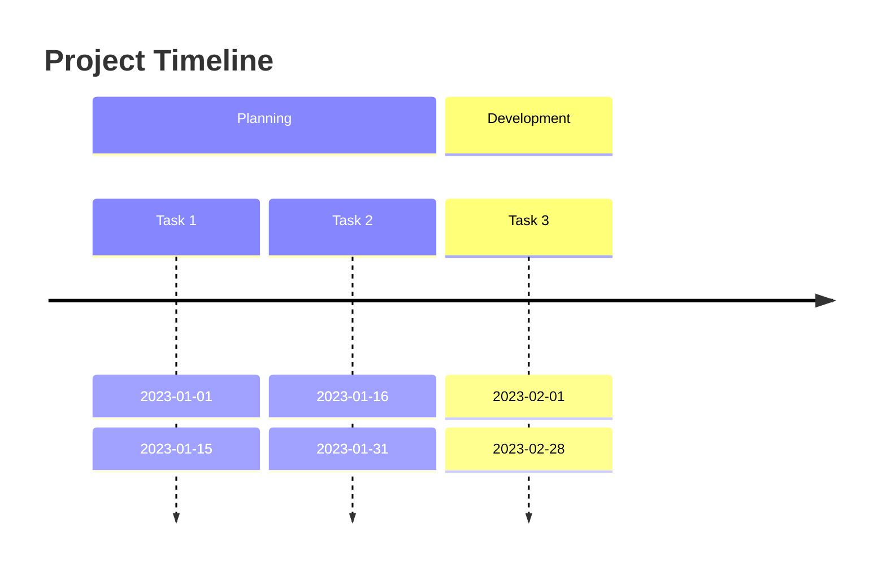
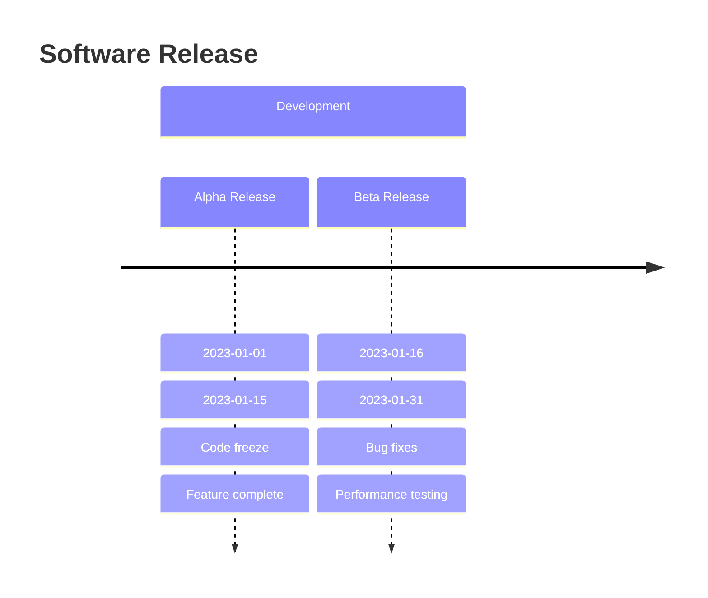

# Timeline Module Documentation

## Introduction

The Timeline module is a specialized diagram renderer within the Mermaid.js ecosystem that creates visual timeline representations. It enables users to display chronological sequences of events, tasks, and milestones in a structured, easy-to-understand format. The module is designed to handle complex timeline data with sections, tasks, and nested events, providing a hierarchical view of temporal information.

## Architecture Overview

The Timeline module follows Mermaid's standard diagram architecture pattern, integrating with the core rendering system while maintaining its own specialized components for timeline-specific functionality.



## Core Components

### TimelineTask

The `TimelineTask` interface defines the structure of individual timeline entries:

```typescript
interface TimelineTask {
  id: number;
  section: string;
  type: string;
  task: string;
  score: number;
  events: string[];
}
```

**Properties:**
- `id`: Unique identifier for the task
- `section`: Section grouping for the task
- `type`: Task classification type
- `task`: Display text for the task
- `score`: Numerical score/value associated with the task
- `events`: Array of related sub-events

### Block Interface

The `Block` interface provides a generic structure for rendering timeline elements:

```typescript
interface Block<TDesc, TSection> {
  number: number;
  descr: TDesc;
  section: TSection;
  width: number;
  padding: number;
  maxHeight: number;
}
```

**Purpose:**
- Standardizes element rendering across sections, tasks, and events
- Provides consistent sizing and spacing calculations
- Enables reusable rendering logic

## Data Flow Architecture



## Rendering Process

### 1. Initialization Phase

The rendering process begins with configuration fetching and environment setup:

```typescript
const conf = getConfig();
const LEFT_MARGIN = conf.timeline?.leftMargin ?? 50;
```

**Security Considerations:**
- Supports sandbox mode for secure rendering
- Handles different security levels appropriately
- Manages DOM access based on security context

### 2. Data Extraction Phase

The renderer extracts structured data from the diagram database:

```typescript
const tasks: TimelineTask[] = diagObj.db.getTasks();
const title = diagObj.db.getCommonDb().getDiagramTitle();
const sections: string[] = diagObj.db.getSections();
```

### 3. Dimension Calculation Phase

Critical for proper layout, the renderer calculates:

- **Section Heights**: Maximum height for each section header
- **Task Heights**: Maximum height for individual tasks
- **Event Dimensions**: Cumulative height for event sequences
- **Spacing Requirements**: Margins and padding calculations



### 4. Rendering Phase

The actual drawing process follows a hierarchical approach:

#### Section Rendering
Sections are drawn as horizontal bands containing related tasks:

```typescript
sections.forEach((section) => {
  const tasksForSection = tasks.filter((task) => task.section === section);
  // Render section and associated tasks
});
```

#### Task Rendering
Tasks are positioned within their sections with consistent spacing:

- **Horizontal Positioning**: 200px increments per task
- **Vertical Alignment**: Aligned within section boundaries
- **Event Connections**: Dashed lines connecting tasks to events

#### Event Rendering
Events are displayed below their parent tasks:

- **Vertical Stacking**: Events stack vertically with 10px spacing
- **Connection Lines**: Dashed lines with arrowheads
- **Consistent Styling**: Uniform appearance across all events

## Configuration System

The Timeline module integrates with Mermaid's configuration system:

```typescript
interface TimelineConfig {
  leftMargin?: number;
  padding?: number;
  useMaxWidth?: boolean;
  disableMulticolor?: boolean;
}
```

**Configuration Options:**
- `leftMargin`: Left margin offset (default: 50px)
- `padding`: General padding (default: 50px)
- `useMaxWidth`: Whether to use maximum available width
- `disableMulticolor`: Disable multi-color sections

## Integration with Mermaid Ecosystem

### Dependency Relationships



### External Dependencies

- **D3.js**: DOM manipulation and SVG creation
- **Configuration Module**: [`config.md`](config.md) for timeline-specific settings
- **Diagram API**: [`diagram-api.md`](diagram-api.md) for diagram lifecycle management
- **Rendering Utilities**: [`rendering-util.md`](rendering-util.md) for common rendering functions

## Styling and Theming

The Timeline module supports Mermaid's theming system through:

- **CSS Classes**: `.taskWrapper`, `.eventWrapper`, `.lineWrapper`
- **Color Schemes**: Integration with theme color palettes
- **Typography**: Consistent font styling across themes
- **Spacing**: Theme-aware padding and margins

## Performance Considerations

### Optimization Strategies

1. **Virtual Node Calculation**: Pre-calculates dimensions before rendering
2. **Efficient DOM Updates**: Minimizes DOM manipulation operations
3. **Memory Management**: Proper cleanup of temporary objects
4. **Layout Caching**: Reuses calculated dimensions where possible

### Scalability Factors

- **Task Count**: Linear scaling with number of tasks
- **Event Complexity**: O(n²) complexity for event layout calculations
- **Section Overhead**: Minimal impact on overall performance

## Error Handling

The module implements robust error handling:

- **Type Safety**: TypeScript interfaces prevent runtime errors
- **Null Checks**: Validates data before processing
- **Fallback Values**: Provides sensible defaults for missing configuration
- **Logging**: Comprehensive debug logging for troubleshooting

## Usage Examples

### Basic Timeline



### Timeline with Events



## Extension Points

The Timeline module provides several extension opportunities:

### Custom Rendering
- Override `svgDraw` methods for custom visual styles
- Implement custom block types for specialized timeline entries
- Add new configuration options for enhanced customization

### Data Integration
- Extend `TimelineTask` interface for additional metadata
- Implement custom data parsers for different input formats
- Add support for real-time data updates

### Theme Customization
- Create timeline-specific theme variants
- Implement dynamic color schemes
- Add support for custom fonts and styling

## Testing Strategy

The Timeline module should be tested for:

- **Rendering Accuracy**: Visual regression testing
- **Data Integrity**: Input validation and processing
- **Performance**: Large dataset handling
- **Cross-browser Compatibility**: SVG rendering consistency
- **Accessibility**: Screen reader compatibility

## Future Enhancements

Potential improvements for the Timeline module:

1. **Interactive Features**: Click handlers and hover effects
2. **Animation Support**: Smooth transitions and updates
3. **Export Capabilities**: PDF and image export functionality
4. **Mobile Optimization**: Responsive design for mobile devices
5. **Real-time Updates**: Live data streaming support

## Related Documentation

- [Core Mermaid Architecture](core-mermaid.md)
- [Configuration System](config.md)  
- [Diagram API](diagram-api.md)
- [Rendering Utilities](rendering-util.md)
- [Theme System](themes.md)