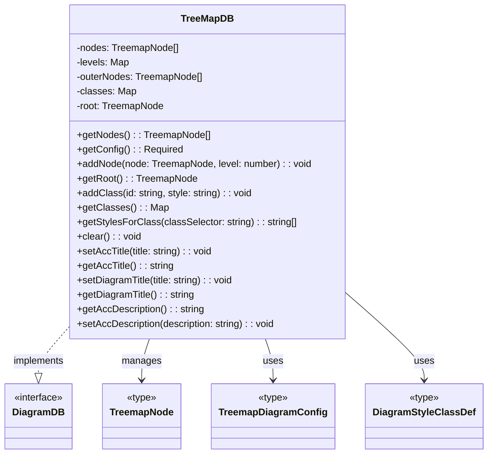
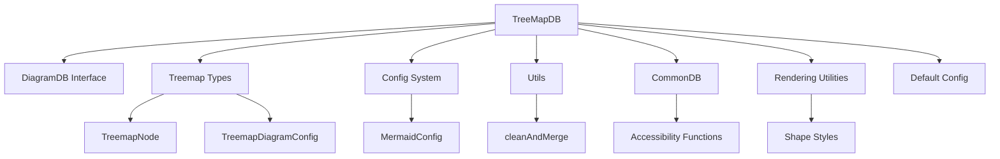
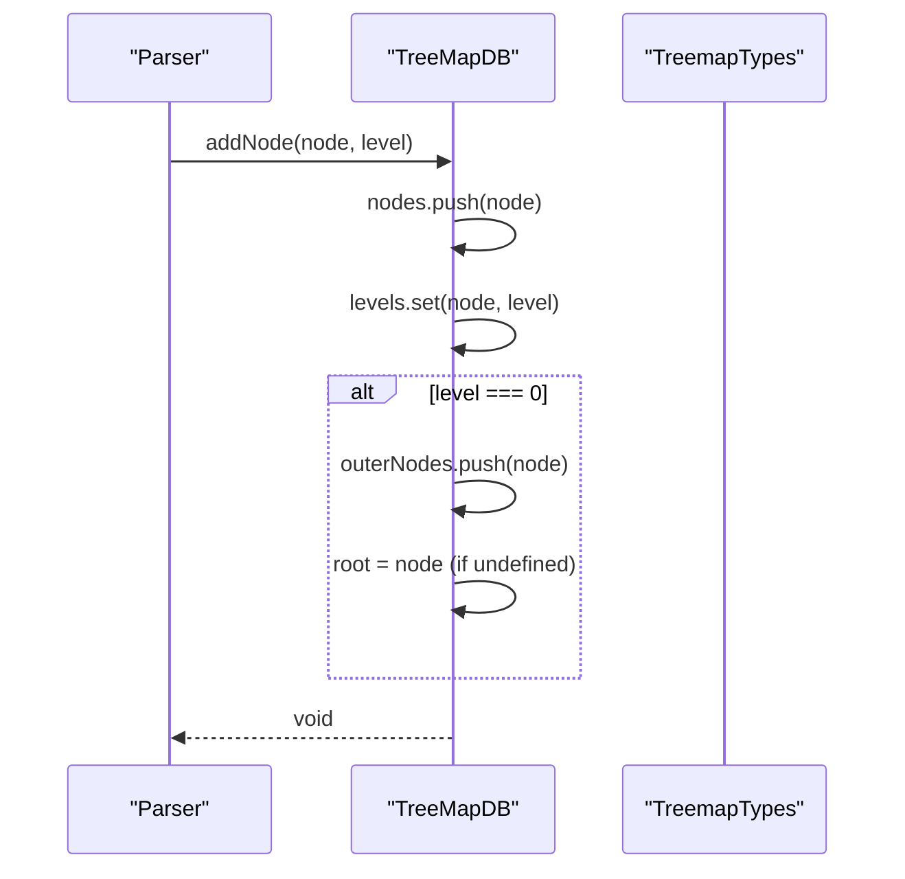
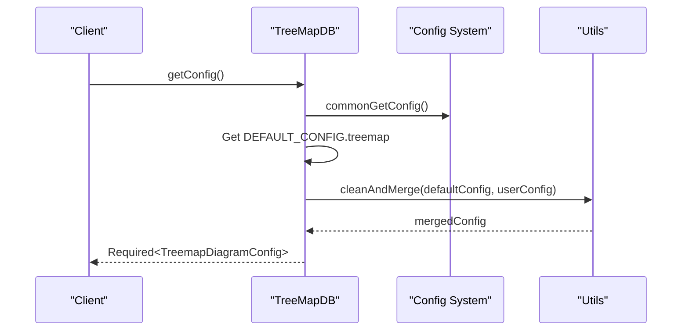
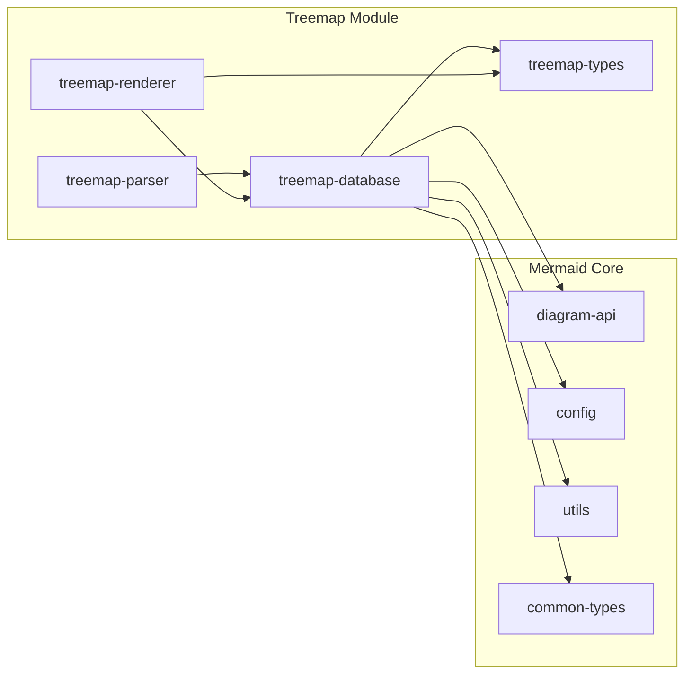
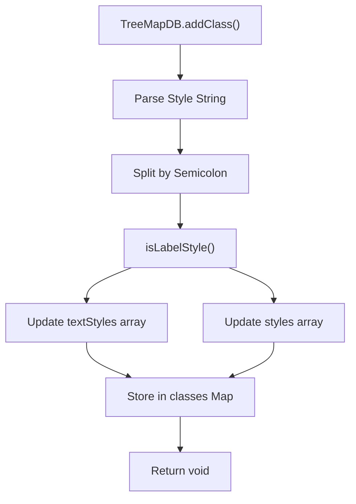

# Treemap Database Module

## Overview

The treemap-database module is a core component of the Mermaid treemap diagram system, responsible for managing the hierarchical data structure and configuration for treemap visualizations. It implements the `DiagramDB` interface and serves as the central data repository for treemap diagrams, handling node management, styling, and configuration merging.

## Purpose and Core Functionality

The TreeMapDB class provides the following key functionalities:

- **Hierarchical Data Management**: Stores and manages treemap nodes in a tree structure with level-based organization
- **Configuration Management**: Handles treemap-specific configuration by merging default and user-provided settings
- **Styling System**: Manages CSS-like style classes for visual customization of treemap elements
- **Node Relationships**: Maintains parent-child relationships and level-based node organization
- **Accessibility Support**: Provides title and description management for accessibility compliance

## Architecture

### Component Structure



### Module Dependencies



## Data Flow

### Node Addition Flow



### Configuration Retrieval Flow



## Component Relationships

### Integration with Treemap Module

The treemap-database module is part of the larger treemap diagram system:



### Style Management



## Key Features

### 1. Hierarchical Node Management
- Maintains nodes in a flat array with level mapping
- Tracks outer nodes (level 0) separately for root construction
- Supports parent-child relationships through the hierarchical structure

### 2. Configuration System
- Merges default treemap configuration with user-provided settings
- Uses the `cleanAndMerge` utility for safe configuration merging
- Returns a `Required<TreemapDiagramConfig>` ensuring all properties are defined

### 3. Style Class Management
- Supports CSS-like style definitions with semicolon-separated properties
- Distinguishes between label styles and regular styles
- Handles comma escaping in style strings
- Provides class-based styling for treemap elements

### 4. Accessibility Support
- Inherits accessibility functions from `commonDb`
- Supports diagram titles and descriptions
- Ensures compliance with accessibility standards

## Usage Patterns

### Basic Node Addition
```typescript
const db = new TreeMapDB();
const node: TreemapNode = { name: 'Root', value: 100 };
db.addNode(node, 0); // Add root level node
```

### Style Class Definition
```typescript
db.addClass('highlight', 'fill:#ff0000,stroke:#000000;label:font-weight:bold');
```

### Configuration Retrieval
```typescript
const config = db.getConfig(); // Returns merged configuration
```

## Related Documentation

- [treemap-types](treemap-types.md) - Type definitions for treemap diagrams
- [diagram-api](diagram-api.md) - Core diagram API interfaces
- [config](config.md) - Configuration system documentation
- [utils](utils.md) - Utility functions including `cleanAndMerge`
- [common-types](common-types.md) - Common type definitions and database functions

## Implementation Notes

1. **Memory Management**: The `clear()` method resets all internal state, important for diagram reuse
2. **Root Node Handling**: The first level-0 node becomes the implicit root
3. **Style Parsing**: Comma escaping uses `§§§` as a temporary placeholder
4. **Configuration Caching**: Configuration is computed on-demand, not cached
5. **Type Safety**: Uses TypeScript's `Required<T>` utility for configuration guarantees