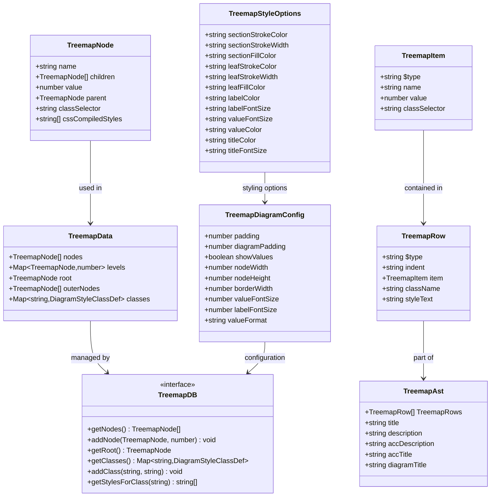
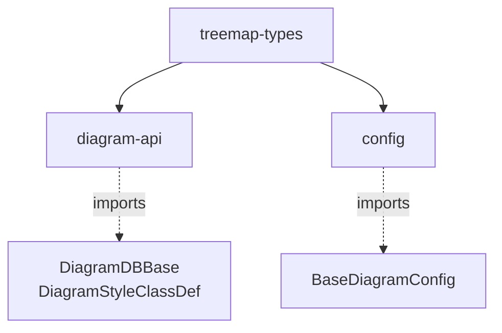
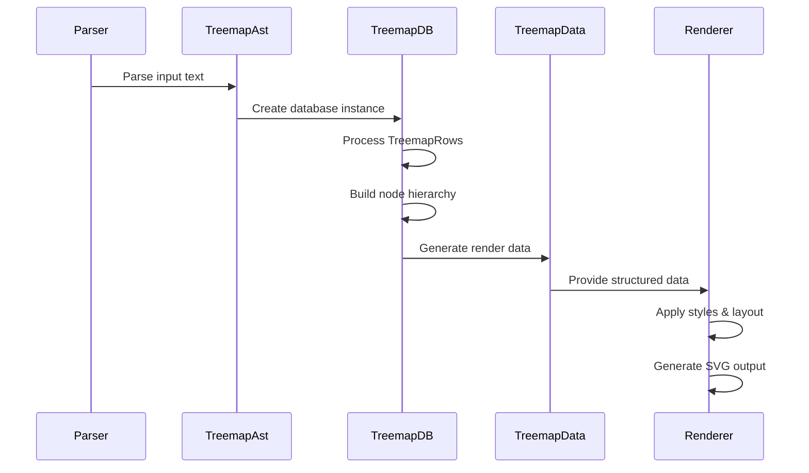
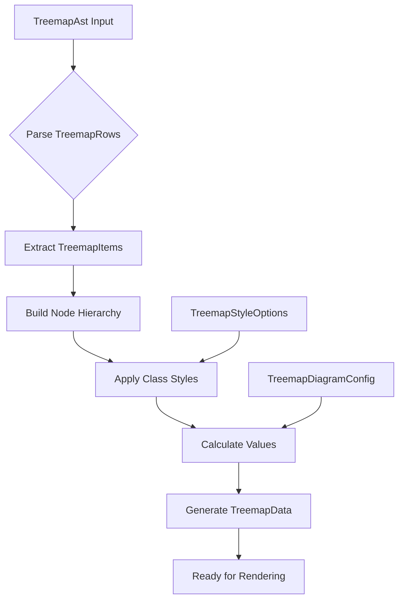
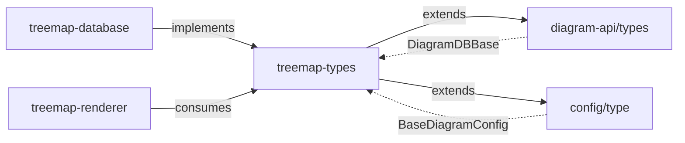
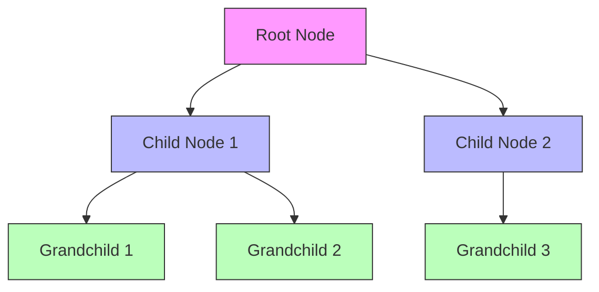

# Treemap Types Module Documentation

## Introduction

The `treemap-types` module provides the foundational type definitions for creating treemap diagrams in Mermaid. Treemap diagrams are hierarchical data visualization tools that display nested rectangles to represent data proportions and relationships. This module defines the core data structures, interfaces, and configuration types that enable the creation, styling, and rendering of treemap diagrams.

## Module Architecture

### Core Type Hierarchy



### Module Dependencies



## Core Components

### TreemapNode
The fundamental building block representing a single node in the treemap hierarchy.

**Properties:**
- `name`: The display name of the node
- `children`: Optional array of child nodes for hierarchical structure
- `value`: Optional numerical value for size calculation
- `parent`: Reference to parent node for tree navigation
- `classSelector`: CSS class selector for styling
- `cssCompiledStyles`: Array of compiled CSS styles

### TreemapDB
Database interface for managing treemap data and operations.

**Methods:**
- `getNodes()`: Retrieves all nodes in the treemap
- `addNode(node, level)`: Adds a node at specified hierarchy level
- `getRoot()`: Returns the root node of the tree
- `getClasses()`: Retrieves style class definitions
- `addClass(className, style)`: Adds a new style class
- `getStylesForClass(classSelector)`: Gets styles for a specific class

### TreemapData
Container for processed treemap data ready for rendering.

**Properties:**
- `nodes`: Array of all nodes
- `levels`: Map tracking node hierarchy levels
- `root`: Root node reference
- `outerNodes`: Array of outer/leaf nodes
- `classes`: Map of style class definitions

### TreemapStyleOptions
Comprehensive styling options for treemap visualization.

**Style Categories:**
- **Section Styles**: `sectionStrokeColor`, `sectionStrokeWidth`, `sectionFillColor`
- **Leaf Styles**: `leafStrokeColor`, `leafStrokeWidth`, `leafFillColor`
- **Text Styles**: `labelColor`, `labelFontSize`, `valueFontSize`, `valueColor`
- **Title Styles**: `titleColor`, `titleFontSize`

### TreemapDiagramConfig
Configuration interface extending base diagram configuration.

**Layout Options:**
- `padding`: Internal padding between nodes
- `diagramPadding`: External padding for entire diagram
- `nodeWidth/Height`: Fixed dimensions for nodes
- `borderWidth`: Border thickness

**Display Options:**
- `showValues`: Toggle value display
- `valueFormat`: Format string for value display
- `valueFontSize/labelFontSize`: Text sizing

## Data Flow Architecture



## AST Processing Flow



## Integration with Mermaid Ecosystem

### Relationship to Core Modules



### Configuration Inheritance

The `TreemapDiagramConfig` extends `BaseDiagramConfig` from the config module, inheriting common diagram properties while adding treemap-specific options:

```typescript
interface TreemapDiagramConfig extends BaseDiagramConfig {
  // Treemap-specific properties
  padding?: number;
  showValues?: boolean;
  // ... additional properties
}
```

## Usage Patterns

### Node Hierarchy Construction



### Style Application

The module supports CSS-like styling through class selectors:

1. Define style classes in `TreemapStyleOptions`
2. Apply classes to nodes via `classSelector` property
3. Styles are compiled and applied during rendering
4. Hierarchical style inheritance is supported

## Key Features

### Hierarchical Data Support
- Unlimited nesting depth
- Parent-child relationships
- Value aggregation for parent nodes
- Level-based styling

### Flexible Styling
- Section and leaf-specific styles
- CSS class-based styling
- Dynamic style compilation
- Theme integration support

### Configuration Options
- Layout customization
- Value display control
- Font and color theming
- Border and padding settings

## Related Documentation

- [diagram-api](diagram-api.md) - Core diagram API and base types
- [config](config.md) - Configuration system and base diagram config
- [treemap-database](treemap-database.md) - Database implementation for treemap data
- [rendering-util](rendering-util.md) - Rendering utilities and common types

## Summary

The `treemap-types` module provides a comprehensive type system for treemap diagram creation in Mermaid. It defines the essential data structures for representing hierarchical data, managing styles, and configuring diagram behavior. The module's design emphasizes flexibility, extensibility, and integration with Mermaid's broader architecture while maintaining clear separation of concerns between data representation, styling, and configuration.