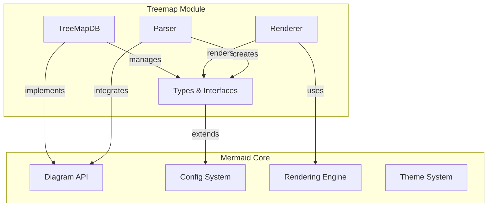
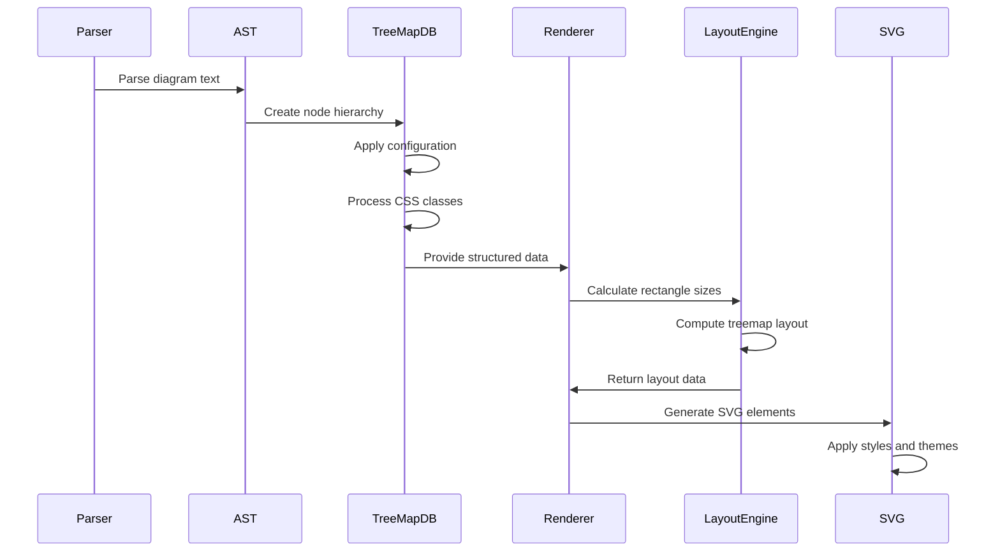
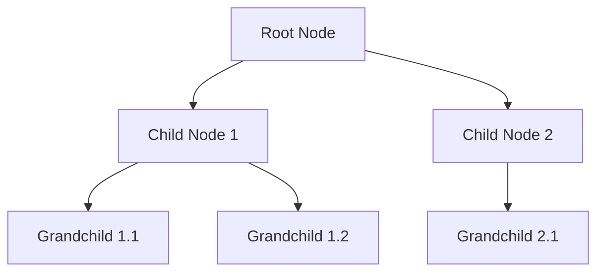

# Treemap Module Documentation

## Overview

The Treemap module is a specialized diagram type within the Mermaid ecosystem that provides hierarchical data visualization through nested rectangular layouts. It enables users to represent tree-structured data where each branch is given a rectangle, and sub-branches are represented as smaller rectangles within the parent rectangle.

## Purpose

Treemap diagrams are particularly useful for:
- Visualizing hierarchical data with quantitative values
- Displaying part-to-whole relationships across multiple levels
- Showing relative sizes of categories and subcategories
- Creating space-efficient visualizations of large datasets

## Architecture

The Treemap module follows Mermaid's standard diagram architecture pattern, integrating with the core framework through well-defined interfaces and type systems.

## Core Components

### TreeMapDB (`packages.mermaid.src.diagrams.treemap.db.TreeMapDB`)
The central database class that manages treemap data, nodes, and styling information. It implements the `DiagramDB` interface and provides methods for:
- Node management and hierarchical organization
- CSS class and style management
- Configuration handling
- Data access and manipulation

For detailed information about the TreeMapDB implementation, see [treemap-database.md](treemap-database.md).

### Type System
The module defines comprehensive TypeScript interfaces for type safety:
- `TreemapNode`: Represents individual nodes in the hierarchy
- `TreemapDB`: Database interface definition
- `TreemapStyleOptions`: Styling configuration options
- `TreemapDiagramConfig`: Diagram-specific configuration
- `TreemapAst`: Abstract Syntax Tree representation

For comprehensive type definitions and interfaces, see [treemap-types.md](treemap-types.md).

## Data Structure

Treemap diagrams use a hierarchical tree structure where:
- Each node can contain child nodes
- Nodes can have associated values for size calculation
- Parent-child relationships define the nesting structure
- CSS classes can be applied for custom styling

## Data Flow and Processing Pipeline

The treemap module follows a standard data processing pipeline:

### Processing Steps

1. **Parsing**: The diagram text is parsed into an Abstract Syntax Tree (AST)
2. **Database Population**: The TreeMapDB processes the AST and creates the node hierarchy
3. **Configuration Application**: User and default configurations are merged and applied
4. **Style Processing**: CSS classes are parsed and stored for later application
5. **Layout Calculation**: The layout engine calculates rectangle sizes based on values and hierarchy
6. **Rendering**: SVG elements are generated with proper positioning and styling
7. **Theme Application**: Final visual styling is applied based on the selected theme

## Integration with Mermaid Ecosystem

The Treemap module integrates seamlessly with other Mermaid components:

- **Configuration System**: Inherits from `BaseDiagramConfig` and integrates with Mermaid's configuration management
- **Rendering Pipeline**: Uses the common rendering utilities and shape definitions
- **Theme System**: Supports all Mermaid themes for consistent visual appearance
- **Parser Integration**: Follows standard Mermaid parsing patterns for diagram syntax

## Styling and Customization

The module supports extensive styling options through:
- CSS class definitions for nodes
- Configurable colors, fonts, and borders
- Value and label formatting options
- Theme integration for consistent appearance

## Configuration Options

Key configuration options include:
- `padding`: Internal padding between nodes
- `diagramPadding`: External padding for the entire diagram
- `showValues`: Toggle value display on nodes
- `nodeWidth`/`nodeHeight`: Base dimensions for nodes
- `valueFontSize`/`labelFontSize`: Text sizing options
- `valueFormat`: Number formatting for displayed values

## Usage Examples

Treemap diagrams are created using Mermaid's standard syntax with the `treemap` diagram type. The hierarchical structure is defined through indentation and nesting in the diagram text.

## Related Documentation

For more information about related modules:
- [config.md](config.md) - Configuration system details
- [diagram-api.md](diagram-api.md) - Core diagram API documentation
- [rendering-util.md](rendering-util.md) - Rendering utilities and helpers
- [themes.md](themes.md) - Theme system and styling options
- [types.md](types.md) - Common type definitions

## Dependencies

The Treemap module depends on several core Mermaid modules:
- Core configuration and type systems
- Rendering utilities for shape and text handling
- Common database functionality
- Theme and styling systems
- Parser infrastructure