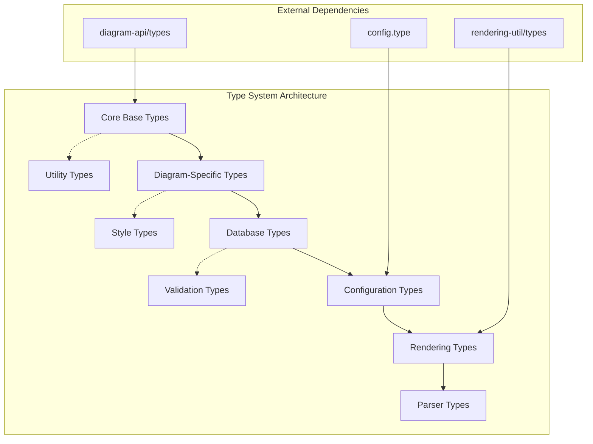
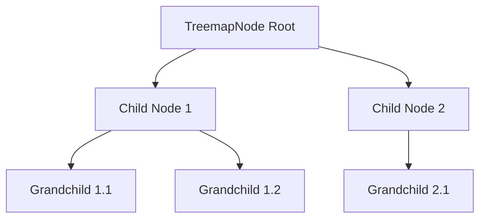
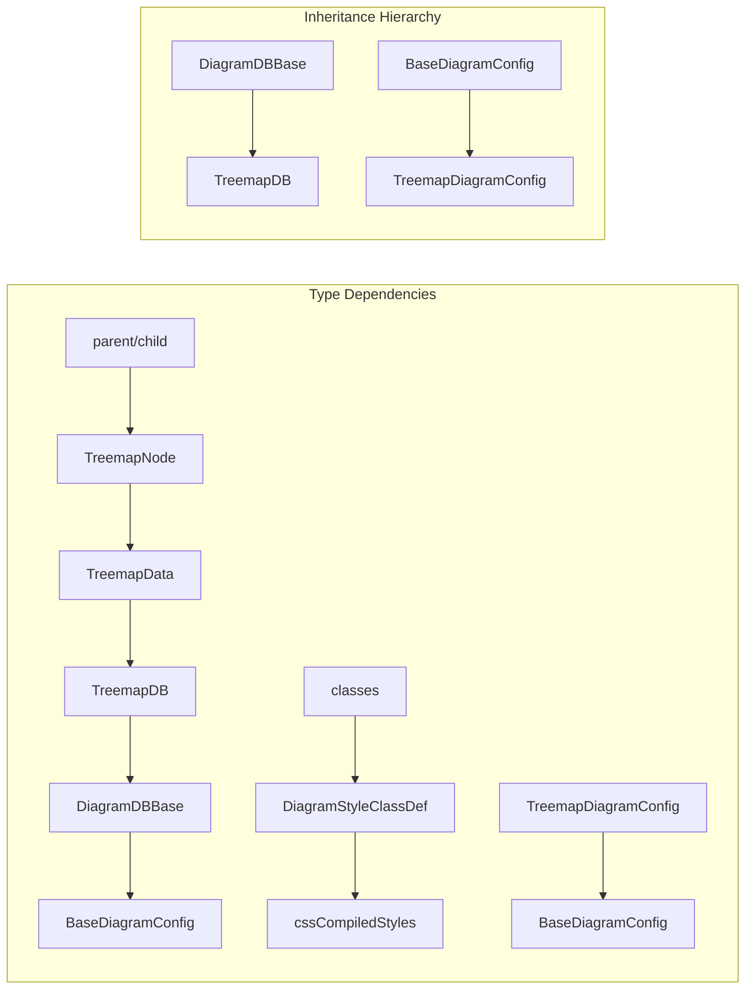
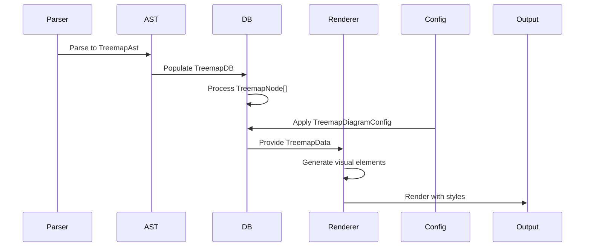
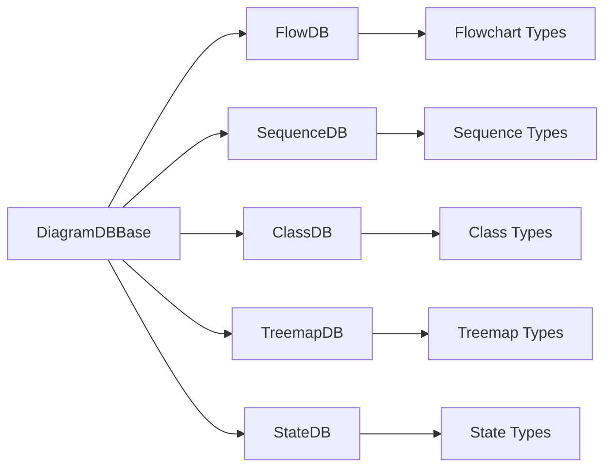
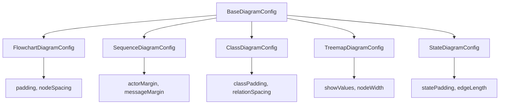

# Type System Module Documentation

## Introduction

The type-system module serves as the foundational type definition layer for the Mermaid diagramming library. It provides comprehensive TypeScript interfaces and type definitions that establish the contract between different components of the diagram rendering pipeline. This module ensures type safety across parsing, data processing, rendering, and configuration management for all diagram types supported by Mermaid.

The type system is designed with modularity and extensibility in mind, allowing for consistent data structures across different diagram types while maintaining the flexibility to accommodate diagram-specific requirements. It forms the backbone of Mermaid's architecture by defining how data flows through the system from raw text input to rendered SVG output.

## Module Overview

The type-system module encompasses type definitions across multiple diagram categories:

- **Core Base Types**: Fundamental interfaces like `DiagramDBBase`, `BaseDiagramConfig`, and `DiagramStyleClassDef`
- **Diagram-Specific Types**: Specialized types for each diagram type (Treemap, Flowchart, Sequence, etc.)
- **Hierarchical Data Types**: Recursive node structures for tree-based diagrams
- **Configuration Types**: Type-safe configuration interfaces for each diagram type
- **Database Interfaces**: Consistent APIs for diagram data management
- **Rendering Types**: Data structures for visual representation and styling

## Architecture Overview

The type-system module is organized into several key architectural layers that work together to provide a comprehensive typing framework for the entire Mermaid ecosystem:



### Core Type Categories

The type system encompasses several fundamental categories of types that serve different purposes within the Mermaid architecture:

**Base Interface Types**: These form the foundation of the type hierarchy, providing common interfaces that are extended by diagram-specific implementations. They establish the contract for how different components interact with each other.

**Data Structure Types**: These define the shape of data as it flows through the system, from initial parsing through to final rendering. They ensure consistency in how diagram elements are represented and manipulated.

**Configuration Types**: These interfaces define the configuration options available for each diagram type, allowing users to customize appearance and behavior while maintaining type safety.

**Database Interfaces**: These types define the interfaces for diagram-specific databases that store and manage the parsed diagram data, providing a consistent API for data access and manipulation.

## Treemap Type System Deep Dive

Based on the provided core components, let's examine the Treemap diagram implementation as an exemplar of the comprehensive type system design:

### Node Hierarchy



The `TreemapNode` interface provides a flexible foundation for representing hierarchical data:

```typescript
export interface TreemapNode {
  name: string;
  children?: TreemapNode[];
  value?: number;
  parent?: TreemapNode;
  classSelector?: string;
  cssCompiledStyles?: string[];
}
```

**Key Design Principles:**
- **Recursive Structure**: Nodes can contain child nodes, enabling infinite nesting
- **Optional Properties**: Value, parent, and styling properties are optional, allowing for different node types
- **Style Integration**: Support for CSS class selectors and compiled styles
- **Parent References**: Bidirectional relationships for efficient traversal

### Database Interface Design

The `TreemapDB` interface demonstrates the database pattern used across Mermaid:

```typescript
export interface TreemapDB extends DiagramDBBase<TreemapDiagramConfig> {
  getNodes: () => TreemapNode[];
  addNode: (node: TreemapNode, level: number) => void;
  getRoot: () => TreemapNode | undefined;
  getClasses: () => Map<string, DiagramStyleClassDef>;
  addClass: (className: string, style: string) => void;
  getStylesForClass: (classSelector: string) => string[];
}
```

**Design Principles:**
- **Immutable Data Access**: Getter methods provide read access to internal data
- **Structured Data Modification**: Add methods ensure data integrity
- **Style Management**: Integrated support for CSS class management
- **Configuration Integration**: Type-safe access to diagram configuration

### Data Structure Types

```typescript
export interface TreemapData {
  nodes: TreemapNode[];
  levels: Map<TreemapNode, number>;
  root?: TreemapNode;
  outerNodes: TreemapNode[];
  classes: Map<string, DiagramStyleClassDef>;
}
```

The `TreemapData` interface represents processed diagram data ready for rendering, including computed properties like node levels and style classes.

### Configuration System

```typescript
export interface TreemapDiagramConfig extends BaseDiagramConfig {
  padding?: number;
  diagramPadding?: number;
  showValues?: boolean;
  nodeWidth?: number;
  nodeHeight?: number;
  borderWidth?: number;
  valueFontSize?: number;
  labelFontSize?: number;
  valueFormat?: string;
}
```

Configuration features:
- **Dimensional Control**: Padding, width, and height settings
- **Visual Customization**: Font sizes, colors, and value formatting
- **Behavioral Options**: Show/hide values, diagram padding
- **Type Safety**: All properties are strongly typed with optional modifiers

## Component Relationships

The type system establishes clear relationships between different components of the Mermaid architecture through well-defined interfaces:



### Key Relationships

**Hierarchical Data Structures**: The type system supports nested data structures through parent-child relationships, as seen in the `TreemapNode` interface where nodes can contain child nodes, enabling the representation of complex hierarchical diagrams.

**Configuration Inheritance**: Configuration types follow an inheritance pattern where diagram-specific configurations extend base configuration interfaces, ensuring consistency while allowing for customization.

**Database Interface Pattern**: All diagram databases implement a common base interface (`DiagramDBBase`) while providing diagram-specific methods and data structures, creating a uniform API for data management.

**Style System Integration**: The type system integrates with Mermaid's style system through `DiagramStyleClassDef` and `cssCompiledStyles`, enabling dynamic styling of diagram elements.

## Data Flow Architecture

The type system facilitates a well-defined data flow through the Mermaid rendering pipeline:



### Data Transformation Stages

**Parsing Stage**: Raw diagram text is parsed into Abstract Syntax Tree (AST) structures defined by the type system. The `TreemapAst` interface represents the parsed structure with rows, items, and metadata.

**Database Population**: Parsed data is transformed into database structures that provide efficient access and manipulation capabilities. The `TreemapDB` interface defines methods for adding and retrieving nodes.

**Data Processing**: The database processes raw node data into structured formats suitable for rendering, including level calculations and parent-child relationship establishment.

**Configuration Application**: Diagram-specific configurations are applied to customize rendering behavior, with type-safe access to configuration properties.

**Rendering Preparation**: Final data structures are prepared for the rendering engine, ensuring all necessary information is available for visual representation.

## Cross-Diagram Type Patterns

The type system employs consistent patterns across different diagram types:

### Database Interface Pattern

All diagram databases follow a similar interface pattern:



### Configuration Inheritance Pattern

Configuration types follow a hierarchical inheritance structure:



## Integration with Other Modules

The type-system module serves as the foundation for multiple other modules in the Mermaid ecosystem:

### Core Mermaid API Integration

The type system integrates with the [mermaid_core_api](mermaid_core_api.md) module through:

- **Diagram Interface**: Core diagram types that all diagram implementations extend
- **Render Result Types**: Type-safe rendering output structures
- **Parse Result Types**: Consistent parsing result interfaces
- **Configuration Types**: Global and diagram-specific configuration interfaces

### Diagram Plugin API Integration

The type system integrates with the [diagram_plugin_api](diagram_plugin_api.md) module through:

- **Consistent Database Interface**: All diagram databases implement the base interface
- **Type-Safe Plugin Development**: Plugin developers can rely on well-defined interfaces
- **Extensibility**: New diagram types can extend existing type hierarchies

### Rendering Engine Integration

Integration with the [rendering_engine](rendering_engine.md) module provides:

- **Render Data Structures**: Type-safe data structures for rendering operations
- **Layout Information**: Structured layout data for positioning calculations
- **Style Integration**: Type-safe access to styling information
- **Shape Definitions**: Consistent shape interfaces for visual elements

### Parser Engine Integration

The type system works with the [parser_engine](parser_engine.md) module through:

- **Token Builder Types**: Abstract interfaces for token construction
- **Value Converter Types**: Type-safe value transformation interfaces
- **Validator Types**: Validation interfaces for parsed content

## Best Practices and Usage Guidelines

### Type Extension Patterns

When extending the type system for new diagram types:

1. **Follow Naming Conventions**: Use consistent prefixes (e.g., `Treemap` for treemap-specific types)
2. **Extend Base Interfaces**: Always extend `DiagramDBBase` and `BaseDiagramConfig`
3. **Maintain Optional Properties**: Use optional modifiers for properties that may not be present
4. **Document Relationships**: Clearly document parent-child and dependency relationships

### Data Structure Design

Effective data structure design principles:

1. **Hierarchical Organization**: Use nested structures for complex data relationships
2. **Optional Properties**: Make properties optional when they may not apply to all instances
3. **Type Safety**: Use specific types rather than generic ones where possible
4. **Extensibility**: Design interfaces that can be extended without breaking existing code

### Configuration Management

Configuration type best practices:

1. **Consistent Property Names**: Use consistent naming across similar configuration options
2. **Appropriate Defaults**: Design types to work well with default values
3. **Validation-Friendly**: Structure types to enable easy validation
4. **Documentation**: Include clear documentation for all configuration options

## Error Handling and Validation

The type system provides a foundation for robust error handling and validation:

### Type-Level Validation

TypeScript's type system enables compile-time validation of:

- **Required Properties**: Ensuring mandatory properties are present
- **Type Compatibility**: Verifying that values match expected types
- **Interface Compliance**: Ensuring implementations meet interface requirements

### Runtime Validation Support

The type definitions support runtime validation through:

- **Optional Properties**: Clear indication of which properties may be undefined
- **Union Types**: Support for properties that can have multiple types
- **String Literal Types**: Enforcing specific string values where appropriate

## Performance Considerations

The type system is designed with performance in mind:

### Memory Efficiency

- **Optional Properties**: Reduce memory usage by omitting unnecessary properties
- **Interface-Based Design**: Avoid class instantiation overhead
- **Recursive Structures**: Support for efficient tree representations

### Compilation Performance

- **Modular Design**: Types are organized to minimize compilation dependencies
- **Interface Inheritance**: Efficient type checking through interface hierarchies
- **Type Inference**: Leverage TypeScript's type inference to reduce explicit typing

## Future Extensibility

The type system is designed to accommodate future enhancements:

### Planned Extensions

- **Generic Diagram Types**: Support for user-defined diagram types
- **Dynamic Configuration**: Runtime configuration type generation
- **Plugin Type System**: Enhanced support for third-party plugins
- **Validation Framework**: Built-in validation for type compliance

### Migration Strategies

The modular design enables:

- **Gradual Migration**: Incremental adoption of new type features
- **Backward Compatibility**: Maintaining compatibility while adding new features
- **Version Management**: Support for multiple type system versions

## Related Documentation

- [Mermaid Core API](mermaid_core_api.md) - Core Mermaid functionality and types
- [Diagram Plugin API](diagram_plugin_api.md) - Plugin development interfaces
- [Rendering Engine](rendering_engine.md) - Rendering system types and interfaces
- [Parser Engine](parser_engine.md) - Parsing system type definitions
- [Configuration System](configuration.md) - Mermaid configuration framework
- [Layout Engine ELK](layout_engine_elk.md) - Layout calculation types
- [ZenUML Integration](zenuml_integration.md) - ZenUML-specific type definitions

For diagram-specific type documentation, refer to individual diagram module documentation:
- [Flowchart Types](diagram_flowchart.md)
- [Sequence Diagram Types](diagram_sequence.md)
- [Class Diagram Types](diagram_class.md)
- [State Diagram Types](diagram_state.md)
- [Entity Relationship Types](diagram_er.md)
- [Git Graph Types](diagram_git.md)
- [Pie Chart Types](diagram_pie.md)
- [XY Chart Types](diagram_xy_chart.md)
- [Requirement Diagram Types](diagram_requirement.md)
- [Mindmap Types](diagram_mindmap.md)
- [Sankey Diagram Types](diagram_sankey.md)
- [Quadrant Chart Types](diagram_quadrant_chart.md)
- [Treemap Types](diagram_treemap.md)

## Conclusion

The type-system module forms the backbone of Mermaid's architecture, providing the type safety and structural consistency that enables reliable diagram rendering across a wide variety of diagram types. Through careful design of interfaces, data structures, and configuration systems, it facilitates the development of maintainable, extensible, and robust diagramming functionality.

The comprehensive type definitions ensure that developers can work confidently with Mermaid's APIs, knowing that the TypeScript compiler will catch type-related errors at compile time. This foundation enables the creation of complex, interactive diagrams while maintaining code quality and developer productivity.

By establishing clear contracts between different components of the system, the type-system module enables modular development, testing, and maintenance of the Mermaid library, supporting both core functionality and extensibility for future diagram types and features. The modular, hierarchical design ensures that the type system can evolve with the needs of the project while maintaining backward compatibility and performance.