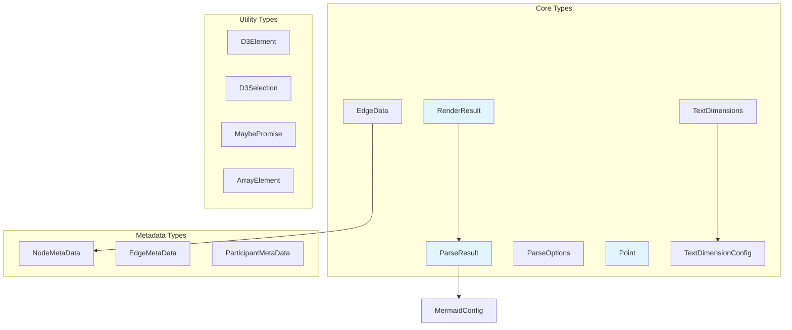
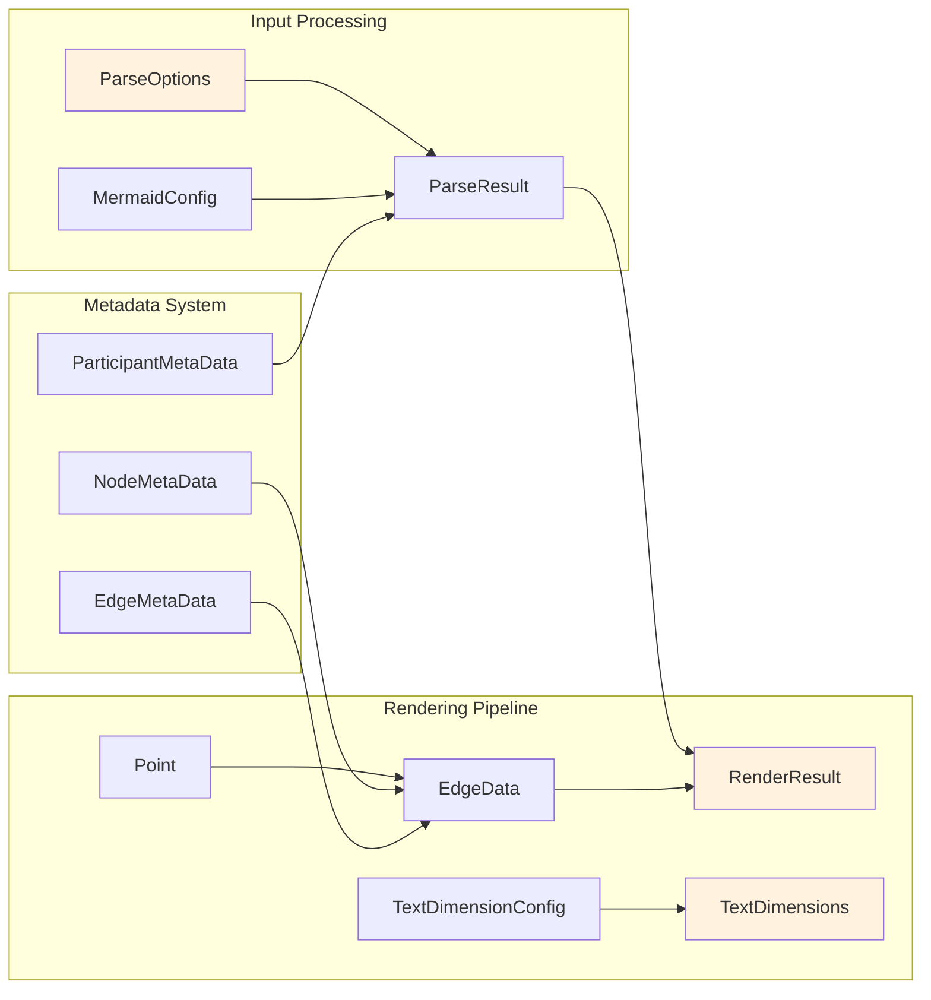
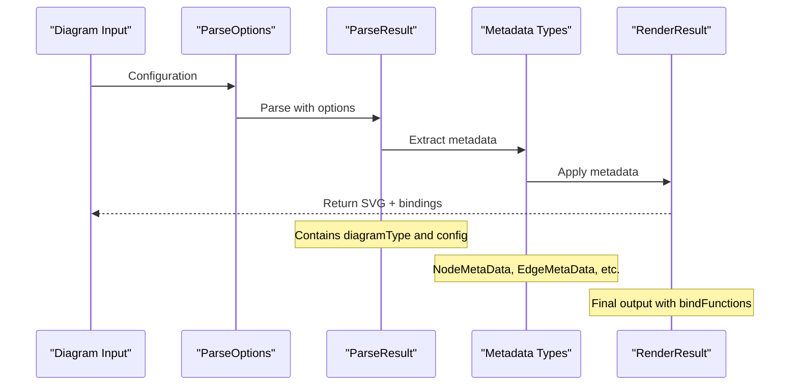

# Types Module Documentation

## Introduction

The types module serves as the foundational type system for the Mermaid diagramming library. It provides core TypeScript interfaces and type definitions that are used throughout the entire Mermaid ecosystem. This module defines the fundamental data structures for parsing, rendering, and managing diagram elements, establishing a consistent type contract across all diagram types and rendering operations.

## Core Architecture

### Type Hierarchy Overview



### Component Relationships



## Core Components

### ParseResult Interface

The `ParseResult` interface represents the outcome of parsing a Mermaid diagram definition. It contains the essential information needed to understand and process the diagram.

```typescript
interface ParseResult {
  diagramType: string;
  config: MermaidConfig;
}
```

**Key Properties:**
- `diagramType`: Identifies the specific diagram type (e.g., 'flowchart', 'sequence', 'class')
- `config`: Configuration object containing YAML frontmatter or directive settings

**Usage Context:**
- Returned by diagram parsers after successful parsing
- Used by the rendering system to determine appropriate rendering strategies
- Links to [config module](config.md) for configuration management

### RenderResult Interface

The `RenderResult` interface encapsulates the complete output of the diagram rendering process, including the generated SVG and any necessary post-processing functions.

```typescript
interface RenderResult {
  svg: string;
  diagramType: string;
  bindFunctions?: (element: Element) => void;
}
```

**Key Properties:**
- `svg`: The generated SVG code for the diagram
- `diagramType`: The diagram type for reference
- `bindFunctions`: Optional function for binding event listeners after DOM insertion

**Integration Points:**
- Consumed by the [core-mermaid module](core-mermaid.md) for final output
- Used by applications integrating Mermaid for display
- Links to [rendering-util module](rendering-util.md) for rendering infrastructure

### Point Interface

A fundamental geometric type representing coordinates in 2D space, used throughout the rendering system.

```typescript
interface Point {
  x: number;
  y: number;
}
```

**Applications:**
- Node positioning in diagrams
- Edge routing and control points
- Text placement calculations
- Used by [rendering-util module](rendering-util.md) for layout algorithms

### EdgeData Interface

Comprehensive type definition for edge (connection) elements in diagrams, containing styling and structural information.

```typescript
interface EdgeData {
  arrowheadStyle?: string;
  labelpos?: string;
  labelType?: string;
  label?: string;
  classes: string;
  pattern: string;
  id: string;
  arrowhead: string;
  startLabelRight: string;
  endLabelLeft: string;
  arrowTypeStart: string;
  arrowTypeEnd: string;
  style: string;
  labelStyle: string;
  curve: any;
}
```

**Key Features:**
- Supports multiple arrow types and styles
- Configurable labels and positioning
- CSS class integration for styling
- Curve definition for complex edge routing

### Text System Types

#### TextDimensions Interface

```typescript
interface TextDimensions {
  width: number;
  height: number;
  lineHeight?: number;
}
```

#### TextDimensionConfig Interface

```typescript
interface TextDimensionConfig {
  fontSize?: number;
  fontWeight?: number;
  fontFamily?: string;
}
```

**Usage:**
- Text measurement and layout calculations
- Font configuration for consistent typography
- Integration with [rendering-util module](rendering-util.md) for text rendering

## Metadata System

### NodeMetaData Interface

Rich metadata for diagram nodes, supporting various visual and semantic properties.

```typescript
interface NodeMetaData {
  shape?: string;
  label?: string;
  icon?: string;
  form?: string;
  pos?: 't' | 'b';
  img?: string;
  w?: string;
  h?: string;
  constraint?: 'on' | 'off';
  priority: 'Very High' | 'High' | 'Medium' | 'Low' | 'Very Low';
  assigned?: string;
  ticket?: string;
}
```

**Applications:**
- Node styling and customization
- Priority-based layout decisions
- Icon and image integration
- Constraint-based positioning

### EdgeMetaData Interface

Specialized metadata for edge elements, focusing on animation and curve properties.

```typescript
interface EdgeMetaData {
  animation?: 'fast' | 'slow';
  animate?: boolean;
  curve?: 'basis' | 'bumpX' | 'bumpY' | 'cardinal' | 'catmullRom' | 'linear' | 'monotoneX' | 'monotoneY' | 'natural' | 'step' | 'stepAfter' | 'stepBefore';
}
```

**Features:**
- Animation control for interactive diagrams
- Multiple curve types for different visual styles
- Performance optimization options

### ParticipantMetaData Interface

Specialized metadata for sequence diagram participants.

```typescript
interface ParticipantMetaData {
  type?: 'actor' | 'participant' | 'boundary' | 'control' | 'entity' | 'database' | 'collections' | 'queue';
}
```

**Usage:**
- Sequence diagram participant typing
- Visual representation selection
- Integration with [sequence module](sequence.md)

## Utility Types

### D3 Integration Types

#### D3Element Type
```typescript
type D3Element = any;
```

#### D3Selection Type
```typescript
type D3Selection<T extends SVGElement> = d3.Selection<T, unknown, Element | null, unknown>;
```

**Purpose:**
- Type-safe D3.js integration
- SVG element manipulation
- Used by [rendering-util module](rendering-util.md) for DOM operations

### Async Support

#### MaybePromise Type
```typescript
type MaybePromise<T> = T | Promise<T>;
```

**Usage:**
- Flexible async/sync function signatures
- Backward compatibility for synchronous operations
- Used throughout the API for optional async behavior

#### ArrayElement Type Helper
```typescript
type ArrayElement<A> = A extends readonly (infer T)[] ? T : never;
```

**Purpose:**
- Type extraction from arrays
- Generic type manipulation utilities

## Data Flow Architecture



## Integration with Other Modules

### Configuration Integration
- Links to [config module](config.md) through `MermaidConfig` usage in `ParseResult`
- Provides type safety for configuration objects
- Supports diagram-specific configuration inheritance

### Rendering Pipeline Integration
- Used by [rendering-util module](rendering-util.md) for layout calculations
- `Point` type used extensively in node positioning
- `TextDimensions` used for text measurement and layout

### Diagram-Specific Integration
- `ParticipantMetaData` used by [sequence module](sequence.md)
- `EdgeData` used by [flowchart module](flowchart.md) and other diagram types
- Metadata types provide extensibility for diagram-specific features

### Core System Integration
- `ParseResult` and `RenderResult` are fundamental to [core-mermaid module](core-mermaid.md)
- `ParseOptions` used in the main parsing pipeline
- Utility types support the overall API design

## Type Safety and Extensibility

The types module provides several mechanisms for type safety and extensibility:

1. **Strict Typing**: All interfaces use specific types rather than generic objects
2. **Optional Properties**: Extensive use of optional properties for backward compatibility
3. **Union Types**: Constrained choices for properties like `priority` and `curve`
4. **Generic Types**: Support for reusable patterns with `MaybePromise` and `ArrayElement`

## Best Practices

### When Extending Types
- Maintain backward compatibility with optional properties
- Use union types for constrained value sets
- Document the purpose and usage of new properties
- Consider integration points with existing modules

### When Using Types
- Leverage TypeScript's type inference where possible
- Use the metadata types for rich diagram element descriptions
- Consider the async implications of `MaybePromise` in API design
- Reference the appropriate module documentation for context-specific usage

## Dependencies

This module has minimal external dependencies:
- References `MermaidConfig` from the [config module](config.md)
- Integrates with D3.js types for SVG manipulation
- Self-contained utility types for common patterns

The types module serves as the foundation for type safety across the entire Mermaid ecosystem, ensuring consistent data structures and interfaces throughout the parsing and rendering pipeline.