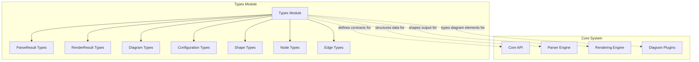
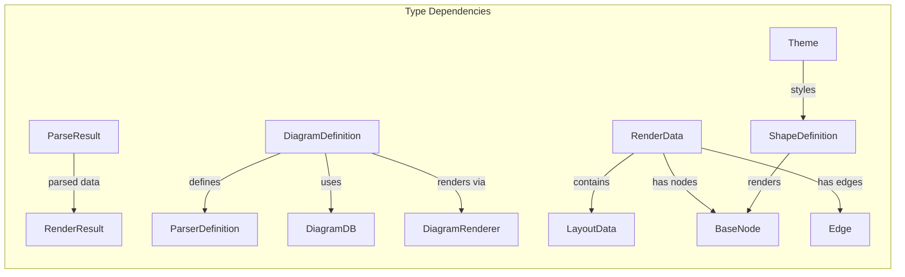
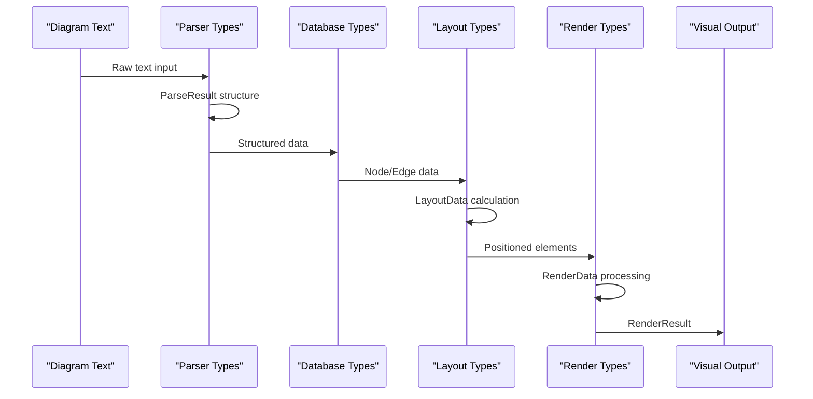
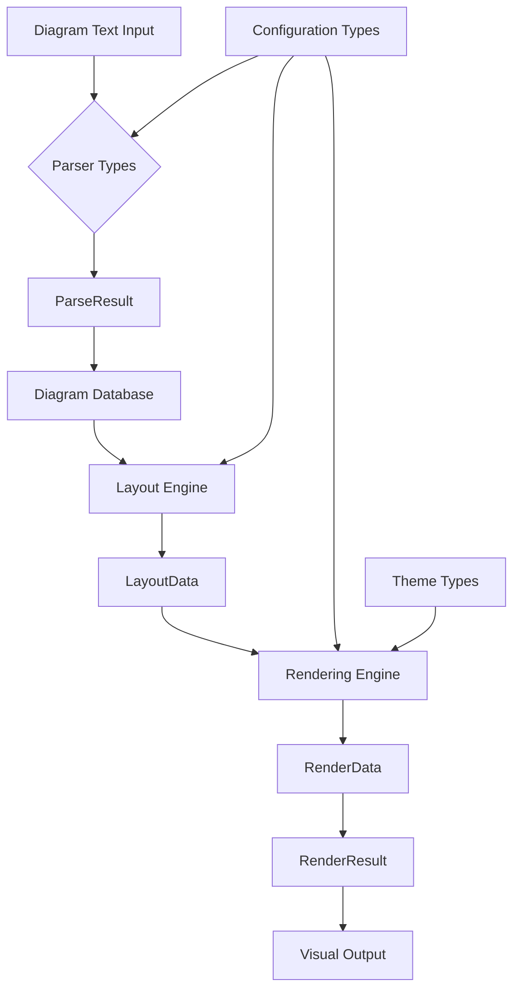

# Types Module Documentation

## Introduction

The types module serves as the foundational type system for Mermaid diagrams, providing TypeScript interfaces and type definitions that define the structure and behavior of various diagram elements. This module establishes the contract between different components of the Mermaid system, ensuring type safety and consistency across the entire framework.

## Core Purpose

The types module acts as the central type repository that:
- Defines the shape of data structures used throughout Mermaid
- Establishes type contracts between parsers, databases, renderers, and configuration systems
- Provides type safety for diagram-specific elements and their relationships
- Enables consistent data flow across the rendering pipeline

## Architecture Overview


```mermaid
graph TB
    subgraph "Types Module"
        T[Types Module]
        T --> PT[ParseResult Types]
        T --> RT[RenderResult Types]
        T --> DT[Diagram Types]
        T --> CT[Configuration Types]
        T --> ST[Shape Types]
        T --> NT[Node Types]
        T --> ET[Edge Types]
    end
    
    subgraph "Core System"
        C[Core API]
        P[Parser Engine]
        R[Rendering Engine]
        D[Diagram Plugins]
    end
    
    T -.->|"defines contracts for"| C
    T -.->|"structures data for"| P
    T -.->|"shapes output for"| R
    T -.->|"types diagram elements for"| D
```

## Component Relationships


```mermaid
graph LR
    subgraph "Type Dependencies"
        PR[ParseResult] --> |"parsed data"| RR[RenderResult]
        DD[DiagramDefinition] --> |"defines"| PT[ParserDefinition]
        DD --> |"uses"| DB[DiagramDB]
        DD --> |"renders via"| DR[DiagramRenderer]
        
        RD[RenderData] --> |"contains"| LD[LayoutData]
        RD --> |"has nodes"| BN[BaseNode]
        RD --> |"has edges"| E[Edge]
        
        SD[ShapeDefinition] --> |"renders"| BN
        T[Theme] --> |"styles"| SD
    end
```

## Core Type Categories

### 1. Core API Types

These types form the foundation of the Mermaid system:

- **ParseResult**: Defines the structure of parsed diagram data
- **RenderResult**: Specifies the output format for rendered diagrams
- **MermaidConfig**: Establishes the global configuration interface
- **RunOptions**: Defines execution parameters for diagram processing

### 2. Diagram Definition Types

Located in the [diagram_plugin_api](diagram_plugin_api.md) module:

- **DiagramDefinition**: The contract for diagram implementations
- **ParserDefinition**: Interface for diagram parsers
- **DiagramDB**: Database interface for storing diagram data
- **DiagramRenderer**: Rendering interface for diagram visualization
- **InjectUtils**: Utility injection interface

### 3. Rendering Types

Part of the [rendering_engine](rendering_engine.md) module:

- **RenderData**: Container for rendering information
- **LayoutData**: Layout calculation results
- **BaseNode**: Fundamental node structure
- **Edge**: Connection between nodes
- **ShapeDefinition**: Visual shape specifications
- **Theme**: Styling and theming interface

### 4. Parser Types

From the [parser_engine](parser_engine.md) module:

- **AbstractMermaidTokenBuilder**: Base class for token generation
- **AbstractMermaidValueConverter**: Base class for value transformation
- **TreemapValidator**: Specific validator for treemap diagrams

### 5. Layout Types

In the [layout_engine_elk](layout_engine_elk.md) module:

- **NodeWithVertex**: Node with layout positioning
- **TreeData**: Hierarchical data structure

## Data Flow Architecture


```mermaid
sequenceDiagram
    participant Input as "Diagram Text"
    participant Parser as "Parser Types"
    participant DB as "Database Types"
    participant Layout as "Layout Types"
    participant Render as "Render Types"
    participant Output as "Visual Output"
    
    Input->>Parser: Raw text input
    Parser->>Parser: ParseResult structure
    Parser->>DB: Structured data
    DB->>Layout: Node/Edge data
    Layout->>Layout: LayoutData calculation
    Layout->>Render: Positioned elements
    Render->>Render: RenderData processing
    Render->>Output: RenderResult
```

## Diagram-Specific Type Extensions

The types module extends to support specific diagram types through specialized interfaces:

### Flowchart Types
- **FlowVertex**: Node types for flowcharts
- **FlowEdge**: Connection types for flowcharts
- **FlowSubGraph**: Grouping structures
- **FlowchartDiagramConfig**: Configuration interface

### Sequence Diagram Types
- **Actor**: Participant representation
- **Message**: Communication between actors
- **Note**: Annotations and comments
- **SequenceDiagramConfig**: Configuration options

### Class Diagram Types
- **ClassNode**: Class representation
- **ClassRelation**: Relationships between classes
- **ClassMember**: Class attributes and methods
- **ClassDiagramConfig**: Configuration interface

### State Diagram Types
- **StateDB**: State machine data
- **StateStmt**: State statements
- **Edge**: State transitions
- **StateDiagramConfig**: Configuration options

### Entity Relationship Types
- **EntityNode**: Entity representation
- **Relationship**: Entity relationships
- **ErDiagramConfig**: Configuration interface

### Git Graph Types
- **GitGraphDB**: Git repository data
- **Commit**: Commit representation
- **BranchAst**: Branch structure
- **GitGraphDiagramConfig**: Configuration options

### Chart Types
- **PieDB**: Pie chart data
- **PieFields**: Data fields
- **PieDiagramConfig**: Configuration interface

### XY Chart Types
- **XYChartBuilder**: Chart construction
- **XYChartData**: Data structure
- **XYChartConfig**: Configuration
- **Axis**: Axis definition
- **Plot**: Plot configuration
- **XYChartConfig**: Global configuration

### Requirement Diagram Types

The requirement diagram types demonstrate the module's approach to domain-specific type definitions:

```typescript
// Requirement types define the core elements
interface Requirement {
  name: string;
  type: RequirementType;  // 'Requirement' | 'Functional Requirement' | etc.
  requirementId: string;
  text: string;
  risk: RiskLevel;        // 'Low' | 'Medium' | 'High'
  verifyMethod: VerifyType; // 'Analysis' | 'Demonstration' | 'Inspection' | 'Test'
  cssStyles: string[];
  classes: string[];
}

// Relationship types define connections
interface Relation {
  type: RelationshipType; // 'contains' | 'copies' | 'derives' | etc.
  src: string;            // Source requirement ID
  dst: string;            // Destination requirement ID
}
```

### Additional Diagram Types

- **Mindmap Types**: [diagram_mindmap](diagram_mindmap.md)
- **Architecture Types**: [diagram_architecture](diagram_architecture.md)
- **Sankey Types**: [diagram_sankey](diagram_sankey.md)
- **Quadrant Chart Types**: [diagram_quadrant_chart](diagram_quadrant_chart.md)
- **Treemap Types**: [diagram_treemap](diagram_treemap.md)

## Integration Patterns

### Type Extension Pattern
```typescript
// Base types provide common functionality
interface BaseNode {
  id: string;
  type: string;
}

// Diagram-specific types extend base functionality
interface FlowVertex extends BaseNode {
  text: string;
  shape: string;
}
```

### Configuration Pattern
```typescript
// Each diagram type has associated configuration
type DiagramConfig = {
  theme: Theme;
  layout: LayoutOptions;
  // diagram-specific options
}
```

### Database Pattern
```typescript
// Each diagram has a database interface
interface DiagramDB {
  addNode(node: BaseNode): void;
  getNode(id: string): BaseNode | undefined;
  getEdges(): Edge[];
}
```

## Process Flow


```mermaid
graph TD
    A[Diagram Text Input] --> B{Parser Types}
    B --> C[ParseResult]
    C --> D[Diagram Database]
    D --> E[Layout Engine]
    E --> F[LayoutData]
    F --> G[Rendering Engine]
    G --> H[RenderData]
    H --> I[RenderResult]
    I --> J[Visual Output]
    
    K[Configuration Types] --> B
    K --> E
    K --> G
    
    L[Theme Types] --> G
```

## Key Benefits

1. **Type Safety**: Ensures consistent data structures across the system
2. **Modularity**: Allows independent development of diagram types
3. **Extensibility**: Enables easy addition of new diagram types
4. **Maintainability**: Provides clear contracts between components
5. **Documentation**: Serves as living documentation for the system

## Related Modules

- [Core API](mermaid_core_api.md) - Uses types for main interfaces
- [Diagram Plugin API](diagram_plugin_api.md) - Extends base types for plugins
- [Rendering Engine](rendering_engine.md) - Consumes render-related types
- [Parser Engine](parser_engine.md) - Uses parse result types
- [Layout Engine ELK](layout_engine_elk.md) - Extends layout types

## Conclusion

The types module is the architectural foundation of Mermaid, providing the type system that enables the framework's flexibility and extensibility. By establishing clear contracts between components, it allows the system to support a wide variety of diagram types while maintaining consistency and type safety throughout the rendering pipeline.