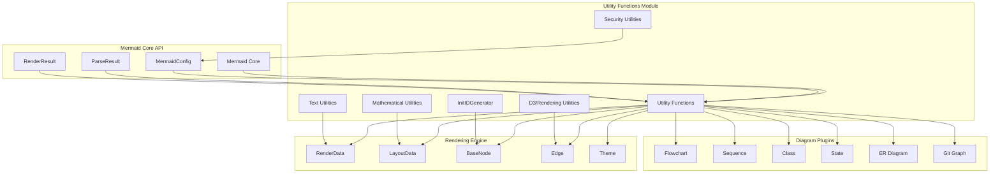
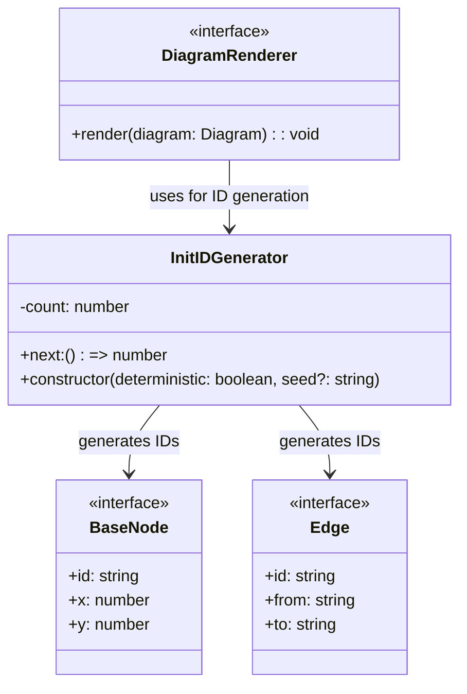
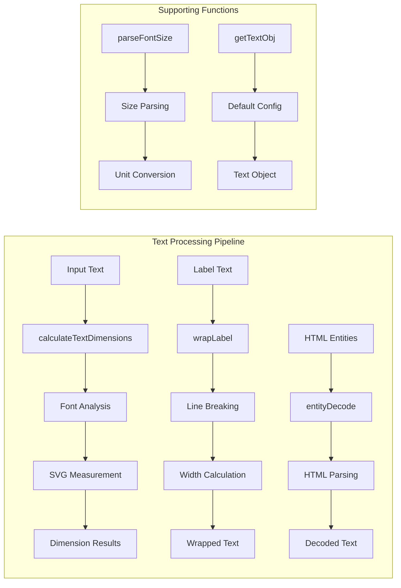
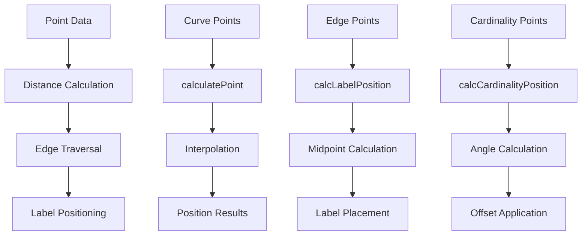
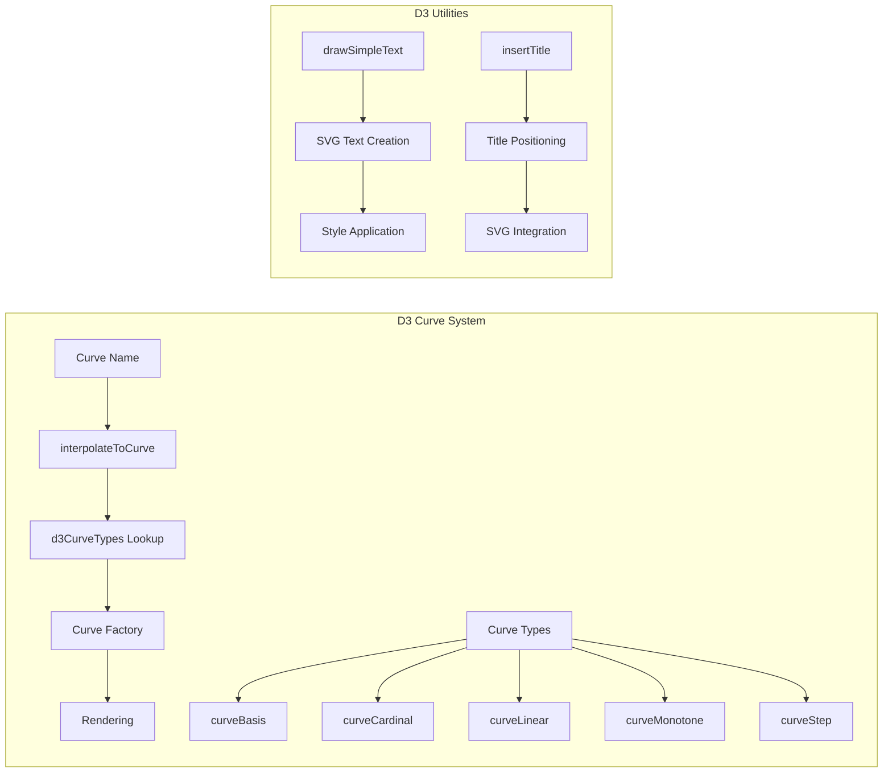
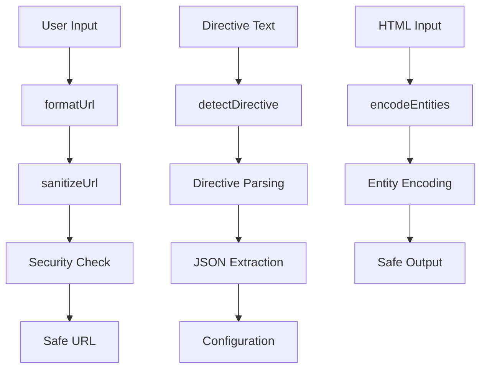
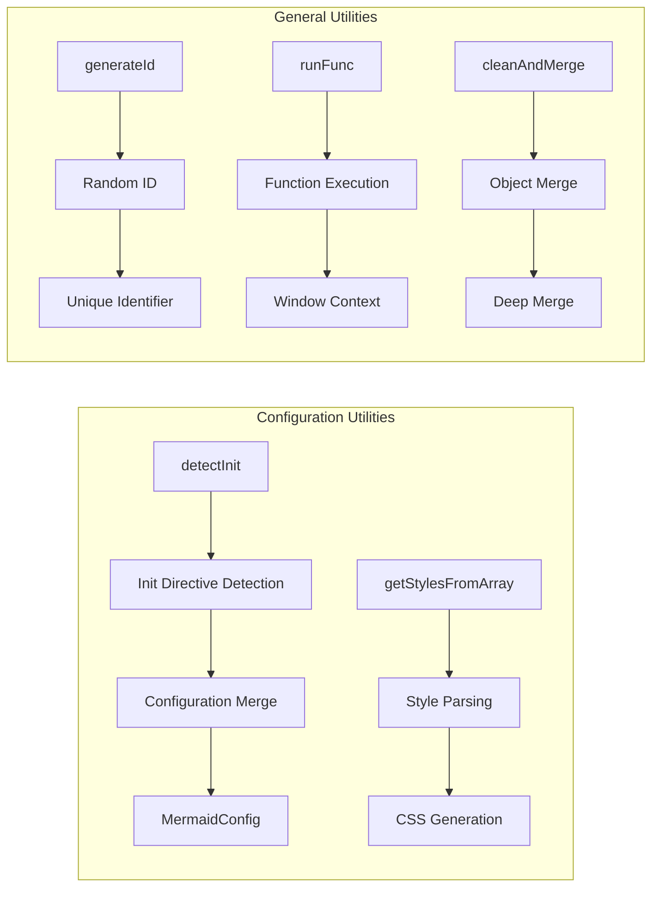
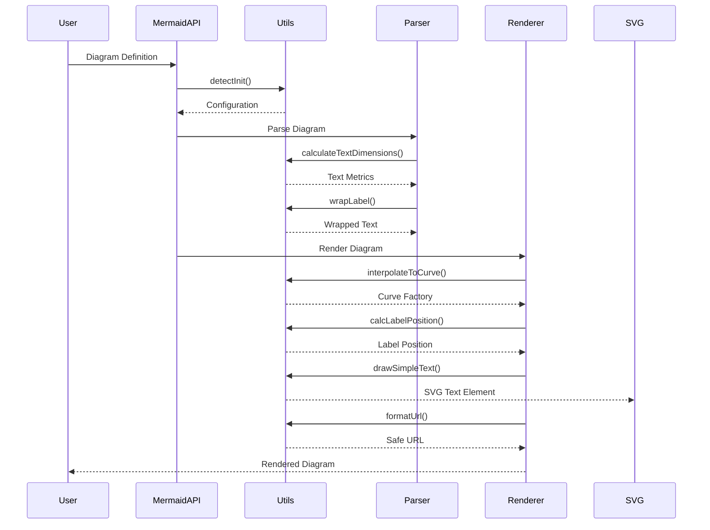
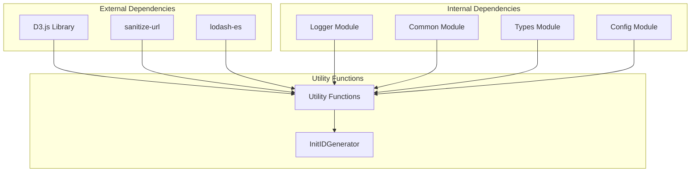
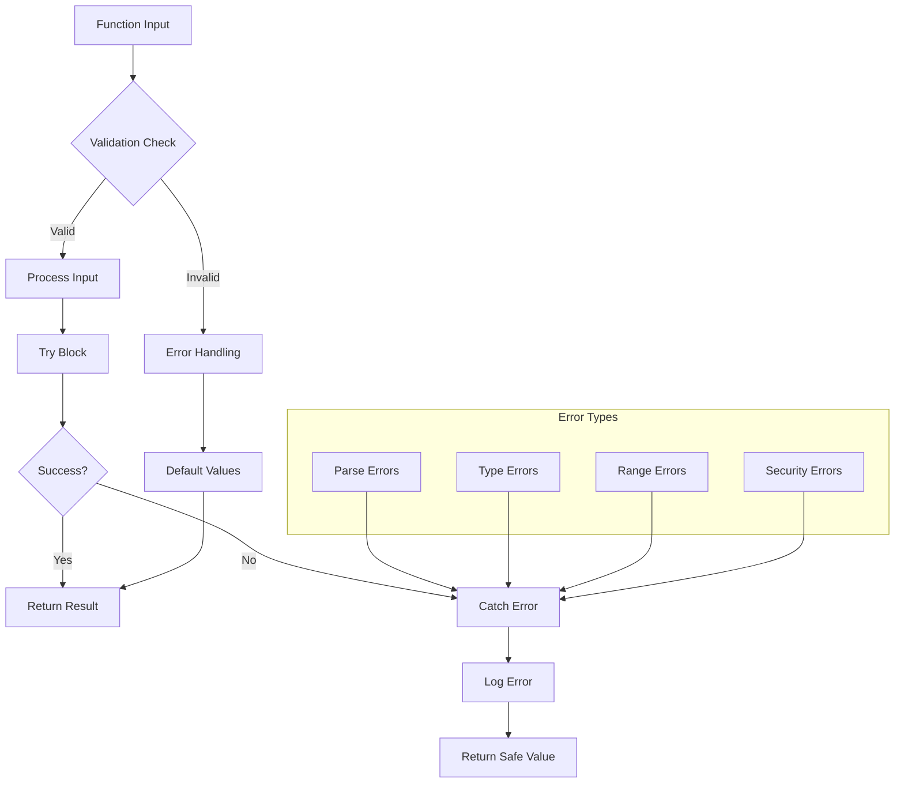

# Utility Functions Module

## Introduction

The utility-functions module serves as the foundational utility layer within the Mermaid diagram rendering system. It provides a comprehensive set of helper functions, mathematical calculations, text processing utilities, and ID generation capabilities that are essential for diagram rendering, text manipulation, and overall system functionality. This module acts as a shared utility layer that supports all diagram types and rendering operations throughout the Mermaid ecosystem.

## Architecture Overview

The utility-functions module is designed as a centralized utility library that provides cross-cutting concerns for the entire Mermaid system. It sits at the core of the rendering engine and provides essential services to diagram plugins, rendering components, and the main Mermaid API.



## Core Components

### InitIDGenerator Class

The `InitIDGenerator` class provides deterministic and non-deterministic ID generation capabilities essential for creating unique identifiers throughout the diagram rendering process.



**Key Features:**
- **Deterministic Mode**: Produces sequential IDs based on an internal counter, ensuring reproducible results
- **Non-deterministic Mode**: Uses timestamp-based IDs for unique generation
- **Seed Support**: Allows initialization with a seed string for predictable ID sequences

## Functional Categories

### 1. Text Processing and Dimension Calculation

The module provides sophisticated text processing capabilities essential for diagram rendering:



**Key Functions:**
- `calculateTextDimensions()`: Calculates precise text dimensions using SVG rendering
- `calculateTextWidth()` / `calculateTextHeight()`: Specialized dimension calculations
- `wrapLabel()`: Intelligent text wrapping with hyphenation support
- `entityDecode()`: Safe HTML entity decoding
- `parseFontSize()`: Flexible font size parsing with unit support

### 2. Mathematical and Geometric Calculations

Provides essential mathematical operations for diagram layout and positioning:



**Key Functions:**
- `calculatePoint()`: Interpolates points along curves with distance-based traversal
- `calcLabelPosition()`: Calculates optimal label positions on edges
- `calcCardinalityPosition()`: Positions cardinality indicators with angle calculations
- `distance()`: Euclidean distance calculations between points
- `roundNumber()`: Precision-based number rounding

### 3. D3.js Integration and Curve Management

Integrates with D3.js for advanced curve and rendering operations:



**Key Functions:**
- `interpolateToCurve()`: Maps curve names to D3 curve factories
- `drawSimpleText()`: Creates styled SVG text elements
- `insertTitle()`: Adds titles to SVG diagrams with proper positioning

### 4. Security and Sanitization

Provides security utilities for safe diagram rendering:



**Key Functions:**
- `formatUrl()`: URL sanitization based on security configuration
- `detectDirective()`: Safe directive parsing with regex validation
- `encodeEntities()` / `decodeEntities()`: Custom entity encoding system
- `sanitizeDirective()`: Directive content sanitization

### 5. Configuration and Utility Functions

Provides general utility functions for system operations:



## Data Flow Integration

The utility-functions module integrates into the Mermaid data flow at multiple points:



## Dependencies and Integration

The utility-functions module has strategic dependencies that enable its functionality:



**External Dependencies:**
- **D3.js**: Provides curve factories, SVG manipulation, and mathematical operations
- **sanitize-url**: URL sanitization for security
- **lodash-es**: Utility functions for memoization and object merging

**Internal Dependencies:**
- **Logger Module**: Logging and error reporting
- **Common Module**: Shared constants and regex patterns
- **Types Module**: TypeScript type definitions
- **Config Module**: Configuration type definitions

## Error Handling and Validation

The module implements comprehensive error handling and validation:



## Performance Optimizations

The module implements several performance optimizations:

1. **Memoization**: Text dimension calculations and label wrapping are memoized using lodash
2. **Lazy Loading**: D3 elements are created only when needed
3. **Caching**: Font dimension calculations are cached across multiple font families
4. **Batch Operations**: Multiple text operations are batched where possible

## Security Considerations

The utility-functions module implements several security measures:

1. **URL Sanitization**: All URLs are sanitized based on security configuration
2. **HTML Entity Encoding**: Custom entity encoding prevents XSS attacks
3. **Input Validation**: All user inputs are validated before processing
4. **Safe Defaults**: Functions return safe default values when inputs are invalid

## Usage Examples

### Text Dimension Calculation
```typescript
const dimensions = calculateTextDimensions('Sample Text', {
  fontSize: 14,
  fontFamily: 'Arial',
  fontWeight: 400
});
// Returns: { width: 85, height: 18, lineHeight: 18 }
```

### ID Generation
```typescript
const idGen = new InitIDGenerator(true, 'seed');
const id1 = idGen.next(); // Returns: 0
const id2 = idGen.next(); // Returns: 1
```

### Label Positioning
```typescript
const points = [{ x: 0, y: 0 }, { x: 100, y: 100 }];
const labelPos = calcLabelPosition(points);
// Returns: { x: 50, y: 50 }
```

## Integration with Other Modules

The utility-functions module serves as a foundation for other modules in the Mermaid ecosystem:

- **[Rendering Engine](rendering-engine.md)**: Uses text utilities and mathematical functions
- **[Diagram Plugins](diagram-plugin-api.md)**: Leverage ID generation and text processing
- **[Theme System](theme-system.md)**: Utilizes style parsing and configuration utilities
- **[Parser Engine](parser_engine.md)**: Depends on text validation and entity decoding

## Conclusion

The utility-functions module is a critical component that provides essential services to the entire Mermaid diagram rendering system. Its comprehensive set of utilities enables consistent text processing, secure operations, mathematical calculations, and efficient rendering across all diagram types. The module's design emphasizes reusability, performance, and security, making it an indispensable foundation for the Mermaid ecosystem.