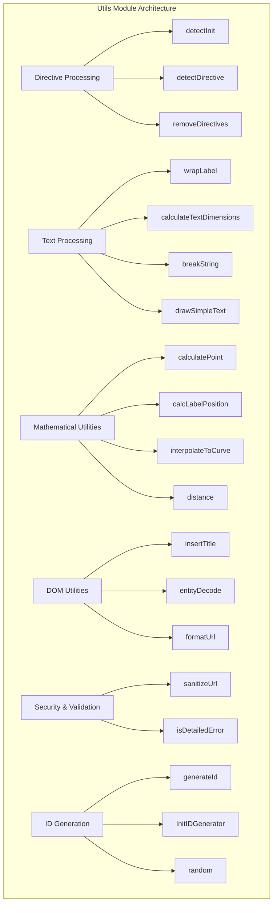
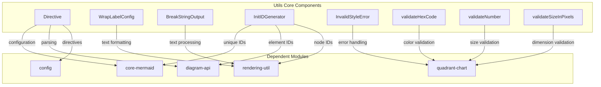
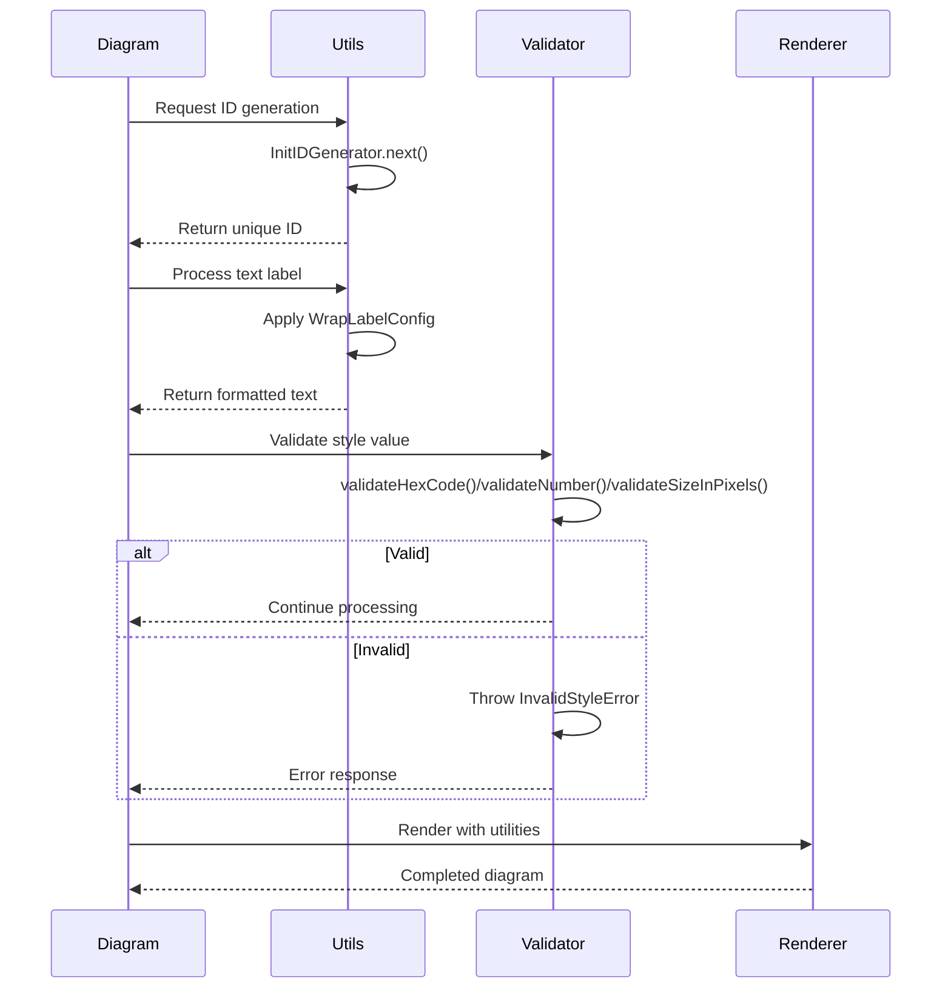
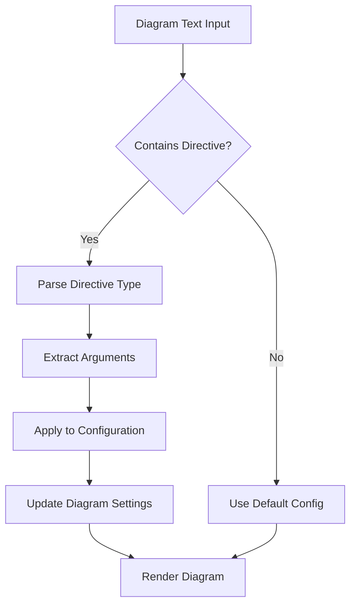
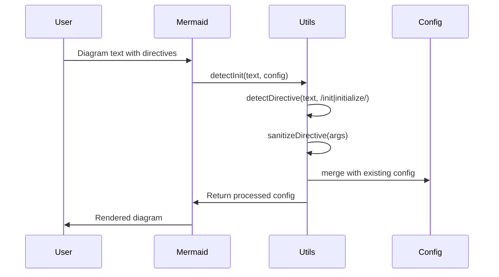
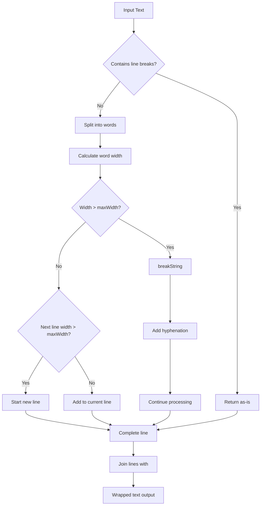
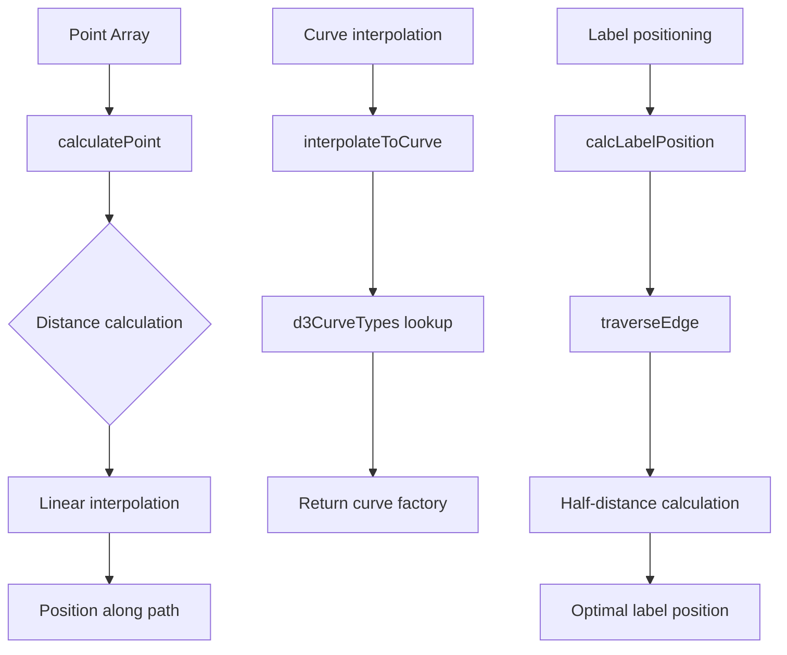
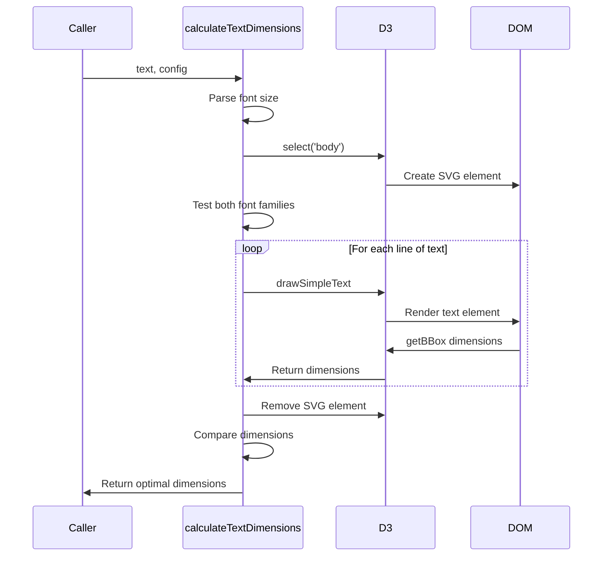
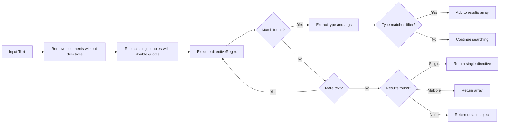

# Utils Module Documentation

## Introduction

The utils module provides essential utility functions and classes that support the core functionality of the Mermaid diagramming library. These utilities are used across various diagram types and provide common functionality for text processing, validation, ID generation, and configuration management.

The Utils module is a foundational utility library within the Mermaid diagramming library that provides essential helper functions, text processing utilities, mathematical calculations, and DOM manipulation tools. This module serves as a shared utility layer that supports all diagram types and core functionality throughout the Mermaid ecosystem.

## Architecture Overview

The Utils module is organized around several key functional areas:

### Core Functional Areas

1. **Directive Processing** - Parsing and handling Mermaid configuration directives
2. **Text Processing** - Text wrapping, dimension calculation, and formatting
3. **Mathematical Utilities** - Point calculations, curve interpolation, and geometric operations
4. **DOM Utilities** - SVG manipulation, text rendering, and element positioning
5. **Security & Validation** - URL sanitization and input validation
6. **ID Generation** - Unique identifier creation for diagram elements



## Component Relationships

The Utils module interacts with multiple core modules throughout the Mermaid ecosystem:

```mermaid
graph LR
    subgraph "Module Dependencies"
        U[Utils Module] --> C[Config Module]
        U --> T[Types Module]
        U --> L[Logger Module]
        U --> DA[Diagram API Module]
        
        FD[Flowchart Diagram] --> U
        SD[Sequence Diagram] --> U
        CD[Class Diagram] --> U
        StD[State Diagram] --> U
        ED[ER Diagram] --> U
        GD[Git Diagram] --> U
        PD[Pie Diagram] --> U
        MD[Mindmap Diagram] --> U
        QD[Quadrant Chart] --> U
        RD[Radar Diagram] --> U
        SanD[Sankey Diagram] --> U
        TD[Timeline Diagram] --> U
        TreD[Treemap Diagram] --> U
        XD[XY Chart] --> U
        AD[Architecture Diagram] --> U
        BD[Block Diagram] --> U
        C4D[C4 Diagram] --> U
        ReqD[Requirement Diagram] --> U
        PaD[Packet Diagram] --> U
        KanD[Kanban Diagram] --> U
        ID[Info Diagram] --> U
    end
```



## Core Components from Module Tree

Based on the current module structure, the utils module includes these core components:

### Directive
The `Directive` interface defines the structure for configuration directives that can be applied to diagrams.

```typescript
interface Directive {
  type?: string;
  args?: unknown;
}
```

**Purpose**: Provides a flexible way to pass configuration options and commands to diagram parsers and renderers.

### WrapLabelConfig
Configuration interface for text wrapping and label formatting.

```typescript
interface WrapLabelConfig {
  fontSize: number;
  fontFamily: string;
  fontWeight: number;
  joinWith: string;
}
```

**Purpose**: Controls how text labels are wrapped and formatted in diagrams.

### BreakStringOutput
Result interface for string breaking operations.

```typescript
interface BreakStringOutput {
  hyphenatedStrings: string[];
  remainingWord: string;
}
```

**Purpose**: Contains the results of text breaking operations, typically used for word wrapping and hyphenation.

### InitIDGenerator
A utility class for generating unique identifiers.

```typescript
class InitIDGenerator {
  private count = 0;
  public next: () => number;
  constructor(deterministic = false, seed?: string) {
    this.count = seed ? seed.length : 0;
    this.next = deterministic ? () => this.count++ : () => Date.now();
  }
}
```

**Purpose**: Provides deterministic or non-deterministic ID generation for diagram elements.

**Features**:
- **Deterministic Mode**: Generates sequential IDs based on a counter (useful for testing)
- **Non-deterministic Mode**: Uses timestamp for unique IDs (default behavior)
- **Seed Support**: Can be initialized with a seed string for predictable ID generation

## Component Relationships

The core components from the module tree interact with various parts of the Mermaid ecosystem:



## Data Flow

### Core Utils Components Flow



### Directive Processing Flow



## Quadrant Chart Validation Utilities

The utils module also includes specialized validation utilities for quadrant charts:

### InvalidStyleError
Custom error class for style validation failures.

```typescript
class InvalidStyleError extends Error {
  constructor(style: string, value: string, type: string) {
    super(`value for ${style} ${value} is invalid, please use a valid ${type}`);
    this.name = 'InvalidStyleError';
  }
}
```

### validateHexCode
Validates hexadecimal color codes.

```typescript
function validateHexCode(value: string): boolean {
  return !/^#?([\dA-Fa-f]{6}|[\dA-Fa-f]{3})$/.test(value);
}
```

**Returns**: `true` if invalid, `false` if valid

### validateNumber
Validates numeric strings.

```typescript
function validateNumber(value: string): boolean {
  return !/^\d+$/.test(value);
}
```

**Returns**: `true` if invalid, `false` if valid

### validateSizeInPixels
Validates pixel size specifications.

```typescript
function validateSizeInPixels(value: string): boolean {
  return !/^\d+px$/.test(value);
}
```

**Returns**: `true` if invalid, `false` if valid

## Key Components

### Directive Processing

The directive processing system handles Mermaid configuration directives embedded within diagram definitions:



### Text Processing Pipeline

The text processing utilities handle label wrapping, dimension calculation, and text rendering:



### Mathematical Calculations

The module provides sophisticated mathematical utilities for diagram positioning:



## Data Flow

### Text Dimension Calculation Flow



### Directive Detection Flow



## Key Functions and Utilities

### Directive Processing Functions

- **`detectInit(text, config?)`**: Extracts initialization configuration from diagram text
- **`detectDirective(text, type?)`**: Parses directives from diagram definitions
- **`removeDirectives(text)`**: Strips directive statements from text

### Text Processing Functions

- **`wrapLabel(label, maxWidth, config)`**: Intelligently wraps text labels with memoization
- **`calculateTextDimensions(text, config)`**: Calculates precise text dimensions using DOM rendering
- **`calculateTextWidth/Height(text, config)`**: Specialized dimension calculators
- **`breakString(word, maxWidth, hyphenCharacter, config)`**: Handles word breaking with hyphenation

### Mathematical Utility Functions

- **`calculatePoint(points, distanceToTraverse)`**: Calculates points along a path
- **`calcLabelPosition(points)`**: Determines optimal label positioning
- **`calcCardinalityPosition(isRelationTypePresent, points, initialPosition)`**: Positions cardinality indicators
- **`calcTerminalLabelPosition(terminalMarkerSize, position, points)`**: Places terminal labels
- **`interpolateToCurve(interpolate, defaultCurve)`**: Maps interpolation names to D3 curve factories
- **`distance(p1, p2)`**: Calculates distance between two points

### DOM and Rendering Functions

- **`drawSimpleText(elem, textData)`**: Creates styled SVG text elements
- **`insertTitle(parent, cssClass, titleTopMargin, title)`**: Adds titles to SVG elements
- **`formatUrl(linkStr, config)`**: Formats and sanitizes URLs based on security settings
- **`entityDecode(html)`**: Decodes HTML entities safely

### Utility Functions

- **`generateId()`**: Creates unique identifiers for diagram elements
- **`InitIDGenerator`**: Class for deterministic or random ID generation
- **`random(options)`**: Generates random hexadecimal strings
- **`runFunc(functionName, ...params)`**: Executes functions by name from window object
- **`getStylesFromArray(arr)`**: Separates style and label style properties
- **`parseFontSize(fontSize)`**: Parses font size configurations

## Security Considerations

The Utils module implements several security measures:

1. **URL Sanitization**: Uses `@braintree/sanitize-url` for URL validation
2. **Security Level Awareness**: Respects Mermaid's security configuration
3. **Input Validation**: Validates and sanitizes directive inputs
4. **DOM Safety**: Properly manages DOM element creation and cleanup

## Performance Optimizations

The module employs several performance optimizations:

1. **Memoization**: Text dimension calculations and label wrapping are memoized
2. **Lazy Loading**: DOM elements are created only when needed
3. **Efficient Algorithms**: Mathematical calculations use optimized algorithms
4. **Caching**: Font dimension testing caches results for reuse

## Error Handling

The module includes comprehensive error handling:

1. **Graceful Degradation**: Functions return sensible defaults on errors
2. **Detailed Error Objects**: Custom error types with context information
3. **Logging Integration**: Uses the logger module for consistent error reporting
4. **Validation**: Input validation prevents common error conditions

## Integration with Other Modules

### Core Components Integration

#### Core Mermaid Integration
The [core-mermaid](core-mermaid.md) module uses `InitIDGenerator` for generating unique element IDs and `Directive` for processing configuration directives.

#### Diagram API Integration  
The [diagram-api](diagram-api.md) components utilize the `Directive` interface for managing diagram definitions and metadata, while `InitIDGenerator` provides unique identifiers for diagram elements.

#### Rendering Integration
The [rendering-util](rendering-util.md) modules depend on `WrapLabelConfig` and `BreakStringOutput` for proper text rendering and layout calculations.

#### Configuration Integration
The [config](config.md) module works with `Directive` objects to apply diagram-specific configuration settings and theme options.

#### Quadrant Chart Integration
The quadrant-chart module uses validation utilities (`validateHexCode`, `validateNumber`, `validateSizeInPixels`) and `InvalidStyleError` for ensuring proper style and configuration values.

### Traditional Utils Functions

### Config Module Integration
- Processes configuration directives
- Merges user configuration with defaults
- Handles diagram-type specific settings

### Types Module Integration
- Uses TypeScript interfaces for type safety
- Provides type definitions for complex return values
- Ensures consistency across the codebase

### Logger Module Integration
- Reports errors and warnings consistently
- Provides debug information for troubleshooting
- Maintains log levels as configured

### Diagram API Integration
- Supports diagram detection and initialization
- Provides utilities for diagram rendering
- Handles diagram-specific requirements

## Usage Examples

### Core Components Usage

#### ID Generation
```typescript
// Non-deterministic IDs (default)
const idGen = new InitIDGenerator();
const id1 = idGen.next(); // Returns timestamp-based ID

// Deterministic IDs for testing
const idGenTest = new InitIDGenerator(true, "test");
const id2 = idGenTest.next(); // Returns 0
const id3 = idGenTest.next(); // Returns 1
```

#### Text Configuration
```typescript
const wrapConfig: WrapLabelConfig = {
  fontSize: 14,
  fontFamily: "Arial, sans-serif",
  fontWeight: 400,
  joinWith: "-"
};
```

#### Directive Processing
```typescript
const directive: Directive = {
  type: "init",
  args: { theme: "dark", flowchart: { useMaxWidth: true } }
};
```

#### Validation Examples
```typescript
try {
  if (validateHexCode("#GGGGGG")) {
    throw new InvalidStyleError("color", "#GGGGGG", "hex color code");
  }
  
  if (validateNumber("abc")) {
    throw new InvalidStyleError("size", "abc", "number");
  }
  
  if (validateSizeInPixels("100")) {
    throw new InvalidStyleError("width", "100", "size in pixels (e.g., 100px)");
  }
} catch (error) {
  if (error instanceof InvalidStyleError) {
    console.error(error.message);
  }
}
```

### Traditional Utils Functions

### Basic Text Processing
```typescript
import { wrapLabel, calculateTextDimensions } from './utils';

// Wrap a long label
const wrappedLabel = wrapLabel('This is a very long label that needs wrapping', 100, {
  fontSize: 12,
  fontFamily: 'Arial',
  fontWeight: 400,
  joinWith: '<br/>'
});

// Calculate text dimensions
const dimensions = calculateTextDimensions('Sample text', {
  fontSize: 14,
  fontFamily: 'Helvetica',
  fontWeight: 'bold'
});
```

### Directive Processing
```typescript
import { detectInit, detectDirective } from './utils';

// Extract initialization config
const config = detectInit(`
  %%{init: {"theme": "dark", "flowchart": {"useMaxWidth": true}}}%%
  graph TD
    A-->B
`);

// Detect specific directives
const directives = detectDirective(text, /theme|init/);
```

### Mathematical Calculations
```typescript
import { calculatePoint, calcLabelPosition, interpolateToCurve } from './utils';

// Calculate point along path
const point = calculatePoint([{x: 0, y: 0}, {x: 100, y: 100}], 50);

// Get optimal label position
const labelPos = calcLabelPosition([{x: 0, y: 0}, {x: 50, y: 50}, {x: 100, y: 100}]);

// Get curve factory
const curve = interpolateToCurve('basis', curveLinear);
```

## Best Practices

### Core Components Best Practices

1. **ID Generation**: Use deterministic mode only for testing to ensure predictable results
2. **Validation**: Always validate user input before applying styles or configurations
3. **Error Handling**: Catch and handle `InvalidStyleError` appropriately in user-facing applications
4. **Text Processing**: Configure `WrapLabelConfig` based on the specific diagram type and rendering requirements
5. **Directives**: Use `Directive` objects for configuration changes rather than direct manipulation

### Traditional Utils Functions

1. **Use Memoized Functions**: Leverage memoized functions like `wrapLabel` and `calculateTextDimensions` for better performance
2. **Handle Security**: Always use `formatUrl` for user-provided URLs
3. **Error Handling**: Check return values and handle edge cases appropriately
4. **Performance**: Reuse calculated dimensions when possible
5. **Consistency**: Use utility functions consistently across diagram types

## Future Considerations

The Utils module is designed to be extensible and maintainable. Future enhancements may include:

### Core Components Enhancements
1. **Additional Validation Functions**: Support for new diagram types beyond quadrant charts
2. **Enhanced Text Processing**: Support for more complex text layouts and internationalization
3. **Performance Optimizations**: Further optimization of ID generation in high-volume scenarios
4. **Enhanced Type Safety**: Stricter TypeScript definitions for core interfaces

### Traditional Utils Functions
1. **Additional Curve Types**: Support for more D3 curve interpolation methods
2. **Enhanced Text Processing**: Support for more complex text layouts
3. **Performance Improvements**: Further optimization of mathematical calculations
4. **Security Enhancements**: Additional security validation and sanitization
5. **Type Safety**: Enhanced TypeScript definitions and stricter type checking

## Related Documentation

- [Config Module](config.md) - Configuration management and diagram-specific settings
- [Types Module](types.md) - TypeScript type definitions used throughout the system
- [Diagram API Module](diagram-api.md) - Core diagram processing and rendering API
- [Core Mermaid Module](core-mermaid.md) - Main Mermaid class and initialization
- [Logger Module](logger.md) - Logging and error reporting system

---

*This documentation is part of the Mermaid diagramming library. For more information about Mermaid and its capabilities, please refer to the main documentation.*