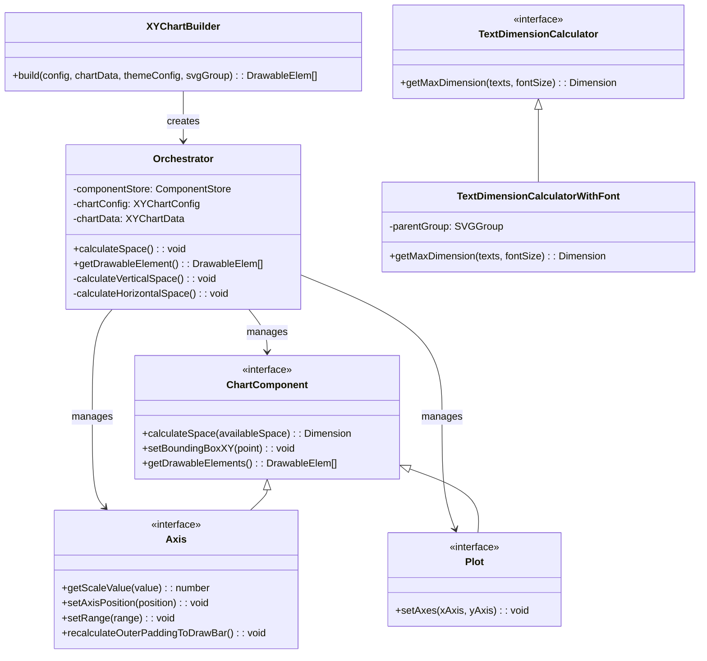
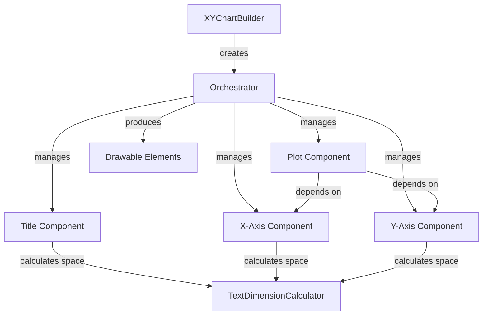
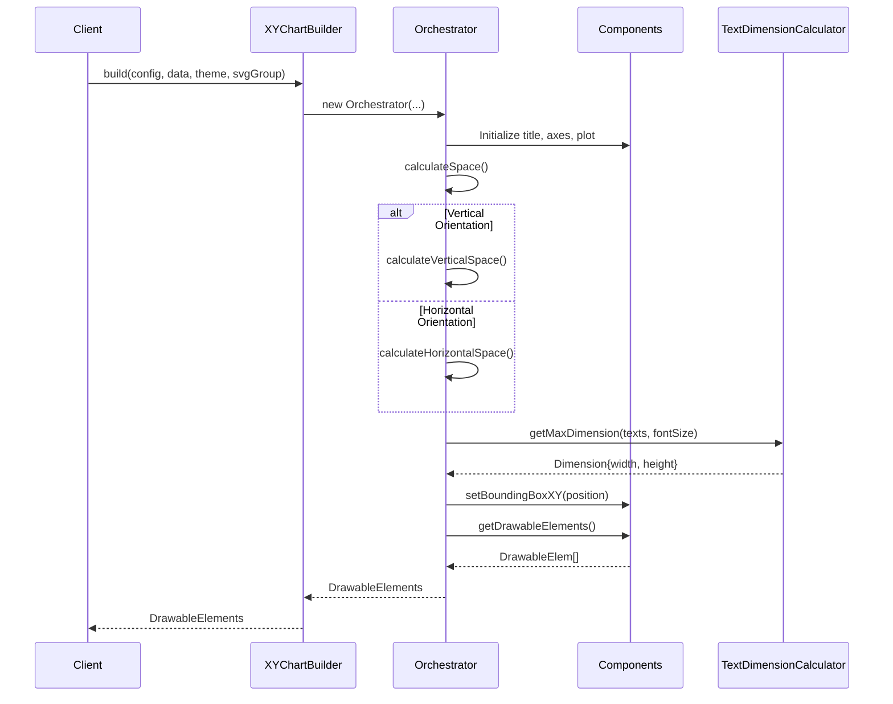
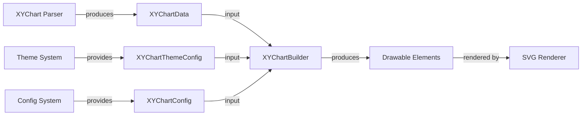

# XYChart Chart Builder Module

The xychart-chart-builder module is a core component of Mermaid's XY chart diagram system, responsible for orchestrating the construction and rendering of XY charts including line plots, bar charts, and scatter plots. This module provides the architectural foundation for creating sophisticated data visualizations with customizable axes, plots, and styling.

## Overview

The XYChart Chart Builder serves as the central coordination layer that transforms chart configuration, data, and theme settings into drawable SVG elements. It implements a component-based architecture where individual chart elements (title, axes, plots) are managed as separate components with well-defined interfaces, enabling flexible layout calculations and rendering.

## Architecture

### Core Components



### Component Relationships



## Data Flow



## Key Interfaces

### Chart Configuration

The module operates on three primary configuration interfaces:

- **XYChartConfig**: Defines chart dimensions, orientation, spacing, and axis configurations
- **XYChartData**: Contains the actual data including axes definitions, title, and plot data
- **XYChartThemeConfig**: Specifies visual styling including colors for all chart elements

### Component Architecture

All chart components implement the `ChartComponent` interface:

```typescript
interface ChartComponent {
  calculateSpace(availableSpace: Dimension): Dimension;
  setBoundingBoxXY(point: Point): void;
  getDrawableElements(): DrawableElem[];
}
```

This enables the Orchestrator to:
1. Calculate space requirements for each component
2. Position components within the available canvas
3. Generate final drawable elements for rendering

## Layout Calculation Process

### Space Allocation Strategy

The Orchestrator implements a two-phase layout calculation:

1. **Initial Space Calculation**: Each component calculates its minimum required space
2. **Space Distribution**: Remaining space is distributed based on configuration percentages

### Orientation Handling

The module supports both vertical and horizontal chart orientations:

- **Vertical**: Traditional layout with X-axis at bottom, Y-axis on left
- **Horizontal**: Rotated layout with axes positions adjusted accordingly

### Bar Plot Special Handling

When bar plots are detected, the system automatically recalculates axis padding to ensure proper bar spacing and alignment.

## Text Dimension Calculation

The `TextDimensionCalculatorWithFont` provides accurate text measurements by:

1. Creating temporary SVG elements with specified font properties
2. Measuring actual rendered dimensions using browser APIs
3. Cleaning up temporary elements to avoid DOM pollution
4. Falling back to character-based estimation when SVG measurement fails

## Integration with Mermaid System

### Dependencies

The module integrates with several Mermaid subsystems:

- **[diagram-api](diagram-api.md)**: Uses SVGGroup type for temporary element creation
- **[rendering-util](rendering-util.md)**: Leverages text dimension calculation utilities
- **[xychart-database](xychart-database.md)**: Consumes chart data structures
- **[config](config.md)**: References XYChartConfig for diagram-specific settings

### Rendering Pipeline



## Usage Patterns

### Basic Chart Construction

The primary entry point is the `XYChartBuilder.build()` method, which:

1. Accepts configuration, data, theme, and SVG context
2. Creates an Orchestrator instance
3. Returns drawable elements ready for SVG rendering

### Component Extensibility

The architecture supports adding new plot types by:

1. Implementing the `Plot` interface
2. Registering with the plot component factory
3. Updating the `PlotData` type union

## Performance Considerations

### Layout Optimization

- Space calculations are performed once during construction
- Component positioning is cached to avoid recalculation
- Text measurement uses temporary DOM elements that are immediately cleaned up

### Memory Management

- Temporary SVG groups are created and removed for text measurement
- Component references are maintained only during the build process
- Drawable elements are generated on-demand

## Error Handling

The module implements graceful degradation:

- Text dimension calculation falls back to estimation when SVG measurement fails
- Invalid plot data is filtered during the build process
- Missing theme configurations use sensible defaults

## Future Enhancements

The modular architecture supports potential extensions:

- Additional plot types (scatter, area, etc.)
- Advanced layout algorithms (force-directed, constraint-based)
- Interactive features (tooltips, zooming, panning)
- Animation support for dynamic data updates