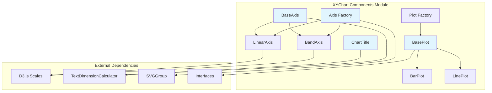
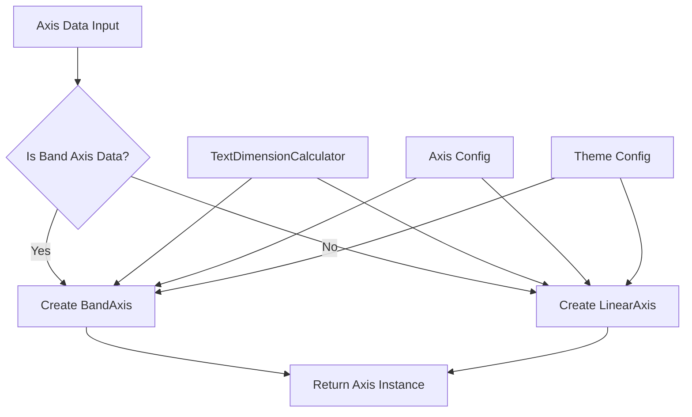
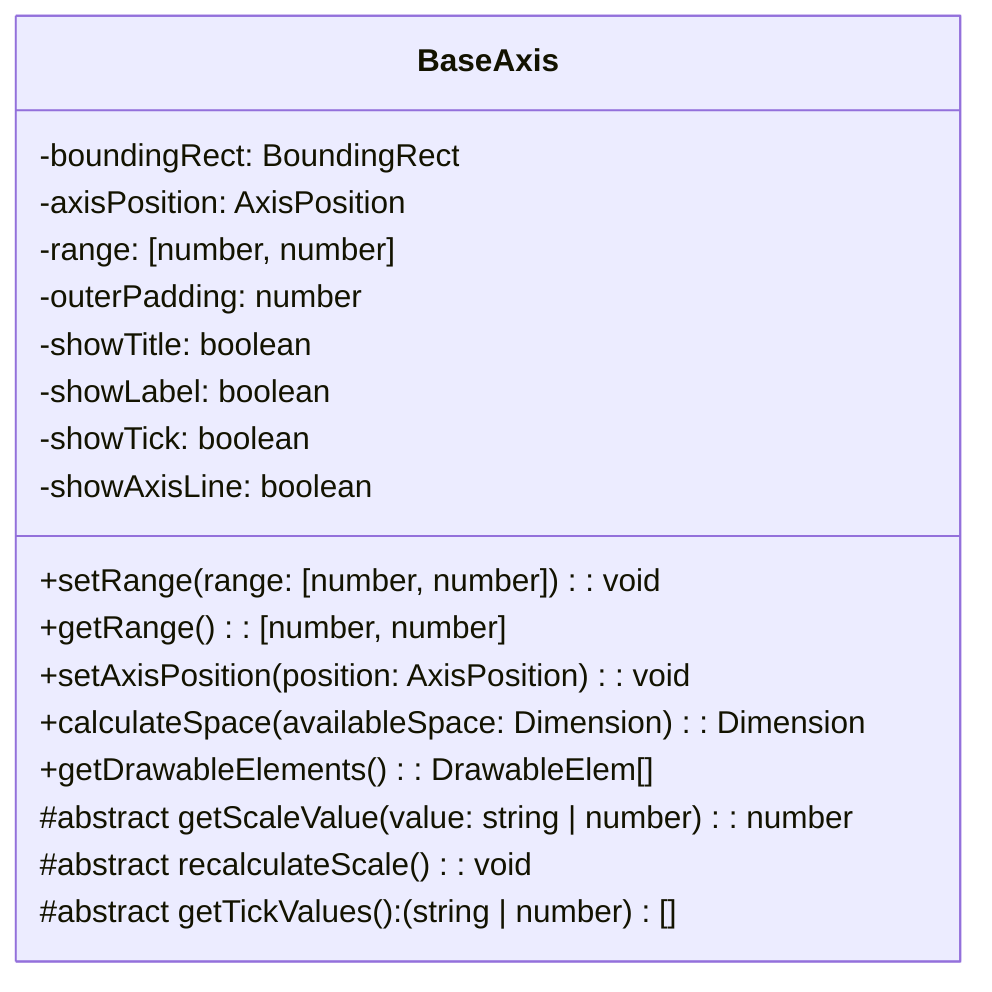
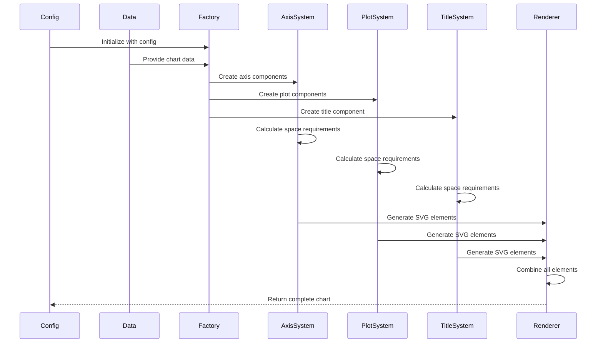
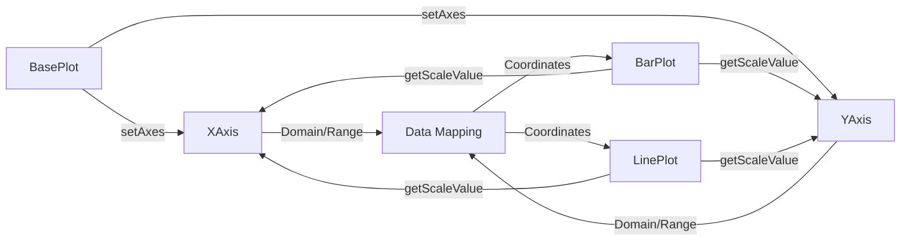

# XYChart Components Module Documentation

## Introduction

The xychart-components module is a specialized sub-module within the Mermaid diagram library that provides the core building blocks for creating XY charts (scatter plots, line charts, and bar charts). This module implements a component-based architecture that separates chart construction into modular, reusable components including axes, plots, and titles.

The module is part of the larger [xychart](./xychart.md) diagram type and works in conjunction with the [xychart-chart-builder](./xychart-chart-builder.md) to create sophisticated data visualizations. It leverages D3.js scales for data mapping and provides a flexible theming system for consistent styling across different chart types.

## Architecture Overview

## Core Components

### Axis System

The axis system provides a flexible foundation for creating both categorical (band) and numerical (linear) axes. The architecture uses a factory pattern to instantiate the appropriate axis type based on data characteristics.

#### Axis Factory (`getAxis`)

The factory function analyzes the input data type and creates the appropriate axis implementation:

- **BandAxis**: For categorical data with discrete values
- **LinearAxis**: For continuous numerical data

#### BaseAxis Abstract Class

The `BaseAxis` class serves as the foundation for all axis types, providing:

- **Position Management**: Support for left, right, top, and bottom axis positions
- **Space Calculation**: Intelligent space allocation for labels, ticks, titles, and axis lines
- **Rendering Logic**: SVG element generation for different axis orientations
- **Scale Integration**: Range management and value mapping coordination

Key responsibilities include:

#### BandAxis Implementation

Specialized for categorical data using D3's band scale:

- **Domain**: Array of string categories
- **Range**: Pixel coordinates for axis rendering
- **Padding**: Configurable inner and outer padding for bar charts
- **Alignment**: Center-aligned band positioning

#### LinearAxis Implementation

Designed for continuous numerical data using D3's linear scale:

- **Domain**: Numerical min/max values
- **Range**: Pixel coordinates with automatic reversal for vertical axes
- **Ticks**: Automatic tick generation using D3's tick algorithm
- **Scaling**: Linear interpolation between domain and range

### Plot System

The plot system handles the visual representation of data series, supporting multiple plot types within a single chart.

#### BasePlot Class

The `BasePlot` class coordinates multiple plot types and manages:

- **Axis Integration**: Links x and y axes to plot data
- **Space Management**: Allocates rendering space within chart boundaries
- **Plot Rendering**: Delegates to specific plot type implementations
- **Style Application**: Applies theme-based styling to plot elements

#### BarPlot Implementation

Creates rectangular bar elements with:

- **Orientation Support**: Both vertical and horizontal bar orientations
- **Width Calculation**: Dynamic bar width based on axis tick distance
- **Padding**: Configurable bar padding for visual separation
- **Color Application**: Fill and stroke color support

#### LinePlot Implementation

Generates line paths using D3's line generator:

- **Path Generation**: Smooth line interpolation through data points
- **Orientation Handling**: Automatic coordinate swapping for horizontal charts
- **Styling**: Configurable stroke color and width
- **Data Mapping**: Coordinate transformation using axis scales

### ChartTitle Component

Manages chart title rendering with:

- **Space Calculation**: Dynamic space allocation based on text dimensions
- **Positioning**: Centered title placement within available space
- **Theming**: Color and font size application from theme configuration
- **Visibility**: Conditional rendering based on configuration flags

## Data Flow Architecture

## Component Interactions

### Axis-Plot Coordination

The relationship between axes and plots is fundamental to chart functionality:

### Space Calculation Flow

Components calculate space requirements in a coordinated manner:

1. **Title Component**: Calculates top space requirement
2. **Axis Components**: Calculate space based on label dimensions and configuration
3. **Plot Component**: Uses remaining space for data visualization
4. **Layout Coordination**: Orchestrator manages space allocation sequence

## Integration with Parent Modules

### XYChart Module Integration

The xychart-components module integrates with the broader [xychart](./xychart.md) module through:

- **Data Interfaces**: Shared data structures for chart configuration
- **Theme System**: Consistent theming across all chart components
- **Rendering Pipeline**: SVG element generation for diagram output
- **Configuration Management**: Unified configuration handling

### Chart Builder Integration

Works with the [xychart-chart-builder](./xychart-chart-builder.md) module to:

- **Component Instantiation**: Factory-based component creation
- **Layout Orchestration**: Coordinated space calculation and positioning
- **Rendering Coordination**: SVG element compilation and output
- **Data Processing**: Chart data transformation and preparation

## Configuration and Theming

### Axis Configuration

Axis behavior is controlled through configuration options:

- **Visibility Flags**: Show/hide titles, labels, ticks, and axis lines
- **Spacing Parameters**: Padding and margin configurations
- **Font Settings**: Title and label font sizes
- **Dimensional Constraints**: Tick lengths and axis line widths

### Theme Integration

Components apply theming through dedicated theme configurations:

- **Color Schemes**: Axis lines, ticks, labels, and titles
- **Typography**: Font families and sizes
- **Styling Consistency**: Unified appearance across chart types

## Error Handling and Edge Cases

### Axis Position Limitations

Currently implemented axis positions:
- ✅ **Left**: Full implementation with complete rendering
- ✅ **Bottom**: Full implementation with complete rendering  
- ✅ **Top**: Full implementation with complete rendering
- ❌ **Right**: Not implemented (throws error)

### Data Validation

The module includes data type checking:
- **Band Axis Detection**: Automatic categorical data identification
- **Scale Validation**: Domain and range validation for linear axes
- **Coordinate Mapping**: Boundary checking for plot positioning

## Performance Considerations

### Text Dimension Calculation

- **Caching Strategy**: Text dimensions calculated once per rendering cycle
- **Font Loading**: Temporary SVG group usage for accurate measurements
- **Optimization**: Minimal DOM manipulation during calculation phase

### Scale Recalculation

- **Efficient Updates**: Scale recalculation only when necessary
- **Range Management**: Intelligent range updates based on space allocation
- **Padding Optimization**: Dynamic padding adjustment for bar charts

## Future Enhancements

### Planned Features

- **Right Axis Support**: Complete implementation of right-side axis positioning
- **Additional Plot Types**: Area plots, scatter plots, and combination charts
- **Interactive Features**: Hover effects and data point selection
- **Animation Support**: Smooth transitions for data updates

### Architecture Improvements

- **Plugin System**: Extensible plot type registration
- **Performance Optimization**: Virtual rendering for large datasets
- **Accessibility**: ARIA label support and keyboard navigation
- **Responsive Design**: Automatic scaling for different container sizes

## Related Documentation

- [XYChart Module](./xychart.md) - Parent module documentation
- [XYChart Chart Builder](./xychart-chart-builder.md) - Layout orchestration module
- [Rendering Utilities](./rendering-util.md) - Shared rendering components
- [Configuration Types](./config.md) - Configuration interface definitions
- [Diagram API](./diagram-api.md) - Core diagram functionality