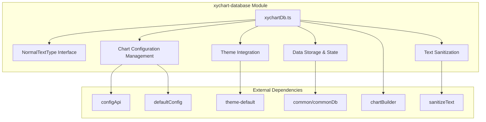
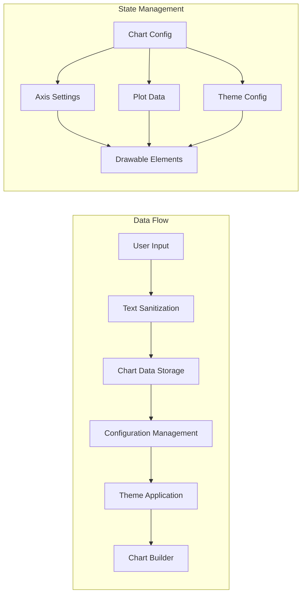
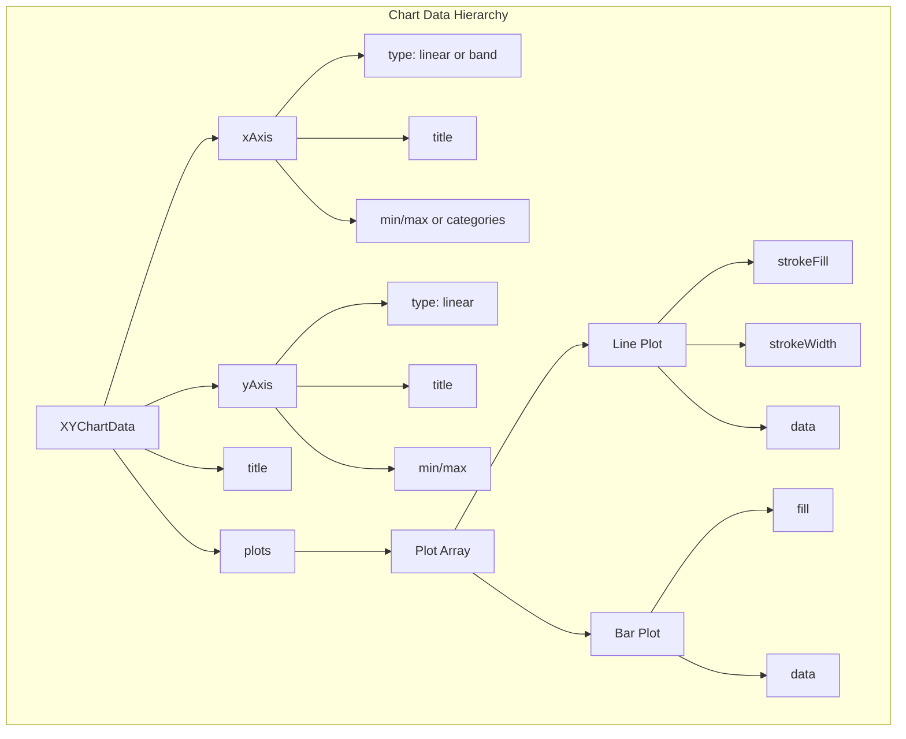
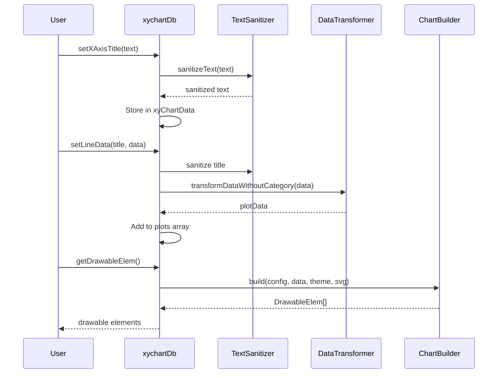
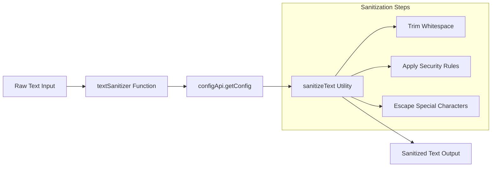
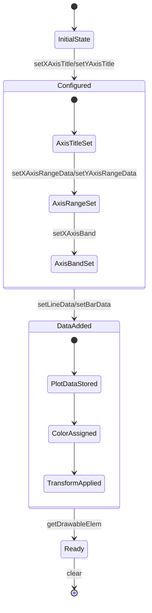

# xychart-database Module Documentation

## Introduction

The xychart-database module is a core data management component within the Mermaid.js xy chart diagram system. It serves as the central database layer for XY chart diagrams, handling data storage, configuration management, and state persistence for chart rendering operations. This module acts as the bridge between chart configuration, user data input, and the chart rendering pipeline.

## Module Overview

The xychart-database module provides essential functionality for managing XY chart data structures, including axis configuration, plot data storage, theme management, and text sanitization. It maintains the state of chart elements and coordinates data flow between the parsing layer and the chart rendering system.

## Core Components

### NormalTextType Interface

The primary data structure defined in this module is the `NormalTextType` interface:

```typescript
interface NormalTextType {
  type: 'text';
  text: string;
}
```

This interface serves as a standardized text container used throughout the XY chart system for handling user-provided text content that requires sanitization before rendering.

## Architecture

### Module Architecture Diagram



### Component Relationships



## Data Structures

### Chart Configuration Objects

The module manages several key configuration objects:

1. **xyChartConfig**: Main chart configuration including orientation and layout settings
2. **xyChartThemeConfig**: Theme-specific styling and color palette configuration
3. **xyChartData**: Core data structure containing axis definitions and plot data

### Data Storage Architecture



## Key Functions

### Configuration Management

- `getChartDefaultConfig()`: Retrieves default chart configuration from system settings
- `getChartDefaultThemeConfig()`: Initializes theme-specific configuration
- `getChartDefaultData()`: Sets up initial data structure for new charts

### Data Input Functions

- `setXAxisTitle()`: Configures X-axis title with text sanitization
- `setXAxisRangeData()`: Sets linear axis range (min/max values)
- `setXAxisBand()`: Configures categorical axis with band categories
- `setYAxisTitle()`: Configures Y-axis title
- `setYAxisRangeData()`: Sets Y-axis range values

### Plot Data Functions

- `setLineData()`: Adds line plot data with automatic color assignment
- `setBarData()`: Adds bar plot data with automatic color assignment
- `transformDataWithoutCategory()`: Converts raw data to plot-ready format

### State Management

- `clear()`: Resets all chart data and configuration to defaults
- `getDrawableElem()`: Generates drawable elements for rendering
- `setTmpSVGG()`: Stores temporary SVG group reference

## Data Flow Process

### Chart Data Processing Flow



### Text Sanitization Process



## Integration Points

### Upstream Dependencies

The module integrates with several core Mermaid.js systems:

- **[config](config.md)**: Configuration management and theme variables
- **[themes](themes.md)**: Theme system for styling and color palettes
- **[utils](utils.md)**: Utility functions for data manipulation
- **[common-types](common-types.md)**: Shared type definitions

### Downstream Consumers

- **[xychart](xychart.md)**: Main XY chart module that consumes database functions
- **[chartBuilder](xychart.md)**: Chart rendering system that processes drawable elements

## State Management

### Global State Variables

```typescript
let plotIndex = 0;                    // Current plot counter for color assignment
let tmpSVGGroup: SVGGroup;            // Temporary SVG group reference
let xyChartConfig: XYChartConfig;     // Main chart configuration
let xyChartThemeConfig: XYChartThemeConfig; // Theme configuration
let xyChartData: XYChartData;         // Core chart data
let plotColorPalette: string[];       // Available plot colors
let hasSetXAxis = false;              // X-axis configuration flag
let hasSetYAxis = false;              // Y-axis configuration flag
```

### State Transition Diagram



## Error Handling

The module implements basic error handling:

- **No Plot Data Error**: Throws error when `getDrawableElem()` is called without plot data
- **Configuration Validation**: Ensures axis configurations are compatible with plot data types
- **Text Sanitization**: Prevents XSS attacks through text input sanitization

## Performance Considerations

### Memory Management

- **State Reset**: The `clear()` function ensures proper cleanup of chart data
- **Color Palette Caching**: Plot colors are cached to avoid repeated string operations
- **Data Transformation**: Lazy evaluation of plot data transformations

### Optimization Strategies

- **Color Assignment**: Efficient modulo-based color palette cycling
- **Data Range Calculation**: Incremental min/max updates for performance
- **Text Sanitization**: Single-pass sanitization with configuration caching

## Usage Examples

### Basic Chart Setup

```typescript
// Set axis titles
xychartDb.setXAxisTitle({ type: 'text', text: 'Time (months)' });
xychartDb.setYAxisTitle({ type: 'text', text: 'Revenue ($)' });

// Configure X-axis with categories
xychartDb.setXAxisBand([
  { type: 'text', text: 'Jan' },
  { type: 'text', text: 'Feb' },
  { type: 'text', text: 'Mar' }
]);

// Add plot data
xychartDb.setLineData(
  { type: 'text', text: 'Sales' },
  [1000, 1500, 2000]
);

// Generate drawable elements
const elements = xychartDb.getDrawableElem();
```

### Chart Reset

```typescript
// Clear all data and reset to defaults
xychartDb.clear();
```

## Related Documentation

- [xychart](xychart.md) - Main XY chart module documentation
- [config](config.md) - Configuration system documentation
- [themes](themes.md) - Theme system documentation
- [common-types](common-types.md) - Shared type definitions
- [utils](utils.md) - Utility functions documentation

## API Reference

For detailed API documentation, refer to the [xychart](xychart.md) module documentation, which provides the primary interface for XY chart functionality.