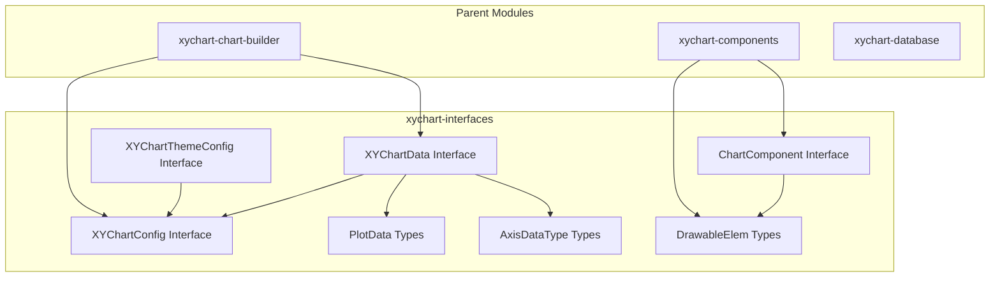
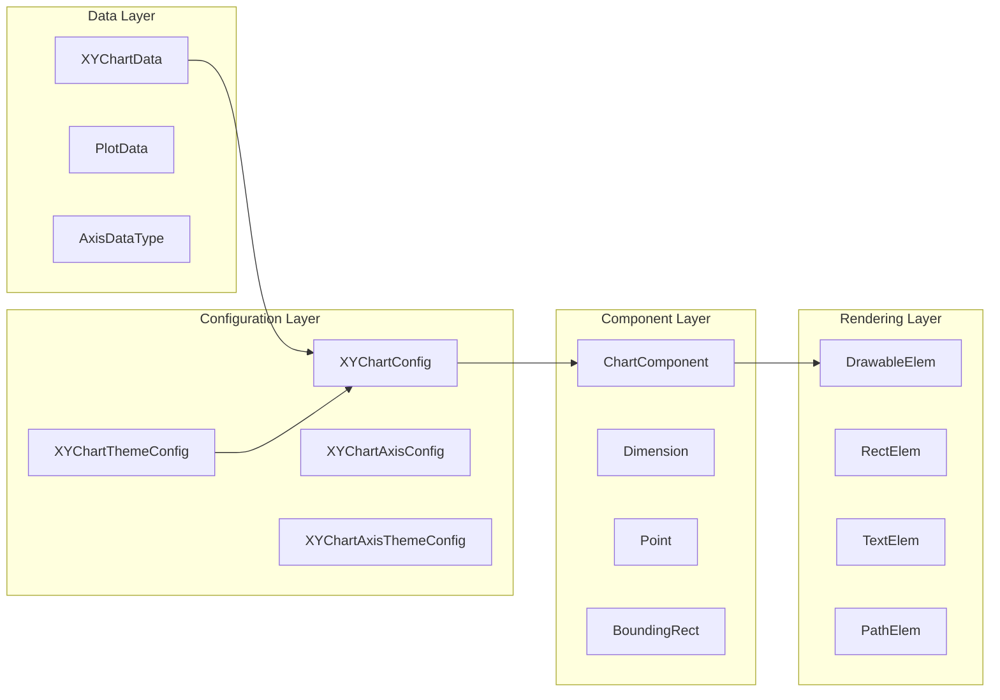
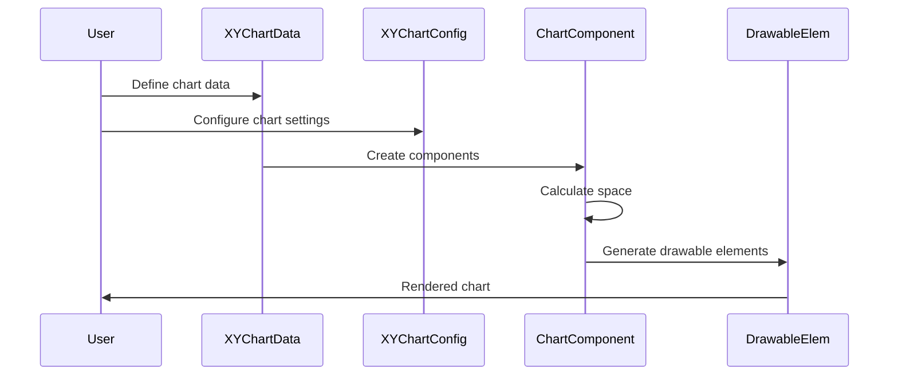

# XYChart Interfaces Module

## Introduction

The xychart-interfaces module defines the core TypeScript interfaces and type definitions for the XYChart diagram type in Mermaid. This module serves as the foundational contract layer that establishes the data structures, configuration options, and component interfaces required for creating and rendering XY charts (scatter plots, line charts, bar charts) within the Mermaid ecosystem.

## Module Overview

The xychart-interfaces module provides a comprehensive set of interfaces that enable the creation of interactive and customizable XY charts. It defines the contract between different components of the XY chart system, including data representation, configuration management, theme customization, and rendering elements.

## Architecture

### Module Structure



### Component Relationships



## Core Interfaces and Types

### Chart Data Structure

#### XYChartData
The primary interface for defining XY chart data, containing axis configurations, title, and plot data.

```typescript
interface XYChartData {
  xAxis: AxisDataType;        // X-axis configuration
  yAxis: AxisDataType;        // Y-axis configuration
  title: string;              // Chart title
  plots: PlotData[];          // Array of plot data
}
```

#### Axis Data Types

**BandAxisDataType**: For categorical data on axes
```typescript
interface BandAxisDataType {
  type: 'band';
  title: string;
  categories: string[];
}
```

**LinearAxisDataType**: For numerical data on axes
```typescript
interface LinearAxisDataType {
  type: 'linear';
  title: string;
  min: number;
  max: number;
}
```

### Plot Data Types

**LinePlotData**: Configuration for line plots
```typescript
interface LinePlotData {
  type: 'line';
  strokeFill: string;         // Line color
  strokeWidth: number;        // Line thickness
  data: SimplePlotDataType;   // Array of [x, y] pairs
}
```

**BarPlotData**: Configuration for bar plots
```typescript
interface BarPlotData {
  type: 'bar';
  fill: string;               // Bar fill color
  data: SimplePlotDataType;   // Array of [x, y] pairs
}
```

### Configuration Interfaces

#### XYChartConfig
Main configuration interface for chart appearance and behavior.

```typescript
interface XYChartConfig {
  width: number;
  height: number;
  titleFontSize: number;
  titlePadding: number;
  showTitle: boolean;
  showDataLabel: boolean;
  xAxis: XYChartAxisConfig;
  yAxis: XYChartAxisConfig;
  chartOrientation: 'vertical' | 'horizontal';
  plotReservedSpacePercent: number;
}
```

#### XYChartAxisConfig
Detailed axis configuration options.

```typescript
interface XYChartAxisConfig {
  showLabel: boolean;
  labelFontSize: number;
  labelPadding: number;
  showTitle: boolean;
  titleFontSize: number;
  titlePadding: number;
  showTick: boolean;
  tickLength: number;
  tickWidth: number;
  showAxisLine: boolean;
  axisLineWidth: number;
}
```

### Theme Configuration

#### XYChartThemeConfig
Global theme settings for the entire chart.

```typescript
interface XYChartThemeConfig {
  backgroundColor: string;
  titleColor: string;
  xAxisLabelColor: string;
  xAxisTitleColor: string;
  xAxisTickColor: string;
  xAxisLineColor: string;
  yAxisLabelColor: string;
  yAxisTitleColor: string;
  yAxisTickColor: string;
  yAxisLineColor: string;
  plotColorPalette: string;
}
```

#### XYChartAxisThemeConfig
Theme settings specific to individual axes.

```typescript
interface XYChartAxisThemeConfig {
  titleColor: string;
  labelColor: string;
  tickColor: string;
  axisLineColor: string;
}
```

### Component Interface

#### ChartComponent
Abstract interface for all chart components that can be rendered.

```typescript
interface ChartComponent {
  calculateSpace(availableSpace: Dimension): Dimension;
  setBoundingBoxXY(point: Point): void;
  getDrawableElements(): DrawableElem[];
}
```

### Geometric Types

#### Basic Geometry
```typescript
interface Dimension {
  width: number;
  height: number;
}

interface Point {
  x: number;
  y: number;
}

interface BoundingRect extends Point, Dimension {}
```

### Rendering Elements

#### Drawable Elements
The module defines a union type `DrawableElem` that represents different types of renderable elements:

```typescript
type DrawableElem =
  | { groupTexts: string[]; type: 'rect'; data: RectElem[] }
  | { groupTexts: string[]; type: 'text'; data: TextElem[] }
  | { groupTexts: string[]; type: 'path'; data: PathElem[] };
```

#### Element Types
- **RectElem**: Rectangle elements with position, dimensions, fill, and stroke properties
- **TextElem**: Text elements with positioning, styling, and alignment properties
- **PathElem**: Path elements for drawing lines and curves

## Data Flow

### Chart Creation Flow



### Type Guard Functions

The module includes type guard functions for runtime type checking:

```typescript
// Check if plot data is bar plot
function isBarPlot(data: PlotData): data is BarPlotData

// Check if axis data is band axis
function isBandAxisData(data: AxisDataType): data is BandAxisDataType

// Check if axis data is linear axis
function isLinearAxisData(data: AxisDataType): data is LinearAxisDataType
```

## Integration with Other Modules

### Dependencies

The xychart-interfaces module is utilized by several related modules:

- **[xychart-chart-builder](xychart-chart-builder.md)**: Uses interfaces to build chart components
- **[xychart-components](xychart-components.md)**: Implements ChartComponent interface for specific components
- **[xychart-database](xychart-database.md)**: Provides data parsing and validation using these interfaces

### Configuration Integration

The interfaces integrate with the global Mermaid configuration system:

- **[config](config.md)**: XYChartConfig extends base configuration patterns
- **[themes](themes.md)**: XYChartThemeConfig works with theme system
- **[types](types.md)**: Shares common type definitions

## Usage Examples

### Basic Line Chart Configuration

```typescript
const chartData: XYChartData = {
  xAxis: {
    type: 'linear',
    title: 'Time (seconds)',
    min: 0,
    max: 100
  },
  yAxis: {
    type: 'linear',
    title: 'Temperature (°C)',
    min: 20,
    max: 80
  },
  title: 'Temperature Over Time',
  plots: [{
    type: 'line',
    strokeFill: '#ff6b6b',
    strokeWidth: 2,
    data: [['0', 25], ['25', 35], ['50', 45], ['75', 55], ['100', 65]]
  }]
};
```

### Bar Chart with Categorical X-Axis

```typescript
const barChartData: XYChartData = {
  xAxis: {
    type: 'band',
    title: 'Products',
    categories: ['Product A', 'Product B', 'Product C', 'Product D']
  },
  yAxis: {
    type: 'linear',
    title: 'Sales (units)',
    min: 0,
    max: 1000
  },
  title: 'Monthly Sales by Product',
  plots: [{
    type: 'bar',
    fill: '#4ecdc4',
    data: [['Product A', 750], ['Product B', 600], ['Product C', 900], ['Product D', 450]]
  }]
};
```

## Best Practices

### Data Structure Design
- Use appropriate axis types (band vs linear) based on your data
- Ensure plot data arrays contain valid [x, y] pairs
- Provide meaningful titles for axes and the chart

### Configuration Management
- Leverage theme configurations for consistent styling
- Use axis-specific configurations for fine-grained control
- Consider chart orientation based on data characteristics

### Performance Considerations
- Minimize the number of plot data points for better rendering performance
- Use appropriate plot reserved space percentages to optimize layout
- Implement efficient space calculation in custom components

## Extension Points

The module provides several extension points for customization:

1. **Custom Plot Types**: Extend `PlotData` union type
2. **Custom Axis Types**: Extend `AxisDataType` union type
3. **Custom Components**: Implement `ChartComponent` interface
4. **Custom Drawable Elements**: Extend `DrawableElem` union type

## Related Documentation

- [xychart-chart-builder](xychart-chart-builder.md) - Chart building and orchestration
- [xychart-components](xychart-components.md) - Component implementations
- [xychart-database](xychart-database.md) - Data parsing and storage
- [config](config.md) - Global configuration system
- [themes](themes.md) - Theme management system
- [types](types.md) - Common type definitions